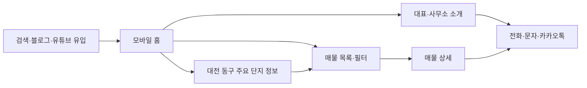
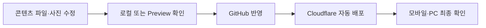

# 천동 리더스시티 행복한부동산 홈페이지 서비스 기획서

| 항목 | 내용 |
|---|---|
| 문서 ID | HRE-PLAN-001 |
| 버전 | v0.4 Content Management |
| 작성 기준일 | 2026-08-25 |
| 문서 상태 | 기준 사이트 핵심 흐름·관리자 콘텐츠 편집·GitHub 저장 경계 반영 |
| 대상 서비스 | 천동 리더스시티 행복한부동산 공개 홈페이지 |
| 관련 문서 | `CODEX.md`, `02_천동_리더스시티_행복한부동산_시스템설계서.md`, `03_천동_리더스시티_행복한부동산_개발진행체크리스트.md` |

> 본 문서는 사용자가 승인한 `운영비 최소화·관리자가 콘텐츠 파일 직접 수정·모바일 우선` 방향을 기준으로 한다. 영업시간, 사업자등록번호, 이메일, 카카오톡 주소, 도메인과 공식 로고는 운영자 제공 정보로 반영했으며, 대표 상세 약력·매물·단지 수치처럼 아직 확인되지 않은 정보는 공개 전 반드시 승인받는다. 법률 관련 내용은 개발 요구사항이며 최종 법률 판단을 대신하지 않는다.

---

## 1. 핵심 결론

이 홈페이지는 네이버 블로그·유튜브·부동산뱅크·네이버지도로 흩어진 정보를 한곳에서 안내하고 전화·문자·카카오톡 상담으로 연결하는 **지역 전문 부동산 정보 허브**다.

첫 출시는 다음 원칙으로 만든다.

1. Astro로 정적 HTML을 생성한다.
2. 코드와 공개 콘텐츠는 GitHub에 저장한다.
3. Cloudflare Workers Static Assets 무료 플랜에 자동 배포한다.
4. 운영자는 관리자 화면 또는 승인된 JSON·사진 파일에서 공개 콘텐츠를 수정한다.
5. 공개 사이트는 DB 없이 정적으로 유지하고, 관리자 화면은 Cloudflare Access와 GitHub Contents API로 보호한다.
6. 스마트폰에서 먼저 보기 편하도록 한 열 카드와 큰 상담 버튼을 사용한다.
7. 도메인 갱신료 외 상시 인프라 비용 0원을 목표로 한다.

브랜드의 중심 문장은 다음으로 한다.

> **근거로 말하고, 직접 확인한 정보로 안내하며, 고객이 스스로 판단할 수 있도록 돕습니다.**

매물 등록·수정·종료는 네이버 부동산에서 처리한다. 네이버페이 부동산에 이미 공개된 중개사 매물은 분양권·상가·빌라·주택·토지를 포함해 사진 없는 외부 링크 카드로 표시하며 자체 상세 매물이나 관리자 입력 폼으로 복제하지 않는다.

---

## 2. 요구사항 상태

| 표기 | 의미 |
|---|---|
| 확정 | 사용자가 직접 확인했거나 승인한 내용 |
| 가안 | 구현을 위한 권고안, 운영자 승인 후 확정 |
| 결정 필요 | 출시 전 자료 또는 의사결정 필요 |
| 출시 후 | 실제 운영 결과를 보고 검토 |
| 제외 | 초기 범위에서 의도적으로 제외 |

확인되지 않은 내용을 가짜 값이나 그럴듯한 문구로 채우지 않는다.

---

## 3. 현재 확인된 사업 정보

| 항목 | 값 | 상태 | 공개 정책 |
|---|---|---|---|
| 법적 상호 | 리더스시티행복한공인중개사사무소 | 확정 | 푸터·소개·매물 상세 |
| 홈페이지 브랜드명 | 리더스시티 행복한부동산 | 확정 | 공식 로고·구조화 데이터에 적용 |
| 대표자 | 백진옥 | 확정 | 소개·푸터·매물 상세 |
| 대표 연락처 | 010-2790-8675 | 확정 | 전화·문자 CTA |
| 주소 | 대전광역시 동구 안샘로14번길 7, 리더스시티5블록 근린생활시설 105호 | 확정 | 소개·푸터·오시는 길 |
| 중개사무소 등록번호 | 30110-2023-00028 | 확정 | 푸터·법정 정보 |
| 네이버지도 장소 ID | 1135476130 | 확정 | 배포 전 장소 일치 재확인 |
| 네이버 등록 매물 | 네이버페이 부동산 개별 매물 50건과 중개사 상세 링크 | 확정 | 홈 미리보기·매물 전체 목록에서 개별 상세로 새 탭 연결 |
| 네이버 블로그 | `p5468300` | 확정 | 추천 글·외부 링크 |
| 유튜브 채널 | 천동리더스시티 행복한부동산 TV | 확정 | 추천 영상·외부 링크 |
| 기존 매물 관리 | 부동산뱅크 | 확정 | 운영자가 홈페이지 파일과 수동 대조 |
| 초기 거래유형 | 아파트 매매·전세·월세 | 확정 | 매물 목록·필터 |
| 전문 지역 | 대전광역시 동구 전역 | 확정 | 홈·매물·단지·SEO |
| 이메일 | `packjinok123@gmail.com` | 확정 | 푸터·소개·오시는 길·llms.txt |
| 카카오톡 상담 주소 | `https://pf.kakao.com/_nxmabn/chat` | 확정 | 공통 상담 CTA |
| 영업시간 | 평일 09:00~20:00, 토요일 09:00~18:00, 일요일 휴무(예약 상담 가능) | 확정 | 홈·소개·오시는 길 |
| 주차 | 리더스시티5블록 단지 내 상가 주차장 이용 가능 | 확정 | 소개·오시는 길 |
| 사업자등록번호 | 805-05-02602 | 확정 | 푸터·소개·구조화 데이터 |
| 운영 현황 | 허위매물 0건·중개사고 0건 | 공개 승인 | 홈·소개·llms.txt, 공개 화면에는 내부 확인 기준 문구 미표시 |
| 대표 약력·경력 | 미정 | 결정 필요 | 임의 생성 금지 |
| 대표·단지 사진 | 운영자 제공 사진 | 공개 승인 | 원본 비율을 보존한 최적화 WebP만 사용 |
| 공식 로고 | 리더스시티 행복한부동산 | 확정·공개 승인 | PNG 원본 보존, 화면용 WebP 사용 |
| 도메인 | `https://leaderscityhappy.com` | 확정 | canonical·사이트맵·llms.txt |

미확정 항목은 운영 파일에서 `null` 또는 비활성 상태로 두고 화면에 표시하지 않는다.

---

## 4. 문제 정의와 목표

### 4.1 문제

- 신규 고객이 대표의 전문성과 상담 철학을 한 번에 확인하기 어렵다.
- 매물, 단지 설명, 블로그와 영상이 서로 연결되지 않는다.
- 외부 플랫폼만으로는 가격·면적·최근 확인일을 간단히 비교하기 어렵다.
- 스마트폰에서 전화나 문자 상담까지 이동 단계가 길 수 있다.
- DB 기반 다중 사용자 관리자 시스템은 초기 비용과 보안·백업 부담이 크다.

홈페이지는 외부 채널을 대체하지 않고 신뢰 가능한 공개 정보와 상담 경로를 모으는 중심 허브가 된다.

### 4.2 목표

| 우선순위 | 목표 | 성공 판단 기준 |
|---:|---|---|
| 1 | 매물을 상담으로 연결 | 모든 매물 상세에서 전화·문자 CTA가 1회 조작으로 동작 |
| 2 | 지역 전문성과 신뢰 전달 | 모바일 첫 화면에서 지역·대표·핵심 철학·전화 확인 |
| 3 | 보기 쉬운 매물 비교 | 거래유형·동구 내 지역·면적·가격 필터와 최근 확인일 제공 |
| 4 | 낮은 운영비 | DB·유료 서버 없이 정적 호스팅으로 운영 |
| 5 | 운영자 자립 | 정해진 콘텐츠 파일과 사진만 수정해 배포 가능 |
| 6 | 검색 유입 | 페이지별 메타정보·사이트맵·구조화 데이터 제공 |
| 7 | 개인정보 최소화 | 사이트가 고객 연락처와 상담 내용을 저장하지 않음 |

### 4.3 비목표

- 자체 비밀번호 관리자 계정과 고객·상담 DB
- 자체 상담 폼·공개 상담 게시판·고객 DB
- 네이버부동산·부동산뱅크의 예약 크롤링 또는 운영자 확인 없는 자동 등록
- 실시간 블로그·유튜브·지도 API 연동
- 계약·결제·회원·CRM
- 여러 중개사무소용 서비스
- AI 생성 내용의 자동 공개
- 출처 없는 실거래·개발계획 단정

---

## 5. 주요 사용자

### 5.1 매수·임차 희망자

- 스마트폰으로 가격·전용면적·층·방향·입주 조건을 빠르게 비교한다.
- 단지 특징과 생활환경을 확인한다.
- 신뢰가 생기면 전화·문자·카카오톡으로 문의한다.

### 5.2 기존 소유자·임대인

- 지역과 단지에 대한 중개사무소의 전문성을 확인한다.
- 대표 연락처로 매도·임대 의뢰를 상담한다.
- 홈페이지에는 고객 개인정보를 남기지 않는다.

### 5.3 대전 동구 이주 검토자

- 대전 동구의 동네와 주요 단지 차이를 확인한다.
- 블로그·유튜브 설명을 참고한 뒤 상담으로 이동한다.

### 5.4 운영자

- 전문 개발 도구 없이 정해진 파일의 값과 사진을 교체한다.
- 가격·최근 확인일·공개 상태를 수정하고 GitHub에 반영한다.
- Cloudflare Preview에서 스마트폰 화면을 확인한 뒤 공개한다.
- 잘못 올렸을 때 Git 또는 Cloudflare의 직전 배포로 되돌린다.

---

## 6. 핵심 사용자·운영 흐름

매물 수정 후 공개 반영에는 배포 시간이 필요하다. 실시간 DB 수정처럼 즉시 반영되는 구조가 아님을 운영 매뉴얼에 설명한다.

---

## 7. 사이트 정보 구조

| 화면 | URL | 역할 |
|---|---|---|
| 홈 | `/` | 소개·추천 매물·상담 CTA 요약 |
| 대표·사무소 소개 | `/office` | 대표·철학·법정 정보 |
| 단지 목록 | `/complexes` | 대전 동구 주요 단지 진입 |
| 리더스시티 4블록 | `/complexes/leaders-city-4` | 현재 초기 등록된 단지·지역정보 |
| 리더스시티 5블록 | `/complexes/leaders-city-5` | 현재 초기 등록된 단지·지역정보 |
| 매물 목록 | `/properties` | 필터·정렬·카드 |
| 매물 상세 | `/properties/{slug}` | 사진·조건·최근 확인일·상담 CTA |
| 블로그 | `/blog` | 네이버 블로그 글과 원문 링크 |
| 유튜브 | `/youtube` | 유튜브 영상과 원문 링크 |
| 콘텐츠 안내 | `/contents` | 블로그·유튜브 카테고리 선택 |
| FAQ·상담 | `/faq` | 반복 질문과 서버에 저장하지 않는 문자 상담 작성 |
| 후기 | `/reviews` | 승인된 실제 후기만 표시 |
| 오시는 길 | `/location` | 주소·연락처·네이버지도 |
| 개인정보처리방침 | `/privacy` | 사이트의 수집 여부와 외부 링크 안내 |
| 이용 안내 | `/terms` | 정보 기준일·면책·외부 링크 안내 |

홈은 참고 사이트처럼 전체 내용을 요약해 연결하되, 매물·단지·콘텐츠에는 검색엔진과 공유에 유리한 별도 페이지를 둔다.

---

## 8. 디자인·모바일 방향

### 8.1 콘셉트

**30대 이상 고객이 스마트폰에서 편안하게 읽고 바로 연락할 수 있는 차분한 지역 전문 부동산**

- 아이보리·화이트 배경
- 차콜·딥네이비 글자와 헤더
- 로즈 계열은 상담 버튼과 일부 강조에만 사용
- 실제 대표·사무소·단지·매물 사진 우선
- 자동재생·패럴랙스·과도한 애니메이션 금지

### 8.2 모바일 필수 기준

| 항목 | 기준 |
|---|---|
| 지원 폭 | 최소 360px부터 정상 표시 |
| 기본 배치 | 스마트폰 한 열, 태블릿 2열, PC 3열까지 확장 |
| 본문 | 16px 이상, 행간 1.5 이상 |
| 터치 영역 | 최소 44×44px |
| 메뉴 | 작은 화면에서 접이식, 현재 위치와 닫기 버튼 명확화 |
| 매물 카드 | 사진·거래유형·가격·면적·최근 확인일 우선 |
| 필터 | 접이식 패널, 적용·초기화 버튼을 손가락으로 쉽게 조작 |
| 상담 CTA | 하단 고정 `전화`, `문자`, 승인 시 `카카오톡` |
| 안전 여백 | 하단 CTA가 마지막 콘텐츠·포커스를 가리지 않게 확보 |
| 확대 | 200% 확대에서도 가로 스크롤과 기능 손실 없음 |

주요 검증 폭은 360·390·430·768·1280px로 한다. 실제 Android Chrome과 iPhone Safari에서도 확인한다.

### 8.3 접근성

- WCAG 2.2 AA를 내부 목표로 한다.
- 키보드만으로 메뉴·필터·FAQ·링크를 조작할 수 있어야 한다.
- 색상만으로 매물 상태를 표시하지 않는다.
- 이미지 대체 텍스트와 명확한 포커스를 제공한다.
- 영문 장식 버튼 대신 `전화로 문의하기`, `문자로 문의하기`처럼 행동을 표시한다.

---

## 9. 공개 화면 상세

### 9.1 홈

첫 방문 10초 안에 지역, 대표, 핵심 철학, 매물 진입, 연락 방법을 이해하게 한다.

권장 순서:

1. 모바일 헤더와 대표 연락 CTA
2. 백진옥 대표 소개·프로필 사진·상담 철학
3. 리더스시티 4·5블록 사진과 대전 동구 지역 전문성
4. 관리자가 등록한 추천·최근 확인 매물 카드
5. 네이버 블로그 글 카드
6. 유튜브 영상 카드
7. 리더스시티와 대전 동구 지역·단지 설명
8. FAQ와 승인된 후기
9. 오시는 길·법적 정보

추천 매물이나 사진이 없으면 가짜 데이터를 넣지 않고 섹션을 숨기거나 준비 중 안내와 전화 CTA를 제공한다.

### 9.2 대표·사무소 소개

- 법적 상호와 승인된 브랜드명
- 백진옥 대표와 상담 철학
- 직접 확인 원칙
- 대표 연락처·주소·등록번호
- 승인된 프로필·사무소 사진

`경력 20년`, `지역 1위`, `수천 건 계약` 같은 미확정 표현을 사용하지 않는다.

### 9.3 대전 동구 주요 단지와 지역정보

- 단지별 별도 페이지
- 세대수·동수·사용승인일·면적형·주차·난방
- 교통·학교·생활편의·커뮤니티
- 관련 매물·블로그·유튜브
- 정보 출처와 기준일

공식 자료를 우선하고, 출처 간 수치가 충돌하면 승인 전 공개하지 않는다.

### 9.4 매물 목록

홈에는 `리더스시티행복한공인중개사사무소`가 네이버페이 부동산에 공개한 개별 매물 50건을 사진 없는 카드로 6건씩 페이지 처리하고, 매물 목록에는 같은 50건 전체를 표시한다. 각 카드에는 네이버에 공개된 동 번호·광고 층수·가격·면적·방향·확인일을 표시하고 같은 매물번호의 네이버 상세 페이지로 새 탭 이동한다. 중개사 매물 지도 링크도 보조 동선으로 유지하며, 내부 상세 게시글을 만들거나 네이버에 없는 정확한 호수를 추정하지 않는다.

필터·정렬:

- 거래유형: 매매·전세·월세
- 매물유형: 네이버 공개 매물유형
- 정렬기준: 가격순·최신순·면적순

정렬을 선택하지 않으면 네이버 데이터 순서를 유지한다. 가격순과 면적순은 낮은 값부터, 최신순은 확인일이 최근인 항목부터 표시한다. 네이버 카드에는 별도 대표 이미지 영역을 두지 않는다.

네이버 등 공개 광고에 표시되지 않은 정확한 호수, 소유자·임대인 정보, 내부 메모는 콘텐츠 파일에도 저장하지 않는다. 네이버 공개 카드의 동 번호와 광고 층수는 같은 매물번호의 외부 링크와 함께 표시할 수 있다.

필터 결과가 없으면 `조건에 맞는 확인 매물이 없습니다`와 필터 초기화·전화 문의 버튼을 제공한다.

### 9.5 매물 상세

- 블록·거래유형·가격·면적
- 공개 가능한 층·방향·입주 가능일
- 최근 확인일과 정보 출처
- 승인된 사진과 대체 텍스트
- 관리비·주차·난방·특징
- 현행 기준의 법정 표시사항
- `전화`, `문자`, 승인 시 `카카오톡` CTA
- 관련 단지·블로그·유튜브 링크

계약완료·종료 매물은 기본 목록과 사이트맵에서 제외한다. 필요하면 기존 URL에 종료 안내와 유사 매물 상담 CTA를 남기는 정책을 추후 승인한다.

### 9.6 콘텐츠·FAQ·후기

- 블로그는 공식 채널의 2026년 글 전체, 유튜브는 공식 채널의 실제 영상 전체를 제목·게시일·짧은 요약·원문 링크·썸네일로 저장한다.
- 블로그·유튜브는 최신순으로 정렬하고 블로그는 페이지당 9개, 유튜브는 페이지당 6개씩 표시하며, 카드 아래 중앙에 이전·페이지 번호·다음 탐색을 둔다. 카드는 데스크톱 3열·태블릿 2열·모바일 1열이다.
- 관리자 화면은 링크의 공개 메타정보를 보조로 불러오며, 썸네일이 없거나 불러오지 못하면 운영자가 직접 승인 사진을 올린다.
- 유튜브 자동재생을 사용하지 않는다.
- FAQ는 실제 반복 질문과 승인된 답변만 공개한다.
- 후기는 실제 거래·상담과 공개 동의가 확인된 내용만 사용한다.
- 준비된 콘텐츠가 없으면 해당 섹션을 숨긴다.

### 9.7 오시는 길

- 법적 상호·대표자·연락처·주소·등록번호
- 네이버지도 장소 ID `1135476130` 기반 외부 링크
- 승인 후 영업시간·휴무일·주차 안내

지도 API와 좌표 임베드는 초기 범위에서 제외한다.

---

## 10. 운영자가 콘텐츠를 수정하는 방법

### 10.1 매물

매물마다 하나의 Markdown 파일을 사용하고 사진은 같은 매물 ID 폴더에 둔다.

운영자가 주로 수정할 항목:

- `status`
- `tradeType`
- `priceKrw`
- `confirmedAt`
- `summary`
- `features`
- `images`

수정 절차:

1. 부동산뱅크와 현장 확인 정보 대조
2. 매물 파일 수정
3. 공개 승인된 최적화 사진 추가
4. 로컬 또는 Preview 화면 확인
5. GitHub에 반영
6. Cloudflare Production 배포 후 모바일 확인

### 10.2 사무소·FAQ·외부 링크

- 사무소 정보와 네이버 등록 매물 같은 상시 외부 채널은 한 개의 JSON 파일에서 관리해 푸터·소개·매물 화면이 같은 값을 사용한다.
- FAQ는 질문·답변·노출 순서를 JSON 또는 Markdown으로 관리한다.
- 블로그·유튜브는 원문 URL을 입력해 제목·썸네일을 보조로 불러오고, 운영자가 문구를 확인하거나 직접 썸네일을 올린 뒤 저장한다.

### 10.3 운영 제한

- Access 보호 관리자 화면은 매물, 첫 화면·사무소, 블로그·유튜브, 지역·단지 설명 편집 화면을 제공한다.
- 실제 저장은 GitHub 저장소 한 개로 제한된 Fine-grained token, Origin·CSRF·콘텐츠 검증과 최신 SHA 비교가 모두 설정된 Production에서만 활성화한다.
- 고객의 연락처와 상담 내용은 저장하지 않는다.
- 여러 사람이 동시에 같은 파일을 수정하면 충돌할 수 있으므로 초기 운영 담당자를 정한다.
- 이미지 업로드는 브라우저에서 WebP로 최적화하고 EXIF를 제거한 뒤 허용된 공개 이미지 경로에만 저장한다.
- DB는 동시 수정·비공개 초안·대량 운영 문제가 실제로 반복될 때만 재검토한다.

---

## 11. 매물 공개 규칙

공개 전 다음을 사람이 확인하고 빌드 검사로 가능한 항목은 자동 검증한다.

- 실제 중개의뢰·광고 근거 확인
- 거래유형과 가격 조합 유효
- 최근 확인일 입력
- 출처와 기준일 입력
- 법정 필수 표시사항 입력
- 네이버 공개 카드에 없는 정확한 호수·개인정보 미포함
- 이미지 사용 권한·개인정보·대체 텍스트 확인
- 같은 매물의 중복 파일 확인
- 사무소 정보 일치

상태는 다음 네 가지를 사용한다.

| 상태 | 의미 | 공개 목록 |
|---|---|---|
| `draft` | 작성·검수 중 | 제외 |
| `published` | 공개 승인 | 포함 |
| `contracted` | 계약완료 | 기본 제외 |
| `ended` | 광고 종료 | 제외 |

최근 확인 기한은 운영자 결정 전 자동 보류하지 않는다. 대신 화면에 확인일을 표시하고 운영 체크리스트에서 오래된 매물을 점검한다.

---

## 12. SEO·성능

### 12.1 SEO

- 페이지별 고유 title·description·canonical·Open Graph
- XML 사이트맵과 robots.txt
- 네이버 서치어드바이저·구글 서치 콘솔 등록
- `RealEstateAgent` 또는 `LocalBusiness`, `BreadcrumbList` 구조화 데이터
- 매물별 정적 URL과 고유 설명
- 종료·초안·필터 조합의 무분별한 색인 방지
- 지역명만 바꾼 중복 문서 대량 생성 금지

### 12.2 성능

- 정적 HTML·CSS를 우선하고 JavaScript를 최소화한다.
- 모바일 Lighthouse 성능·접근성·SEO 각 90점 이상을 목표로 한다.
- LCP 2.5초 이하, INP 200ms 이하, CLS 0.1 이하를 내부 목표로 한다.
- 반응형 이미지, 지연 로딩, 명시적 크기, WebP/AVIF를 사용한다.
- 유튜브 플레이어와 지도 임베드를 초기 로드하지 않는다.

---

## 13. 개인정보·법적 준수

### 13.1 중개대상물 표시·광고

- 존재하지 않거나 의뢰받지 않은 매물 공개 금지
- 가격·사진·상태를 사실과 다르게 표시하거나 과장 금지
- 출시 시점 현행 법령·고시의 표시 항목을 운영자와 필요 시 전문가가 검수
- 코드가 법률 변경을 자동 판단한다고 가정하지 않음

### 13.2 개인정보

- 자체 상담 입력란을 만들지 않는다.
- 고객 연락처·상담 내용·네이버 등 공개 광고에 없는 정확한 호수를 GitHub에 저장하지 않는다.
- 전화·문자·카카오톡 링크만 제공한다.
- 외부 문의폼을 추가하려면 개인정보 수집 목적·항목·보유기간·처리방침을 먼저 결정한다.
- 분석 도구는 초기 제외하며 추가 시 전화번호·상담 내용·정확한 주소를 이벤트에 넣지 않는다.

### 13.3 이미지·저작권

- 사용 권한이 있는 사진만 등록한다.
- 얼굴·차량번호·우편물·가족사진·계약서·출입정보를 검토한다.
- EXIF·GPS 메타데이터를 제거한다.
- 블로그·유튜브·기사·지도·평면도는 출처 표기만으로 사용 권한이 생긴다고 가정하지 않는다.

---

## 14. 비용·배포 방향

| 항목 | 초기 선택 | 예상 고정비 |
|---|---|---|
| Git 저장소 | GitHub | 0원 목표 |
| 정적 호스팅·SSL·CDN | Cloudflare Workers Static Assets Free | 0원 목표 |
| DB·서버 | 사용하지 않음 | 0원 |
| 이미지 저장 | 저장소 내 공개 최적화본 | 0원 목표 |
| 상담 | 전화·문자·카카오톡 | 통신 이용료 외 별도 웹 비용 없음 |
| 도메인 | 별도 구매·연결 | 연간 갱신료 발생 |

무료 서비스의 약관·한도는 변경될 수 있으므로 출시와 연 1회 운영 점검 시 확인한다.

---

## 15. 단계별 개발 범위

### 15.1 준비

- 브랜드명·영업시간·사업자번호·카카오톡 등 미확정 자료 확인
- 대표·사무소·단지·매물 사진 사용 승인
- 매물 법정 표시 체크리스트 승인
- `CODEX.md`와 정적 사이트 기술 방향 승인

### 15.2 정적 MVP

- Astro 프로젝트와 공통 디자인
- 모바일 헤더·한 열 레이아웃·하단 상담 CTA
- 홈·소개·대전 동구 주요 단지·오시는 길
- 매물 콘텐츠 스키마·목록·필터·상세
- 블로그·유튜브·FAQ·후기
- 개인정보·이용 안내와 기본 SEO

### 15.3 품질·출시

- 콘텐츠 스키마·내부 링크·정적 빌드 검사
- 모바일·키보드·확대·접근성·성능 검수
- 법정 정보·개인정보·이미지 권리 검수
- Cloudflare Preview·Production 배포와 롤백 확인
- 운영자 파일 수정·배포 교육

### 15.4 출시 후 선택 확장

- 공식 CSV 가져오기 보조 스크립트
- 승인된 콘텐츠 링크 갱신 자동화
- 실제 운영 필요가 확인된 경우 외부 폼, 관리자 쓰기 기능 또는 DB 검토

AI 또는 자동화 결과는 운영자 승인 전 공개하지 않는다.

---

## 16. 출시 완료 정의

- [ ] 확정 사업 정보와 공개 문구를 운영자가 승인했다.
- [ ] 대표·사무소·단지·매물 사진의 사용 권한을 확인했다.
- [ ] 샘플·가짜·자리표시자 데이터가 공개 환경에 없다.
- [ ] 공개 매물에 최근 확인일·출처·필수 표시 정보가 있다.
- [ ] 네이버 공개 카드에 없는 정확한 호수·의뢰인·상담 개인정보가 저장소와 화면에 없다.
- [ ] 360·390·430px에서 한 열 배치와 16px 이상 본문을 확인했다.
- [ ] 모바일 하단 전화·문자·카카오톡 CTA가 내용을 가리지 않는다.
- [ ] 실제 Android Chrome과 iPhone Safari에서 핵심 화면과 링크를 확인했다.
- [ ] 키보드·200% 확대·명도 대비·대체 텍스트를 확인했다.
- [ ] 매물 목록·필터·상세와 빈 결과 상태가 정상 동작한다.
- [ ] 사이트맵·robots.txt·canonical·구조화 데이터를 확인했다.
- [ ] 정적 빌드와 핵심 E2E가 통과했다.
- [ ] Cloudflare Preview·Production·직전 배포 롤백을 확인했다.
- [ ] 운영자가 매물 파일 수정부터 배포 확인까지 수행할 수 있다.

---

## 17. 주요 위험과 대응

| 위험 | 영향 | 대응 |
|---|---|---|
| 오래된 매물 공개 | 신뢰·법적 위험 | 최근 확인일 표시, 정기 점검, 상태 파일 수정 |
| 부동산뱅크와 홈페이지 불일치 | 중복 문의·허위 인식 | 공개 전 양쪽 상태 수동 대조 |
| 공개 광고에 없는 정확한 호수·개인정보 커밋 | 사생활·영업 위험 | 금지 필드 검사, 매물번호·네이버 URL 일치 검사, 리뷰 |
| 사진이 많아 저장소가 커짐 | 배포 지연 | 크기 축소·WebP/AVIF, 필요 시 R2 별도 검토 |
| 운영자의 YAML·JSON 문법 오류 | 빌드 실패 | 스키마 검사, 예시 템플릿, Preview 확인 |
| 여러 명의 동시 수정 | Git 충돌 | 초기 담당자 1명, 변경 단위를 작게 유지 |
| 외부 링크 삭제·비공개 | 콘텐츠 공백 | 정기 링크 점검, 실패 시 섹션 숨김 |
| 무료 플랜 정책·한도 변경 | 비용·배포 위험 | 연 1회 약관·한도 검토, 정적 산출물 이관 가능 유지 |
| 모바일 하단 CTA 겹침 | 이용 불편 | 안전 여백, 실기기·키보드·확대 검증 |

---

## 18. 추후 결정 목록

| ID | 결정 항목 | 현재 처리 | 결정 시점 |
|---|---|---|---|
| DEC-001 | 홈페이지 브랜드명 | 가안 사용, 공개 전 승인 | 디자인 확정 전 |
| DEC-002 | 대표 경력·소개 | 미노출 | 소개 작성 전 |
| DEC-003 | 영업시간·휴무일·주차 | 2026-08-25 운영자 제공 정보 반영 | 확정 |
| DEC-004 | 사업자등록번호·이메일 | 2026-08-25 운영자 제공 정보 반영 | 확정 |
| DEC-005 | 카카오톡 주소 | 승인된 상담 URL 반영 | 확정 |
| DEC-006 | 추가 매물 유형 | 비활성 | 실제 운영 범위 확정 후 |
| DEC-007 | 실제 도메인 | `https://leaderscityhappy.com` 반영 | 확정 |
| DEC-008 | 매물 재확인 기한 | 수동 점검 | 운영자 결정 후 |
| DEC-009 | 계약완료 페이지 유지 여부 | 목록·사이트맵 기본 제외 | SEO 정책 검수 시 |
| DEC-010 | 외부 문의폼 | 초기 제외 | 전화·문자만으로 부족할 때 |
| DEC-011 | DB·관리자 도입 | DB는 제외하고 Access 보호 관리자 편집 UI와 GitHub 저장 API 구현 | Production Secret 연결·운영 검수 필요 |

---

## 19. 참고 자료

| ID | 자료 | 용도 |
|---|---|---|
| REF-01 | https://osongmiso.com/ | 참고 사이트 정보 구조와 사용자 흐름 |
| REF-02 | https://blog.naver.com/p5468300 | 공식 블로그 연결 대상 |
| REF-03 | https://www.youtube.com/@%EB%A6%AC%EB%8D%94%EC%8A%A4%EC%8B%9C%ED%8B%B0%ED%96%89%EB%B3%B5%ED%95%9C-y8u | 공식 유튜브 연결 대상 |
| REF-04 | 네이버지도 Place ID `1135476130` | 오시는 길 연결 대상 |
| REF-05 | https://developers.cloudflare.com/workers/static-assets/billing-and-limitations/ | 정적 자산 요금·한도 |
| REF-06 | https://developers.cloudflare.com/workers/ci-cd/builds/limits-and-pricing/ | Workers Builds 무료 한도 |
| REF-07 | https://docs.astro.build/ | Astro 공식 문서 |
| REF-08 | https://searchadvisor.naver.com/guide/seo-basic-intro | 네이버 SEO |
| REF-09 | https://developers.google.com/search/docs/appearance/structured-data/local-business | LocalBusiness 구조화 데이터 |
| REF-10 | https://schema.org/RealEstateAgent | RealEstateAgent 스키마 |
| REF-11 | https://www.w3.org/TR/WCAG22/ | WCAG 2.2 |
| REF-12 | https://www.law.go.kr/LSW/lsInfoP.do?lsId=001654 | 공인중개사법 확인 |

---

## 부록 A. 요구사항 식별자

| ID | 요구사항 |
|---|---|
| FR-PUB-001 | 홈에서 지역 전문성·대표·철학·전화 CTA를 즉시 제공한다. |
| FR-PUB-002 | 매물 목록은 거래유형·동구 내 지역·면적·가격으로 필터링한다. |
| FR-PUB-003 | 매물 상세는 가격·면적·공개 가능한 조건·최근 확인일·표시 정보를 제공한다. |
| FR-PUB-004 | 네이버에 공개된 동 번호와 광고 층수는 표시하되, 공개되지 않은 정확한 호수와 고객·의뢰인 개인정보는 저장소와 화면에 넣지 않는다. |
| FR-PUB-005 | 대전 동구 주요 단지 정보를 분리하고 출처·기준일을 표시한다. |
| FR-PUB-006 | 블로그·유튜브는 승인된 요약·링크 방식으로 제공한다. |
| FR-PUB-007 | 전화·문자·승인된 카카오톡 상담 CTA를 제공한다. |
| FR-OPS-001 | 운영자는 Markdown·JSON·사진 파일을 수정해 배포할 수 있다. |
| FR-OPS-002 | GitHub 반영 시 Workers Builds가 Preview·Production 정적 자산을 자동 배포한다. |
| NFR-MOB-001 | 360px부터 한 열 반응형 화면과 44px 이상 터치 영역을 제공한다. |
| NFR-MOB-002 | 하단 상담 CTA는 콘텐츠·포커스·입력 UI를 가리지 않는다. |
| NFR-A11Y-001 | WCAG 2.2 AA를 내부 접근성 목표로 한다. |
| NFR-PERF-001 | 모바일 Lighthouse 성능·접근성·SEO 90점 이상을 목표로 한다. |
| NFR-SEC-001 | 비밀정보와 개인정보를 GitHub·HTML·URL·분석 이벤트에 저장하지 않는다. |
| NFR-COST-001 | 도메인 외 상시 인프라 비용 0원을 목표로 한다. |
