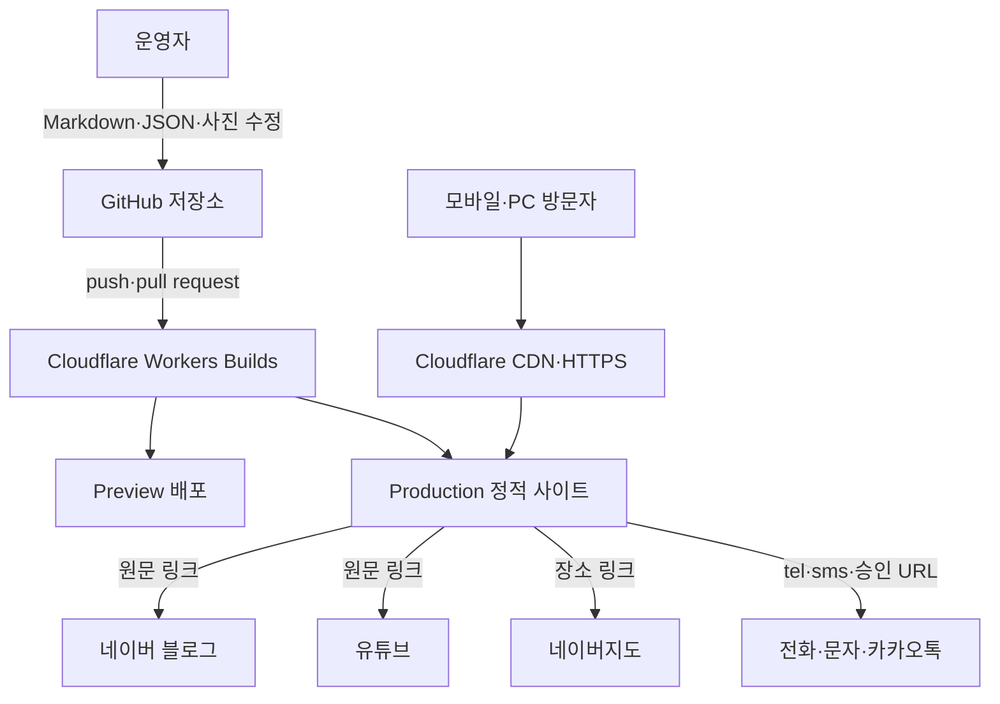
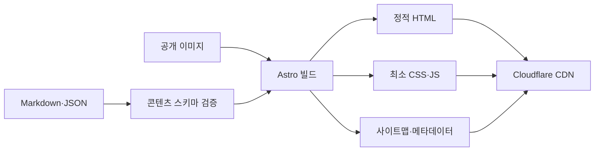

# 천동 리더스시티 행복한부동산 홈페이지 시스템 설계서

| 항목 | 내용 |
|---|---|
| 문서 ID | HRE-DESIGN-001 |
| 버전 | v0.2 Draft |
| 작성 기준일 | 2026-08-24 |
| 문서 상태 | 정적 사이트 방향 반영·운영자 검토 대기 |
| 아키텍처 | Astro 정적 사이트 생성(SSG) |
| 배포 | GitHub → Workers Builds → Workers Static Assets |
| 데이터 | Markdown·JSON·공개용 이미지 파일 |
| 관련 문서 | `CODEX.md`, `01_천동_리더스시티_행복한부동산_서비스기획서.md`, `03_천동_리더스시티_행복한부동산_개발진행체크리스트.md` |

> 최종 도메인, 공개 문구, 사진, 법정 표시사항은 운영자 승인 후 적용한다. 무료 플랜의 약관과 한도는 출시 시점에 다시 확인한다.

---

## 1. 설계 목표

1. 스마트폰에서 빠르고 읽기 쉬운 부동산 홈페이지를 제공한다.
2. 정적 HTML로 검색 노출과 초기 로딩 성능을 확보한다.
3. 운영자가 매물·FAQ·외부 링크 파일을 직접 수정할 수 있게 한다.
4. GitHub 변경 이력과 Cloudflare Preview로 공개 전 검수한다.
5. 데이터베이스·서버·관리자 로그인 없이 운영비와 보안 부담을 줄인다.
6. 고객 개인정보를 홈페이지와 저장소에 보관하지 않는다.
7. 나중에 필요하면 콘텐츠 구조를 유지한 채 동적 시스템으로 확장할 수 있게 한다.

---

## 2. 확정 기술 결정

| 결정 | 선택 | 이유 |
|---|---|---|
| 렌더링 | 빌드 시 정적 HTML 생성 | SEO·속도·장애 범위·비용에 유리 |
| 프레임워크 | Astro | 정적 페이지 중심, 적은 브라우저 JS, Markdown 콘텐츠에 적합 |
| 콘텐츠 저장 | Astro Content Collections 또는 Markdown·JSON | 사람이 파일을 직접 수정하고 스키마 검증 가능 |
| 공개 이미지 | Git 저장소의 최적화본 | 초기 규모에서 추가 스토리지 비용 제거 |
| 저장소 | GitHub | 코드·콘텐츠 이력과 Cloudflare 연동 |
| 호스팅 | Cloudflare Workers Static Assets Free | 정적 자산 호스팅·SSL·CDN·Preview 제공 |
| 문의 | `tel:`, `sms:`, 승인된 카카오톡 URL | 서버·DB·개인정보 저장 불필요 |
| 외부 콘텐츠 | 승인된 메타데이터와 원문 링크 수동 등록 | API 장애·CORS·약관·개발 비용 최소화 |
| 지도 | 네이버지도 장소 링크 | 지도 API 키·좌표·임베드 비용 제거 |

### 2.1 초기 비채택

- ASP.NET Core·Next.js 서버 렌더링
- PostgreSQL·Supabase·D1·ORM·마이그레이션
- 관리자 인증·권한·MFA·세션
- 자체 상담 API·게시판·메일 발송
- Worker 런타임 코드·Functions·서버 API
- S3·R2·Vercel Blob 등 별도 객체 스토리지
- Redis·큐·백그라운드 스케줄러
- 실시간 외부 API와 자동 크롤링

동적 기능을 추가하면 비용뿐 아니라 개인정보·인증·백업·장애 대응 범위가 달라지므로 별도 결정으로 다룬다.

---

## 3. 전체 구조



런타임 서버와 DB가 없으므로 방문 요청 시 외부 저장소를 조회하지 않는다. 모든 공개 정보는 배포 시 만들어진 HTML·CSS·JS·이미지에서 제공한다.

### 3.1 신뢰 경계

| 영역 | 포함 가능 | 포함 금지 |
|---|---|---|
| GitHub | 공개 승인된 사업 정보·매물·이미지 | 고객 연락처·상담·정확한 동호수·비밀키 |
| 정적 HTML | 공개 매물·단지·법정 표시·연락 CTA | 내부 메모·의뢰인·비공개 위치 |
| 브라우저 JS | 공개 필터 데이터·UI 상태 | 비밀키·비공개 데이터·인증 토큰 |
| 외부 링크 | 승인된 공개 URL | 사용자 개인정보가 포함된 쿼리 문자열 |

---

## 4. 권장 저장소 구조

```text
/
├─ CODEX.md
├─ README.md
├─ package.json
├─ package-lock.json
├─ astro.config.mjs
├─ tsconfig.json
├─ wrangler.jsonc
├─ public/
│  ├─ images/
│  │  ├─ office/
│  │  ├─ complexes/
│  │  └─ listings/<listing-id>/
│  ├─ favicon.svg
│  ├─ robots.txt
│  └─ _headers
├─ src/
│  ├─ components/
│  │  ├─ layout/
│  │  ├─ home/
│  │  ├─ listings/
│  │  ├─ content/
│  │  └─ common/
│  ├─ layouts/
│  │  └─ BaseLayout.astro
│  ├─ pages/
│  │  ├─ index.astro
│  │  ├─ office.astro
│  │  ├─ complexes/
│  │  ├─ properties/
│  │  │  ├─ index.astro
│  │  │  └─ [slug].astro
│  │  ├─ contents.astro
│  │  ├─ faq.astro
│  │  ├─ reviews.astro
│  │  ├─ location.astro
│  │  ├─ privacy.astro
│  │  └─ terms.astro
│  ├─ content/
│  │  ├─ listings/
│  │  ├─ complexes/
│  │  └─ articles/
│  ├─ data/
│  │  ├─ office.json
│  │  ├─ faq.json
│  │  ├─ reviews.json
│  │  └─ external-links.json
│  ├─ lib/
│  │  ├─ listing-format.ts
│  │  ├─ listing-filter.ts
│  │  └─ seo.ts
│  ├─ styles/
│  │  ├─ tokens.css
│  │  └─ global.css
│  └─ content.config.ts
├─ tests/
│  └─ e2e/
└─ .github/workflows/
```

구조는 초기 구현 시 조정할 수 있지만 콘텐츠, 화면, 공통 컴포넌트, 순수 유틸리티의 책임은 분리한다.

---

## 5. 빌드·런타임 흐름



### 5.1 빌드 실패 조건

- 콘텐츠 문법 또는 스키마 오류
- 중복 `id`·`slug`
- 잘못된 거래유형·상태·가격 조합
- `published` 매물의 최근 확인일·출처·필수 표시 정보 누락
- 존재하지 않는 이미지 경로
- 이미지 대체 텍스트 누락
- 금지 필드 또는 비밀정보 패턴 검출
- 내부 링크 오류

자동 검사가 법률 준수와 이미지 권리를 완전히 보증하지 않는다. 공개 전 사람의 검수도 필요하다.

### 5.2 런타임 동작

- 서버 호출 없이 정적 페이지를 표시한다.
- 매물 목록 페이지의 공개 데이터만 JSON으로 직렬화한다.
- 거래유형·블록·면적·가격 필터는 브라우저에서 실행한다.
- 필터 상태는 가능한 범위에서 URL 쿼리에 반영한다.
- 전화·문자·카카오톡·지도는 외부 앱 또는 URL로 이동한다.

---

## 6. 콘텐츠 스키마

### 6.1 매물 `Listing`

| 필드 | 형식 | 필수 | 공개 규칙 |
|---|---|---:|---|
| `id` | 영문 kebab-case 문자열 | O | 내부·공개 식별자, 개인정보 금지 |
| `slug` | 영문 kebab-case 문자열 | O | URL 고유값 |
| `title` | 문자열 | O | 과장·긴급성 금지 |
| `status` | enum | O | `draft`, `published`, `contracted`, `ended` |
| `propertyType` | enum | O | MVP는 `apartment` |
| `tradeType` | enum | O | `sale`, `jeonse`, `monthly-rent` |
| `complex` | enum | O | `leaders-city-4`, `leaders-city-5` |
| `salePriceKrw` | 정수·null | 조건부 | 매매만 사용 |
| `depositKrw` | 정수·null | 조건부 | 전세·월세 사용 |
| `monthlyRentKrw` | 정수·null | 조건부 | 월세만 사용 |
| `supplyAreaM2` | 숫자 | 결정 | 승인 자료 기준 |
| `exclusiveAreaM2` | 숫자 | O | ㎡ 저장, 평은 표시 시 계산 |
| `typeLabel` | 문자열 | 결정 | 예: 84A, 면적과 분리 |
| `floorLabel` | 문자열 | 결정 | 공개 가능한 `저층·중층·고층` 등 |
| `direction` | 문자열 | 결정 | 확인된 경우만 표시 |
| `moveIn` | 문자열 | 결정 | 공개용 표현 |
| `maintenanceFee` | 문자열 | 결정 | 근거 확인 후 표시 |
| `summary` | 문자열 | O | 공개용 짧은 설명 |
| `features` | 문자열 배열 | O | 실제 확인 특징 |
| `images` | 이미지 배열 | 조건부 | 이미지 정책 확정 전 검수 필수 |
| `source` | 문자열 | O | 정보 출처 |
| `confirmedAt` | 날짜 | O | 최근 확인일 |
| `publishedAt` | 날짜·null | 조건부 | 공개 시 사용 |

거래유형별 가격 규칙:

- 매매: `salePriceKrw`만 필수이며 전세·월세 가격은 `null`
- 전세: `depositKrw` 필수, `salePriceKrw`와 `monthlyRentKrw`는 `null`
- 월세: `depositKrw`와 `monthlyRentKrw` 필수, `salePriceKrw`는 `null`
- 금액은 원 단위 안전 정수로 저장하고 음수·0원·비정상 범위를 검증한다.

정확한 동·호수, 소유자·임대인, 중개의뢰 근거 원본, 내부 메모, 고객 연락처 필드는 만들지 않는다.

### 6.2 이미지

```yaml
images:
  - src: /images/listings/leaders-city-5-84-sale-001/01.webp
    alt: 거실에서 남향 창 방향을 바라본 모습
    width: 1600
    height: 1067
```

- 공개용 최적화본만 저장한다.
- 같은 매물 ID 폴더를 사용한다.
- 파일명은 `01.webp`, `02.webp`처럼 단순하게 한다.
- 원본 EXIF·GPS를 제거한다.
- 얼굴·차량번호·우편물·계약서 등 개인정보를 검수한다.
- 대표 이미지는 배열의 첫 이미지로 한다.

### 6.3 사무소 정보 `Office`

한 개의 데이터 파일을 푸터·소개·매물 상세·구조화 데이터가 공유한다.

필드 가안:

- `legalName`
- `brandName`
- `representative`
- `mobile`
- `address`
- `registrationNumber`
- `businessNumber`
- `email`
- `hours`
- `parking`
- `naverPlaceId`
- `naverBlogUrl`
- `youtubeUrl`
- `kakaoUrl`

미승인 값은 `null`로 두고 컴포넌트가 해당 항목을 렌더링하지 않아야 한다.

### 6.4 단지·FAQ·외부 콘텐츠

- 단지: 블록, 제목, 승인된 숫자 정보, 설명, 출처, 기준일, 이미지
- FAQ: `id`, 질문, 답변, 노출 순서, 공개 여부
- 외부 콘텐츠: 유형, 제목, 게시일, 짧은 요약, 원문 URL, 이미지 사용 권리 상태
- 후기: 실제 여부와 공개 동의가 확인된 최소 정보만 사용하고, 준비되지 않으면 파일과 화면에서 제외

---

## 7. 페이지 생성·라우팅

### 7.1 정적 생성

- 일반 페이지는 `.astro` 파일에서 정적 생성한다.
- 매물 상세는 빌드 시 `published` 콘텐츠의 `slug`별 HTML을 만든다.
- 초안·종료 매물은 Production 경로와 사이트맵에서 제외한다.
- 계약완료 매물은 초기에는 제외하며 URL 유지 정책은 운영자 승인 후 구현한다.

### 7.2 매물 목록 필터

- 서버 검색 대신 공개 매물 배열을 클라이언트에서 필터링한다.
- 필터 적용 시 결과 수를 보조기술에 알리는 `aria-live` 영역을 사용한다.
- 필터 버튼과 입력에는 명시적 label을 제공한다.
- `필터 초기화`를 항상 제공한다.
- URL 쿼리는 공개 필터 값만 사용하고 개인정보를 넣지 않는다.
- 매물 수가 수백 건을 넘어 초기 JS 크기나 운영 오류가 문제가 될 때만 서버 검색을 검토한다.

### 7.3 오류·빈 상태

- 404 페이지에 홈·매물 목록·전화 문의 링크를 제공한다.
- 매물 0건은 오류가 아니라 정상 상태로 처리한다.
- 이미지가 없으면 무단 대체 사진 대신 승인된 공통 플레이스홀더 또는 이미지 없는 카드 디자인을 사용한다.
- 외부 링크가 없거나 미승인이면 버튼 자체를 렌더링하지 않는다.

---

## 8. 컴포넌트 설계

| 컴포넌트 | 책임 |
|---|---|
| `BaseLayout` | title·description·canonical·공통 헤더·푸터 |
| `SiteHeader` | 데스크톱 내비게이션·모바일 메뉴 |
| `MobileContactBar` | 전화·문자·승인된 카카오톡 CTA |
| `HeroSection` | 지역·대표·핵심 문장·주 CTA |
| `ListingCard` | 사진·가격·면적·최근 확인일·상태 |
| `ListingFilters` | 공개 필터와 결과 수·초기화 |
| `ListingGallery` | 반응형 이미지와 대체 텍스트 |
| `ComplexCard` | 4블록·5블록 요약 |
| `ExternalContentCard` | 블로그·유튜브 요약·원문 링크 |
| `FaqList` | 접근 가능한 질문·답변 펼침 |
| `OfficeInfo` | 단일 사무소 데이터 렌더링 |
| `SeoHead` | 메타·Open Graph·구조화 데이터 |

컴포넌트는 공개 데이터를 props로 받고 파일 시스템을 직접 탐색하지 않는다. 콘텐츠 조회와 정렬은 페이지 또는 전용 라이브러리에서 처리한다.

---

## 9. 모바일·반응형 구현

### 9.1 CSS 원칙

- 모바일 기본 스타일을 먼저 작성하고 `min-width` 미디어 쿼리로 확장한다.
- 고정 픽셀 폭보다 `min()`, `max()`, `clamp()`, Grid/Flex를 우선한다.
- 전체 컨테이너는 작은 화면에서 좌우 16px 이상 여백을 둔다.
- 본문은 16px 이상, 행간 1.5 이상으로 한다.
- 터치 대상은 최소 44×44px이며 인접 버튼 간 간격을 둔다.
- `100vw`로 인한 스크롤바 넘침을 피한다.

권장 구간:

| 폭 | 배치 |
|---|---|
| 360~767px | 한 열, 접이식 메뉴·필터, 하단 고정 CTA |
| 768~1023px | 2열 카드, 넓어진 필터 |
| 1024px 이상 | 최대 폭 컨테이너, 3열 카드, 데스크톱 내비게이션 |

콘텐츠에 맞으면 중간 구간을 추가할 수 있지만 특정 기기명에 종속되지 않는다.

### 9.2 하단 상담 CTA

- `position: fixed` 사용 시 `env(safe-area-inset-bottom)`을 고려한다.
- 본문에 CTA 실제 높이 이상의 아래 padding을 둔다.
- 키보드 포커스가 CTA 뒤에 숨지 않게 `scroll-margin`을 적용한다.
- 3개 버튼을 넘기지 않는다.
- 카카오톡 URL 미승인 시 전화·문자 2개 버튼이 균등 확장된다.
- 데스크톱에서는 고정 바 대신 헤더·본문 CTA로 전환할 수 있다.

### 9.3 매물 카드·필터

- 작은 화면은 카드 한 열과 가로 폭 전체 버튼을 사용한다.
- 카드 상단에서 사진, 거래유형, 가격을 우선 인지하게 한다.
- 면적, 층·방향, 최근 확인일은 읽기 순서를 유지한다.
- 필터 패널이 열려도 닫기·적용·초기화가 화면 안에 있어야 한다.
- 필터 결과 0건 화면에도 전화 문의가 가능해야 한다.

### 9.4 접근성 검증

- 200% 확대에서 기능 손실과 불필요한 가로 스크롤 없음
- 키보드 탭 순서가 시각적 순서와 일치
- 메뉴 열림·닫힘과 FAQ 상태를 ARIA로 전달
- `prefers-reduced-motion`에서 불필요한 동작 제거
- 명도 대비와 포커스 표시를 실제 색상으로 측정
- Android Chrome과 iPhone Safari에서 전화·문자 링크 확인

---

## 10. 이미지·성능 설계

- 공개 이미지 기본 형식은 WebP, 가능하면 AVIF 소스를 함께 제공한다.
- 히어로와 첫 매물 이미지에는 적절한 우선순위를 적용하고 나머지는 지연 로드한다.
- `srcset`·`sizes`로 화면 폭에 맞는 이미지를 제공한다.
- 이미지 `width`·`height` 또는 aspect ratio를 지정해 CLS를 방지한다.
- 사진 한 장은 특별한 이유가 없으면 1MB 이하, 일반 카드용은 더 작게 최적화한다.
- 동영상 파일은 저장소와 Pages에 직접 올리지 않고 유튜브를 사용한다.
- 외부 폰트와 아이콘 라이브러리를 최소화하고 시스템 폰트·간단한 SVG를 우선한다.

성능 목표:

| 항목 | 내부 목표 |
|---|---|
| 모바일 Lighthouse | 성능·접근성·SEO 각 90 이상 |
| LCP | 2.5초 이하 |
| INP | 200ms 이하 |
| CLS | 0.1 이하 |
| 초기 브라우저 JS | 필요한 기능만 포함, 증가 시 근거 기록 |

---

## 11. 외부 콘텐츠 설계

### 11.1 네이버 블로그

- 운영자가 추천 글 URL·제목·게시일·짧은 요약을 등록한다.
- 원문 전체와 권한 없는 썸네일을 복제하지 않는다.
- 빌드 또는 방문 시 RSS를 필수 의존성으로 사용하지 않는다.
- 링크가 사라져도 홈페이지 핵심 화면은 정상 동작한다.

### 11.2 유튜브

- 영상 ID·제목·게시일·요약·채널 URL을 수동 등록한다.
- 자동재생하지 않는다.
- 무거운 iframe은 클릭 후 로드하거나 원문 링크로 이동한다.
- 썸네일 이용 정책과 권리를 확인한다.

### 11.3 네이버지도

- 장소 ID `1135476130`의 공식 장소 일치를 배포 전 확인한다.
- 초기에는 `네이버지도에서 보기` 외부 링크를 사용한다.
- 지도 임베드와 API 키는 사용하지 않는다.

### 11.4 부동산뱅크

- 운영자가 매물 상태·가격·확인일을 수동 대조한다.
- 공식 CSV 또는 API가 확인되기 전 자동 수집하지 않는다.
- 향후 가져오기 도구를 만들더라도 즉시 공개하지 않고 파일 생성·검수까지만 자동화한다.

---

## 12. SEO 설계

### 12.1 메타데이터

```text
Home: 대전 동구 천동 리더스시티 행복한부동산 | 4블록·5블록 매물
Property: {블록} {거래유형} {전용면적} | 천동 리더스시티 행복한부동산
Complex: 리더스시티 {블록} 단지정보·매물 | 천동 행복한부동산
```

- 페이지별 고유 title·description·canonical
- Open Graph title·description·image
- 실제 도메인 확정 전 canonical을 운영 배포에 잘못 고정하지 않음
- 공유 이미지는 승인된 사진만 사용

### 12.2 구조화 데이터

- 홈·소개: 승인 정보로 `RealEstateAgent` 또는 `LocalBusiness`
- 탐색 경로: `BreadcrumbList`
- 콘텐츠: 필요 시 `Article`·`VideoObject`
- 매물: 검색엔진 지원 범위를 확인한 뒤 `RealEstateListing` 검토
- 가짜 평점·후기 수·영업시간을 넣지 않음

### 12.3 사이트맵·robots

- 공개 정적 페이지만 사이트맵에 포함한다.
- `draft`, `contracted`, `ended` 매물과 필터 쿼리를 제외한다.
- Preview 배포는 검색 색인을 차단한다.
- 404·중복 canonical·내부 링크를 빌드 후 검사한다.

---

## 13. 보안·개인정보 설계

정적 사이트라도 다음을 적용한다.

- HTTPS와 Cloudflare 기본 TLS
- `_headers`를 통한 Content-Security-Policy, Referrer-Policy, X-Content-Type-Options, Permissions-Policy 검토
- 외부 링크에 `noopener noreferrer`
- 의존성 잠금 파일과 취약점 점검
- 저장소 비밀정보 스캔
- HTML·URL·JSON에 개인정보가 없는지 검사
- 외부 스크립트는 필요성과 개인정보 영향을 승인받고 추가

정적 MVP에는 사용자 입력·쿠키 인증·DB·서버 로그가 없다. 따라서 CSRF·SQL 삽입·세션 탈취·DB 백업 범위도 없다. 기능이 추가되면 이 위협 모델을 다시 작성한다.

### 13.1 금지 정보

- 고객·소유자·임대인 이름·전화번호·상담 내용
- 정확한 동·호수와 내부 매물 메모
- 계약서·신분증·등록증 원본
- 비밀번호·API 키·토큰·인증서·운영 `.env`
- 사용 권한이 없는 이미지·지도·평면도·기사 원문

---

## 14. 캐시·배포 산출물

- 콘텐츠 해시가 포함된 CSS·JS·이미지는 장기 캐시할 수 있다.
- HTML은 새 배포가 빠르게 반영되도록 보수적인 캐시 정책을 사용한다.
- Workers Static Assets가 정적 산출물을 Cloudflare CDN에 배포한다.
- 브라우저 로컬 저장소에 매물·상담 정보를 저장하지 않는다.
- Service Worker와 오프라인 캐시는 초기 제외한다.

---

## 15. CI·CD

### 15.1 예상 명령

프로젝트 초기화 후 실제 `package.json`을 기준으로 한다.

```bash
npm ci
npm run check
npm run build
npm run test:e2e
```

Cloudflare Workers Builds 설정 가안:

| 항목 | 값 |
|---|---|
| Git 공급자 | GitHub |
| Production 브랜치 | 실제 기본 브랜치 확인 후 설정 |
| 빌드 명령 | `npm run build` |
| 배포 명령 | `npx wrangler deploy` |
| 정적 자산 디렉터리 | `./dist` |
| Node.js 버전 | 프로젝트 초기화 시 고정 |

`wrangler.jsonc` 가안:

```jsonc
{
  "$schema": "./node_modules/wrangler/config-schema.json",
  "name": "leaders-city-happy-realty",
  "compatibility_date": "2026-08-24",
  "assets": {
    "directory": "./dist"
  }
}
```

`main`과 Worker 스크립트는 두지 않는다. 초기 배포는 정적 자산 전용이며, 서버 API를 암묵적으로 추가하지 않는다.

### 15.2 CI 검사

- 의존성 설치와 잠금 파일 일치
- TypeScript·Astro 검사
- 콘텐츠 스키마·중복 ID·상태·가격 규칙
- 금지 필드·비밀·개인정보 패턴
- 정적 빌드
- 내부 링크·이미지 경로·사이트맵
- 핵심 E2E·모바일 뷰포트·접근성 검사

### 15.3 배포 흐름

1. 작업 브랜치 또는 로컬 수정
2. 자동 검사와 정적 빌드
3. Cloudflare Preview 생성
4. 운영자 모바일·PC 검수
5. 기본 브랜치 반영
6. Production 자동 배포
7. 핵심 화면·CTA·404·사이트맵 점검

### 15.4 롤백

- Cloudflare의 직전 정상 배포 버전으로 되돌리거나 문제 커밋을 Git revert한 뒤 재배포한다.
- DB와 마이그레이션이 없으므로 애플리케이션·스키마 호환 문제는 없다.
- 사진 원본은 Git 저장소 밖에서 별도 백업한다.

---

## 16. 테스트 전략

### 16.1 단위·스키마 테스트

- 거래유형별 가격 조합
- 원 단위 금액 표시
- ㎡와 평 표시 변환
- 상태별 공개·사이트맵 포함 여부
- 최근 확인일·출처·필수 필드
- 외부 URL 허용 형식
- 사무소 미승인 값 미노출

### 16.2 빌드 통합 테스트

- 모든 `published` 매물 상세 생성
- 초안·종료 매물 미생성
- 중복 slug 실패
- 누락 이미지·대체 텍스트 실패
- 내부 링크·canonical·사이트맵 일치
- 정확한 동·호수·개인정보 금지 패턴

### 16.3 E2E·수동 테스트

- 홈·모바일 메뉴·하단 CTA
- 매물 필터·초기화·빈 결과·상세
- 4블록·5블록 혼동 없음
- 전화·문자·카카오톡·블로그·유튜브·지도 링크
- 360·390·430·768·1280px 레이아웃
- 200% 확대·키보드·포커스·명도 대비
- 이미지 누락·긴 한국어·느린 네트워크
- Android Chrome·iPhone Safari 실기기 확인

### 16.4 성능·SEO

- Lighthouse 모바일 성능·접근성·SEO
- LCP 이미지 크기와 로딩 우선순위
- CLS·불필요한 JS·외부 요청
- robots.txt·사이트맵·구조화 데이터 검사

---

## 17. 운영 절차

### 17.1 매물 등록·수정

1. 부동산뱅크와 실제 확인 자료를 대조한다.
2. 기존 매물 파일을 복사하지 말고 템플릿에서 새 파일을 만든다.
3. 공개 가능한 정보만 입력하고 사진을 최적화한다.
4. `draft`로 로컬·Preview에서 확인한다.
5. 법정 표시·최근 확인일·출처·이미지 권리를 검수한다.
6. `published`로 변경하고 GitHub에 반영한다.
7. Production에서 모바일 화면과 연락 링크를 확인한다.

### 17.2 계약완료·종료

1. 부동산뱅크 상태를 확인한다.
2. 파일의 `status`를 `contracted` 또는 `ended`로 바꾼다.
3. 빌드 결과에서 목록과 사이트맵 제외를 확인한다.
4. 기존 URL 정책이 확정되면 종료 안내 페이지 동작도 확인한다.

### 17.3 장애 점검

1. Cloudflare 배포 상태와 최근 커밋 확인
2. 빌드 로그에서 콘텐츠·이미지 경로 오류 확인
3. Preview와 Production 비교
4. 외부 링크 장애인지 사이트 장애인지 구분
5. 필요 시 직전 정상 배포로 롤백
6. 원인과 수정 파일을 기록

---

## 18. 비용·용량 경계

- 정적 자산 요청은 Workers Static Assets 무료 범위 사용을 전제로 한다.
- Workers Builds 무료 플랜의 빌드 시간과 정적 자산의 파일 수·파일 크기 한도 안에서 운영한다.
- 사진은 저장소와 배포 크기를 줄이도록 최적화한다.
- 동영상과 대용량 원본은 저장소에 넣지 않는다.
- 사진이나 매물 수가 늘어 배포가 느려질 때 R2 등 별도 스토리지를 검토한다.
- 도메인 갱신료 외 비용이 생기는 서비스는 사용자 승인 후 도입한다.

---

## 19. 동적 시스템 전환 기준

다음 중 하나가 반복되는 실제 문제로 확인되면 DB·관리자 화면을 검토한다.

- 매물 파일 수가 많아 수동 수정 오류가 잦음
- 두 명 이상이 동시에 수정해 Git 충돌이 반복됨
- 현장에서 모바일로 사진과 매물을 즉시 등록해야 함
- 자체 비공개 상담 수집·상태 관리가 업무상 필수
- 공식 CSV·API 연동이 확보되어 자동 동기화 이점이 큼
- 이미지 저장소 크기·배포 시간이 무료 범위를 벗어남

전환 시 다음을 새로 설계한다.

- 호스팅·DB·스토리지 비용
- 관리자 인증·MFA·권한
- 개인정보 암호화·보유·파기
- 입력 검증·업로드 보안·감사 로그
- DB 백업·복구·마이그레이션
- 서버 모니터링·장애 대응

---

## 20. ADR 목록

| ADR | 결정 | 상태 |
|---|---|---|
| ADR-001 | Astro 정적 사이트 생성 | 승인 |
| ADR-002 | GitHub 코드·콘텐츠 저장 | 승인 |
| ADR-003 | Workers Static Assets·Workers Builds 무료 배포 | 승인, 출시 시 약관·한도 재확인 |
| ADR-004 | DB·관리자 화면·자체 상담 제외 | 승인 |
| ADR-005 | 공개 이미지 저장소 포함 | 승인, 규모 증가 시 재검토 |
| ADR-006 | 전화·문자·승인된 카카오톡 상담 | 승인 |
| ADR-007 | 블로그·유튜브·지도 수동 링크 | 승인 |
| ADR-008 | 실제 도메인 | 결정 필요 |
| ADR-009 | 매물 확인 기한·계약완료 URL 정책 | 결정 필요 |
| ADR-010 | 분석 도구·쿠키 | 초기 제외 |

---

## 21. 출시 전 기술 체크리스트

### 정적 빌드

- [ ] `npm ci`, `npm run check`, `npm run build` 성공
- [ ] 공개 매물 콘텐츠 스키마와 링크 검사 성공
- [ ] 초안·종료 매물이 Production과 사이트맵에 없음
- [ ] 샘플·자리표시자·가짜 후기 없음

### 모바일·접근성

- [ ] 360·390·430px 한 열 레이아웃 정상
- [ ] 본문 16px 이상, 터치 영역 44×44px 이상
- [ ] 하단 CTA가 콘텐츠·포커스를 가리지 않음
- [ ] 키보드·200% 확대·명도 대비·대체 텍스트 확인
- [ ] Android Chrome·iPhone Safari 실기기 확인

### 보안·개인정보·법정 정보

- [ ] 비밀정보·고객 개인정보·정확한 동호수 미포함
- [ ] 외부 링크 보호 속성·보안 헤더 확인
- [ ] 이미지 권리·EXIF·개인정보 확인
- [ ] 중개대상물 표시 항목 운영자·필요 시 전문가 검수

### SEO·성능

- [ ] title·description·canonical·Open Graph 고유성
- [ ] 사이트맵·robots.txt·404 확인
- [ ] 구조화 데이터 실제 승인 정보만 포함
- [ ] 모바일 Lighthouse 성능·접근성·SEO 90 이상 목표 확인

### 배포·운영

- [ ] GitHub → Cloudflare Preview·Production 자동 배포 확인
- [ ] 실제 도메인·HTTPS·리디렉션 확인
- [ ] 전화·문자·카카오톡·지도·블로그·유튜브 링크 확인
- [ ] 직전 정상 배포 롤백 확인
- [ ] 운영자 콘텐츠 수정·배포 매뉴얼 검수

---

## 22. 참고 자료

| ID | 자료 | 용도 |
|---|---|---|
| REF-01 | https://docs.astro.build/ | Astro 공식 문서 |
| REF-02 | https://developers.cloudflare.com/workers/static-assets/ | Workers Static Assets |
| REF-03 | https://developers.cloudflare.com/workers/static-assets/billing-and-limitations/ | 정적 자산 요금·한도 |
| REF-04 | https://developers.cloudflare.com/workers/ci-cd/builds/limits-and-pricing/ | Workers Builds 무료 한도 |
| REF-05 | https://developers.cloudflare.com/workers/configuration/routing/custom-domains/ | 사용자 도메인 연결 |
| REF-06 | https://searchadvisor.naver.com/guide/seo-basic-intro | 네이버 SEO |
| REF-07 | https://developers.google.com/search/docs/appearance/structured-data/local-business | LocalBusiness 구조화 데이터 |
| REF-08 | https://schema.org/RealEstateAgent | RealEstateAgent 스키마 |
| REF-09 | https://www.w3.org/TR/WCAG22/ | WCAG 2.2 |
| REF-10 | https://web.dev/articles/defining-core-web-vitals-thresholds | Core Web Vitals |
| REF-11 | https://www.law.go.kr/LSW/lsInfoP.do?lsId=001654 | 공인중개사법 |

---

## 부록 A. 첫 구현 순서

1. Astro 프로젝트·README·Git 기본 파일·CI
2. 디자인 토큰·공통 레이아웃·모바일 헤더·하단 CTA
3. 단일 사무소 데이터와 홈·소개·오시는 길
4. 4블록·5블록 콘텐츠와 페이지
5. 매물 콘텐츠 스키마·검증·가격 표시 유틸리티
6. 매물 목록·클라이언트 필터·상세 정적 생성
7. 블로그·유튜브·FAQ·후기 링크 콘텐츠
8. SEO·사이트맵·robots·보안 헤더
9. 모바일·접근성·성능·E2E 검증
10. Workers Static Assets 배포·도메인·롤백·운영자 교육
