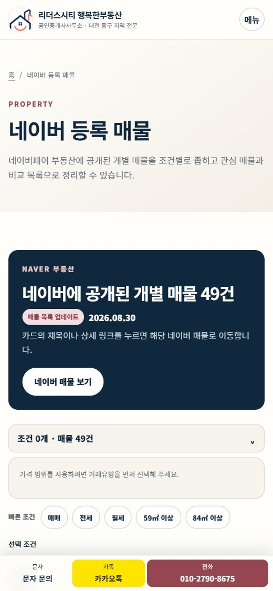

# 대전 동구 행복한부동산 홈페이지

대전 동구와 천동 리더스시티·신흥 SK뷰를 중심으로 매매·전세·월세 정보를 안내하는 리더스시티 행복한부동산 홈페이지입니다.

공개된 매물을 원하는 조건으로 비교하고, 지역과 단지 정보를 살펴본 뒤 전화·문자·카카오톡으로 편하게 상담할 수 있도록 만들었습니다. 고객의 연락처와 상담 내용은 홈페이지에 저장하지 않습니다.

공식 사이트: [leaderscityhappy.com](https://leaderscityhappy.com)

## 화면 미리보기


| 모바일 홈 | 모바일 매물 찾기 |
|:---:|:---:|
|  |  |

_2026년 8월 31일 운영 사이트 화면 기준_

## 주요 기능

- 네이버에 공개된 매물을 거래유형·가격·면적 등의 조건으로 검색
- 관심 매물 저장과 최대 3개 매물 비교
- 천동 리더스시티 4·5블록과 신흥 SK뷰 등 대전 동구 주요 단지 정보 안내
- 공식 네이버 블로그와 유튜브 콘텐츠 모아보기
- 전화·문자·카카오톡 상담 연결
- 운영자가 공개 내용을 직접 관리하고 변경 이력을 확인할 수 있는 관리자 화면

## 개발 구조

```text
사용자 화면
├─ 홈·사무소 소개
├─ 매물 검색·관심 매물·비교
├─ 리더스시티·신흥 SK뷰와 대전 동구 지역 정보
├─ 블로그·유튜브·FAQ
└─ 전화·문자·카카오톡 상담 연결

운영자 화면
├─ 공개 매물과 소개 문구 관리
├─ 지역·단지 콘텐츠 관리
├─ 블로그·유튜브 링크 관리
└─ 변경 이력과 공개 반영 상태 확인

프로젝트
├─ src/components/   공통 화면 구성
├─ src/data/         공개되는 글과 매물 정보
├─ src/pages/        홈페이지와 관리자 페이지
├─ public/           로고와 공개 이미지
├─ scripts/          콘텐츠 검사와 자동 갱신
├─ tests/            기능 검사
├─ e2e/              실제 화면 흐름 검사
└─ worker/           보호된 관리자 기능
```

## 기술 구성

| 영역 | 사용 기술 | 적용 방식 |
|---|---|---|
| 홈페이지 | Astro | 빠르고 가벼운 정적 페이지로 제작 |
| 콘텐츠 | JSON·공개 이미지 | 별도 데이터베이스 없이 파일로 관리 |
| 저장·변경 이력 | GitHub | 코드와 공개 콘텐츠의 변경 내용을 함께 기록 |
| 배포 | Cloudflare Workers | 확정한 변경을 운영 사이트에 자동 반영 |
| 관리자 보호 | Cloudflare Access | 승인된 관리자만 콘텐츠를 수정할 수 있도록 보호 |
| 품질 확인 | Node 테스트·Playwright·Lighthouse | 데이터 오류, 주요 화면 동작, 모바일 품질을 자동 확인 |

별도 데이터베이스나 자체 회원 시스템을 두지 않아 운영비와 관리 범위를 줄였습니다. 방문자가 보는 화면은 빠르게 열리도록 미리 만들고, 콘텐츠 수정 기능은 승인된 관리자만 사용할 수 있게 구성했습니다.

## 개발·검사·배포 방법

개발은 공개 콘텐츠와 화면을 작은 단위로 수정한 뒤, 데이터·기능·모바일 화면을 확인하고 운영 사이트에 반영하는 순서로 진행합니다.

```text
콘텐츠·화면 수정
→ 자동 검사와 정적 사이트 생성
→ GitHub에 변경 기록
→ Cloudflare 자동 배포
→ 운영 사이트 최종 확인
```

개발 과정에서는 다음 내용을 순서대로 확인합니다.

1. 화면과 공개 콘텐츠를 필요한 범위만 수정합니다.
2. 잘못된 매물 정보, 누락된 항목, 개인정보 포함 여부를 자동으로 검사합니다.
3. 실제 브라우저에서 매물 검색·비교·상담 연결과 모바일 화면을 확인합니다.
4. 확인을 마친 변경은 GitHub에 기록합니다.
5. Cloudflare가 새 버전을 자동으로 배포하면 운영 사이트의 모바일·PC 화면과 주요 상담 링크를 다시 확인합니다.

구체적인 실행 명령과 배포 설정은 이 소개 문서에 길게 나열하지 않고 관련 운영 문서에 분리했습니다.

## 콘텐츠 운영 원칙

- 공개 승인을 받은 사업 정보·매물·사진만 사용합니다.
- 확인되지 않은 경력, 후기, 매물 정보는 임의로 만들지 않습니다.
- 고객 연락처·상담 내용·비공개 호수·내부 메모는 저장하지 않습니다.
- 네이버 매물은 공개된 정보와 원문 링크만 안내합니다.
- 블로그와 유튜브는 공식 채널의 제목·요약·링크를 모아 보여줍니다.
- 모바일 360px 화면부터 읽기 쉽고 상담하기 편하도록 구성합니다.

## 자동 갱신

- 부동산뱅크의 공개 매물 목록은 허용된 범위에서 하루 한 번 확인합니다.
- 공식 네이버 블로그와 유튜브의 새 콘텐츠는 정해진 시간마다 확인합니다.
- 수집이나 검사가 실패하면 잘못된 내용으로 기존 공개 데이터를 덮어쓰지 않습니다.
- 관리자 저장과 자동 갱신 내용은 GitHub 변경 이력으로 남기고 공개 반영 상태를 확인합니다.

## 관련 문서

상세한 설계와 운영 방법은 다음 문서에 분리해 두었습니다.

- [서비스 기획서](docs/01_천동_리더스시티_행복한부동산_서비스기획서.md)
- [시스템 설계서](docs/02_천동_리더스시티_행복한부동산_시스템설계서.md)
- [개발 진행 체크리스트](docs/03_천동_리더스시티_행복한부동산_개발진행체크리스트.md)
- [콘텐츠 운영 안내](docs/operations/CONTENT_GUIDE.md)
- [Cloudflare 배포 안내](docs/operations/CLOUDFLARE_DEPLOY.md)
