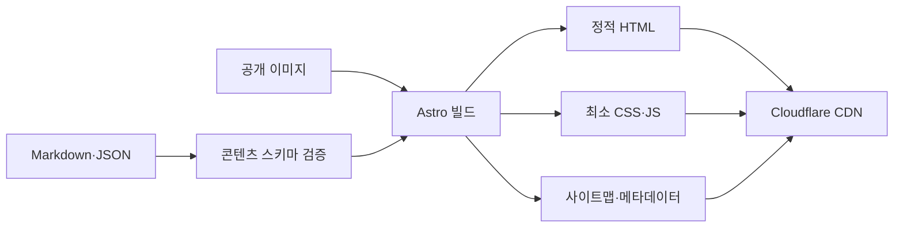

# 천동 리더스시티 행복한부동산 홈페이지 시스템 설계서

| 항목 | 내용 |
|---|---|
| 문서 ID | HRE-DESIGN-001 |
| 버전 | v0.6 Naver Listing Admin |
| 작성 기준일 | 2026-08-26 |
| 문서 상태 | 기준 사이트 핵심 공개 흐름·관리자 편집·GitHub 저장 API·공식 RSS 수동 동기화 구현 반영 |
| 아키텍처 | Astro 정적 사이트(SSG) + 동일 Worker 관리 API |
| 배포 | GitHub → Workers Builds → Workers Static Assets + `/api/admin/*` |
| 데이터 | Markdown·JSON·공개용 이미지 파일 |
| 관련 문서 | `CODEX.md`, `01_천동_리더스시티_행복한부동산_서비스기획서.md`, `03_천동_리더스시티_행복한부동산_개발진행체크리스트.md`, 관리자시스템 설계서·체크리스트, `ADR-004` |

> 최종 도메인, 공개 문구, 사진, 법정 표시사항은 운영자 승인 후 적용한다. 무료 플랜의 약관과 한도는 출시 시점에 다시 확인한다.

---

## 1. 설계 목표

1. 스마트폰에서 빠르고 읽기 쉬운 부동산 홈페이지를 제공한다.
2. 정적 HTML로 검색 노출과 초기 로딩 성능을 확보한다.
3. 운영자가 관리자 화면 또는 승인 파일에서 매물·홈 문구·지역 설명·외부 링크와 사진을 수정할 수 있게 한다.
4. GitHub 변경 이력과 Cloudflare Preview로 공개 전 검수한다.
5. 공개 페이지는 정적으로 유지하고, DB·자체 비밀번호 없이 Cloudflare Access가 보호하는 관리자 기능을 단계적으로 추가한다.
6. 고객 개인정보를 홈페이지와 저장소에 보관하지 않는다.
7. 나중에 필요하면 콘텐츠 구조를 유지한 채 동적 시스템으로 확장할 수 있게 한다.

---

## 2. 확정 기술 결정

| 결정 | 선택 | 이유 |
|---|---|---|
| 렌더링 | 빌드 시 정적 HTML 생성 | SEO·속도·장애 범위·비용에 유리 |
| 프레임워크 | Astro | 정적 페이지 중심, 적은 브라우저 JS, Markdown 콘텐츠에 적합 |
| 콘텐츠 저장 | Astro Content Collections 또는 Markdown·JSON | 사람이 파일을 직접 수정하고 스키마 검증 가능 |
| 공개 이미지 | Git 저장소의 최적화본 | 초기 규모에서 추가 스토리지 비용 제거 |
| 저장소 | GitHub | 코드·콘텐츠 이력과 Cloudflare 연동 |
| 호스팅 | Cloudflare Workers Static Assets Free | 정적 자산 호스팅·SSL·CDN·Preview 제공 |
| 관리자 콘텐츠 관리 | `/admin/` 정적 UI + 동일 Worker `/api/admin/*` | Access Email OTP·JWT 재검증, GitHub 허용 파일·이미지 경로만 저장 |
| 문의 | `tel:`, `sms:`, 승인된 카카오톡 URL | 서버·DB·개인정보 저장 불필요 |
| 외부 콘텐츠 | 승인된 메타데이터·원문 링크·자체 저장 썸네일 + 공식 RSS 신규 항목 동기화 | 기존 수동값은 보존하고 고정 출처·ID 검증을 통과한 신규 항목만 추가 |
| 지도 | 네이버지도 장소 링크 | 지도 API 키·좌표·임베드 비용 제거 |

### 2.1 초기 비채택

- ASP.NET Core·Next.js 서버 렌더링
- PostgreSQL·Supabase·D1·ORM·마이그레이션
- 자체 비밀번호·자체 세션 저장소·DB 기반 권한 시스템
- 자체 상담 API·게시판·메일 발송
- 공개 정적 요청 전체를 처리하는 Worker 런타임과 Pages Functions 전환
- S3·R2·Vercel Blob 등 별도 객체 스토리지
- Redis·큐·백그라운드 스케줄러
- 방문 시 실시간 외부 API와 허용받지 않은 자동 크롤링

동적 기능을 추가하면 비용뿐 아니라 개인정보·인증·백업·장애 대응 범위가 달라지므로 별도 결정으로 다룬다.

---

## 3. 전체 구조

```mermaid
flowchart TD
    OP[운영자] -->|파일 직접 수정| GIT[GitHub 저장소]
    ADMIN[관리자] -->|Email OTP| ACCESS[Cloudflare Access]
    ACCESS --> ADMINUI[/admin/ 정적 UI]
    ADMINUI -->|same-origin| ADMINAPI[/api/admin/* 동일 Worker]
    ADMINAPI -->|Origin·CSRF·스키마·SHA 검증| GIT
    ADMINUI -->|매물·문구·링크·사진 편집| ADMINAPI
    GIT -->|push·pull request| CF[Cloudflare Workers Builds]
    CF --> PREVIEW[Preview 배포]
    CF --> PROD[Production 정적 사이트]
    VISITOR[모바일·PC 방문자] --> CDN[Cloudflare CDN·HTTPS]
    CDN --> PROD
    PROD -->|원문 링크| BLOG[네이버 블로그]
    PROD -->|원문 링크| YOUTUBE[유튜브]
    PROD -->|장소 링크| MAP[네이버지도]
    PROD -->|tel·sms·승인 URL| CONTACT[전화·문자·카카오톡]
```

공개 방문 요청은 DB나 외부 저장소를 조회하지 않고 배포 시 만들어진 HTML·CSS·JS·이미지에서 제공한다. Worker 런타임은 `/api/admin`과 `/api/admin/*`에서만 먼저 실행한다. 실제 쓰기는 Production에서 저장소 한 개로 제한된 GitHub 토큰·32자 이상 CSRF Secret·쓰기 활성 변수가 모두 설정된 경우에만 열린다.

### 3.1 신뢰 경계

| 영역 | 포함 가능 | 포함 금지 |
|---|---|---|
| GitHub | 공개 승인된 사업 정보·매물·이미지와 네이버 공개 매물 스냅샷 | 고객 연락처·상담·네이버에 없는 정확한 호수·비밀키 |
| 정적 HTML | 공개 매물·단지·법정 표시·연락 CTA | 내부 메모·의뢰인·비공개 위치 |
| 브라우저 JS | 공개 필터 데이터·UI 상태 | 비밀키·비공개 데이터·인증 토큰 |
| 관리자 UI·API | Access로 검증된 공개 콘텐츠 편집, 자체 저장 썸네일, 배포 연결 | 원문 관리자 이메일·Secret·고객 개인정보 |
| 외부 링크 | 승인된 공개 URL | 사용자 개인정보가 포함된 쿼리 문자열 |

---

## 4. 권장 저장소 구조

```text
/
├─ src/
│  ├─ components/          공개·관리자 공통 UI
│  ├─ data/                공개 승인 JSON
│  ├─ layouts/             공통 HTML·SEO 레이아웃
│  ├─ lib/                 데이터 타입·표시 유틸리티
│  ├─ pages/
│  │  ├─ admin/            Access 보호 관리자 정적 UI
│  │  ├─ complexes/        단지 목록·상세
│  │  ├─ properties/       매물 목록·상세
│  │  └─ 기타 공개 페이지와 robots·llms
│  └─ styles/              전역 반응형 스타일
├─ worker/                 동일 Worker 관리 API·Access JWT 검증
├─ public/                 공개 이미지와 보안 헤더
├─ scripts/                공개 콘텐츠 검증·외부 RSS 동기화
├─ tests/                  콘텐츠·관리자 UI·Worker 단위 테스트
├─ docs/adr/               배포·관리 API 결정 기록
├─ docs/operations/        콘텐츠·배포·검색 운영 절차
├─ .github/workflows/      GitHub CI
├─ astro.config.mjs
└─ wrangler.jsonc
```

구조는 초기 구현 시 조정할 수 있지만 콘텐츠, 화면, 공통 컴포넌트, 순수 유틸리티의 책임은 분리한다.

---

## 5. 빌드·런타임 흐름



### 5.1 빌드 실패 조건

- 콘텐츠 문법 또는 스키마 오류
- 중복 `id`·`slug`
- 잘못된 거래유형·상태·가격 조합
- `published` 매물의 최근 확인일·출처·필수 표시 정보 누락
- 리더스시티 면적별 세대수 합계 불일치
- 단지·전체 안내의 출처 메타데이터 누락 또는 존재하지 않거나 비공개인 관련 콘텐츠 ID
- 존재하지 않는 이미지 경로
- 이미지 대체 텍스트 누락
- 금지 필드 또는 비밀정보 패턴 검출
- 내부 링크 오류

자동 검사가 법률 준수와 이미지 권리를 완전히 보증하지 않는다. 공개 전 사람의 검수도 필요하다.

### 5.2 런타임 동작

- 서버 호출 없이 정적 페이지를 표시한다.
- 매물 목록 페이지의 공개 데이터만 JSON으로 직렬화한다.
- 거래유형·동구 내 지역·면적·가격 필터는 브라우저에서 실행한다.
- 필터 상태는 가능한 범위에서 URL 쿼리에 반영한다.
- 전화·문자·카카오톡·지도는 외부 앱 또는 URL로 이동한다.

---

## 6. 콘텐츠 스키마

### 6.1 매물 `Listing`

| 필드 | 형식 | 필수 | 공개 규칙 |
|---|---|---:|---|
| `id` | 영문 kebab-case 문자열 | O | 내부·공개 식별자, 개인정보 금지 |
| `slug` | 영문 kebab-case 문자열 | O | URL 고유값 |
| `title` | 문자열 | O | 과장·긴급성 금지 |
| `status` | enum | O | `draft`, `published`, `contracted`, `ended` |
| `propertyType` | enum | O | MVP는 `apartment` |
| `tradeType` | enum | O | `sale`, `jeonse`, `monthly-rent` |
| `district` | 문자열 | O | 현재 `대전 동구`만 허용 |
| `neighborhoodSlug` | 영문 kebab-case 문자열 | O | 동구 내 동네 식별자 |
| `neighborhoodName` | 문자열 | O | 공개할 동네 이름 |
| `complexName` | 문자열·null | 조건부 | 단지 매물은 단지명, 비단지 매물은 `null` |
| `salePriceKrw` | 정수·null | 조건부 | 매매만 사용 |
| `depositKrw` | 정수·null | 조건부 | 전세·월세 사용 |
| `monthlyRentKrw` | 정수·null | 조건부 | 월세만 사용 |
| `supplyAreaM2` | 숫자 | 결정 | 승인 자료 기준 |
| `exclusiveAreaM2` | 숫자 | O | ㎡ 저장, 평은 표시 시 계산 |
| `typeLabel` | 문자열 | 결정 | 예: 84A, 면적과 분리 |
| `floorLabel` | 문자열 | 결정 | 공개 가능한 `저층·중층·고층` 등 |
| `direction` | 문자열 | 결정 | 확인된 경우만 표시 |
| `moveIn` | 문자열 | 결정 | 공개용 표현 |
| `maintenanceFee` | 문자열 | 결정 | 근거 확인 후 표시 |
| `summary` | 문자열 | O | 공개용 짧은 설명 |
| `features` | 문자열 배열 | O | 실제 확인 특징 |
| `thumbnail` | 이미지·null | 조건부 | 목록 대표 이미지와 대체 텍스트 |
| `images` | 이미지 배열 | 조건부 | 상세 화면용 승인 이미지 |
| `source` | 문자열 | O | 정보 출처 |
| `confirmedAt` | 날짜 | O | 최근 확인일 |
| `publishedAt` | 날짜·null | 조건부 | 공개 시 사용 |

거래유형별 가격 규칙:

- 매매: `salePriceKrw`만 필수이며 전세·월세 가격은 `null`
- 전세: `depositKrw` 필수, `salePriceKrw`와 `monthlyRentKrw`는 `null`
- 월세: `depositKrw`와 `monthlyRentKrw` 필수, `salePriceKrw`는 `null`
- 금액은 원 단위 안전 정수로 저장하고 음수·0원·비정상 범위를 검증한다.

네이버 등 공개 광고에 없는 정확한 호수, 소유자·임대인, 중개의뢰 근거 원본, 내부 메모, 고객 연락처 필드는 만들지 않는다. `naver-listings.json`에는 네이버 카드에 공개된 동 번호와 광고 층수를 같은 매물번호의 URL과 함께 저장할 수 있다.

### 6.2 이미지

```yaml
images:
  - src: /images/listings/leaders-city-5-84-sale-001/01.webp
    alt: 거실에서 남향 창 방향을 바라본 모습
    width: 1600
    height: 1067
```

- 공개용 최적화본만 저장한다.
- 같은 매물 ID 폴더를 사용한다.
- 파일명은 `01.webp`, `02.webp`처럼 단순하게 한다.
- 원본 EXIF·GPS를 제거한다.
- 얼굴·차량번호·우편물·계약서 등 개인정보를 검수한다.
- `thumbnail`이 있으면 카드 대표 이미지로 사용하고, 없으면 `images`의 첫 이미지를 사용한다.
- 관리자 업로드는 브라우저에서 WebP·최대 1600px·2MB 이하로 변환해 원본 메타데이터를 제거한다.
- 서버는 WebP 형식과 파일 크기를 다시 확인하고 `public/images/content/<허용 분류>/` 이외의 경로를 만들지 않는다.

### 6.3 사무소 정보 `Office`

한 개의 데이터 파일을 푸터·소개·매물 상세·구조화 데이터가 공유한다.

필드 가안:

- `legalName`
- `brandName`
- `representative`
- `mobile`
- `address`
- `registrationNumber`
- `businessNumber`
- `email`
- `hours`
- `parking`
- `naverPlaceId`
- `naverListingsUrl`
- `naverBlogUrl`
- `youtubeUrl`
- `kakaoUrl`

미승인 값은 `null`로 두고 컴포넌트가 해당 항목을 렌더링하지 않아야 한다.

### 6.4 단지·FAQ·외부 콘텐츠

- 홈 콘텐츠: 대표 소개, 원본 비율을 보존하는 리더스시티 현장 사진 영역, 리더스시티 알아보기 제목·설명 카드와 자체 이미지 경로
- 단지 전체 안내: `complexes-overview.json` 객체에 Hero 문구, 숫자 카드, 4·5블록 비교행, 공통 생활권·현장 확인사항, 관련 콘텐츠 ID, 출처 메타데이터와 기준일 저장
- 단지: `complexes.json` 배열에 slug, 동구 내 지역, 단지명, 표시 마크, 소개 제목·문단, 사진, 기본 사실, 면적별 세대수, 공급 요약, 생활환경, 시설 확인 상태, 현장 확인사항, FAQ, 관련 콘텐츠 ID, 출처 메타데이터와 기준일 저장
- 출처: 고유 ID, 발행처, 표시명, HTTPS URL, `official|public-data|operator|news` 종류, 확인일과 선택 참고 문구
- 시설 상태: `official|operator-confirmed|historical-plan|check-required`를 구분하며 과거 계획을 현재 운영 중인 시설로 출력하지 않음
- FAQ: `id`, 질문, 답변, 노출 순서, 공개 여부
- 외부 콘텐츠: 고유 ID, `draft|published`, 블로그·유튜브 유형, YouTube의 `youtubeFormat: video|short`, 제목, 게시일, 짧은 요약, 원문 URL, 자체 저장 썸네일과 대체 텍스트. 공개 목록은 최신순으로 정렬하고 블로그는 페이지당 9개로 표시한다. 홈의 유튜브는 일반 영상 최신 6개만 표시하고, `/youtube/`는 전체 혼합 없이 일반 영상을 기본으로 `일반 영상·Shorts 보기`를 제공해 선택 형식을 페이지당 6개씩 표시한다.
- 후기: 실제 여부와 공개 동의가 확인된 최소 정보만 사용하고, 준비되지 않으면 파일과 화면에서 제외

---

## 7. 페이지 생성·라우팅

### 7.1 정적 생성

- 일반 페이지는 `.astro` 파일에서 정적 생성한다.
- 매물 상세는 빌드 시 `published` 콘텐츠의 `slug`별 HTML을 만든다.
- 초안·종료 매물은 Production 경로와 사이트맵에서 제외한다.
- 계약완료 매물은 초기에는 제외하며 URL 유지 정책은 운영자 승인 후 구현한다.

### 7.2 매물 목록 필터

- 서버 검색 대신 공개 매물 배열을 클라이언트에서 필터링한다.
- 필터 적용 시 결과 수를 보조기술에 알리는 `aria-live` 영역을 사용한다.
- 필터 버튼과 입력에는 명시적 label을 제공한다.
- `필터 초기화`를 항상 제공한다.
- URL 쿼리는 공개 필터 값만 사용하고 개인정보를 넣지 않는다.
- 매물 수가 수백 건을 넘어 초기 JS 크기나 운영 오류가 문제가 될 때만 서버 검색을 검토한다.

### 7.3 오류·빈 상태

- 404 페이지에 홈·매물 목록·전화 문의 링크를 제공한다.
- 매물 0건은 오류가 아니라 정상 상태로 처리한다.
- 이미지가 없으면 무단 대체 사진 대신 승인된 공통 플레이스홀더 또는 이미지 없는 카드 디자인을 사용한다.
- 외부 링크가 없거나 미승인이면 버튼 자체를 렌더링하지 않는다.

---

## 8. 컴포넌트 설계

| 컴포넌트 | 책임 |
|---|---|
| `BaseLayout` | title·description·canonical·공통 헤더·푸터 |
| `SiteHeader` | 데스크톱 내비게이션·모바일 메뉴 |
| `MobileContactBar` | 전화·문자·승인된 카카오톡 CTA |
| `HeroSection` | 지역·대표·핵심 문장·주 CTA |
| `ListingCard` | 사진·가격·면적·최근 확인일·상태 |
| `NaverListingCard` | 네이버 공개 동·광고 층수·가격·면적과 개별 외부 상세 링크 |
| `ListingFilters` | 공개 필터와 결과 수·초기화 |
| `ListingGallery` | 반응형 이미지와 대체 텍스트 |
| `ComplexCard` | 대전 동구 주요 단지 요약 |
| `ExternalContentCard` | 블로그·유튜브 요약·원문 링크 |
| `FaqList` | 접근 가능한 질문·답변 펼침 |
| `OfficeInfo` | 단일 사무소 데이터 렌더링 |
| `SeoHead` | 메타·Open Graph·구조화 데이터 |

컴포넌트는 공개 데이터를 props로 받고 파일 시스템을 직접 탐색하지 않는다. 콘텐츠 조회와 정렬은 페이지 또는 전용 라이브러리에서 처리한다.

---

## 9. 모바일·반응형 구현

### 9.1 CSS 원칙

- 모바일 기본 스타일을 먼저 작성하고 `min-width` 미디어 쿼리로 확장한다.
- 고정 픽셀 폭보다 `min()`, `max()`, `clamp()`, Grid/Flex를 우선한다.
- 전체 컨테이너는 작은 화면에서 좌우 16px 이상 여백을 둔다.
- 본문은 16px 이상, 행간 1.5 이상으로 한다.
- 터치 대상은 최소 44×44px이며 인접 버튼 간 간격을 둔다.
- `100vw`로 인한 스크롤바 넘침을 피한다.

권장 구간:

| 폭 | 배치 |
|---|---|
| 360~767px | 한 열, 접이식 메뉴·필터, 하단 고정 CTA |
| 768~1023px | 2열 카드, 넓어진 필터 |
| 1024px 이상 | 최대 폭 컨테이너, 3열 카드, 데스크톱 내비게이션 |

콘텐츠에 맞으면 중간 구간을 추가할 수 있지만 특정 기기명에 종속되지 않는다.

대표·단지 인물 사진은 임의로 확대해 자르지 않고 원본 비율을 보존한다. 블로그 카드는 1024px 이상에서 3열, 중간 화면에서 2열, 작은 화면에서 1열로 표시한다.

### 9.2 하단 상담 CTA

- `position: fixed` 사용 시 `env(safe-area-inset-bottom)`을 고려한다.
- 본문에 CTA 실제 높이 이상의 아래 padding을 둔다.
- 키보드 포커스가 CTA 뒤에 숨지 않게 `scroll-margin`을 적용한다.
- 3개 버튼을 넘기지 않는다.
- 카카오톡 URL 미승인 시 전화·문자 2개 버튼이 균등 확장된다.
- 데스크톱에서는 고정 바 대신 헤더·본문 CTA로 전환할 수 있다.

### 9.3 매물 카드·필터

- 작은 화면은 카드 한 열과 가로 폭 전체 버튼을 사용한다.
- 카드 상단에서 사진, 거래유형, 가격을 우선 인지하게 한다.
- 면적, 층·방향, 최근 확인일은 읽기 순서를 유지한다.
- 필터 패널이 열려도 닫기·적용·초기화가 화면 안에 있어야 한다.
- 필터 결과 0건 화면에도 전화 문의가 가능해야 한다.

### 9.4 접근성 검증

- 200% 확대에서 기능 손실과 불필요한 가로 스크롤 없음
- 키보드 탭 순서가 시각적 순서와 일치
- 메뉴 열림·닫힘과 FAQ 상태를 ARIA로 전달
- `prefers-reduced-motion`에서 불필요한 동작 제거
- 명도 대비와 포커스 표시를 실제 색상으로 측정
- Android Chrome과 iPhone Safari에서 전화·문자 링크 확인

---

## 10. 이미지·성능 설계

- 공개 이미지 기본 형식은 WebP, 가능하면 AVIF 소스를 함께 제공한다.
- 히어로와 첫 매물 이미지에는 적절한 우선순위를 적용하고 나머지는 지연 로드한다.
- `srcset`·`sizes`로 화면 폭에 맞는 이미지를 제공한다.
- 이미지 `width`·`height` 또는 aspect ratio를 지정해 CLS를 방지한다.
- 사진 한 장은 특별한 이유가 없으면 1MB 이하, 일반 카드용은 더 작게 최적화한다.
- 동영상 파일은 저장소와 Pages에 직접 올리지 않고 유튜브를 사용한다.
- 외부 폰트와 아이콘 라이브러리를 최소화하고 시스템 폰트·간단한 SVG를 우선한다.

성능 목표:

| 항목 | 내부 목표 |
|---|---|
| 모바일 Lighthouse | 성능·접근성·SEO 각 90 이상 |
| LCP | 2.5초 이하 |
| INP | 200ms 이하 |
| CLS | 0.1 이하 |
| 초기 브라우저 JS | 필요한 기능만 포함, 증가 시 근거 기록 |

---

## 11. 외부 콘텐츠 설계

### 11.1 네이버 블로그

- 공식 블로그의 2024~2026년 공개 게시글 128건의 URL·제목·게시일·짧은 요약을 등록한다.
- 원문 전체와 권한 없는 썸네일을 복제하지 않는다.
- 빌드 또는 방문 시 RSS를 필수 의존성으로 사용하지 않는다.
- 링크가 사라져도 홈페이지 핵심 화면은 정상 동작한다.
- GitHub Actions 수동 실행에서는 공식 블로그 ID `p5468300`의 HTTPS RSS에 노출된 신규 글만 감지한다. RSS에 없는 글을 감지한다고 표현하지 않고 기존 항목을 삭제하지 않는다.
- 신규 ID는 `naver-blog-{logNo}`로 만들고 공식 제목·게시일·원문 URL과 결정론적 요약을 사용한다.

### 11.2 유튜브

- 공식 채널의 실제 영상 전체를 영상 ID·제목·게시일·요약·영상 URL로 등록한다.
- 페이지 진입 시 자동재생하지 않는다.
- 무거운 iframe은 hover 가능한 정밀 포인터가 카드 전체에 0.3초 머물 때 한 개만 `youtube-nocookie.com`에서 음소거로 지연 로드한다. 카드 이탈·필터 전환·페이지 전환·탭 비활성화 시 제거하며 모바일과 `prefers-reduced-motion` 환경에서는 만들지 않는다. 카드를 클릭하면 원문 링크로 이동한다.
- 썸네일 이용 정책과 권리를 확인한다.
- GitHub Actions Repository Variable `YOUTUBE_CHANNEL_ID`에는 2026-08-26 확인한 공식 채널 ID `UCuOZDnM5vxOZELDgu-y-hNg`를 등록한다. API 키와 YouTube Data API는 사용하지 않는다.
- 공식 Atom의 요청 channelId·채널 링크·각 entry channelId를 고정값과 대조하고, `watch`·`shorts`·`live` URL의 원본 videoId와 `<yt:videoId>`를 일치시킨다. 저장 URL은 공식 watch URL로 정규화한다.
- `<published>`를 게시일로 사용하고 `<updated>`만 바뀐 기존 videoId는 다시 추가하지 않는다. 정규화 ID가 같은데 원본 videoId가 다르면 전체 동기화를 실패시킨다.

블로그와 유튜브는 각각 최신순으로 정렬한다. 블로그는 페이지당 9개를 표시하고, 홈의 유튜브는 일반 영상 최신 6개만 표시한다. `/youtube/`는 전체 혼합 필터를 제거하고 일반 영상을 기본으로 `일반 영상·Shorts 보기`를 전환하며 선택 형식을 페이지당 6개씩 표시한다. 필터 전환 시 1페이지로 초기화한다. 페이지 번호는 카드 그리드 아래 중앙에 배치하며 키보드 버튼, 현재 페이지 `aria-current`, 이전·다음 비활성 상태를 제공한다.

관리자 화면은 블로그와 유튜브를 독립된 카테고리로 나누고 카테고리별 건수, 제목·URL 검색, 새 항목 등록과 수정 목록을 제공한다. YouTube 편집 시 일반 영상 또는 Shorts 형식을 선택하며 Shorts URL 미리보기는 형식을 자동 선택한다. 저장 형식과 API는 공통 `external-links` 리소스를 유지한다.

RSS 동기화는 `external-links.json`에 신규 항목만 append-only로 병합하고 YouTube alternate URL의 `/shorts/` 여부로 `youtubeFormat`을 결정한다. 허용된 공식 썸네일은 크기·형식·디코딩을 검사하고 960×540 WebP로 재인코딩하며, 썸네일 단독 실패는 `thumbnail: null`로 격리한다. 출처·호스트·채널 불일치, XML·ID 충돌, 최종 콘텐츠 검증 오류는 JSON과 이미지 교체 전에 전체 실행을 중단한다.

피드 조회는 출처별로 격리한다. 네트워크·408·425·429·5xx는 최대 3회 재시도하고, 고정된 공식 YouTube Atom 주소의 404도 일시 장애로 추가 분류한다. 한 출처만 계속 실패하면 Actions summary에 `skipped`와 Warning을 남기고 정상 출처의 검증된 신규 항목만 원자적으로 반영한다. 두 출처 모두 조회하지 못하거나 재시도 대상이 아닌 HTTP 오류, 응답 Content-Type·UTF-8·XML·출처·채널·ID 검증이 실패하면 전체 실행을 실패시키고 파일을 변경하지 않는다.

### 11.3 네이버지도

- 장소 ID `1135476130`의 공식 장소 일치를 배포 전 확인한다.
- 초기에는 `네이버지도에서 보기` 외부 링크를 사용한다.
- 지도 임베드와 API 키는 사용하지 않는다.

### 11.4 네이버 등록 매물

- `office.json`의 `naverListingsUrl`에 네이버페이 부동산 중개사 매물 지도 주소를 저장한다.
- `naver-listings.json`에 목록 업데이트일과 개별 매물번호·유형·거래유형·가격·면적·동 번호·광고 층수·방향·설명·등록일·상세 URL을 저장한다. 개별 등록일은 기존 `confirmedAt` 필드에 원본 등록기간 시작일을 보존한다.
- 홈은 50건 전체를 사진 없는 카드로 6건씩 페이지 처리하고, 홈과 전체 목록에서 최근 등록순·가격 낮은순·가격 높은순·면적 작은순·면적 큰순 정렬을 제공한다. 최근 등록순을 기본으로 사용하고 `confirmedAt`에 저장된 원본 등록기간 시작일이 최근인 항목부터 표시한다. 면적 정렬은 카드의 첫 번째 표시면적을 사용하므로 서로 다른 유형을 비교할 때는 매물유형 필터를 먼저 적용한다. 매물 목록은 거래유형·매물유형 필터도 제공하며, 카드는 같은 매물번호의 `fin.land.naver.com/articles/` 상세 주소를 새 탭으로 연다.
- 공개 헤더는 법적 상호 `리더스시티행복한공인중개사사무소`를 표시하며 지역 콘텐츠는 `/blog/`와 `/youtube/`로 분리한다.
- `/faq/` 상담 작성 화면은 서버 요청이나 DB 없이 문자 앱으로만 내용을 전달한다. 게시글 저장·목록·비밀번호 삭제 기능은 별도 DB·개인정보 정책 승인 전에는 제공하지 않는다.
- `/admin/listings/`는 네이버 공개 목록 확인·검색·유형 필터와 편집 진입을 제공한다. `/admin/listings/editor/`는 부동산뱅크 `.xls`의 브라우저 전용 파싱·개인정보 제거·diff 미리보기·반영과 그 밖의 네이버 매물 직접 등록·수정·등록 종료를 제공한다.
- 네이버에 공개되지 않은 정확한 호수나 고객·소유자 정보는 저장하지 않으며 `external-links.json`의 게시글 카드로도 취급하지 않는다.
- 빌드 검증은 중복 매물번호, HTTPS 호스트, URL 경로의 매물번호 일치, 필수 표시값과 확인일을 검사한다.

### 11.5 부동산뱅크

- 2026-08-26 부동산뱅크 1:1 문의에서 중개사 본인 공개 매물의 하루 1회 크롤링·자체 홈페이지 활용을 허용받았다.
- GitHub Actions가 매일 00:10 KST 공개 목록 현재 페이지들만 조회해 네이버 매물번호 기준으로 신규·변경을 반영한다.
- `.github/bank-listing-sync-state.json`의 직전 부동산뱅크 ID 기준선에서 사라진 매물은 공개 JSON에서도 삭제하며, 기준선에 없던 다른 공급처 매물은 유지한다.
- 전체 건수·페이지·중복·필수 필드·개인정보·공개 콘텐츠 검증이 하나라도 실패하면 파일을 커밋하지 않는다. 네이버 페이지, 로그인, 상세페이지, 사진은 조회하지 않는다.
- 운영자가 부동산뱅크에서 직접 엑셀출력한 EUC-KR HTML-table `.xls`만 브라우저에서 읽는다.
- 원본 XLS는 Worker·GitHub·브라우저 저장소에 남기지 않고 소유자·매도자·전화번호·정확한 호수·메모를 버린 공개 JSON만 전송한다.
- 엑셀 경로도 네이버 매물번호를 키로 신규·변경·동일·사이트 전용 항목을 비교하며 자동 동기화 장애 시 보완용으로 사용한다.
- 한방 엑셀, 네이버 크롤링, 허용 범위 밖 부동산뱅크 수집과 형식이 확인되지 않은 부동산뱅크 엑셀 월세 자동 변환은 지원하지 않는다.

---

## 12. SEO 설계

### 12.1 메타데이터

```text
Home: 대전 동구 지역 전문 행복한부동산 | 매매·전세·월세
Property: {동네 또는 단지} {거래유형} {전용면적} | 대전 동구 행복한부동산
Complex: {단지명} 단지정보·매물 | 대전 동구 행복한부동산
```

- 페이지별 고유 title·description·canonical
- Open Graph title·description·image
- 실제 도메인 확정 전 canonical을 운영 배포에 잘못 고정하지 않음
- 공유 이미지는 운영자가 승인한 공식 로고 PNG를 사용하고 화면 로고는 WebP 최적화본을 사용

### 12.2 구조화 데이터

- 홈·소개: 승인 정보로 `RealEstateAgent` 또는 `LocalBusiness`
- 탐색 경로: `BreadcrumbList`
- 콘텐츠: 필요 시 `Article`·`VideoObject`
- 매물: 검색엔진 지원 범위를 확인한 뒤 `RealEstateListing` 검토
- 가짜 평점·후기 수·영업시간을 넣지 않음

### 12.3 사이트맵·robots

- 공개 정적 페이지만 사이트맵에 포함한다.
- `draft`, `contracted`, `ended` 매물과 필터 쿼리를 제외한다.
- Preview 배포는 검색 색인을 차단한다.
- 404·중복 canonical·내부 링크를 빌드 후 검사한다.

---

## 13. 보안·개인정보 설계

정적 사이트라도 다음을 적용한다.

- HTTPS와 Cloudflare 기본 TLS
- `_headers`를 통한 Content-Security-Policy, Referrer-Policy, X-Content-Type-Options, Permissions-Policy 검토
- 외부 링크에 `noopener noreferrer`
- 의존성 잠금 파일과 취약점 점검
- 저장소 비밀정보 스캔
- HTML·URL·JSON에 개인정보가 없는지 검사
- 외부 스크립트는 필요성과 개인정보 영향을 승인받고 추가

공개 정적 페이지에는 사용자 입력·쿠키 인증·DB가 없다. `/admin/`과 `/api/admin/*`에는 Cloudflare Access 쿠키·JWT 검증과 최소 서버 로그가 있으므로 인증 우회, 허용 이메일 불일치, Origin·CSRF, Secret 노출을 별도 관리자 위협 모델로 관리한다. DB를 도입하기 전까지 SQL 삽입·DB 백업 범위는 없다.

### 13.1 금지 정보

- 고객·소유자·임대인 이름·전화번호·상담 내용
- 네이버 등 공개 광고에 없는 정확한 호수와 내부 매물 메모
- 계약서·신분증·등록증 원본
- 비밀번호·API 키·토큰·인증서·운영 `.env`
- 사용 권한이 없는 이미지·지도·평면도·기사 원문

---

## 14. 캐시·배포 산출물

- 콘텐츠 해시가 포함된 CSS·JS·이미지는 장기 캐시할 수 있다.
- HTML은 새 배포가 빠르게 반영되도록 보수적인 캐시 정책을 사용한다.
- Workers Static Assets가 정적 산출물을 Cloudflare CDN에 배포한다.
- 브라우저 로컬 저장소에 매물·상담 정보를 저장하지 않는다.
- Service Worker와 오프라인 캐시는 초기 제외한다.

---

## 15. CI·CD

### 15.1 예상 명령

프로젝트 초기화 후 실제 `package.json`을 기준으로 한다.

```bash
npm ci
npm test
npm run check
npm run build
npx wrangler deploy --dry-run
```

Cloudflare Workers Builds 설정 가안:

| 항목 | 값 |
|---|---|
| Git 공급자 | GitHub |
| Production 브랜치 | `master` |
| 빌드 명령 | `npm run build` |
| 배포 명령 | `npx wrangler deploy` |
| 정적 자산 디렉터리 | `./dist` |
| Node.js 버전 | 22.12 이상, Cloudflare 빌드는 24 설정 |

현재 `wrangler.jsonc` 기준:

```jsonc
{
  "$schema": "./node_modules/wrangler/config-schema.json",
  "name": "leaders-city-happy-realty",
  "compatibility_date": "2026-08-24",
  "main": "./worker/index.mjs",
  "assets": {
    "directory": "./dist",
    "binding": "ASSETS",
    "run_worker_first": [
      "/api/admin",
      "/api/admin/*"
    ],
    "not_found_handling": "404-page"
  }
}
```

공개 정적 경로는 `ASSETS`가 직접 제공하고 `/api/admin` 계열만 Worker를 먼저 실행한다. 관리자 API는 Cloudflare Access JWT를 서버에서 다시 검증한다. 기본 상태에서는 `health`, `session`, `system`만 제공하며, Production Secret이 모두 준비된 경우 허용 콘텐츠 조회·저장, WebP 이미지 업로드와 네이버 블로그·유튜브 링크 미리보기를 추가로 제공한다.

쓰기 요청은 같은 Origin, `application/json`, 2시간 이내 HMAC CSRF 토큰을 요구한다. GitHub 파일은 최신 SHA가 일치할 때만 수정하고 충돌 시 `409`로 중단한다. 허용 파일은 `listings.json`, `naver-listings.json`, `office.json`, `complexes-overview.json`, `complexes.json`, `external-links.json`, `home-content.json`, `faq.json`, `reviews.json`으로 고정한다. `naver-listings.json` 저장도 숫자 ID·고정 source·ID 일치 네이버 URL·공개 텍스트 개인정보 검증을 통과해야 한다.

### 15.2 CI 검사

- 의존성 설치와 잠금 파일 일치
- TypeScript·Astro 검사
- 콘텐츠 스키마·중복 ID·상태·가격 규칙
- 금지 필드·비밀·개인정보 패턴
- 정적 빌드
- 내부 링크·이미지 경로·사이트맵
- 핵심 E2E·모바일 뷰포트·접근성 검사

### 15.3 외부 콘텐츠 수동 동기화

- `.github/workflows/sync-external-content.yml`은 1차 운영 검증 전까지 `workflow_dispatch`만 지원하며 schedule을 두지 않는다.
- 이 워크플로만 `contents: write`를 사용하고 `master`에서 `npm ci`, RSS 동기화, `npm test`, `npm run check`, `npm run build`를 모두 수행한다.
- 한 출처의 일시 장애로 부분 성공한 실행은 성공 상태와 출처별 `available|skipped`·Warning을 남긴다. 다음 정상 응답에 아직 포함된 누락 항목은 기존 ID 비교를 거쳐 자동 추가한다. 두 출처 모두 일시 장애이거나 신뢰 경계 오류이면 실패한다.

### 15.4 부동산뱅크 공개 매물 자동 동기화

- `.github/workflows/sync-bank-listings.yml`은 매일 00:10 KST와 `workflow_dispatch`로 실행한다.
- `scripts/sync-bank-listings.mjs`는 승인된 `land.neonet.co.kr/r/info/503143` 공개 목록만 최대 10페이지·페이지당 2MB 제한으로 순차 조회한다.
- 변경 가능 경로는 `.github/bank-listing-sync-state.json`과 `src/data/naver-listings.json` 두 개뿐이며 테스트·콘텐츠 검사·빌드 후에만 `master`로 푸시한다.
- 첫 실행은 현재 부동산뱅크 ID를 기준선으로 만들고, 이후 기준선에서 빠진 ID만 삭제한다. 다른 공급처 네이버 ID는 유지한다.
- 변경 허용 경로는 `src/data/external-links.json`, `public/images/blog/`, `public/images/youtube/`로 제한한다. 콘텐츠가 없고 마지막 활동 후 45일 이상이면 `.github/automation-health.json`만 별도 keepalive 커밋으로 갱신한다.
- 콘텐츠와 keepalive는 섞어 커밋하지 않는다. 허용 경로 밖의 변경이 있으면 stage·push 전에 실패한다.
- 첫 수동 실행에서 실제 신규 항목의 `master` 커밋과 Cloudflare Production 반영, branch protection/ruleset 호환을 확인한 뒤에만 별도 변경으로 schedule을 검토한다.

### 15.4 배포 흐름

1. 작업 브랜치 또는 로컬 수정
2. 자동 검사와 정적 빌드
3. Cloudflare Preview 생성
4. 운영자 모바일·PC 검수
5. 기본 브랜치 반영
6. Production 자동 배포
7. 핵심 화면·CTA·404·사이트맵 점검

### 15.5 롤백

- Cloudflare의 직전 정상 배포 버전으로 되돌리거나 문제 커밋을 Git revert한 뒤 재배포한다.
- DB와 마이그레이션이 없으므로 애플리케이션·스키마 호환 문제는 없다.
- 사진 원본은 Git 저장소 밖에서 별도 백업한다.

---

## 16. 테스트 전략

### 16.1 단위·스키마 테스트

- 거래유형별 가격 조합
- 원 단위 금액 표시
- ㎡와 평 표시 변환
- 상태별 공개·사이트맵 포함 여부
- 최근 확인일·출처·필수 필드
- 4블록 1,328세대, 5블록 임대 712세대·분양 1,423세대와 전체 3,463세대 합계
- 단지 관련 콘텐츠 ID 존재·공개 상태·게시일
- 외부 URL 허용 형식
- 네이버 RSS 공식 blogId·logNo·필수 필드와 중복 병합
- YouTube Atom 승인 channelId·`published`·`updated`·영상 URL·원본 videoId 충돌
- 썸네일 단독 실패와 신뢰 경계 실패의 분리, 45일 keepalive 경계와 stage 허용 경로
- 사무소 미승인 값 미노출

### 16.2 빌드 통합 테스트

- 모든 `published` 매물 상세 생성
- 초안·종료 매물 미생성
- 중복 slug 실패
- 누락 이미지·대체 텍스트 실패
- 내부 링크·canonical·사이트맵 일치
- 공개 광고에 없는 정확한 호수·개인정보 금지 패턴과 네이버 매물번호·URL 일치

### 16.3 E2E·수동 테스트

- 홈·모바일 메뉴·하단 CTA
- 매물 필터·초기화·빈 결과·상세
- 동네·단지 정보 혼동 없음
- 전화·문자·카카오톡·블로그·유튜브·지도 링크
- 360·390·430·768·1280px 레이아웃
- 200% 확대·키보드·포커스·명도 대비
- 이미지 누락·긴 한국어·느린 네트워크
- Android Chrome·iPhone Safari 실기기 확인

### 16.4 성능·SEO

- Lighthouse 모바일 성능·접근성·SEO
- LCP 이미지 크기와 로딩 우선순위
- CLS·불필요한 JS·외부 요청
- robots.txt·사이트맵·구조화 데이터 검사

---

## 17. 운영 절차

### 17.1 매물 등록·수정

1. 부동산뱅크와 실제 확인 자료를 대조한다.
2. 기존 매물 파일을 복사하지 말고 템플릿에서 새 파일을 만든다.
3. 공개 가능한 정보만 입력하고 사진을 최적화한다.
4. `draft`로 로컬·Preview에서 확인한다.
5. 법정 표시·최근 확인일·출처·이미지 권리를 검수한다.
6. `published`로 변경하고 GitHub에 반영한다.
7. Production에서 모바일 화면과 연락 링크를 확인한다.

### 17.2 계약완료·종료

1. 부동산뱅크 상태를 확인한다.
2. 파일의 `status`를 `contracted` 또는 `ended`로 바꾼다.
3. 빌드 결과에서 목록과 사이트맵 제외를 확인한다.
4. 기존 URL 정책이 확정되면 종료 안내 페이지 동작도 확인한다.

### 17.3 장애 점검

1. Cloudflare 배포 상태와 최근 커밋 확인
2. 빌드 로그에서 콘텐츠·이미지 경로 오류 확인
3. Preview와 Production 비교
4. 외부 링크 장애인지 사이트 장애인지 구분
5. 필요 시 직전 정상 배포로 롤백
6. 원인과 수정 파일을 기록

---

## 18. 비용·용량 경계

- 정적 자산 요청은 Workers Static Assets 무료 범위 사용을 전제로 한다.
- Workers Builds 무료 플랜의 빌드 시간과 정적 자산의 파일 수·파일 크기 한도 안에서 운영한다.
- 사진은 저장소와 배포 크기를 줄이도록 최적화한다.
- 동영상과 대용량 원본은 저장소에 넣지 않는다.
- 사진이나 매물 수가 늘어 배포가 느려질 때 R2 등 별도 스토리지를 검토한다.
- 도메인 갱신료 외 비용이 생기는 서비스는 사용자 승인 후 도입한다.

---

## 19. 동적 시스템 전환 기준

다음 중 하나가 반복되는 실제 문제로 확인되면 현재 GitHub 기반 관리자 쓰기를 D1·R2 같은 동적 저장 구조로 전환할지 검토한다.

- 매물 파일 수가 많아 수동 수정 오류가 잦음
- 두 명 이상이 동시에 수정해 Git 충돌이 반복됨
- 현장에서 모바일로 사진과 매물을 즉시 등록해야 함
- 자체 비공개 상담 수집·상태 관리가 업무상 필수
- 공식 CSV·API 연동이 확보되어 자동 동기화 이점이 큼
- 이미지 저장소 크기·배포 시간이 무료 범위를 벗어남

전환 시 다음을 새로 설계한다.

- 호스팅·DB·스토리지 비용
- 관리자 역할 확대·중요 변경 재인증·세부 권한
- 개인정보 암호화·보유·파기
- 입력 검증·업로드 보안·감사 로그
- DB 백업·복구·마이그레이션
- 서버 모니터링·장애 대응

---

## 20. ADR 목록

| ADR | 결정 | 상태 |
|---|---|---|
| ADR-001 | Astro 정적 사이트 생성 | 승인 |
| ADR-002 | GitHub 코드·콘텐츠 저장 | 승인 |
| ADR-003 | Workers Static Assets·Workers Builds 무료 배포 | 승인, 출시 시 약관·한도 재확인 |
| ADR-004 | DB 없이 Workers Static Assets와 관리 API를 같은 Worker로 운영 | 승인, 편집 UI·GitHub 저장 API 구현·Production Secret 연결 대기 |
| ADR-005 | 공개 이미지 저장소 포함 | 승인, 규모 증가 시 재검토 |
| ADR-006 | 전화·문자·승인된 카카오톡 상담 | 승인 |
| ADR-007 | 블로그·유튜브·지도 수동 링크 | 승인 |
| ADR-008 | 실제 도메인 `https://leaderscityhappy.com` | 승인 |
| ADR-009 | 매물 확인 기한·계약완료 URL 정책 | 결정 필요 |
| ADR-010 | 분석 도구·쿠키 | 초기 제외 |

---

## 21. 출시 전 기술 체크리스트

### 정적 빌드

- [ ] `npm ci`, `npm run check`, `npm run build` 성공
- [ ] 공개 매물 콘텐츠 스키마와 링크 검사 성공
- [ ] 초안·종료 매물이 Production과 사이트맵에 없음
- [ ] 샘플·자리표시자·가짜 후기 없음

### 모바일·접근성

- [ ] 360·390·430px 한 열 레이아웃 정상
- [ ] 본문 16px 이상, 터치 영역 44×44px 이상
- [ ] 하단 CTA가 콘텐츠·포커스를 가리지 않음
- [ ] 키보드·200% 확대·명도 대비·대체 텍스트 확인
- [ ] Android Chrome·iPhone Safari 실기기 확인

### 보안·개인정보·법정 정보

- [ ] 비밀정보·고객 개인정보·네이버에 없는 정확한 호수 미포함
- [ ] 외부 링크 보호 속성·보안 헤더 확인
- [ ] 이미지 권리·EXIF·개인정보 확인
- [ ] 중개대상물 표시 항목 운영자·필요 시 전문가 검수

### SEO·성능

- [x] title·description·canonical과 승인 공식 로고 Open Graph 적용
- [ ] 사이트맵·robots.txt·404 확인
- [ ] 구조화 데이터 실제 승인 정보만 포함
- [ ] 모바일 Lighthouse 성능·접근성·SEO 90 이상 목표 확인

### 배포·운영

- [ ] GitHub → Cloudflare Preview·Production 자동 배포 확인
- [ ] 실제 도메인·HTTPS·리디렉션 확인
- [ ] 전화·문자·카카오톡·지도·블로그·유튜브 링크 확인
- [ ] 직전 정상 배포 롤백 확인
- [ ] 운영자 콘텐츠 수정·배포 매뉴얼 검수

---

## 22. 참고 자료

| ID | 자료 | 용도 |
|---|---|---|
| REF-01 | https://docs.astro.build/ | Astro 공식 문서 |
| REF-02 | https://developers.cloudflare.com/workers/static-assets/ | Workers Static Assets |
| REF-03 | https://developers.cloudflare.com/workers/static-assets/billing-and-limitations/ | 정적 자산 요금·한도 |
| REF-04 | https://developers.cloudflare.com/workers/ci-cd/builds/limits-and-pricing/ | Workers Builds 무료 한도 |
| REF-05 | https://developers.cloudflare.com/workers/configuration/routing/custom-domains/ | 사용자 도메인 연결 |
| REF-06 | https://searchadvisor.naver.com/guide/seo-basic-intro | 네이버 SEO |
| REF-07 | https://developers.google.com/search/docs/appearance/structured-data/local-business | LocalBusiness 구조화 데이터 |
| REF-08 | https://schema.org/RealEstateAgent | RealEstateAgent 스키마 |
| REF-09 | https://www.w3.org/TR/WCAG22/ | WCAG 2.2 |
| REF-10 | https://web.dev/articles/defining-core-web-vitals-thresholds | Core Web Vitals |
| REF-11 | https://www.law.go.kr/LSW/lsInfoP.do?lsId=001654 | 공인중개사법 |

---

## 부록 A. 첫 구현 순서

1. Astro 프로젝트·README·Git 기본 파일·CI
2. 디자인 토큰·공통 레이아웃·모바일 헤더·하단 CTA
3. 단일 사무소 데이터와 홈·소개·오시는 길
4. 대전 동구 주요 단지 콘텐츠와 페이지
5. 매물 콘텐츠 스키마·검증·가격 표시 유틸리티
6. 매물 목록·클라이언트 필터·상세 정적 생성
7. 블로그·유튜브·FAQ·후기 링크 콘텐츠
8. SEO·사이트맵·robots·보안 헤더
9. 모바일·접근성·성능·E2E 검증
10. Workers Static Assets 배포·도메인·롤백·운영자 교육
