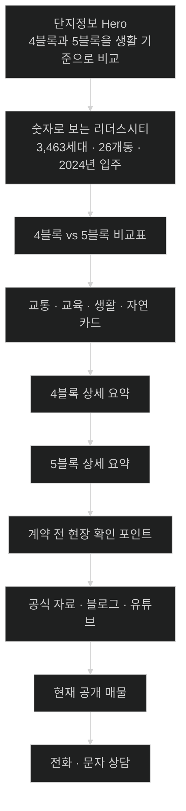
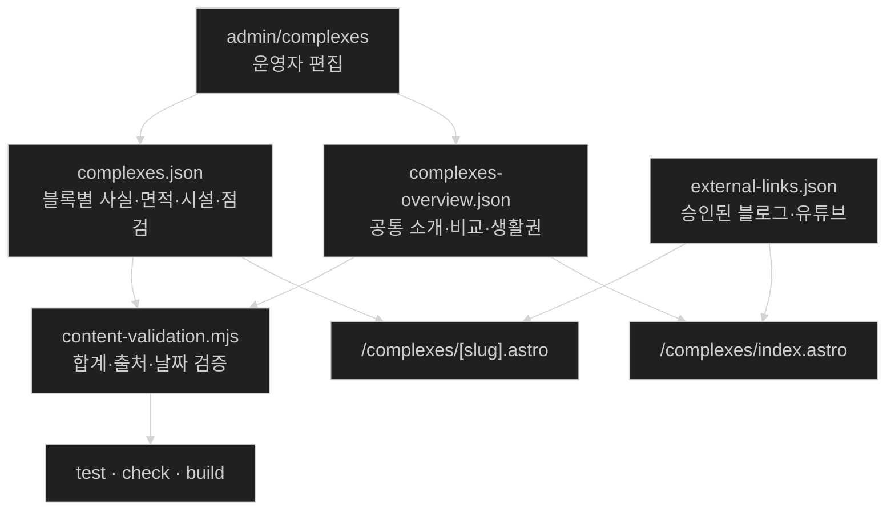

# 리더스시티 4·5블록 단지정보 콘텐츠 확장 조사서

- **대상 사이트:** https://leaderscityhappy.com/
- **대상 페이지:** https://leaderscityhappy.com/complexes/
- **참고 페이지:** https://osongmiso.com/#area
- **공식 저장소:** https://github.com/myoungsuk/real-estate-website
- **조사·작성 기준일:** 2026-08-25
- **목적:** 리더스시티 4블록·5블록 단지정보를 근거 중심으로 확장하고, Codex가 현재 Astro·TypeScript·JSON 구조 안에서 구현할 수 있도록 콘텐츠·데이터·화면 구조를 한 문서에 정리한다.

> 이 문서는 외부 사이트 문구나 이미지를 복제하기 위한 자료가 아니다.
> 참고 사이트의 **정보 밀도와 구성 방식**만 참고하고, 문구·디자인·이미지는 리더스시티 행복한부동산의 승인 자료와 자체 표현으로 구현한다.

---

## 0. 정보 상태 표기

| 표기 | 의미 | 공개 판단 |
|---|---|---|
| **[확정]** | LH, 대전광역시 고시, K-apt 등 공식·공공 자료로 확인 | 출처와 확인일을 붙여 공개 가능 |
| **[교차확인]** | 공식 사업자료와 복수의 신뢰 가능한 자료가 일치 | 공개 가능하나 원자료 링크를 함께 표시 |
| **[운영자 확인]** | 현장 상태, 현재 운영 여부, 동·층별 차이처럼 인터넷 자료만으로 확정하기 어려움 | 운영자가 직접 확인한 뒤 공개 |
| **[불확실한 사실]** | 출처별 값이 다르거나 과거 계획과 준공 후 값이 다름 | 확정값으로 공개 금지 |
| **[ChatGPT 의견]** | 콘텐츠·UI·운영 구조에 대한 제안 | 구현 판단 자료로만 사용 |

---

# 1. 핵심 결론

현재 단지 페이지가 휑한 가장 큰 이유는 문장이 짧아서가 아니라, 데이터와 화면이 아래 항목만 지원하기 때문이다.

- 단지별 소개 문단
- 기본정보 몇 개
- 생활권 장점 몇 개
- 출처 링크
- 상담 CTA

현재 저장소의 `src/data/complexes.json`, `src/lib/complexes.ts`, `src/pages/complexes/[slug].astro`, `/admin/complexes/`가 모두 이 구조에 맞춰져 있다. 따라서 **문구만 길게 늘리는 방식으로는 오송 참고 사이트처럼 풍부해지지 않는다.**

## 권장 방향

### `/complexes/` 단지정보 메인

1. 리더스시티 전체 소개
2. 숫자로 보는 4·5블록
3. 4블록·5블록 비교표
4. 교통·교육·생활·자연·상담 접근성 카드
5. 블록별 핵심 카드
6. 계약 전 현장 확인 포인트
7. 공식 자료·자체 블로그·유튜브 카드
8. 출처와 최근 확인일
9. 전화·문자 상담 CTA

### `/complexes/leaders-city-4/`, `/complexes/leaders-city-5/`

1. 단지 대표 이미지와 요약
2. 기본정보
3. 전용면적별 세대 구성
4. 공급 구성과 단지 성격
5. 교통·교육·생활·자연환경
6. 커뮤니티와 단지시설
7. 실제 집을 볼 때 확인할 항목
8. 관련 블로그·유튜브
9. 공개 매물
10. 출처와 확인일

이렇게 구성해야 참고 사이트의 **카드 → 비교 → 근거 자료** 흐름을 살리면서도, 리더스시티 행복한부동산의 핵심 메시지인 **“근거로 말하고 직접 확인한다”**를 더 분명하게 보여줄 수 있다.

---

# 2. 현재 저장소 분석

## 2.1 현재 단지 데이터

`src/data/complexes.json`에는 4블록과 5블록 각각 다음 정도만 들어 있다.

- `summary`
- `introTitle`
- `introduction`
- 대표 이미지 1장
- `facts` 4개
- `highlights` 3개
- `sources` 2개
- `confirmedAt`

## 2.2 현재 상세 페이지

`src/pages/complexes/[slug].astro`는 다음 순서로만 출력한다.

1. 페이지 제목
2. 대표 이미지와 소개
3. 기본정보 목록
4. 생활권 카드 3개
5. 출처
6. 상담 패널

## 2.3 현재 관리자 화면

`src/pages/admin/complexes/index.astro`도 다음 항목만 편집한다.

- 기본 소개
- 대표 이미지
- `항목 | 값` 형식의 기본정보
- `제목 | 설명` 형식의 생활권 장점
- 출처
- 확인일

## 2.4 구현 시 중요한 영향 범위

새로운 단지 콘텐츠 필드를 추가하면 한 파일만 수정하면 안 된다. 최소한 아래를 함께 맞춰야 한다.

- `src/data/complexes.json`
- 새로 추가할 `src/data/complexes-overview.json`
- `src/lib/complexes.ts`
- `src/pages/complexes/index.astro`
- `src/pages/complexes/[slug].astro`
- `src/pages/admin/complexes/index.astro`
- `scripts/content-validation.mjs`
- 관련 테스트
- `docs/operations/CONTENT_GUIDE.md`
- 핵심 설계·체크리스트 문서 중 단지 스키마를 설명하는 부분
- 필요 시 `src/styles/`의 단지 페이지 스타일

---

# 3. 참고 사이트에서 가져올 것은 “정보 구조”다

참고 사이트의 지역정보 영역은 다음 흐름을 갖는다.

- “왜 이 지역인가”를 설명하는 카드
- 지역·단지 비교표
- 뉴스·근거 카드
- 매물 탐색 전에 입지를 먼저 설명하는 문장

## 가져올 요소

- 한눈에 이해되는 숫자 카드
- 선택 기준이 되는 비교표
- 교통·교육·생활·자연을 분리한 카드
- 근거 자료와 게시일
- 매물보다 먼저 생활권을 설명하는 흐름

## 가져오지 않을 요소

- 문구 복사
- 외부 사이트 이미지 무단 저장
- 참고 사이트의 관리자·DB 구조
- 과장된 희소성 문구
- 출처 없는 전망·호재
- “무조건 오른다”, “최고”, “완벽”, “초역세권”처럼 판단을 대신하는 표현

---

# 4. 권장 화면 구조





---

# 5. 공식·공공 자료로 확인된 리더스시티 전체 정보

## 5.1 전체 사업

| 항목 | 확인 내용 | 상태 | 근거 |
|---|---:|---|---|
| 사업 배경 | 천동3구역 주거환경개선사업 | **[확정]** | 대전광역시 고시 제2023-159호 |
| 정비구역 | 천동·효동·인동·신흥동·판암동 일원 | **[확정]** | 대전광역시 고시 |
| 정비구역 면적 | 163,315㎡ | **[확정]** | 대전광역시 고시 |
| 전체 세대수 | 3,463세대 | **[확정]** | 대전광역시 고시 |
| 4블록 | 1,328세대 | **[확정]** | 대전광역시 고시·K-apt |
| 5블록 | 2,135세대 | **[확정]** | 대전광역시 고시·LH |
| 전체 동수 | 26개동 | **[교차확인]** | 4블록 10개동 + 5블록 16개동 |
| 전체 전용면적 범위 | 39㎡대부터 84㎡대 | **[확정]** | 대전광역시 고시·LH |
| 입주 시기 | 4블록 2024년 7월, 5블록 2024년 12월 | **[확정/교차확인]** | LH 사용검사·공급정보·운영자 공개자료 |

## 5.2 전체 세대 구성

대전광역시 고시의 면적별 공급표를 기준으로 정리하면 다음과 같다.

| 블록 | 공급 구분 | 전용면적 구간 | 세대수 |
|---|---|---:|---:|
| 4블록 | 분양 | 59㎡ | 456 |
| 4블록 | 분양 | 74㎡ | 516 |
| 4블록 | 분양 | 84㎡ | 356 |
| 5블록 | 10년 공공임대 | 39㎡ | 208 |
| 5블록 | 10년 공공임대 | 51㎡ | 154 |
| 5블록 | 10년 공공임대 | 59㎡ | 350 |
| 5블록 | 분양 | 59㎡ | 551 |
| 5블록 | 분양 | 74㎡ | 536 |
| 5블록 | 분양 | 84㎡ | 336 |
| **합계** |  |  | **3,463** |

### 공개 문구 예시

> 리더스시티는 천동3구역 주거환경개선사업으로 조성된 4블록·5블록 합계 3,463세대 주거단지입니다. 4블록은 전용 59·74·84㎡ 1,328세대, 5블록은 분양 1,423세대와 10년 공공임대 712세대를 합한 2,135세대로 구성됩니다. 전용 39㎡대부터 84㎡대까지 선택 폭이 있어 가족 구성과 자금 계획에 따라 비교할 수 있습니다.

---

# 6. `/complexes/` 메인 페이지에 넣을 실제 콘텐츠

## 6.1 Hero 문안

**Eyebrow**

> LEADERS CITY GUIDE

**제목**

> 4블록과 5블록, 숫자보다 생활 기준으로 비교하세요

**설명**

> 천동 리더스시티는 4·5블록 합계 3,463세대 규모의 신축 생활권입니다. 세대수와 전용면적뿐 아니라 출퇴근 동선, 학교, 의료·생활시설, 동·층별 환경과 계약 형태까지 확인해야 나에게 맞는 집을 고를 수 있습니다.

**보조 문구**

> 아래 정보는 LH·대전광역시·K-apt 등 공개자료와 운영자가 직접 확인한 내용을 구분해 안내합니다. 실제 계약 전에는 최신 공적 자료와 현장 상태를 다시 확인합니다.

---

## 6.2 숫자 카드

| 카드 제목 | 표시값 | 보조 문구 |
|---|---:|---|
| 전체 규모 | **3,463세대** | 4블록 1,328세대 + 5블록 2,135세대 |
| 전체 동수 | **26개동** | 4블록 10개동 + 5블록 16개동 |
| 입주 시기 | **2024년** | 4블록 7월, 5블록 12월 |
| 전용면적 | **39~84㎡대** | 5블록 임대형부터 4·5블록 중형까지 |
| 공급 구성 | **분양 + 공공임대** | 5블록에는 10년 공공임대 712세대 포함 |
| 현장 상담 | **5블록 단지 내** | 근린생활시설 105호에서 4·5블록 상담 |

> **운영 주의:** “전체 동수 26개동”은 4블록 10개동과 5블록 16개동을 합산한 값이다. 각 출처를 함께 노출한다.

---

## 6.3 “왜 리더스시티를 살펴보는가” 카드

### 카드 1. 3,463세대가 만드는 생활권

> 4블록과 5블록을 합하면 총 3,463세대입니다. 단지 하나의 숫자만 보기보다 두 블록을 하나의 생활권으로 보고 상가, 통학, 교통, 공원과 지역 서비스의 변화를 함께 살펴볼 필요가 있습니다.

### 카드 2. 신흥역·대전역·판암IC를 함께 보는 교통

> LH 공개자료는 대전도시철도 1호선 신흥역, KTX 대전역, 판암IC를 주요 교통 여건으로 안내합니다. 대중교통과 차량 이동을 모두 사용하는 가구라면 실제 출퇴근 시간대 동선을 직접 확인하는 것이 좋습니다.

### 카드 3. 천동초와 가오권 학교 생활

> 천동초등학교가 인근에 있으며 LH 자료에는 가오초·가오중·가오고 등 주변 교육시설이 함께 소개됩니다. 다만 실제 배정학교와 통학구역은 학년도와 주소에 따라 달라질 수 있으므로 교육청 자료를 별도로 확인해야 합니다.

### 카드 4. 병원·쇼핑·도심 접근

> LH와 관련 공개자료에는 충남대학교병원, 홈플러스, 야구장 등 대전 동구·중구 생활시설 접근성이 언급됩니다. 홈페이지에서는 고정된 “몇 분 거리”를 단정하기보다 지도 링크와 이동수단별 확인 안내를 제공하는 편이 안전합니다.

### 카드 5. 공원·하천과 산책 환경

> 샘골근린공원, 판암근린공원, 비학산, 대동천, 대전천 등 주변 녹지·수변 환경을 함께 이용할 수 있습니다. 실제 산책로 진입 위치, 경사, 야간 조도는 현장에서 확인합니다.

### 카드 6. 단지 안에서 이어지는 상담

> 리더스시티 행복한부동산은 5블록 근린생활시설 105호에 있습니다. 온라인 정보만으로 판단하기 어려운 동별 조망, 소음, 일조, 주차 동선을 현장에서 비교해 안내합니다.

---

## 6.4 4블록·5블록 비교표

| 비교 항목 | 리더스시티 4블록 | 리더스시티 5블록 |
|---|---|---|
| 도로명주소 | 대전광역시 동구 안샘로 11 | 대전광역시 동구 안샘로14번길 7 |
| 세대수 | 1,328세대 | 2,135세대 |
| 동수 | 10개동 | 16개동 |
| 입주 | 2024년 7월 | 2024년 12월 |
| 공급 구성 | 분양 1,328세대 | 분양 1,423세대 + 10년 공공임대 712세대 |
| 전용면적 | 59·74·84㎡ | 임대 39·51·59㎡ / 분양 59·74·84㎡ |
| 가장 많은 면적 구간 | 74㎡ 516세대 | 전체 기준 59㎡ 구간 901세대 |
| 난방 | **운영자·공식 기본정보 재확인 후 표시** | 개별가스난방 |
| 사무소 접근 | 5블록 단지 내 사무소와 인접 | 단지 내 근린생활시설 105호 |
| 계약 시 핵심 확인 | 타입·동·층·조망·주차 동선 | 분양/공공임대 구분·타입·철도 인접도·동·층 |
| 공개자료 확인일 | 페이지에 개별 표시 | 페이지에 개별 표시 |

> **중요:** 어느 블록이 “더 좋다”고 순위를 매기지 않는다. 가족 구성, 예산, 소유·임대 형태, 출퇴근, 원하는 면적, 동·층별 환경에 따라 선택이 달라진다는 방식으로 안내한다.

---

## 6.5 비교표 아래 안내 문구

> 같은 전용면적이라도 타입, 동, 방향, 층, 옵션과 조망에 따라 실제 체감은 크게 달라집니다. 표는 단지 전체를 비교하기 위한 출발점이며, 계약 판단은 개별 매물의 등기·권리관계·상태와 현장 확인을 기준으로 해야 합니다.

---

# 7. 리더스시티 4블록 상세 콘텐츠

## 7.1 상세 페이지 Hero

**Eyebrow**

> CHEON-DONG · LEADERS CITY 4

**제목**

> 리더스시티 4블록

**요약**

> 2024년 7월 입주를 시작한 10개동 1,328세대 규모의 단지로, 전용 59·74·84㎡ 주택형으로 구성됩니다. 신흥역과 천동초 생활권, 4·5블록을 합한 대단지 환경을 함께 비교할 수 있습니다.

---

## 7.2 기본정보

| 항목 | 내용 | 상태 |
|---|---|---|
| 주소 | 대전광역시 동구 안샘로 11 | **[확정]** |
| 지번 | 대전광역시 동구 천동 173 일대 | **[확정]** |
| 규모 | 10개동, 1,328세대 | **[확정]** |
| 공급 구성 | 분양 1,328세대 | **[확정]** |
| 전용면적 | 59·74·84㎡ | **[확정]** |
| 사용검사·입주 | 2024년 7월 | **[확정]** |
| 사업 시행 | LH와 계룡건설 컨소시엄 공동사업 | **[확정]** |
| 층수 | 지하 2층~지상 29층으로 공급 안내 | **[교차확인]** |
| 난방 | 공개 전 K-apt 기본정보 직접 확인 | **[운영자 확인]** |
| 주차대수 | 출처별 값이 달라 확정 전 미표시 | **[불확실한 사실]** |

---

## 7.3 전용면적별 세대 구성

| 전용면적 구간 | 세대수 | 4블록 내 비중 |
|---:|---:|---:|
| 59㎡ | 456 | 34.3% |
| 74㎡ | 516 | 38.9% |
| 84㎡ | 356 | 26.8% |
| **합계** | **1,328** | **100%** |

### 설명 문안

> 4블록은 전용 74㎡가 516세대로 가장 많고, 59㎡ 456세대, 84㎡ 356세대로 이어집니다. 같은 면적 안에서도 A·B·C 등 타입에 따라 방 배치, 수납, 주방과 거실의 연결 방식이 달라질 수 있으므로 면적 숫자만으로 판단하지 않는 것이 좋습니다.

> 흔히 말하는 “24평·29평·34평”은 공급면적을 기준으로 부르는 경우가 많습니다. 홈페이지의 공식 숫자는 혼동을 줄이기 위해 **전용면적 ㎡**를 기준으로 표시하고, 평 환산은 참고값으로만 제공해야 합니다.

---

## 7.4 생활환경 문안

### 교통

> 대전도시철도 1호선 신흥역 생활권이며, 대전역과 판암IC를 함께 이용할 수 있습니다. 실제 이동시간은 출발 동, 도보 경로, 시간대와 교통수단에 따라 달라지므로 고정된 분 단위 표현보다 지도와 현장 확인을 권장합니다.

### 교육

> 천동초등학교가 인근에 있습니다. 단지와 학교가 가깝더라도 실제 통학구역, 배정학교, 학급 상황은 매년 달라질 수 있으므로 대전광역시동부교육지원청 또는 학교알리미의 최신 정보를 확인해야 합니다.

### 생활

> 홈플러스와 충남대학교병원 등 주변 생활시설 접근성이 공개자료에 소개돼 있습니다. 단지 안팎 상권은 입주 이후에도 변하므로 현재 영업 중인 시설과 이용 동선은 지도·현장 기준으로 안내합니다.

### 자연

> 샘골근린공원, 판암근린공원, 비학산, 대동천·대전천 등 주변 녹지와 수변 생활권을 함께 살펴볼 수 있습니다. 산책로와 공원은 실제 출입구, 경사와 야간 환경을 확인하는 것이 좋습니다.

---

## 7.5 커뮤니티·부대시설

2024년 입주자 사전방문 행사 보도에서 LH 설명을 인용해 소개된 시설은 다음과 같다.

- 골프연습장
- 피트니스센터
- 주민카페
- 작은도서관
- 그룹 스터디룸
- 문화교실
- 공방
- 공유오피스
- 단지 내 어린이집
- 맘스스테이션

### 홈페이지 공개 방식

**운영자 현장 확인 전**

> 2024년 입주자 사전방문 당시 골프연습장, 피트니스센터, 주민카페, 작은도서관, 공유오피스, 어린이집 등 커뮤니티 시설이 설치된 것으로 소개됐습니다. 현재 운영 여부와 이용 조건은 관리사무소 또는 현장에서 확인해 주세요.

**운영자 현장 확인 후**

> 골프연습장, 피트니스센터, 주민카페, 작은도서관, 공유오피스, 어린이집 등 다양한 커뮤니티 시설을 갖추고 있습니다. 시설별 운영시간과 이용료는 관리규정에 따라 달라질 수 있습니다.

---

## 7.6 4블록에서 집을 볼 때 확인할 점

1. **타입 차이**<br>
   같은 59·74·84㎡라도 현관 수납, 주방 구조, 드레스룸, 팬트리, 거실 폭이 다를 수 있다.

2. **동·층·방향**<br>
   일조, 조망, 앞 동 간격, 도로와 학교 방향을 낮과 저녁에 각각 확인한다.

3. **등하교 시간 교통**<br>
   천동초 인근 차량 흐름과 어린이보호구역 진입 동선을 확인한다.

4. **주차 동선**<br>
   해당 동과 가까운 주차구역, 지하주차장 연결, 방문차량 등록 방식을 확인한다.

5. **엘리베이터·생활 동선**<br>
   세대에서 주차장, 재활용장, 택배보관, 커뮤니티까지의 이동을 확인한다.

6. **신축 하자·보수 이력**<br>
   창호, 결로 흔적, 타일, 실리콘, 배수, 빌트인 기기와 하자보수 상태를 확인한다.

7. **옵션과 소유권**<br>
   시스템에어컨, 중문, 인덕션 등은 매물마다 다르므로 계약서에 포함 범위를 적는다.

8. **관리비**<br>
   한 달 숫자만 보지 말고 계절, 면적, 난방 사용량, 공용시설 비용을 나눠 확인한다.

9. **권리관계**<br>
   등기부등본, 근저당, 임차관계, 잔금 시 말소 조건을 개별 매물 기준으로 확인한다.

10. **최근 거래**<br>
    국토교통부 실거래가와 현재 호가를 구분하고 계약일·층·면적·해제 여부를 함께 본다.

---

## 7.7 4블록 관련 승인 콘텐츠 연결

`external-links.json`의 다음 ID를 우선 연결 후보로 사용한다.

| 콘텐츠 ID | 용도 |
|---|---|
| `youtube-mw4br0-anoc` | 4블록 전체 분석 영상 |
| `naver-blog-224293278469` | 4블록 실거주 관점 글 |
| `youtube-mczflfm-4c8` | 59A 내부 영상 |
| `youtube-tdxw9gqsi2a` | 59C 내부 영상 |
| `youtube-6jq8o99smge` | 84B 내부 영상 |
| `naver-blog-224378379746` | 2026년 타입별 실거래 정리 |
| `naver-blog-224382351730` | 74㎡ 실제 매물 사례 |

> 가격·매물 제목이 포함된 콘텐츠는 **게시일과 거래완료 여부**를 반드시 함께 표시한다. 과거 가격을 현재 시세처럼 노출하지 않는다.

---

## 7.8 4블록 SEO 문안

**Title**

> 천동 리더스시티 4블록 단지정보·전용면적·생활환경 | 행복한부동산

**Description**

> 대전 동구 천동 리더스시티 4블록의 1,328세대 규모, 전용 59·74·84㎡ 구성, 입주 시기, 교통·교육·생활환경과 계약 전 확인할 점을 출처와 확인일 기준으로 안내합니다.

---

# 8. 리더스시티 5블록 상세 콘텐츠

## 8.1 상세 페이지 Hero

**Eyebrow**

> CHEON-DONG · LEADERS CITY 5

**제목**

> 리더스시티 5블록

**요약**

> 16개동 총 2,135세대로 구성된 리더스시티의 큰 블록입니다. 분양 1,423세대와 10년 공공임대 712세대가 함께 있으며, 리더스시티 행복한부동산이 단지 내 근린생활시설 105호에서 직접 상담합니다.

---

## 8.2 기본정보

| 항목 | 내용 | 상태 |
|---|---|---|
| 주소 | 대전광역시 동구 안샘로14번길 7 | **[확정]** |
| 지번 | 대전광역시 동구 천동 228-9 일대 | **[확정]** |
| 규모 | 16개동, 2,135세대 | **[교차확인]** |
| 공급 구성 | 분양 1,423세대 + 10년 공공임대 712세대 | **[확정]** |
| 전용면적 | 39.98~84.96㎡ | **[확정]** |
| 입주 | 2024년 12월 | **[확정/교차확인]** |
| 난방 | 개별가스난방 | **[확정]** |
| 층수 | 지하 3층~지상 29층으로 사업자료에 안내 | **[교차확인]** |
| 주차대수 | 2,718대와 2,733대 자료가 혼재 | **[불확실한 사실]** |
| 사무소 | 5블록 근린생활시설 105호 | **[운영자 승인 정보]** |

---

## 8.3 공급 구성

| 구분 | 세대수 | 5블록 내 비중 |
|---|---:|---:|
| 분양 | 1,423 | 66.7% |
| 10년 공공임대 | 712 | 33.3% |
| **합계** | **2,135** | **100%** |

### 설명 문안

> 5블록은 분양세대와 10년 공공임대가 함께 구성된 단지입니다. 같은 단지 안에서도 소유 형태와 계약 구조가 다르므로, 매물을 볼 때는 단순히 동·호수만 확인하지 말고 **분양세대인지 공공임대인지, 현재 계약 가능한 권리와 절차가 무엇인지**를 개별 서류와 LH 안내를 기준으로 확인해야 합니다.

> 공공임대의 임대조건, 분양전환 기준과 자격은 공고 시점과 개별 계약에 따라 달라질 수 있으므로 홈페이지에서 오래된 금액이나 조건을 고정 안내하지 않는다.

---

## 8.4 면적별 구성

### 10년 공공임대

| 주택형 | 전용면적 | 전체 세대수 |
|---|---:|---:|
| 39.9800A | 39.98㎡ | 208 |
| 51.8900A | 51.89㎡ | 126 |
| 51.8900B | 51.89㎡ | 28 |
| 59.6400B | 59.64㎡ | 29 |
| 59.9800D | 59.98㎡ | 321 |
| **합계** |  | **712** |

### 분양세대

대전광역시 고시의 면적 구간 기준이다.

| 전용면적 구간 | 세대수 |
|---:|---:|
| 59㎡ | 551 |
| 74㎡ | 536 |
| 84㎡ | 336 |
| **합계** | **1,423** |

### 공개 시 주의

과거 일반공급 기사에 나온 59A·59B·74A·74B·84A·84B 세대수는 **지구주민 우선공급분과 임대 물량을 제외한 특정 공급회차 1,192세대**를 기준으로 한다. 이를 5블록 전체 1,423세대의 타입별 총세대수처럼 표시하면 틀릴 수 있다.

따라서 공개 페이지에는 다음 원칙을 적용한다.

- 전체 단지 구성은 대전광역시 고시의 59·74·84㎡ 구간 세대수 사용
- 공공임대는 LH 공고의 세부 주택형 사용
- 분양세대 A·B 타입별 전체 수량은 공식 최종 자료 확인 전 미표시
- 평면 내부 영상은 “해당 타입 참고”로만 연결

---

## 8.5 생활환경 문안

### 교통

> LH는 신흥역, KTX 대전역, 판암IC를 주요 교통 여건으로 소개합니다. 도시철도와 차량 이동을 함께 활용할 수 있지만, 철도·도로에 가까운 동은 소음과 조망 체감이 달라질 수 있어 현장 확인이 중요합니다.

### 교육

> 천동초등학교가 인근에 있으며 가오초·가오중·가오고 등 주변 학교가 LH 생활환경 자료에 소개됩니다. 실제 배정학교는 교육청의 최신 통학구역을 확인해야 합니다.

### 생활

> 충남대학교병원, 야구장 등 주변 생활 인프라가 LH 자료에 안내돼 있습니다. 상가의 실제 영업 여부와 이동시간은 현장과 지도 기준으로 최신 확인한다.

### 자연

> 샘골근린공원, 판암근린공원, 비학산, 대동천, 대전천과 연계되는 생활권입니다. 단지 출입구에 따라 산책로 접근성이 달라질 수 있습니다.

---

## 8.6 커뮤니티·단지시설

LH 하나로 내집의 단지 특성 태그와 과거 사업자료·분양 보도에는 다음 시설이 안내됐다.

- 어린이집
- 키즈룸·키즈스테이션
- 피트니스
- 실내골프장
- 주민카페
- 공유오피스
- 공방
- 문화교실
- 놀이터
- 경로당
- 쉼터

### 홈페이지 공개 방식

현재 운영 여부를 운영자가 확인하기 전에는 다음처럼 표현한다.

> 사업자료에는 어린이집, 피트니스, 실내골프장, 주민카페, 공유오피스, 공방과 문화교실 등 커뮤니티 시설이 계획·소개됐습니다. 실제 운영 시설과 이용 조건은 관리사무소 또는 현장에서 확인해 주세요.

운영자 확인 뒤에는 `confirmedAt`과 함께 실제 운영 중인 시설만 표시한다.

---

## 8.7 철도 인접 환경을 균형 있게 안내하는 문안

과거 분양 분석 기사에서는 5블록 북측 일부 동의 철도 인접성과 소음 가능성을 지적했다. 이를 자극적인 단점 문구로 사용하지 말고 다음처럼 **현장 점검 항목**으로 안내한다.

> 5블록은 동과 방향에 따라 철도와의 거리, 도로 방향, 앞 동 간격이 다릅니다. 집을 볼 때는 창문을 닫은 상태와 연 상태의 소음, 낮과 저녁의 열차·도로 소리, 침실 방향을 직접 확인하는 것이 좋습니다.

### 공개 금지 표현

- “하루 종일 시끄럽다”
- “창문을 열 수 없다”
- “철도 쪽 동은 나쁘다”
- “로열동·비로열동”

개별 세대의 체감과 방음 상태가 다르므로 단정하지 않는다.

---

## 8.8 5블록에서 집을 볼 때 확인할 점

1. 분양세대와 공공임대의 구분
2. 거래 또는 임대가 가능한 권리와 계약 주체
3. 동·층·방향별 철도와 도로 소음
4. 주출입구·부출입구와 차량 동선
5. 천동초 등하교 시간대 차량 흐름
6. 해당 동에서 상가·사무소·지하철 방향까지의 보행 동선
7. 지하주차장 연결과 방문주차 등록
8. 일조·앞 동 간격·조망
9. 시스템에어컨·중문·주방가전 등 매물별 옵션
10. 창호·배수·결로·타일 등 신축 하자 상태
11. 관리비와 공용시설 이용료
12. 등기·근저당·임대차관계와 잔금 조건
13. 실거래가와 현재 호가의 차이
14. 공공임대 관련 최신 LH 공고와 계약서

---

## 8.9 5블록 관련 승인 콘텐츠 연결

| 콘텐츠 ID | 용도 |
|---|---|
| `youtube-3vl70tt-jr4` | 5블록 주출입구 현장 영상 |
| `naver-blog-224347446074` | 5블록 59B 실거주·매물 사례 |
| `youtube-umcbjryct3c` | 59B 내부·신혼부부 관점 |
| `youtube-hxw7f371nfm` | 84A 내부 참고 영상 |
| `youtube-uncuqe5e94` | 84B 내부 참고 영상 |
| `youtube-rpgiuca1lbe` | 74B 내부 참고 영상 |
| `youtube-gzi03lpigqc` | 5블록 단지 내 상가 사례 |
| `youtube-piobieujysa` | 리더스시티 실거주 선택 관점 |

> 거래완료 매물 영상은 “평면·옵션 참고”로만 사용하고, 제목의 과거 가격을 현재 가격으로 오인하지 않도록 `거래완료`, `게시일`, `과거 매물` 배지를 표시한다.

---

## 8.10 5블록 SEO 문안

**Title**

> 천동 리더스시티 5블록 단지정보·분양·공공임대 구성 | 행복한부동산

**Description**

> 대전 동구 천동 리더스시티 5블록의 2,135세대 규모, 분양 1,423세대와 10년 공공임대 712세대 구성, 전용면적, 교통·교육·생활환경과 현장 확인 포인트를 안내합니다.

---

# 9. 메인 페이지에 넣을 “계약 전 확인” 섹션

## 제목

> 장점만 나열하지 않고, 실제 판단에 필요한 것을 함께 봅니다

## 카드 1. 같은 면적도 구조가 다릅니다

> 전용 59·74·84㎡라는 숫자가 같아도 타입별 거실 폭, 주방, 수납, 드레스룸과 환기 방식이 다릅니다. 평면도와 실제 내부를 함께 확인합니다.

## 카드 2. 동·층·방향이 생활을 바꿉니다

> 일조, 조망, 철도·도로 소음, 학교와 출입구 방향은 단지 전체 설명만으로 알 수 없습니다. 낮과 저녁에 현장을 비교합니다.

## 카드 3. 가격은 날짜와 조건을 붙여 봅니다

> 실거래가, 현재 호가, 거래완료 매물 가격은 서로 다릅니다. 계약일, 면적, 층, 방향, 옵션과 해제 여부를 함께 확인합니다.

## 카드 4. 권리관계는 매물별로 다릅니다

> 등기부등본, 근저당, 임차관계, 잔금 시 말소 조건을 확인합니다. 5블록은 분양세대와 공공임대의 계약 구조도 구분합니다.

## 카드 5. 신축도 상태 확인이 필요합니다

> 창호, 결로 흔적, 욕실과 발코니 배수, 타일, 실리콘, 붙박이장, 빌트인 가전과 하자보수 이력을 확인합니다.

## 카드 6. 생활 동선을 직접 걸어봅니다

> 주차장에서 세대, 학교, 지하철 방향, 상가와 공원까지 실제로 이동해 봅니다. 지도상의 직선거리와 체감 동선은 다를 수 있습니다.

---

# 10. 추천 FAQ 문안

## Q1. 4블록과 5블록의 가장 큰 차이는 무엇인가요?

4블록은 10개동 1,328세대의 분양단지이며 전용 59·74·84㎡로 구성됩니다. 5블록은 16개동 2,135세대로, 분양 1,423세대와 10년 공공임대 712세대가 함께 있습니다. 원하는 면적, 소유·임대 형태와 동·층별 환경을 함께 비교해야 합니다.

## Q2. 5블록의 공공임대 세대도 일반 아파트처럼 바로 매매할 수 있나요?

공공임대는 일반 분양세대와 계약 구조가 다릅니다. 거래·임대 가능 범위, 임대조건과 분양전환 관련 사항은 해당 세대의 LH 계약서와 최신 공고를 기준으로 확인해야 합니다.

## Q3. 59㎡는 모두 같은 구조인가요?

아닙니다. 같은 59㎡라도 A·B·C·D 등 타입에 따라 방 배치, 주방, 수납과 방향이 달라질 수 있습니다. 평면도와 실제 내부 영상을 함께 확인하는 것이 좋습니다.

## Q4. 천동초 배정이 확정되나요?

천동초가 단지 인근에 있지만, 실제 배정학교와 통학구역은 주소와 학년도에 따라 달라질 수 있습니다. 계약 전 대전광역시동부교육지원청의 최신 통학구역을 확인해야 합니다.

## Q5. 신흥역까지 몇 분인가요?

출발 동과 단지 출입구, 보행 신호와 개인 걸음 속도에 따라 달라집니다. 홈페이지에서는 특정 분 수를 고정하기보다 지도 링크를 제공하고 현장에서 실제 동선을 확인합니다.

## Q6. 5블록은 철도 소음이 있나요?

철도와의 거리와 방향이 동·층별로 다르며 체감도 다릅니다. 관심 세대에서는 창문을 닫고 열었을 때를 각각 확인하고, 낮과 저녁 시간대 현장을 비교하는 것이 좋습니다.

## Q7. 현재 시세는 단지정보 페이지에 왜 고정하지 않나요?

시세는 빠르게 변하고 실거래가와 호가도 다르기 때문입니다. 단지 기본정보에는 변하지 않는 사실을 두고, 최신 시세는 확인일이 있는 블로그·유튜브·공개 매물에서 별도로 안내하는 편이 정확합니다.

## Q8. 관리비는 얼마인가요?

관리비는 면적, 계절, 난방·전기 사용량과 공용시설 비용에 따라 달라집니다. 최근 한 달 숫자만 보지 말고 K-apt 공시와 해당 매물의 최근 고지서를 함께 확인해야 합니다.

## Q9. 단지 내 부동산에서 무엇을 확인할 수 있나요?

공개 매물, 타입별 구조, 동·층·방향, 조망과 소음, 주차·학교·상가 동선을 현장에서 비교할 수 있습니다. 권리관계와 계약조건은 개별 매물 서류를 기준으로 확인합니다.

---

# 11. 가격·시세 콘텐츠 운영 원칙

## 단지 기본정보에 넣지 않을 것

- 현재 매매가
- 현재 전세가
- 현재 월세
- “급매 최저가”
- 예상 상승률
- 미래 시세
- 오래된 분양가를 현재 가격처럼 보이게 하는 문구

## 별도 최신 콘텐츠로 운영할 것

- 국토교통부 실거래가 월별 정리
- 타입별 최근 거래
- 현재 공개 매물
- 전세와 매매 비교
- 거래량 변화
- 관리비 공시

## 표시 필수값

- 자료 기준일
- 거래일 또는 게시일
- 면적
- 층 범위
- 출처
- 거래해제 여부 확인 안내
- 호가인지 실거래가인지 구분

---

# 12. 권장 데이터 구조

## 12.1 `src/data/complexes-overview.json` 신규 추가

공통 소개와 4·5블록 비교는 개별 단지 데이터에 중복 저장하지 않고 별도 파일로 관리하는 편이 낫다.

```json
{
  "eyebrow": "LEADERS CITY GUIDE",
  "title": "4블록과 5블록, 숫자보다 생활 기준으로 비교하세요",
  "description": "천동 리더스시티는 4·5블록 합계 3,463세대 규모의 신축 생활권입니다.",
  "confirmedAt": "2026-08-25",
  "stats": [
    {
      "label": "전체 규모",
      "value": "3,463세대",
      "description": "4블록 1,328세대 + 5블록 2,135세대"
    },
    {
      "label": "전체 동수",
      "value": "26개동",
      "description": "4블록 10개동 + 5블록 16개동"
    },
    {
      "label": "입주 시기",
      "value": "2024년",
      "description": "4블록 7월, 5블록 12월"
    },
    {
      "label": "전용면적",
      "value": "39~84㎡대",
      "description": "가족 구성에 따라 비교 가능한 면적 구성"
    }
  ],
  "reasons": [
    {
      "title": "3,463세대 생활권",
      "description": "두 블록을 하나의 생활권으로 보고 교통·학교·상가·공원을 함께 비교합니다."
    },
    {
      "title": "복수 교통축",
      "description": "신흥역, 대전역, 판암IC를 이용하는 생활 동선을 확인할 수 있습니다."
    },
    {
      "title": "학교와 생활시설",
      "description": "천동초와 가오권 학교, 병원·생활시설 접근 조건을 살펴봅니다."
    },
    {
      "title": "공원과 하천",
      "description": "인근 공원, 비학산, 대동천·대전천 생활권을 함께 확인합니다."
    }
  ],
  "comparisonRows": [
    {
      "label": "세대수",
      "values": {
        "leaders-city-4": "1,328세대",
        "leaders-city-5": "2,135세대"
      }
    },
    {
      "label": "공급 구성",
      "values": {
        "leaders-city-4": "분양 1,328세대",
        "leaders-city-5": "분양 1,423세대 + 10년 공공임대 712세대"
      }
    }
  ],
  "sharedCheckpoints": [
    {
      "title": "타입 차이",
      "description": "같은 전용면적도 평면과 수납 구성이 다릅니다."
    },
    {
      "title": "동·층·방향",
      "description": "일조, 조망, 도로·철도 소음을 현장에서 확인합니다."
    }
  ],
  "relatedContentIds": [
    "youtube-lj5vyuijnvs",
    "naver-blog-224321578531",
    "youtube-v5x9yvozziw"
  ],
  "sources": [
    {
      "id": "daejeon-2023-159",
      "publisher": "대전광역시",
      "label": "천동3구역 정비계획 변경 고시",
      "url": "https://www.eum.go.kr/web/gs/gv/gvGosiDet.jsp?mobile_yn=&seq=584384",
      "kind": "official",
      "checkedAt": "2026-08-25"
    }
  ]
}
```

---

## 12.2 `ComplexContent` 권장 확장

```ts
export interface ComplexUnitGroup {
  category: string;
  areaLabel: string;
  households: number;
  note?: string;
}

export interface ComplexAmenityGroup {
  title: string;
  items: string[];
  verification:
    | "official"
    | "operator-confirmed"
    | "historical-plan"
    | "check-required";
  note?: string;
}

export interface ComplexSource {
  id: string;
  publisher: string;
  label: string;
  url: string;
  kind: "official" | "public-data" | "operator" | "news";
  checkedAt: string;
  note?: string;
}

export interface ComplexContent {
  // 기존 필드 유지
  slug: string;
  areaSlug: string;
  areaName: string;
  eyebrow: string;
  mark: string;
  name: string;
  status: "preparing" | "published";
  summary: string;
  introTitle: string;
  introduction: string[];
  image: { src: string; alt: string } | null;
  facts: Array<{ label: string; value: string }>;
  highlights: Array<{ title: string; description: string }>;
  confirmedAt: string | null;

  // 신규 권장 필드
  unitGroups: ComplexUnitGroup[];
  supplySummary: Array<{ label: string; value: string; description?: string }>;
  livingSections: Array<{
    category: "transport" | "education" | "daily-life" | "nature";
    title: string;
    description: string;
  }>;
  amenityGroups: ComplexAmenityGroup[];
  checkpoints: Array<{ title: string; description: string }>;
  faqs: Array<{ question: string; answer: string }>;
  relatedContentIds: string[];
  sources: ComplexSource[];
}
```

---

## 12.3 스키마를 너무 복잡하게 만들지 않는 기준

- 단순 문장을 CMS 블록 편집기처럼 일반화하지 않는다.
- 모든 섹션을 임의 순서·임의 타입으로 만드는 페이지 빌더를 도입하지 않는다.
- 현재 필요한 `단지 비교`, `면적 구성`, `생활환경`, `시설`, `점검`, `관련 콘텐츠`만 명시적 필드로 둔다.
- 동적 DB나 새 프레임워크를 도입하지 않는다.
- 합계는 가능하면 숫자로 저장하고 화면에서 계산한다.
- 불확실한 값은 빈 문자열 대신 `null`, `check-required` 등 명시 상태를 사용한다.

---

# 13. 자동 검증에 추가할 규칙

## 13.1 수치 합계

- 4블록 `unitGroups.households` 합계는 1,328
- 5블록 공공임대 합계는 712
- 5블록 분양 합계는 1,423
- 5블록 전체 합계는 2,135
- 4·5블록 전체 합계는 3,463

## 13.2 관련 콘텐츠

- `relatedContentIds`가 `external-links.json`에 실제 존재
- 연결 콘텐츠가 `published`
- 중복 ID 금지
- 가격 민감 콘텐츠는 `publishedAt` 표시

## 13.3 출처

- 공개 단지는 공식 또는 공공 출처 1개 이상
- 모든 출처는 HTTPS
- `checkedAt`은 ISO 날짜
- 페이지 `confirmedAt`보다 미래 날짜 금지
- `kind` 허용값 검사
- 출처 ID 중복 금지

## 13.4 문구·상태

- `historical-plan` 시설을 현재 운영 중인 것처럼 출력하지 않음
- `check-required`는 “확인 필요” 배지 표시
- `null` 값을 임의 숫자로 대체하지 않음
- 주차대수처럼 충돌하는 값은 검증 완료 전 공개 데이터에서 제외

## 13.5 화면

- 비교표가 360px에서 가로 넘침을 만들지 않음
- 모바일에서는 표를 블록별 카드로 전환하거나 가로 스크롤 영역과 안내문 제공
- 숫자 그래프는 색만으로 구분하지 않고 수치·라벨 표시
- 모든 링크에 의미 있는 텍스트 사용
- `target="_blank"`에는 `rel="noopener noreferrer"`
- 카드 전체 링크 안에 중첩 링크를 넣지 않음

---

# 14. UI 구현 제안

## `/complexes/` 메인

### 데스크톱

- Hero 아래 숫자 카드 4개
- 4블록·5블록 2열 비교 카드
- 비교표
- 생활권 카드 4~6개
- 현장 확인 카드 6개
- 관련 콘텐츠 3개
- 출처 패널
- 상담 CTA

### 모바일

- 숫자 카드는 2열
- 단지 카드는 1열
- 비교표는 행마다 `항목 → 4블록 → 5블록` 세로 카드
- 관련 콘텐츠는 가로 스와이프보다 1열 카드 권장
- 전화·문자 CTA가 표와 출처를 가리지 않도록 하단 여백 확보

## 단지 상세

- 대표 이미지와 핵심 숫자를 첫 화면에 함께 표시
- 면적별 세대수는 CSS 가로 막대로 표현
- 차트 라이브러리는 도입하지 않음
- 커뮤니티는 상태 배지 포함
- “장점”과 “확인할 점”을 나란히 배치
- 공식 출처와 자체 콘텐츠를 시각적으로 구분

## 디자인

현재 사이트의 화이트·아이보리, 차콜·딥네이비, 차분한 로즈 강조색을 유지한다.

- 외부 참고 사이트의 색상·폰트·카드 모양을 복제하지 않는다.
- 숫자 카드의 큰 수치와 작은 출처 라벨로 신뢰감을 준다.
- 지나친 아이콘 장식보다 읽기 쉬운 제목·설명을 우선한다.
- 애니메이션은 최소화한다.

---

# 15. 사진·저작권 원칙

## 사용 가능

- 저장소에 이미 승인된 `/public/images/area/` 사진
- 운영자가 직접 촬영하고 공개 승인한 사진
- 승인된 블로그·유튜브 썸네일을 해당 원문 카드에 사용하는 방식
- 직접 제작한 CSS 그래프와 텍스트 비교표

## 사용 금지

- 오송 참고 사이트 이미지 다운로드·재사용
- 뉴스 기사 사진 무단 저장
- LH 조감도·배치도 파일을 저작권 검토 없이 `public/`에 복사
- 네이버지도 화면 캡처 무단 사용
- 얼굴·차량번호·우편물·출입정보가 보이는 현장 사진
- EXIF·GPS가 남은 원본 사진

## 권장 대안

- 외부 배치도는 원문 링크로 연결
- 자체 촬영 전경·출입구·공원·보행 동선 사진 사용
- 사진마다 촬영일과 대략적 촬영 위치를 내부 관리하되 정확한 세대정보는 파일명에 넣지 않음

---

# 16. 공개 전 운영자 확인 목록

아래는 인터넷 조사만으로 확정하면 안 된다.

- [ ] 4블록 난방방식의 최신 K-apt 기본정보
- [ ] 4블록 최종 주차대수
- [ ] 5블록 최종 주차대수
- [ ] 4블록·5블록 정확한 사용승인일
- [ ] 각 커뮤니티 시설의 현재 운영 여부
- [ ] 시설별 운영시간·이용료
- [ ] 현재 단지 출입구와 보행 동선
- [ ] 철도·도로 소음의 동·층별 현장 체감
- [ ] 실제 통학구역과 배정학교
- [ ] 현재 영업 중인 단지 내·인근 상가
- [ ] 지도 Place가 해당 사무소와 일치하는지
- [ ] 공개 사진 권리·개인정보·EXIF 제거
- [ ] 공공임대 관련 최신 LH 안내
- [ ] 최신 매물의 표시·광고 법정 항목

---

# 17. 출처별 값이 충돌하는 항목

## 17.1 4블록 주차대수

과거 공급자료·부동산 사이트에는 다음 값이 혼재한다.

- 1,687대
- 1,708대
- 1,727대

준공 전 계획값과 준공 후 K-apt 반영값이 섞였을 가능성이 있다.

**처리:** K-apt 단지 기본정보 또는 건축물대장으로 직접 확인하기 전 공개하지 않는다.

## 17.2 5블록 주차대수

- 2,718대
- 2,733대

**처리:** K-apt 단지 기본정보 또는 관리사무소 확인 전 공개하지 않는다.

## 17.3 사용승인일

- 4블록은 2024-07-22로 표시되는 자료가 있으나 LH 게시일은 2024-07-23
- 5블록은 2024-12-19와 2024-12-20 자료가 혼재

**처리:** 현재 페이지에는 월 단위로 표시하고, 정확한 일자는 공식 확인증이나 건축물대장 확인 후 공개한다.

## 17.4 건폐율·용적률

사업계획·설계단계와 준공 후 자료 사이에 소수점 차이가 있다.

**처리:** 일반 고객의 단지 선택에 꼭 필요한 정보가 아니므로 우선 제외한다. 공개할 때는 준공 후 공식값과 기준일을 함께 표시한다.

---

# 18. 미래 개발·호재 문구 원칙

다음 항목은 상태가 바뀌기 쉬우므로 과거 기사만 보고 쓰지 않는다.

- 도시철도 2호선 트램
- 대전역세권 개발
- 혁신도시·공공기관 이전
- 인근 재개발·재건축
- 예정 상업시설
- 학교 신설·이전
- 도로 개통 계획

## 공개 조건

1. 대전광역시·국토교통부·사업시행자 최신 공문 확인
2. 기준일 표시
3. 확정·공사 중·계획·검토를 구분
4. 단지 가치 상승을 보장하는 문구 금지
5. 일정 변경 가능성 안내

---

# 19. Codex 작업 지시문

아래 내용을 그대로 Codex 작업 요청에 붙여 사용할 수 있다.

```text
공식 저장소 myoungsuk/real-estate-website의 현재 기본 브랜치와 최신 커밋을 먼저 확인해 주세요.
작업 전 루트 CODEX.md, 서비스 기획서, 시스템 설계서, 개발 체크리스트, 실제 package.json과 단지 관련 소스를 읽어 주세요.

목표:
현재 /complexes/와 /complexes/[slug]/가 기본정보 몇 개만 보여 휑한 문제를 개선합니다.
이 조사서의 확정 콘텐츠를 사용해 오송 참고 사이트처럼 카드, 비교표, 근거 콘텐츠가 이어지는 풍부한 단지정보 화면을 구현하되, 외부 사이트 문구·디자인·이미지는 복제하지 마세요.

기술 범위:
- 현재 Astro + TypeScript + JSON + Cloudflare 구조 유지
- 새 프레임워크, DB, ORM, 외부 CMS, 지도 임베드, 차트 라이브러리 도입 금지
- 공개 승인된 저장소 이미지와 external-links.json의 콘텐츠만 사용
- 가격·호재·주차대수 등 미확정 값 임의 생성 금지
- 충돌 항목은 null 또는 확인 필요 상태로 관리
- 기존 공개 URL과 slug 유지

필수 구현:
1. src/data/complexes-overview.json을 추가해 전체 소개, 숫자 카드, 비교표, 공통 생활권, 점검사항, 관련 콘텐츠 ID, 출처를 관리합니다.
2. src/data/complexes.json에 unitGroups, supplySummary, livingSections, amenityGroups, checkpoints, faqs, relatedContentIds와 출처 메타데이터를 추가합니다.
3. src/lib/complexes.ts의 타입을 실제 JSON과 일치시킵니다.
4. /complexes/에 다음을 추가합니다.
   - 리더스시티 전체 Hero
   - 3,463세대·26개동 등 숫자 카드
   - 4블록·5블록 비교표
   - 교통·교육·생활·자연 카드
   - 계약 전 현장 확인 카드
   - 승인된 관련 블로그·유튜브 카드
   - 출처·확인일
5. /complexes/[slug]/에 다음을 추가합니다.
   - 전용면적별 세대 구성
   - 공급 구성
   - 생활환경
   - 커뮤니티 상태
   - 현장 확인 체크리스트
   - FAQ
   - 관련 콘텐츠
   - 출처·확인일
6. external-links.json의 ID를 직접 참조하고, 없는 ID나 draft 콘텐츠는 빌드 전에 실패시킵니다.
7. scripts/content-validation.mjs에 합계 검증을 추가합니다.
   - 4블록 1,328
   - 5블록 임대 712
   - 5블록 분양 1,423
   - 5블록 전체 2,135
   - 전체 3,463
8. /admin/complexes/에서 신규 필드를 편집할 수 있도록 관리자 UI와 저장 로직을 함께 갱신합니다.
9. 콘텐츠 가이드와 스키마 관련 설계 문서를 실제 코드와 동기화합니다.
10. 모바일 360px, 키보드 접근성, 44px 터치영역, 포커스, 표 읽기 순서를 보존합니다.

콘텐츠 원칙:
- 이 문서의 [확정] 정보만 확정 문장으로 사용
- [운영자 확인] 시설은 현재 운영 중인 것처럼 쓰지 않음
- 주차대수, 정확한 사용승인일, 통학구역, 현재 시세는 확인 전 공개하지 않음
- 5블록 철도 인접성은 특정 동을 비하하지 말고 현장 확인 항목으로 표현
- 실거래가와 호가를 구분
- 거래완료 영상은 과거 사례로 표시
- 외부 뉴스 사진과 LH 이미지를 public에 복사하지 않음

검증:
npm ci
npm test
npm run check
npm run build
npx wrangler deploy --dry-run

완료 보고:
- 변경 목적
- 변경 파일
- 데이터 스키마 변경
- 관리자 영향
- SEO·접근성·저작권·개인정보 영향
- 실행한 명령과 실제 결과
- 운영자 확인이 남은 항목
- 실행하지 않은 검사를 구분해 보고해 주세요.
```

---

# 20. 권장 구현 순서

## 1단계. 데이터와 검증

- `complexes-overview.json` 추가
- `complexes.json` 확장
- TypeScript 타입 추가
- 합계·출처·관련 콘텐츠 ID 검사
- 단위 테스트

## 2단계. 공개 화면

- `/complexes/` 메인 확장
- 상세 페이지 확장
- 관련 콘텐츠 연결
- 모바일·접근성 수정

## 3단계. 관리자·문서

- 관리자 입력 UI
- Worker 저장 허용 스키마 확인
- 운영 가이드
- 설계서·체크리스트 동기화

## 4단계. 운영자 현장 확인

- 주차
- 커뮤니티 운영
- 소음·동선
- 학교 배정 안내
- 사진 승인

## 5단계. 최종 검증·배포

- 테스트·체크·빌드·Wrangler dry-run
- Preview에서 모바일·데스크톱 확인
- 실제 도메인에서 canonical·robots·sitemap 확인
- 전화·문자·외부 링크 확인

---

# 21. 출처 목록

## [S01] 대전광역시 고시·토지이음

- 자료명: 천동3구역 주거환경개선사업 도시·주거환경정비기본계획(변경), 정비계획(변경) 결정 및 정비구역(변경) 지정 고시
- 고시번호: 대전광역시 고시 제2023-159호
- 고시일: 2023-08-16
- 확인 내용:
  - 정비구역 163,315㎡
  - 전체 3,463세대
  - 4블록 1,328세대
  - 5블록 2,135세대
  - 면적별·분양/임대별 세대 구성
- URL: https://www.eum.go.kr/web/gs/gv/gvGosiDet.jsp?mobile_yn=&seq=584384

## [S02] LH 청약플러스 4블록 사용검사

- 자료명: [민간참여] 대전천동3지구 4BL 리더스시티 사용검사확인증 게시
- 게시일: 2024-07-23
- 확인 내용:
  - LH와 계룡컨소시엄 공동사업
  - 사용검사 확인증 교부
- URL: https://apply.lh.or.kr/lhapply/apply/noti/an/view.do?bbsSn=9102429931&ccrCnntSysDsCd=02&mi=1079

## [S03] K-apt 4블록 공개 입찰정보

- 확인 내용:
  - 단지명 리더스시티4BL
  - 주소 안샘로 11
  - 10개동
  - 1,328세대
- URL: https://www.k-apt.go.kr/bid/bidDetail.do?aptCode=&aptName=%EB%A6%AC%EB%8D%94%EC%8A%A4%EC%8B%9C%ED%8B%B0&bidArea=&bidNo=&bidNum=20250523154005895&bidState=&bidTitle=&codeAuth=&codeAuthSub=&codeClassifyType1=&codeClassifyType2=&codeClassifyType3=&codeSucWay=&codeWay=&dTime=1748227353035&dateArea=1&dateEnd=2025-05-26&dateStart=2025-04-26&mainKaptCode=&pageNo=1&searchBidGb=bid_gb_1&searchDateGb=reg&type=4

## [S04] LH 청약플러스 5블록 공급정보

- 확인 내용:
  - 주소 안샘로14번길 7
  - 전용 39.98~84.96㎡
  - 총 2,135세대
  - 개별가스난방
  - 2024년 12월 입주예정
  - 공공임대 주택형별 전체 세대수
- URL: https://apply.lh.or.kr/lhapply/apply/wt/wrtanc/selectWrtancInfo.do?aisTpCd=08&ccrCnntSysDsCd=02&mi=1026&panId=0000060351&uppAisTpCd=06

## [S05] LH 청약플러스 5블록 최신 공공임대 공고 페이지

- URL: https://apply.lh.or.kr/lhapply/apply/wt/wrtanc/selectWrtancInfo.do?aisTpCd=08&ccrCnntSysDsCd=02&mi=1026&panId=0000060833&uppAisTpCd=06

## [S06] LH 하나로 내집 5블록 생활환경

- 확인 내용:
  - 공공임대 712세대
  - 39·51·59㎡
  - 신흥역·대전역·판암IC
  - 천동초·가오권 학교
  - 충남대학교병원·야구장
  - 공원·비학산·대동천·대전천
- URL: https://hanaro.lh.or.kr/siteDetail/view?menuKey=60O0Um5kwF&sPageCnt=&schArea=&schHsClsfCd=&schPoint=&schRegion=&schSplyHH=&schStatus=&schText=&siteDetailId=79

## [S07] 리더스시티 5블록 공식 사업 사이트

- 메인: https://lh-cd.co.kr/
- 사업개요: https://lh-cd.co.kr/sub/01/sub_1_new.asp
- 팸플릿: https://lh-cd.co.kr/%EB%8C%80%EC%A0%84%EC%B2%9C%EB%8F%993%205BL%2010%EB%85%84%EA%B3%B5%EA%B3%B5%EC%9E%84%EB%8C%80%20%ED%8C%B8%ED%94%8C%EB%A6%BF.pdf

> 일부 원문은 자동 접근이 제한될 수 있다. 수치 반영 시 운영자가 브라우저에서 원문을 다시 열어 확인한다.

## [S08] 학교알리미 대전천동초등학교

- 확인 내용:
  - 학교명
  - 주소: 대전광역시 동구 안샘로 8
- URL: https://www.schoolinfo.go.kr/ei/ss/Pneiss_b01_s0.do?SHL_IDF_CD=5dccf925-e168-4b84-a93f-734c5d5f581c

## [S09] 4블록 사전방문·커뮤니티 보도

- 매체: 충청뉴스
- 게시일: 2024-06-18
- 확인 내용:
  - 1,328세대
  - 신흥역·천동초 생활권
  - 당시 설치·소개된 커뮤니티 시설
- URL: https://www.ccnnews.co.kr/news/articleView.html?idxno=338241

> 기사 사진과 원문은 무단 복제하지 않는다. 사실 확인 보조 자료와 원문 링크로만 사용한다.

## [S10] 5블록 분양·커뮤니티 보도

- 매체: 충청뉴스
- 게시일: 2022-04-08
- 확인 내용:
  - 16개동
  - 2,135세대
  - 당시 공급·커뮤니티 계획
- URL: https://www.ccnnews.co.kr/news/articleView.html?idxno=253199

## [S11] 5블록 철도 인접성 분석

- 매체: 땅집고
- 게시일: 2022-04-15
- 용도: 특정 동을 단정하거나 비하하지 않고, 철도 인접 동·층의 현장 소음 확인 필요성을 설명하는 참고자료
- URL: https://realty.chosun.com/site/data/html_dir/2022/04/15/2022041500968.html

## [S12] 참고 사이트 지역정보 구성

- URL: https://osongmiso.com/#area
- 참고 범위:
  - 지역 장점 카드
  - 비교표
  - 근거·뉴스 카드
- 복제 금지:
  - 문구
  - 이미지
  - 디자인 세부
  - 동적 시스템 구조

## [S13] 자체 승인 콘텐츠

- 저장소: `src/data/external-links.json`
- 활용:
  - 블록별 내부 영상
  - 실거주 설명
  - 최근 실거래 정리
  - 현장·드론 영상
- 표시 조건:
  - `published`
  - 게시일 표시
  - 과거 가격과 거래완료 상태 구분

---

# 22. 최종 공개 문구의 톤

## 권장

- “확인할 수 있습니다”
- “함께 비교합니다”
- “실제 계약 전 다시 확인합니다”
- “동·층·방향에 따라 달라질 수 있습니다”
- “공개자료 기준”
- “운영자 현장 확인”
- “최근 확인일”

## 지양

- “대전 최고의 단지”
- “무조건 오릅니다”
- “절대 놓치면 안 됩니다”
- “완벽한 입지”
- “초특급 호재”
- “소음이 전혀 없습니다”
- “무조건 천동초 배정”
- “가장 저렴한 매물”
- “로열동 보장”

---

# 23. 이번 조사서에서 바로 공개 가능한 핵심 숫자

```text
리더스시티 전체: 3,463세대
전체 동수: 26개동
4블록: 10개동, 1,328세대, 전용 59·74·84㎡, 2024년 7월 입주
4블록 면적 구성: 59㎡ 456세대 / 74㎡ 516세대 / 84㎡ 356세대
5블록: 16개동, 2,135세대, 2024년 12월 입주
5블록 공급 구성: 분양 1,423세대 / 10년 공공임대 712세대
5블록 공공임대: 39㎡ 208세대 / 51㎡ 154세대 / 59㎡ 350세대
5블록 분양: 59㎡ 551세대 / 74㎡ 536세대 / 84㎡ 336세대
5블록 난방: 개별가스난방
4블록 주소: 대전광역시 동구 안샘로 11
5블록 주소: 대전광역시 동구 안샘로14번길 7
```

---

# 24. 최종 판단

**[ChatGPT 의견]**

단지 페이지를 풍부하게 만드는 가장 안전한 방법은 “장점 문장을 많이 쓰는 것”이 아니라 아래 세 가지를 늘리는 것이다.

1. **공식 숫자와 비교 기준**
2. **실제 생활·계약에서 확인할 항목**
3. **운영자가 이미 만든 블로그·유튜브·현장 콘텐츠 연결**

이 구조라면 가짜 호재나 출처 없는 광고 문구를 넣지 않아도 페이지가 충분히 풍부해지고, 방문자는 “이 부동산은 단지 홍보만 하는 곳이 아니라 판단에 필요한 것을 정리해 주는 곳”이라는 인상을 받을 수 있다.
