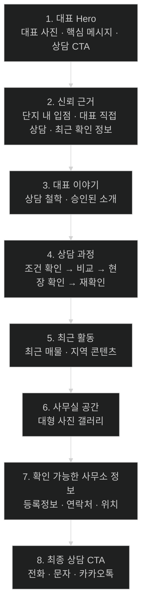

# 리더스시티 행복한부동산 `office` 페이지 개선안

- 대상 사이트: `https://leaderscityhappy.com/office/`
- 대상 저장소: `myoungsuk/real-estate-website`
- 작성 기준일: 2026-08-26
- 확인한 기본 브랜치: `master`
- 주요 대상 파일:
  - `src/pages/office.astro`
  - `src/styles/global.css`
  - `src/data/office.json`
  - 필요 시 기존 공통 컴포넌트
- 구현 목적: 사무소 소개 페이지를 단순 등록정보 페이지가 아니라 **대표자, 현장 전문성, 확인 가능한 근거, 실제 상담 흐름이 드러나는 신뢰 페이지**로 개선한다.

---

## 1. 핵심 결론

현재 `office` 페이지는 필요한 기본 재료가 이미 있다.

- 백진옥 대표 사진
- 대표 인사말
- 상담 원칙
- 사무실 사진 3장
- 사무소 등록정보
- 전화·문자·카카오톡 상담 CTA
- `src/data/office.json` 기반의 공통 사무소 데이터

문제는 정보 부족보다는 **정보의 우선순위와 시각적 위계가 약한 것**이다.

현재는 다음 요소가 거의 비슷한 무게로 이어진다.

```text
사무소 소개
→ 대표 사진 + 인사말
→ 운영 현황 숫자
→ 상담 원칙
→ 사무실 사진
→ 등록 정보
→ 상담 CTA
```

개선 후에는 방문자가 페이지를 읽는 순서를 다음과 같이 바꾼다.

```text
이곳이 어떤 부동산인가
→ 누가 직접 상담하는가
→ 왜 이 사무소를 신뢰할 수 있는가
→ 실제로 어떻게 상담하는가
→ 최근에도 활동하고 있는가
→ 어디에서 상담하는가
→ 공식적으로 확인 가능한 정보는 무엇인가
→ 바로 상담
```

### 최종 방향

**“좋은 부동산입니다”라고 주장하는 페이지가 아니라, 방문자가 근거를 보고 스스로 신뢰를 판단할 수 있는 페이지로 만든다.**

---

## 2. 현재 페이지에서 유지할 것

아래 요소는 삭제하지 않고 개선하여 재사용한다.

1. 대표 사진
2. 대표 직접 상담 메시지
3. 현재 대표 인사말의 핵심 철학
4. 리더스시티5블록 단지 내 입점 사실
5. 사무실 사진 3장
6. 사무소 등록정보
7. 전화·문자·카카오톡 CTA
8. 기존 전역 색상 체계
   - 화이트·아이보리
   - 딥네이비·차콜
   - 차분한 로즈 강조
9. 모바일 하단 상담 CTA
10. 기존 `BaseLayout`, SEO, canonical, 구조화 데이터 흐름

---

## 3. 현재 페이지에서 개선할 것

### 3.1 `PageIntro` 중심 시작을 대표 Hero 중심으로 변경

현재 첫 화면은 `PageIntro`의 다음 구조로 시작한다.

```text
OFFICE
사무소 소개
리더스시티5블록 단지 내 상가를 거점으로...
```

정보는 정확하지만 방문자의 첫인상을 만들기에는 행정적인 느낌이 강하다.

개선 후에는 **대표 사진 + 핵심 메시지 + 신뢰 근거 + 상담 CTA**를 첫 화면에 배치한다.

---

### 3.2 대표 인사말을 긴 본문보다 프로필 중심으로 재구성

현재 대표 소개는 사진 옆에 긴 인사말이 이어진다.

핵심 문장을 앞에 두고 긴 문단은 2~3개로 정리한다.

대표자의 상세 경력은 운영자가 공식 승인하기 전 임의로 만들지 않는다.

---

### 3.3 `허위매물 0건`, `중개사고 0건`의 시각적 비중 조정

현재 저장소 `CODEX.md`와 `src/data/office.json`에서는 운영자 확인 정보로 관리되고 있으므로 임의로 삭제하지 않는다.

다만 Hero 바로 아래에서 가장 강한 숫자처럼 강조하지 않는다.

#### 개선 원칙

- 대표 사진이나 지역 전문성보다 앞세우지 않는다.
- 페이지 하단의 `확인 가능한 정보` 또는 신뢰 보조 영역에 배치한다.
- 근거 기준이나 집계 기간을 실제로 공개할 수 있다면 함께 표시한다.
- 근거 기준을 공개할 수 없다면 과도한 마케팅 문구로 확대하지 않는다.

**ChatGPT 의견:** 이 사이트의 브랜드 철학에는 `0건` 주장보다 `최근 확인일`, 실제 위치, 대표 직접 상담, 공식 등록번호처럼 방문자가 확인 가능한 정보가 더 잘 맞는다.

---

### 3.4 추상적인 `상담 원칙`을 실제 상담 흐름으로 변경

현재:

- 동구 현장에 가까운 안내
- 충분한 비교
- 공개 정보 안내

개선:

1. 원하는 조건 확인
2. 선택지 비교
3. 현장과 조건 확인
4. 계약 전 재확인
5. 계약 이후 필요한 내용 안내

단, 실제 운영 방식과 다른 절차를 확정하지 않는다.

---

### 3.5 사무실 사진을 작은 3분할보다 편집형 갤러리로 강화

현재 사진 3장을 동일 크기로 나열한다.

개선 후:

- 대표 사무실 사진 1장을 크게
- 보조 사진 2장을 작게
- 사진 설명은 유지
- 모바일은 자연스럽게 1열

---

### 3.6 등록정보는 유지하되 페이지의 주인공에서 보조 신뢰정보로 변경

공식 등록정보는 매우 중요하므로 삭제하지 않는다.

다만 페이지 전체에서 가장 강한 시각적 섹션이 되지 않게 한다.

---

## 4. 정보 승인 상태 주의사항

### 불확실한 사실

현재 라이브 사이트와 저장소 `CODEX.md`에는 다음 정보가 공개되어 있다.

- 사업자등록번호
- 이메일
- 영업시간
- 일요일 운영 안내
- 주차
- 카카오톡 상담

그러나 프로젝트 운영 기준에는 이들 일부 항목이 별도 운영자 승인 전 확정 공개하지 않는 정보로 관리된 이력이 있다.

따라서 이번 UI 개선 작업에서는 **현재 값을 새로 만들거나 변경하지 말고, 기존 공개값을 유지할지 운영자 승인 상태를 다시 확인한 뒤 처리한다.**

Codex가 UI 개선 과정에서 임의의 값을 추가하거나 추정해서는 안 된다.

### 확정되지 않은 대표 정보

다음 항목은 운영자 승인 자료가 생기기 전 추가 금지:

- 공인중개사 경력 연수
- 천동 근무 연수
- 리더스시티 전문 경력 연수
- 거래 건수
- 계약 건수
- 고객 수
- 수상 경력
- 자격·교육 이력
- 고객 후기
- “1위”, “최다”, “최고”, “유일” 등 비교우위 표현

확인되지 않은 값은 만들지 않는다.

---

# 5. 개선 후 전체 페이지 구조



---

# 6. 섹션 1 - 대표 Hero

## 목적

첫 화면에서 5초 안에 다음 네 가지를 알 수 있어야 한다.

1. 어디 지역을 다루는가
2. 누가 상담하는가
3. 어떤 방식으로 상담하는가
4. 어떻게 연락하는가

## 권장 문구

### Eyebrow

```text
LEADERS CITY · DAEJEON DONG-GU
```

### H1

```text
리더스시티 안에서
직접 보고 안내합니다.
```

### 보조 설명

```text
리더스시티5블록 단지 내 사무소에서
백진옥 대표 공인중개사가 천동·신흥동을 포함한
대전 동구의 매매·전세·월세 상담을 직접 안내합니다.
```

주의:

- “매일 확인한다” 같은 표현은 실제 운영 기준이 확인될 때만 사용한다.
- “리더스시티 전문 1등” 같은 검증 불가능 표현은 금지한다.

## 사실 정보

Hero 하단에는 작은 fact row를 둔다.

```text
대표
백진옥 공인중개사

위치
리더스시티5블록 단지 내

상담
매매 · 전세 · 월세
```

## CTA

```text
[전화 상담] [문자 문의]
```

카카오톡은 Hero에 세 번째 버튼으로 무리하게 넣지 않아도 된다.

모바일 하단 고정 CTA가 이미 있다면 Hero의 CTA는 전화와 문자 2개로 단순하게 유지한다.

---

## PC 레이아웃

```text
┌─────────────────────────────────────────────────────────────┐
│ LEADERS CITY · DAEJEON DONG-GU                              │
│                                                             │
│ 리더스시티 안에서                 ┌──────────────────────┐  │
│ 직접 보고 안내합니다.             │                      │  │
│                                   │   백진옥 대표 사진    │  │
│ 리더스시티5블록 단지 내...        │                      │  │
│                                   │                      │  │
│ [전화 상담] [문자 문의]            └──────────────────────┘  │
│                                                             │
│ 대표 백진옥  |  위치 5블록 단지 내  |  매매·전세·월세       │
└─────────────────────────────────────────────────────────────┘
```

### 비율

- 텍스트: 약 55%
- 사진: 약 45%
- 최대 콘텐츠 폭은 기존 `--shell: 1180px` 유지

---

## 모바일 레이아웃

```text
┌────────────────────────────┐
│ LEADERS CITY               │
│                            │
│ 리더스시티 안에서           │
│ 직접 보고 안내합니다.       │
│                            │
│ 설명                       │
│                            │
│ [대표 사진]                │
│                            │
│ 대표 백진옥                │
│ 위치 리더스시티5블록       │
│ 상담 매매·전세·월세        │
│                            │
│ [전화 상담] [문자 문의]     │
└────────────────────────────┘
```

모바일에서는 텍스트가 너무 길어지지 않게 한다.

---

# 7. 섹션 2 - 왜 행복한부동산인가

## 목적

추상적인 자랑이 아니라 **검증 가능한 사실 3개**를 보여준다.

## 제목

```text
가까이에서 보고,
확인한 정보로 안내합니다.
```

## 카드 1

### 제목

```text
리더스시티5블록 단지 내
```

### 본문

```text
리더스시티5블록 근린생활시설 105호에 위치해
단지와 주변 생활환경을 가까이에서 살펴보며 상담합니다.
```

---

## 카드 2

### 제목

```text
대표 공인중개사 직접 상담
```

### 본문

```text
문의부터 매물 비교와 계약 전 확인까지
백진옥 대표가 직접 상담합니다.
```

실제 업무가 대표 단독 수행이 아닌 경우 문구를 운영 방식에 맞게 수정한다.

---

## 카드 3

### 제목

```text
확인 시점을 함께 안내
```

### 본문

```text
공개 매물과 지역 정보는 게시일 또는 확인일을 기준으로 안내하고,
실제 조건은 상담 과정에서 다시 확인합니다.
```

이 문구는 현재 사이트 푸터의 운영 원칙과도 일치시키는 것이 좋다.

---

# 8. 섹션 3 - 대표 이야기

## 목적

대표자를 단순한 프로필 사진이 아니라 사이트의 신뢰 주체로 보여준다.

## Eyebrow

```text
REPRESENTATIVE
```

## 제목

```text
충분히 비교하고
납득한 뒤 선택하세요.
```

현재 핵심 문장을 유지한다.

## 권장 본문

현재 `office.introduction` 내용을 기반으로 다음처럼 2~3개 문단으로 정돈한다.

```text
리더스시티5블록 단지 내 사무소에서
천동·신흥동을 포함한 대전 동구의 매물과 지역 정보를
가까이에서 확인하며 상담하고 있습니다.

부동산은 단순히 매물을 보여드리는 일이 아니라
고객님의 예산과 입주 시기, 생활 조건을 함께 비교하는 과정이라고 생각합니다.

급하게 결정을 권하기보다 충분히 비교하고 이해하신 뒤
선택하실 수 있도록 필요한 정보를 차근차근 안내하겠습니다.
```

### 문구 원칙

- 과도한 감성 문장보다 실제 상담 태도 중심
- “평생 책임”, “무조건 최저가”, “반드시 좋은 집” 같은 보증성 표현 금지
- 검증된 경력이 생기면 별도 프로필 정보로 확장

---

## 대표 약력 영역

현재는 만들지 않는다.

향후 운영자가 다음 정보를 승인하면 작은 프로필 리스트를 추가할 수 있다.

```text
공인중개사 자격
천동 지역 중개 경력
리더스시티 입점 시점
관련 교육·활동
```

정보가 승인되기 전에는 빈 영역이나 가짜 숫자를 만들지 않는다.

---

# 9. 섹션 4 - 실제 상담 과정

## 목적

현재 `상담 원칙` 3개 카드보다 방문자가 실제 상담 경험을 예상할 수 있게 한다.

## 제목

```text
처음 문의부터 계약 전 확인까지
차근차근 비교합니다.
```

## 5단계 구성

### 01. 원하는 조건 확인

```text
찾는 지역, 거래유형, 예산, 면적, 입주시기 등
우선순위를 먼저 확인합니다.
```

### 02. 선택지 비교

```text
가격과 면적, 입주 조건 등 공개된 정보를 기준으로
비교할 수 있는 선택지를 함께 살펴봅니다.
```

### 03. 현장과 조건 확인

```text
관심 있는 매물과 단지의 실제 확인이 필요한 부분을 구분하고
상담 시점의 조건을 다시 확인합니다.
```

### 04. 계약 전 재확인

```text
최종 선택 전에 가격과 일정 등 중요한 조건을
한 번 더 확인합니다.
```

### 05. 필요한 내용 안내

```text
계약 과정에서 고객이 확인해야 할 사항을
이해하기 쉽게 안내합니다.
```

### 운영 주의

이 5단계가 실제 사무소의 상담 절차와 다른 부분이 있으면 운영자 확인 후 수정한다.

---

## PC 디자인

가로 5개를 억지로 좁게 넣지 않는다.

권장 방식:

```text
01 ───── 02 ───── 03
                 │
                 ▼
04 ───────────── 05
```

또는 3 + 2 카드 그리드.

## 모바일 디자인

세로 타임라인을 사용한다.

```text
01
│
02
│
03
│
04
│
05
```

---

# 10. 섹션 5 - 최근 활동

## 목적

“지역 전문입니다”라고 쓰는 대신 실제로 최근에 어떤 정보를 다루고 있는지 보여준다.

## 제목

```text
최근 확인한 매물과
지역 이야기를 살펴보세요.
```

## 구현 우선순위

### 1단계 권장

새로운 데이터 스키마를 만들지 않는다.

기존 공개 데이터에서 다음 링크를 연결한다.

```text
[최근 매물 보기] → /properties/
[리더스시티 단지정보] → /complexes/
[지역 콘텐츠 보기] → /blog/
```

이 단계만으로도 충분히 개선 효과가 있다.

### 2단계 선택사항

기존 `naver-listings.json`, `external-links.json`에서 검증된 최신 항목을 읽어
작은 카드 3개 정도를 노출할 수 있다.

예:

```text
최근 매물 확인
리더스시티 매매 · 2026.08.xx 확인

최근 지역 콘텐츠
리더스시티 실거래가 분석 · 2026.08.xx

최근 블로그
천동·신흥동 지역 정보 · 2026.08.xx
```

### 중요한 구현 원칙

- 페이지를 풍성하게 만들기 위해 가짜 활동 데이터를 만들지 않는다.
- 게시일과 확인일의 의미를 섞지 않는다.
- 공개 데이터가 없으면 카드 대신 해당 목록 페이지 CTA만 보여준다.
- `office.json`에 최근 활동을 중복 저장하지 않는다.
- 기존 매물·외부 콘텐츠 데이터를 재사용한다.

---

# 11. 섹션 6 - 사무실 공간

## Eyebrow

```text
OFFICE
```

## 제목

```text
리더스시티5블록 안에서
편하게 상담받으세요.
```

## 보조 문구

```text
지역 지도와 단지 자료를 함께 보며
조건을 하나씩 비교할 수 있는 상담 공간입니다.
```

---

## 권장 사진 배치

PC:

```text
┌─────────────────────────────┬───────────────┐
│                             │ 상담 공간      │
│       사무실 메인 사진       ├───────────────┤
│                             │ 상담 테이블    │
└─────────────────────────────┴───────────────┘
```

모바일:

```text
[사무실 메인 사진]

[상담 공간]

[상담 테이블]
```

---

## 이미지 규칙

기존 파일을 우선 재사용한다.

- `/images/office/office-interior.webp`
- `/images/office/office-consultation.webp`
- `/images/office/office-meeting-room.webp`

Hero의 대표 사진:

- `/images/office/representative-baek-jinok.webp`

### 성능

- Hero 대표 사진은 첫 화면이므로 `loading="lazy"`를 사용하지 않는다.
- 필요 시 `fetchpriority="high"` 검토
- 갤러리 하단 사진은 `loading="lazy"` 유지
- WebP 유지
- 원본 EXIF·GPS가 포함된 파일을 새로 공개하지 않는다.

---

# 12. 섹션 7 - 확인 가능한 사무소 정보

## 목적

등록정보를 행정표처럼 보이게 하지 않고 **공식 신뢰정보 카드**로 정리한다.

## 제목

```text
확인 가능한 사무소 정보
```

## 상단 핵심 정보

먼저 중요한 4개를 크게 보여준다.

```text
대표자
백진옥

중개사무소 등록번호
30110-2023-00028

법적 상호
리더스시티행복한공인중개사사무소

소재지
대전광역시 동구 안샘로14번길 7,
리더스시티5블록 근린생활시설 105호
```

## 보조 정보

운영자 승인 상태를 확인한 뒤 기존 공개값을 유지할 수 있다.

```text
연락처
이메일
영업시간
주차
사업자등록번호
```

### 레이아웃

PC:

```text
┌─────────────────┬───────────────────────────┐
│ 사무소 정보      │ 대표자                    │
│                  │ 등록번호                  │
│ 공식 등록 내용을 │ 법적 상호                 │
│ 확인할 수 있습니다│ 소재지                    │
│                  │ 연락처                    │
│                  │ 기타 승인 정보            │
└─────────────────┴───────────────────────────┘
```

모바일에서는 1열.

---

## `0건` 운영 현황 배치

현재 공개가 승인된 상태를 유지한다면 등록정보 아래에 작은 보조 줄로 배치한다.

예:

```text
운영자 확인 현황
허위매물 0건 · 중개사고 0건
```

과도하게 큰 숫자 카드로 만들지 않는다.

근거 기준이나 기간이 승인되면 별도 보조문구를 추가한다.

---

# 13. 섹션 8 - 최종 상담 CTA

기존 `ContactPanel`을 최대한 재사용한다.

## 제목 제안

```text
찾는 조건을 말씀해 주세요.
현재 확인 가능한 정보부터 안내하겠습니다.
```

## 보조 문구

```text
지역, 거래유형, 예산, 면적, 입주시기를 알려주시면
현재 확인할 수 있는 매물과 비교할 내용을 안내합니다.
```

## 버튼

```text
[전화 상담]
[문자 문의]
[카카오톡 상담]
```

CTA에서는 선택지를 명확하게 보여주되, 스크롤 중 이미 모바일 고정 CTA가 있다면 화면을 과도하게 반복해서 가리지 않게 한다.

---

# 14. 권장 디자인 시스템

현재 `global.css`의 디자인 토큰을 유지한다.

```css
--navy-950
--navy-900
--ink
--muted
--ivory
--paper
--white
--rose
--rose-dark
--rose-soft
--gold
```

새로운 브랜드 색상을 임의로 만들지 않는다.

---

## 분위기

목표:

```text
지역 전문 공인중개사
+
깔끔한 생활 서비스
+
신뢰 가능한 로컬 브랜드
```

피할 것:

- 과도한 핑크
- 꽃무늬 장식
- 골드 남용
- 부동산 광고 전단지 같은 빨강·노랑 강조
- 지나치게 많은 그림자
- 카드마다 다른 모서리 스타일
- 아이콘 남발
- 자동 슬라이드
- 숫자 카운터 애니메이션
- 의미 없는 스크롤 애니메이션

---

# 15. CSS 구현 방향

현재 `global.css`에는 이미 다음 Office 관련 클래스가 있다.

```text
.office-story
.representative-card
.office-message
.office-gallery
.office-facts
.claim-strip--office
```

기존 클래스를 무조건 폐기하지 않는다.

다만 새 구조가 명확해지도록 Office 전용 클래스명을 추가할 수 있다.

예:

```text
.office-hero
.office-hero__grid
.office-hero__copy
.office-hero__portrait
.office-hero__facts
.office-trust
.office-trust__grid
.office-profile
.office-process
.office-process__list
.office-activity
.office-gallery--featured
.office-facts__primary
.office-facts__secondary
```

### 원칙

- 전역 범용 클래스를 Office 한 페이지 때문에 크게 변경하지 않는다.
- `global.css`에서 Office 전용 스타일을 묶어서 유지한다.
- 공통 컴포넌트화는 실제 재사용이 있는 경우에만 한다.
- 작은 MVP에 불필요한 추상화 계층을 만들지 않는다.

---

# 16. `office.astro` 권장 구조

예상 구조:

```astro
<BaseLayout {title} {description}>
  <section class="office-hero">
    ...
  </section>

  <section class="section office-trust">
    ...
  </section>

  <section class="section section--soft office-profile">
    ...
  </section>

  <section class="section office-process">
    ...
  </section>

  <section class="section section--soft office-activity">
    ...
  </section>

  <section class="section office-gallery-section">
    ...
  </section>

  <section class="section section--navy office-facts-section">
    ...
  </section>

  <ContactPanel />
</BaseLayout>
```

실제 구현 시 현재 컴포넌트와 CSS 구조에 더 자연스러운 방식이 있다면 Codex가 작은 범위에서 조정할 수 있다.

---

# 17. `office.json` 변경 원칙

## 기본 원칙

UI 개편 때문에 데이터를 페이지에 다시 하드코딩하지 않는다.

현재 `office.json`에서 관리하는 정보는 계속 데이터 파일을 기준으로 한다.

예:

```text
legalName
brandName
serviceArea
representative
mobile
address
registrationNumber
businessNumber
email
hours
parking
introduction
publicClaims
외부 링크
```

---

## 이번 작업에서 권장하는 데이터 변경

### `introduction`

현재 4문단을 유지해도 되지만, 운영자가 새 대표 문안을 승인하면 2~3문단으로 정리한다.

### `publicClaims`

임의 삭제 금지.

단, 화면상의 위치와 강조 수준은 조정한다.

### 새 필드

첫 구현에서는 가능하면 추가하지 않는다.

특히 다음과 같은 임의 마케팅 필드는 만들지 않는다.

```json
{
  "experienceYears": 10,
  "totalContracts": 500,
  "customerCount": 1000,
  "leadersCityExpertSince": "..."
}
```

공식 근거가 없는 숫자는 금지한다.

---

# 18. 최근 활동 구현 시 데이터 중복 금지

`office.json`에 아래처럼 별도 최근 활동 목록을 복제하지 않는다.

```json
{
  "recentActivities": [
    ...
  ]
}
```

기존 공개 매물·외부 콘텐츠 데이터가 이미 있으므로 해당 데이터를 재사용한다.

이유:

- 같은 게시물이 두 JSON에 중복 저장됨
- 날짜 불일치 가능
- 운영자가 한 곳만 수정할 위험
- 오래된 활동이 Office에 남을 위험

---

# 19. SEO

기존 URL은 그대로 유지한다.

```text
/office/
```

URL 또는 slug를 변경하지 않는다.

## Title

현재:

```text
사무소 소개 | 대전 동구 행복한부동산
```

유지 가능.

검색 키워드와 브랜드를 조금 명확히 하고 싶다면 다음 정도까지 검토할 수 있다.

```text
리더스시티 행복한부동산 사무소 소개 | 대전 동구
```

단, 전체 사이트 title 규칙과 비교 후 변경한다.

## Description 제안

```text
리더스시티5블록 단지 내에 위치한 리더스시티행복한공인중개사사무소입니다. 백진옥 대표가 천동·신흥동을 포함한 대전 동구의 매매·전세·월세 정보를 확인하고 직접 상담합니다.
```

실제 공개 범위와 맞는지 확인 후 사용한다.

---

# 20. 접근성

반드시 유지하거나 개선한다.

## Heading

한 페이지에서 H1은 1개.

권장:

```text
H1 리더스시티 안에서 직접 보고 안내합니다.
  H2 가까이에서 보고, 확인한 정보로 안내합니다.
  H2 충분히 비교하고 납득한 뒤 선택하세요.
  H2 처음 문의부터 계약 전 확인까지...
  H2 최근 확인한 매물과 지역 이야기...
  H2 리더스시티5블록 안에서...
  H2 확인 가능한 사무소 정보
```

## 이미지

대표 사진 alt:

```text
리더스시티 행복한부동산 백진옥 대표
```

사무실 사진 alt는 현재처럼 실제 장면을 설명한다.

장식 목적으로 추가한 이미지가 있다면 빈 `alt=""` 사용을 검토한다.

## 버튼

- 최소 44×44px
- 키보드 포커스 유지
- `tel:`, `sms:` 링크 의미 명확
- 색상만으로 상태를 구분하지 않음

---

# 21. 모바일 기준

최소 검수 폭:

```text
360px
390px
768px
1024px
1180px 이상
```

## 반드시 확인할 것

- 가로 스크롤 없음
- 대표 사진이 지나치게 커서 첫 화면을 모두 차지하지 않음
- Hero CTA가 2줄 이상 난잡하게 깨지지 않음
- 상담 타임라인 글자가 너무 작아지지 않음
- 등록번호와 긴 주소가 영역 밖으로 넘치지 않음
- 모바일 하단 전화·문자 CTA가 최종 콘텐츠를 가리지 않음
- `safe-area-inset-bottom` 기존 대응 유지
- 본문 16px 이상
- 너무 긴 가운데 정렬 문단을 만들지 않음

---

# 22. 성능

페이지를 고급스럽게 만든다는 이유로 JavaScript를 추가하지 않는다.

이번 개선은 기본적으로 Astro 정적 HTML + CSS만으로 구현한다.

## 금지

- 이미지 슬라이더 라이브러리
- 스크롤 애니메이션 라이브러리
- 숫자 카운터 라이브러리
- 외부 폰트 추가
- 지도 iframe 자동 삽입
- 불필요한 클라이언트 hydration

## 권장

- CSS Grid/Flex
- 기존 WebP
- 정적 HTML
- 필요한 경우 CSS `clamp()`
- 기존 디자인 토큰 재사용

---

# 23. 개인정보와 공개정보

UI 개편 과정에서 다음 내용을 새로 노출하지 않는다.

- 고객 연락처
- 상담 내용
- 비공개 동·호수
- 소유자·임대인·임차인 정보
- 계약서
- 신분증
- 내부 메모
- 비밀키
- 관리자 정보
- 원본 사진 EXIF/GPS

대표 사진·사무실 사진은 현재 승인된 공개 최적화본을 재사용한다.

---

# 24. 구현 우선순위

## 1차 구현 - 반드시

1. Hero 재구성
2. 대표 사진 강화
3. 신뢰 근거 3개 카드
4. 대표 인사말 정돈
5. 상담 원칙을 상담 과정으로 변경
6. 사무실 갤러리 레이아웃 개선
7. 등록정보 시각 위계 정리
8. 최종 CTA 문구 개선
9. 모바일 반응형 검수
10. 접근성 검수

---

## 2차 구현 - 권장

1. 최근 활동 섹션
2. `/properties/`, `/complexes/`, `/blog/` 연결
3. 기존 데이터에서 실제 최신 콘텐츠 2~3건 표시

---

## 3차 구현 - 운영자 자료 확보 후

1. 대표 약력
2. 자격·교육 이력
3. 리더스시티 입점 시점
4. 실제 경력 정보
5. 승인된 후기

운영자 자료가 없으면 구현하지 않는다.

---

# 25. 수정 예상 파일

## 반드시 확인

### `src/pages/office.astro`

주요 마크업 변경 대상.

### `src/styles/global.css`

Office 전용 레이아웃과 모바일 반응형 스타일.

---

## 데이터 문구 변경 시

### `src/data/office.json`

대표 소개 문구 또는 승인 정보가 바뀔 때만 수정.

UI 구조만 변경한다면 데이터 스키마는 그대로 유지하는 것을 우선한다.

---

## 최근 활동 추가 시

기존 프로젝트 구조를 먼저 확인한다.

예상 참고 대상:

```text
src/data/naver-listings.json
src/data/external-links.json
src/lib/naver-listings.ts
src/lib/content.ts 또는 관련 외부 콘텐츠 유틸리티
```

정확한 실제 파일과 export는 구현 시 저장소 최신 상태를 다시 확인한다.

---

# 26. 변경하지 말아야 할 것

이번 작업에서 다음 변경을 섞지 않는다.

- Astro → 다른 프레임워크 전환
- URL 변경
- DB 추가
- 새로운 관리자 시스템 설계
- 자체 상담 저장 폼 추가
- 외부 지도 SDK 추가
- 새로운 분석 도구 추가
- 사이트 전체 디자인 리뉴얼
- 다른 페이지의 대규모 리팩터링
- 콘텐츠 검증 규칙 약화

Office 개선 범위만 작게 수정한다.

---

# 27. 완료 기준

다음 조건을 모두 만족해야 완료로 본다.

## 화면

- [ ] 첫 화면에서 대표자와 지역 전문성이 즉시 보인다.
- [ ] 대표 사진이 작은 보조 이미지가 아니라 Hero의 핵심 요소로 보인다.
- [ ] 단지 내 입점, 대표 직접 상담 등 검증 가능한 근거가 드러난다.
- [ ] 대표 인사말이 읽기 쉬운 길이로 정리되어 있다.
- [ ] 상담 과정이 모바일에서도 이해하기 쉽다.
- [ ] 사무실 사진 3장의 시각적 위계가 생겼다.
- [ ] 등록정보가 유지되면서 페이지 전체를 지배하지 않는다.
- [ ] CTA가 전화·문자·승인된 외부 상담으로 자연스럽게 연결된다.

## 데이터

- [ ] 미승인 경력이나 숫자를 새로 만들지 않았다.
- [ ] 개인정보나 내부정보를 추가하지 않았다.
- [ ] `office.json`의 기존 데이터를 불필요하게 페이지에 중복 하드코딩하지 않았다.
- [ ] 최근 활동을 구현했다면 기존 공개 데이터에서 가져온다.

## 접근성

- [ ] H1은 1개다.
- [ ] Heading 순서가 자연스럽다.
- [ ] 모든 의미 있는 이미지에 적절한 alt가 있다.
- [ ] 키보드 포커스가 보인다.
- [ ] 주요 CTA 터치 영역이 44×44px 이상이다.
- [ ] 360px에서 가로 스크롤이 없다.

## 성능

- [ ] 불필요한 JavaScript 라이브러리를 추가하지 않았다.
- [ ] Hero 외 하단 이미지는 lazy loading을 유지한다.
- [ ] 이미지 최적화본을 사용한다.
- [ ] 기존 CSP를 불필요하게 확장하지 않았다.

## SEO

- [ ] `/office/` URL 유지
- [ ] canonical 유지
- [ ] robots/noindex 운영 정책 유지
- [ ] title/description을 바꿨다면 실제 페이지 내용과 일치
- [ ] 구조화 데이터의 기존 사무소 정보 흐름을 깨뜨리지 않음

---

# 28. 검증 명령

구현 후 저장소 최신 스크립트를 다시 확인한 뒤 최소 다음을 실행한다.

```bash
npm ci
npm test
npm run check
npm run build
npx wrangler deploy --dry-run
```

실제로 실행하지 않은 명령을 통과했다고 보고하지 않는다.

---

# 29. 수동 화면 검수

로컬 또는 Preview에서 최소 다음을 확인한다.

```text
/office/
/properties/
/complexes/
/location/
/faq/
```

Office 페이지 변경이 공통 CSS에 영향을 주지 않았는지도 확인한다.

## 필수 viewport

```text
360 × 800
390 × 844
768 × 1024
1440 × 900
```

---

# 30. 구현 후 보고 형식

Codex는 작업 완료 시 다음을 보고한다.

```text
1. 수정 목적
2. 변경 파일
3. 핵심 UI 변경
4. 데이터 변경 여부
5. 접근성 영향
6. SEO 영향
7. 개인정보·보안 영향
8. 실행한 명령과 실제 결과
9. 미실행 검사
10. 운영자 확인이 필요한 정보
```

---

# 31. Codex 구현 지시

이 문서를 구현 지침으로 사용할 때 아래 원칙을 따른다.

```text
현재 master 브랜치와 최신 코드를 먼저 확인한다.
루트 CODEX.md와 관련 문서를 읽고 실제 코드 기준으로 작업한다.

이 문서의 목표는 /office/ 페이지를 대표자와 지역 전문성이 명확한
신뢰 중심 페이지로 개선하는 것이다.

범위는 src/pages/office.astro와 필요한 Office 전용 CSS를 중심으로 제한한다.
데이터는 가능한 한 기존 src/data/office.json과 기존 공개 데이터 소스를 재사용한다.

미확정 대표 경력, 계약 건수, 고객 수, 후기, 순위, 지역 1위 같은 정보는 만들지 않는다.
현재 공개 중인 사업자등록번호, 이메일, 영업시간, 주차, 카카오톡 등은
프로젝트 문서 간 승인 상태가 일치하는지 확인하고 임의 변경하지 않는다.

허위매물 0건·중개사고 0건은 현재 저장소에서 운영자 확인 정보로 관리되고 있으므로
임의 삭제하지 말고 시각적 비중을 낮춰 보조 신뢰정보로 배치한다.

새 프레임워크, DB, 외부 UI 라이브러리, 슬라이더, 스크롤 애니메이션은 추가하지 않는다.
Astro 정적 HTML과 기존 CSS 디자인 토큰을 우선 사용한다.

모바일 360px부터 가로 넘침이 없어야 하고,
주요 터치 영역 44×44px, 키보드 포커스, alt, heading 구조를 보존한다.

구현 후 npm test, npm run check, npm run build,
npx wrangler deploy --dry-run을 실제 실행하고 결과를 보고한다.
```

---

# 32. 최종 목표 화면의 인상

최종 Office 페이지는 방문자에게 다음 인상을 주어야 한다.

```text
“광고 문구가 많은 부동산”
가 아니라

“실제 리더스시티 안에 있고,
누가 상담하는지 분명하며,
확인 가능한 정보를 근거로 설명하는 동네 부동산”
```

화려함보다 **사람, 위치, 근거, 최근 활동, 상담 방식**이 페이지의 중심이 되어야 한다.
