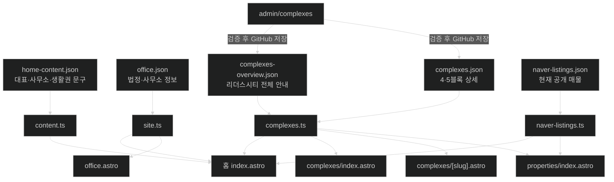
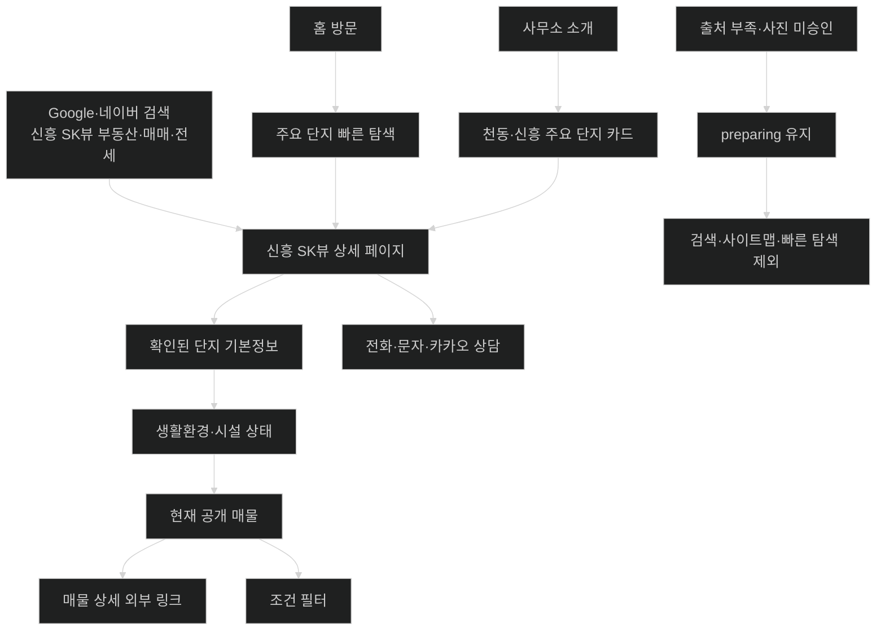
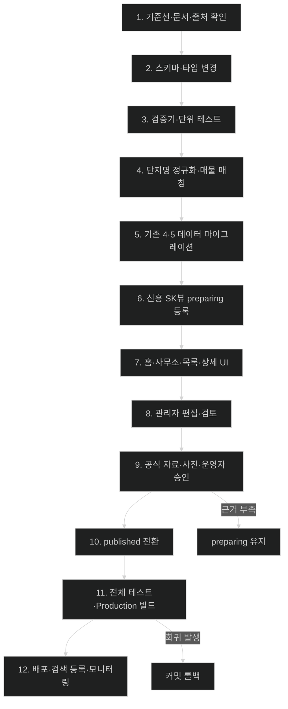

# 신흥 SK뷰 단지·상담 영역 확장 시스템 설계서

| 항목 | 내용 |
|---|---|
| 문서 ID | HRE-SKV-DESIGN-001 |
| 버전 | v1.2 공개 전환 검증 반영본 |
| 작성 기준일 | 2026-09-01 |
| 대상 저장소 | `myoungsuk/real-estate-website` |
| 기준 브랜치 | `origin/master` 확인 후 별도 작업 브랜치 또는 격리 worktree 사용 |
| 확인 기준 커밋 | `8a03d0e3ca461da35136a80279de00d1c4d0768c` |
| 대상 사이트 | `https://leaderscityhappy.com` |
| 핵심 목표 | 기존 리더스시티 브랜드를 유지하면서 신흥 SK뷰 상담·단지정보·현재 공개 매물을 주요 서비스 범위로 명확히 노출 |
| 아키텍처 | Astro 정적 사이트 + GitHub 공개 JSON·이미지 + 동일 Cloudflare Worker 관리자 API |
| 관련 문서 | `CODEX.md`, 핵심 서비스기획서·시스템설계서·개발체크리스트, 관리자시스템 설계서·체크리스트, `docs/leaderscity_complex_content_research_2026-08-25.md` |

> 이 문서는 신흥 SK뷰의 확정 사양을 대신하는 단지 조사서가 아니다. 화면·데이터·관리자·검증·배포 구조를 정의하는 구현 설계서다. 세대수, 동수, 사용승인일, 면적별 세대수, 주차대수, 시설 운영 여부 등 공개 수치는 아래의 정보 상태와 공개 Gate를 통과한 값만 `published` 데이터에 넣는다.

> 2026-09-01 구현 결과: 공식 기본정보·면적·공급 합계, 운영자 직접 촬영 대표 사진과 공개 문구 승인을 반영해 신흥 SK뷰를 `published`로 전환했다. 로컬 Production-mode 빌드·E2E·Lighthouse와 200% 확대 동등 조건·키보드 검수는 통과했다. 실제 Android·iPhone 검수는 운영자 승인으로 제외했으며 Production 배포·검색 수집 검증은 남아 있다.

---

## 0. 정보 상태와 용어

| 표기 | 의미 | 구현·공개 처리 |
|---|---|---|
| **[소스 확인]** | 현재 `master`의 파일과 코드에서 직접 확인 | AS-IS 근거로 사용 |
| **[공식 확인]** | 지방자치단체, K-apt, 건축물대장 등 1차 공식 자료에서 확인 | 출처·확인일·적용 범위와 함께 공개 가능 |
| **[교차확인]** | 공식 발표를 인용한 보도자료 또는 복수 공개 자료가 일치 | 임시 공개 가능하나 공식 원문 재확인 항목으로 유지 |
| **[운영자 확인]** | 실제 상담 수행, 사진 권리, 현장·시설 상태를 운영자가 확인 | 승인 시점과 담당자를 기록한 뒤 공개 |
| **[불확실한 사실]** | 출처별 값 충돌, 자료 시점 차이, 직접 원문 미확보 | 확정 문구·숫자 카드·구조화 데이터에 사용 금지 |
| **[ChatGPT 의견]** | 정보 구조, UX, 유지보수, 운영 안전성에 대한 권고 | 공식 사실과 분리해 구현 판단에만 사용 |

### 0.1 주요 식별값

- 화면 표시명: `신흥 SK뷰`
- URL slug: `sinheung-sk-view`
- 지역 표시: `신흥동`
- 지역 slug: `sinheung-dong`
- 네이버 공개 매물에서 확인되는 표기: `신흥SK뷰`
- 검색·매칭 기준: 공백, ASCII 대소문자, 일부 구분기호 차이를 정규화해 비교

---

# 1. 핵심 결론

## 1.1 제품·브랜드 판정

법적 상호와 홈페이지 브랜드는 변경하지 않는다.

- 법적 상호: `리더스시티행복한공인중개사사무소`
- 브랜드명: `리더스시티 행복한부동산`
- 위치 강점: `리더스시티5블록 단지 내`
- 주요 상담 단지: `리더스시티 4·5블록`, `신흥 SK뷰`
- 전문 생활권: `천동·신흥동을 중심으로 한 대전 동구`
- 상담 범위: `매매·전세·월세`

권장 대표 문장은 다음과 같다.

> 리더스시티5블록 단지 내에서 리더스시티 4·5블록과 신흥 SK뷰를 함께 살펴보며, 천동·신흥동의 매매·전세·월세를 직접 상담합니다.

`신흥 SK뷰 전문`이라는 표현은 첫 릴리스에서 사용하지 않는다. 실제 매물·현장 경험·콘텐츠 축적을 근거로 삼기 전에는 `상담`, `함께 안내`, `주요 상담 단지`가 더 정확하다.

## 1.2 구현 판정

신흥 SK뷰 데이터를 `complexes.json`에 단순 추가하는 방식은 금지한다. 현재 구현에는 다음 결합이 있기 때문이다.

1. 홈페이지 빠른 탐색이 리더스시티 4·5블록 slug를 직접 하드코딩한다.
2. `/complexes/` 비교표가 모든 `publishedComplexes`를 열로 사용한다.
3. `complexes-overview.json` 비교값은 리더스시티 4·5블록만 가진다.
4. 관리자 전체 비교 편집기가 `4블록 값 | 5블록 값` 형식으로 고정돼 있다.
5. 상세 페이지 SEO가 `leaders-city-4`가 아니면 모두 5블록 문구를 사용한다.
6. 네이버 매물 매칭은 `listingTitle.startsWith(complex.name)` 방식이라 `신흥SK뷰`와 `신흥 SK뷰`가 일치하지 않는다.
7. 공개 단지는 사진, 면적별 세대 구성, 공급 요약, 시설 상태, FAQ, 출처와 확인일을 모두 요구한다.

따라서 **데이터 추가 전에 범위 분리, SEO 일반화, 단지명 정규화, 관리자 파서와 검증기를 먼저 고친다.**

## 1.3 첫 릴리스 범위

- 홈페이지 대표 소개와 사무소 소개에 신흥 SK뷰 상담 범위 명시
- 빠른 탐색 그룹명을 `리더스시티`에서 `주요 단지`로 변경
- `리더스시티 4블록`, `리더스시티 5블록`, `신흥 SK뷰` 순서로 노출
- `/complexes/`를 `천동·신흥 주요 단지정보` 진입점으로 확장
- 리더스시티 4·5블록 비교표는 두 블록만 유지
- `/complexes/sinheung-sk-view/` 정적 상세 페이지 생성
- 신흥 SK뷰 현재 공개 매물 자동 연결
- `/properties/?complex=sinheung-sk-view` 필터 정상 동작
- 관리자 화면에서 새 필드와 비교 범위를 편집 가능
- 콘텐츠 검증, 단위 테스트, E2E, 빌드, SEO, 모바일 검수
- 운영자 문구·사진·출처 승인 후에만 `published`

---

# 2. 현재 저장소 기준선

## 2.1 현재 데이터 흐름



## 2.2 확인한 AS-IS

### 홈

- 대표 문구는 리더스시티 4·5블록과 대전 동구를 강조한다.
- 사무소 설명은 천동·신흥동을 언급하지만 신흥 SK뷰 단지명은 없다.
- 빠른 단지 탐색은 `leaders-city-4`, `leaders-city-5`만 코드에 직접 지정한다.
- 홈의 단지 기본정보 표는 모든 `publishedComplexes`를 순회하므로 세 번째 단지가 추가되면 제목과 범위가 어긋난다.

### 사무소 소개

- 사무소가 리더스시티5블록 안에 있다는 강점은 명확하다.
- 천동·신흥동을 상담한다고 적혀 있으나 신흥 SK뷰 취급 사실은 한눈에 드러나지 않는다.
- 신뢰 카드와 최근 활동 카드가 리더스시티 중심으로 고정돼 있다.

### 단지정보

- `complexes.json`은 일반 단지를 추가할 수 있는 상세 스키마를 갖고 있다.
- `/complexes/[slug].astro` 본문 대부분은 일반화돼 있으나 SEO와 단위 설명 일부가 리더스시티 전용이다.
- `/complexes/index.astro`는 제목·통계·비교 모두 리더스시티 4·5블록을 전제로 한다.
- `validateComplexOverview()`는 모든 공개 단지에 대해 모든 비교행의 값을 요구한다.

### 매물

- 현재 공개 매물 데이터에 `신흥SK뷰` 제목의 매물이 존재한다.
- 단지 필터는 `publishedComplexes`에서 생성된다.
- 매물과 단지 연결은 공백까지 동일한 접두어 비교라 표기 차이에 취약하다.

### 관리자

- 개별 단지는 새로 추가할 수 있다.
- 전체 비교 편집은 `항목 | 4블록 값 | 5블록 값`으로 고정돼 있다.
- 새 스키마 필드를 추가하면 UI, 파서, 검토 화면, Worker 허용 스키마, 테스트를 함께 갱신해야 한다.

---

# 3. 목표와 비목표

## 3.1 목표

1. 방문자가 첫 화면에서 신흥 SK뷰도 상담한다는 사실을 이해한다.
2. 브랜드 중심은 리더스시티에 유지하되 영업 범위를 축소해 보이지 않게 한다.
3. 신흥 SK뷰 검색 사용자가 단지정보, 현재 공개 매물, 상담 CTA로 자연스럽게 이동한다.
4. 리더스시티 4·5블록 전용 비교표가 세 번째 단지 때문에 오염되지 않게 한다.
5. 네이버 매물의 공백·영문 표기 차이를 안전하게 정규화한다.
6. 단지 정보의 출처, 확인일, 시설 상태, 변동 정보의 성격을 구분한다.
7. 운영자가 관리자 화면에서 같은 데이터 구조를 유지할 수 있게 한다.
8. 새 단지가 추가돼도 하드코딩을 늘리지 않는 구조를 만든다.
9. 모바일, 접근성, SEO, 정적 빌드, 배포·롤백을 기존 운영 방식에 맞춘다.

## 3.2 비목표

- 상호 또는 도메인 변경
- DB 도입
- 고객 상담 내용 저장
- 네이버 상세 페이지 실시간 크롤링
- 실거래가·호가의 자체 시계열 DB 구축
- 신흥 SK뷰를 리더스시티와 우열 순위로 평가
- 운영자 확인 없이 `전문`, `최고`, `초역세권`, `무조건 상승` 등 과장 표현 사용
- Google 검색 이미지 또는 외부 중개사 사진 복제
- 주차대수, 관리비, 학교 배정, 시설 운영 여부를 출처 충돌 상태에서 확정
- 첫 릴리스에서 대전 동구 전체 단지를 모두 구축

---

# 4. 콘텐츠와 브랜드 표현 설계

## 4.1 표현 계층

| 노출 위치 | 역할 | 권장 표현 |
|---|---|---|
| 법정·푸터 | 법적 식별 | 리더스시티행복한공인중개사사무소 |
| 헤더·로고 | 브랜드 유지 | 리더스시티 행복한부동산 |
| 홈 Hero | 주요 서비스 즉시 전달 | 리더스시티와 신흥 SK뷰, 직접 확인하고 비교해서 안내합니다 |
| 홈 보조 문구 | 생활권 확장 | 천동·신흥동을 중심으로 대전 동구 매매·전세·월세 상담 |
| 사무소 소개 | 위치와 범위 결합 | 리더스시티5블록 단지 내에서 리더스시티 4·5블록과 신흥 SK뷰 상담 |
| 단지정보 | 정보형 랜딩 | 천동·신흥 주요 단지정보 |
| 신흥 SK뷰 상세 | 검색·상담 전환 | 단지 기본정보, 생활환경, 현재 공개 매물, 현장 확인사항 |
| CTA | 행동 요청 | 신흥 SK뷰 조건 상담 / 현재 공개 매물 보기 |

## 4.2 금지 표현

- `신흥 SK뷰 공식 부동산`
- `신흥 SK뷰 지정 부동산`
- `신흥 SK뷰 유일 전문`
- `최저가 보장`
- `투자가치 확정`
- `무조건 오른다`
- 근거 없는 도보 분 수
- 학년도·주소 확인 없는 배정학교 단정
- 확인일 없는 현재 시세 고정 문구

## 4.3 권장 홈 문안

### 대표 Hero

- Eyebrow: `리더스시티 · 신흥 SK뷰 · 대전 동구`
- 제목: `리더스시티와 신흥 SK뷰, 직접 확인하고 비교해서 안내합니다.`
- 설명:

> 리더스시티5블록 단지 내 사무소에서 리더스시티 4·5블록과 신흥 SK뷰를 중심으로 천동·신흥동의 매매·전세·월세를 함께 안내합니다. 백진옥 대표 공인중개사가 공개 매물과 현장에서 확인할 내용을 차분하게 비교해 드립니다.

### 사무소 소개

- 제목: `리더스시티 안에서, 천동·신흥 주요 단지를 함께 봅니다.`
- 설명:

> 리더스시티5블록 단지 내 사무소에서 백진옥 대표 공인중개사가 리더스시티 4·5블록과 신흥 SK뷰를 중심으로 천동·신흥동 매매·전세·월세를 직접 상담합니다.

### 신뢰 카드 추가

- 제목: `천동·신흥 주요 단지 상담`
- 설명:

> 리더스시티 4·5블록뿐 아니라 신흥 SK뷰의 매매·전세·월세와 단지별 차이도 함께 비교해 안내합니다.

---

# 5. 목표 사용자 흐름



## 5.1 성공 조건

- 홈에서 두 번 이내 클릭으로 신흥 SK뷰 상세에 도달한다.
- 검색 유입자는 상세 페이지에서 현재 매물 또는 상담으로 이동한다.
- 현재 매물이 0건이어도 단지정보와 상담 CTA는 정상 표시된다.
- 현재 매물 가격은 데이터 스냅샷에서만 표시되며 본문에 고정되지 않는다.
- 신흥 SK뷰가 추가돼도 리더스시티 4·5블록 비교표는 두 열을 유지한다.

---

# 6. 핵심 아키텍처 결정

## AD-SKV-01. 공개 단지 범위와 비교 범위를 분리한다

### 결정

`complexes-overview.json`에 다음 두 필드를 추가한다.

```ts
featuredComplexSlugs: string[];
comparisonComplexSlugs: string[];
```

- `featuredComplexSlugs`: 홈 빠른 탐색과 `/complexes/` 주요 카드의 노출 순서
- `comparisonComplexSlugs`: 현재 리더스시티 비교표에 참여하는 단지 순서

초기값:

```json
{
  "featuredComplexSlugs": [
    "leaders-city-4",
    "leaders-city-5",
    "sinheung-sk-view"
  ],
  "comparisonComplexSlugs": [
    "leaders-city-4",
    "leaders-city-5"
  ]
}
```

### 이유

- 새 공개 단지를 추가해도 기존 4·5블록 비교표 의미가 유지된다.
- 홈페이지 코드에 slug를 계속 직접 추가하지 않는다.
- 한 파일에서 노출 순서를 운영할 수 있다.
- 임의의 다중 비교 그룹까지 도입하는 대규모 리팩터링을 피한다.

### Trade-off

- 첫 버전은 비교표 한 개만 지원한다.
- 향후 `리더스시티 vs 신흥 SK뷰` 비교표가 필요하면 별도 ADR로 `comparisonGroups` 배열을 도입한다.
- 현재 요구에는 최소 변경이 더 안정적이다.

## AD-SKV-02. 단지명 정규화는 매칭 함수로 처리한다

### 결정

표시명은 `신흥 SK뷰`로 유지한다. 매물 제목의 `신흥SK뷰`는 정규화 함수로 연결한다.

```ts
normalizeComplexText("신흥 SK뷰") === normalizeComplexText("신흥SK뷰")
```

정규화 규칙:

1. Unicode NFKC 정규화
2. trim
3. 영문 소문자화
4. 공백, 점, 가운데점, 하이픈 제거
5. 나머지 한글·영문·숫자는 유지

`aliases`는 공백 차이를 저장하기 위한 용도가 아니라 다른 실제 명칭만 저장한다.

예:

```json
"aliases": ["신흥에스케이뷰"]
```

### 매칭 규칙

- 후보: `name + aliases`
- 긴 후보를 먼저 비교
- 정규화된 매물 제목이 후보로 시작할 때만 일치
- 동일 길이의 복수 단지가 일치하면 `unmatched` 처리하고 검증 경고
- 단순 `includes()`는 오탐 위험 때문에 사용하지 않는다

## AD-SKV-03. SEO를 단지 데이터로 이동한다

현재 상세 페이지의 4블록/그 외 분기문을 제거하고 다음 필드를 추가한다.

```ts
seo: {
  title: string;
  description: string;
};
```

모든 단지는 `seo` 객체를 항상 명시한다. 준비 중 단지는 초안 문구를 허용하지만, 공개 단지는 비어 있지 않은 최종 승인 문구를 필수로 검증한다. SEO 제목은 최대 70자(권장 30~60자), 설명은 최대 180자(권장 70~160자)로 제한하고 준비 안내 문구가 남은 공개 데이터를 거부한다. 이 규칙은 TypeScript 타입, strict schema, 기존 4·5블록 데이터, 관리자 직렬화·파서를 한 번에 맞추기 위한 데이터 계약이다.

## AD-SKV-04. 단지별 데이터 주의 문구를 데이터로 이동한다

현재 상세 페이지의 5블록 전용 문장을 제거하고 다음 필드를 추가한다.

```ts
unitDataNote: string | null;
```

- 4블록: 타입별 차이와 집계 기준
- 5블록: 분양·공공임대 구분과 고시 집계 기준
- 신흥 SK뷰: 확보한 자료의 집계 범위와 미확정 타입 수량 안내

## AD-SKV-05. 신흥 SK뷰는 준비 상태에서 시작한다

다음 Gate를 모두 통과하기 전에는 `status: "preparing"`을 유지한다.

- 운영자 제공 또는 사용권이 명확한 대표 사진
- 사진 대체 텍스트
- 공식 또는 공공 1차 자료
- 면적별 세대 구성 합계
- 공급 구성 합계
- 시설 상태 라벨
- FAQ와 현장 체크포인트
- SEO 문구
- 확인일
- 운영자 최종 문구 승인

---

# 7. 데이터 모델 변경

## 7.1 `ComplexContent` 변경

```ts
export interface ComplexContent {
  slug: string;
  areaSlug: string;
  areaName: string;
  eyebrow: string;
  mark: string;
  name: string;

  aliases: string[];
  seo: {
    title: string;
    description: string;
  };
  unitDataNote: string | null;

  status: "preparing" | "published";
  summary: string;
  introTitle: string;
  introduction: string[];
  image: { src: string; alt: string } | null;
  facts: Array<{ label: string; value: string }>;
  highlights: Array<{ title: string; description: string }>;
  unitGroups: Array<{
    category: string;
    areaLabel: string;
    households: number;
    note?: string;
  }>;
  supplySummary: Array<{
    label: string;
    value: string;
    description?: string;
  }>;
  livingSections: Array<{
    category: "transport" | "education" | "daily-life" | "nature";
    title: string;
    description: string;
  }>;
  amenityGroups: Array<{
    title: string;
    items: string[];
    verification:
      | "official"
      | "operator-confirmed"
      | "historical-plan"
      | "check-required";
    note?: string;
  }>;
  checkpoints: Array<{ title: string; description: string }>;
  faqs: Array<{ question: string; answer: string }>;
  relatedContentIds: string[];
  sources: ComplexSource[];
  confirmedAt: string | null;
}
```

`aliases`, `seo`, `unitDataNote`는 `preparing`과 `published` 모두 JSON에 항상 기록한다. `preparing`은 `seo.title`·`seo.description` 초안을 허용하고 `unitDataNote`는 `null`일 수 있다. `published` 전환 시에는 최종 SEO 문구와 공개 데이터 Gate를 모두 통과해야 한다. 중간 커밋에서 기존 단지 데이터나 관리자 파서가 새 필드를 유실하지 않도록 타입·strict schema·기존 데이터 마이그레이션·관리자 round-trip 테스트를 같은 원자적 변경으로 처리한다.

## 7.2 `ComplexOverview` 변경

```ts
export interface ComplexOverview {
  eyebrow: string;
  title: string;
  description: string;
  note: string;
  confirmedAt: string;

  featuredComplexSlugs: string[];
  comparisonComplexSlugs: string[];

  stats: Array<{ label: string; value: string; description: string }>;
  reasons: Array<{ title: string; description: string }>;
  comparisonRows: Array<{
    label: string;
    values: Record<string, string>;
  }>;
  sharedCheckpoints: Array<{ title: string; description: string }>;
  relatedContentIds: string[];
  sources: ComplexSource[];
}
```

## 7.3 파생 데이터 함수

`src/lib/complexes.ts`에 다음 함수를 추가한다.

```ts
export function getComplexBySlug(slug: string): ComplexContent | undefined;
export function getOrderedComplexes(slugs: string[]): ComplexContent[];
export function normalizeComplexText(value: string): string;
export function getComplexMatchCandidates(complex: ComplexContent): string[];
export function matchPublishedComplexByListingTitle(
  title: string
): ComplexContent | undefined;
```

파생 컬렉션:

```ts
export const featuredComplexes =
  getOrderedComplexes(complexOverview.featuredComplexSlugs);

export const comparisonComplexes =
  getOrderedComplexes(complexOverview.comparisonComplexSlugs);
```

## 7.4 신흥 SK뷰 준비 데이터 예시

아래는 설계용 예시이며 그대로 `published`로 복사하지 않는다.

```json
{
  "slug": "sinheung-sk-view",
  "areaSlug": "sinheung-dong",
  "areaName": "신흥동",
  "eyebrow": "SINHEUNG SK VIEW",
  "mark": "SK",
  "name": "신흥 SK뷰",
  "aliases": [
    "신흥에스케이뷰"
  ],
  "seo": {
    "title": "신흥 SK뷰 단지정보·매매·전세·월세 | 행복한부동산",
    "description": "대전 동구 신흥동 신흥 SK뷰의 확인된 단지정보, 생활환경, 계약 전 점검사항과 현재 공개 매매·전세·월세를 안내합니다."
  },
  "unitDataNote": "면적별 세대수와 공급 구분은 확보한 공식 원문의 집계 범위를 확인한 뒤 공개합니다.",
  "status": "preparing",
  "summary": "신흥동의 대규모 아파트 단지로, 공개자료와 현장 확인을 구분해 안내할 예정입니다.",
  "introTitle": "신흥 SK뷰, 현재 매물과 생활 조건을 함께 살펴봅니다",
  "introduction": [
    "신흥 SK뷰의 단지 규모와 면적 구성, 교통·교육·생활환경을 확인 가능한 자료를 기준으로 정리합니다.",
    "현재 공개 매물은 등록일과 확인일이 있는 목록에서 자동으로 연결하며, 가격과 계약 조건은 상담 시점에 다시 확인합니다."
  ],
  "image": null,
  "facts": [],
  "highlights": [],
  "unitGroups": [],
  "supplySummary": [],
  "livingSections": [],
  "amenityGroups": [],
  "checkpoints": [],
  "faqs": [],
  "relatedContentIds": [],
  "sources": [],
  "confirmedAt": null
}
```

---

# 8. 단지 사실·출처 공개 Gate

## 8.1 공식 확인 사실과 남은 후보

2026-08-31 기준으로 아래 일부 값은 공식 원문에서 직접 확인했다. 실제 JSON에는 원문 URL·발행처·확인일을 함께 기록하고, 아직 원문이 부족하거나 값이 충돌하는 항목은 계속 공개하지 않는다.

| 항목 | 값 | 현재 설계 상태 | 근거·공개 Gate |
|---|---:|---|---|
| 단지명·지번 | 신흥SK뷰아파트·신흥동 161-33 | 공식 확인 | K-apt 공개 단지정보, 화면 표시명은 승인된 `신흥 SK뷰` 사용 |
| 사업 맥락 | 신흥3구역 재개발 | 공식 확인 | 대전 동구청 재개발정비사업 추진현황 |
| 전체 세대수 | 1,588세대 | 공식 확인 | K-apt·대전 동구청 원문 일치 |
| 동수 | 12개동 | 공식 확인 | K-apt·대전 동구청 원문 일치 |
| 사용승인·입주 시기 | 사용승인일 2022-04-28·입주 2022년 4월 | 공식 확인 | K-apt 사용승인일과 대전 동구청 준공·입주 기록을 구분해 저장 |
| 공급 구분 | 분양 1,499·임대 89 | 공식 확인 | 대전광역시 2022년 주택입주 계획 원문 |
| 도로명주소 | 확인 필요 | 미확정 | 도로명주소 또는 건축물대장 원문 확보 후 공개 |
| 면적 범위·면적별 세대수 | 전용 39~84㎡대 후보 | 불확실한 사실 | 공식 모집공고·K-apt 원문 전수 확인과 합계 검증 전 공개 금지 |
| 주차대수 | 1,957 / 1,966 충돌 | 불확실한 사실 | 충돌 해소 전 공개 금지 |
| 시설 운영 | 과거 분양·입주 자료에 시설 언급 | 운영 주의 | 관리사무소·운영자 현재 확인 |
| 현재 가격 | 날짜별 매물·시세로 변동 | 변동 정보 | 본문 고정 금지, 현재 매물 데이터만 사용 |

공식 확인 원문:

- [K-apt 공동주택관리정보시스템 단지 공개 목록](https://www.k-apt.go.kr/cmmn/introMmentPop.do?bjdCode=30&searchOccuDate=202408&upYn=Y): 단지명, 12개동, 1,588세대, 사용승인일 2022-04-28, 지번
- [대전 동구청 재개발정비사업 추진현황](https://donggu.go.kr/dg/kor/contents/150): 신흥3구역, 신흥동 161-33 일원, 12개동 1,588세대, 2022년 4월 준공·입주
- [대전광역시 2022년 주택입주 계획](https://www.daejeon.go.kr/drh/drhStoryDaejeonView.do?boardId=blog_0001&categorySeq=293&menuSeq=7713&ntatcSeq=1393288021&pageIndex=1): 분양 1,499세대, 임대 89세대, 합계 1,588세대

## 8.2 출처 우선순위

1. K-apt 단지 기본정보 직접 조회
2. 건축물대장·도로명주소·지자체 고시
3. 정비사업 조합·사업시행자·시공사 공식 자료
4. 대전 동구·대전광역시 공식 보도와 회의·재정 문서
5. 공식 자료를 인용한 언론
6. 네이버·KB 등 현재 공개 부동산 서비스
7. 기타 블로그·커뮤니티

6~7순위 자료는 공식 수치의 단독 근거로 사용하지 않는다.

## 8.3 사진 Gate

- 운영자가 직접 촬영했거나 공개 사용권을 확인한 사진만 저장소에 넣는다.
- Google 이미지 검색, 다른 중개사, 블로그, 분양 홍보물 이미지를 복제하지 않는다.
- EXIF와 위치 메타데이터를 제거한다.
- WebP로 최적화하고 반응형 파생 이미지를 생성한다.
- 첫 공개 대표 사진은 `public/images/area/sinheung-sk-view.webp`, `sinheung-sk-view-640.webp`, `sinheung-sk-view-1200.webp`를 한 세트로 등록한다. validator는 공개 단지의 원본과 두 파생본을 모두 확인한다.
- 관리자 화면의 `public/images/content/area/` 단일 WebP 업로드는 초안 검토용이며 반응형 파생본을 별도로 생성·검수하기 전에는 공개 대표 사진으로 사용할 수 없다.
- 사진이 없으면 `preparing` 상태를 유지한다.
- 무단 대체 이미지는 사용하지 않는다.

## 8.4 시설 Gate

시설은 다음 상태 중 하나로만 공개한다.

- `official`: 현재 공식 자료가 운영 상태까지 확인
- `operator-confirmed`: 운영자가 현장에서 현재 사용 여부 확인
- `historical-plan`: 과거 분양·입주 자료의 계획 또는 당시 소개
- `check-required`: 존재·운영·이용 조건을 현재 다시 확인해야 함

---

# 9. 페이지별 설계

## 9.1 홈페이지 `/`

### 변경

1. SEO title에 `리더스시티·신흥 SK뷰` 추가
2. SEO description에 주요 상담 단지 명시
3. Hero eyebrow·headline·lead 변경
4. 빠른 탐색 그룹명을 `주요 단지`로 변경
5. `quickComplexes` 하드코딩 제거
6. `featuredComplexes` 사용
7. 단지 기본정보 표 제목을 `주요 단지 기본정보`로 일반화
8. 표에는 `featuredComplexes`를 표시
9. `대전 동구 단지정보 보기` 링크 유지
10. 매물 영역은 현재 전체 공개 매물을 그대로 유지

### 제목 예시

```ts
const title =
  "대전 동구 지역 전문 행복한부동산 | 리더스시티·신흥 SK뷰";
```

### 설명 예시

```ts
const description =
  "리더스시티5블록 단지 내 행복한부동산입니다. 리더스시티 4·5블록과 신흥 SK뷰를 중심으로 천동·신흥동의 매매·전세·월세를 백진옥 대표 공인중개사가 직접 상담합니다.";
```

### 구조화 데이터

- 법적 상호와 브랜드명은 그대로 유지한다.
- `areaServed`는 `대전광역시 동구`를 유지한다.
- 특정 단지명을 `sameAs`나 법적 식별자처럼 사용하지 않는다.
- 필요한 경우 `knowsAbout` 후보로 단지명을 추가할 수 있으나 첫 릴리스에서는 생략한다.

## 9.2 사무소 소개 `/office/`

### 변경

- title·description에 신흥 SK뷰 상담 범위 반영
- Hero 제목·문단 변경
- 신뢰 카드 4번째 항목 추가 또는 기존 3개 카드 중 한 항목 교체
- 최근 활동 카드의 `리더스시티 단지정보`를 `천동·신흥 주요 단지정보`로 변경
- 소개문 `office.introduction[0]`에 신흥 SK뷰 추가
- 사무소 위치와 상담 대상이 혼동되지 않도록 `단지 내 위치`와 `주요 상담 단지`를 분리 표시

### 권장 facts

| 항목 | 표시 |
|---|---|
| 위치 | 리더스시티5블록 단지 내 |
| 주요 상담 단지 | 리더스시티 4·5블록 · 신흥 SK뷰 |
| 지역 | 천동·신흥동을 포함한 대전 동구 |
| 상담 | 매매 · 전세 · 월세 |

## 9.3 단지정보 목록 `/complexes/`

### Hero

- Eyebrow: `DAEJEON DONG-GU COMPLEX GUIDE`
- 제목: `천동·신흥 주요 단지, 생활 기준으로 비교하세요`
- 설명:

> 리더스시티 4·5블록과 신흥 SK뷰의 규모, 입주시기, 면적 구성, 생활환경과 현재 공개 매물을 확인 가능한 자료와 현장 기준으로 안내합니다.

### 섹션 순서

1. Hero
2. 주요 단지 카드 3개
3. 숫자로 보는 리더스시티
4. 리더스시티 4블록 vs 5블록 비교
5. 천동·신흥 생활권 안내
6. 공통 현장 확인사항
7. 관련 블로그·유튜브
8. 자료 출처
9. 상담 CTA

### 렌더링 범위

```ts
const featuredComplexes = getOrderedComplexes(
  complexOverview.featuredComplexSlugs
);

const comparisonComplexes = getOrderedComplexes(
  complexOverview.comparisonComplexSlugs
);
```

- 카드: `featuredComplexes`
- 비교표 열: `comparisonComplexes`
- 나머지 공개 단지는 필요 시 `기타 단지` 목록에 표시
- 비교값이 누락되면 빌드 실패
- 신흥 SK뷰를 리더스시티 4·5 비교표에 자동 추가하지 않음

## 9.4 신흥 SK뷰 상세 `/complexes/sinheung-sk-view/`

### 섹션

1. 단지 Hero
2. 대표 사진·소개
3. 현재 공개 매물 요약 CTA
4. 단지 기본정보
5. 면적·공급 구성
6. 교통·교육·생활·자연
7. 시설과 확인 상태
8. 현장 체크리스트
9. FAQ
10. 현재 공개 매물 카드
11. 관련 블로그·유튜브
12. 출처·확인일
13. 상담 CTA

### 현재 매물 섹션

```ts
const relatedListings = naverListings.filter(
  (listing) =>
    matchPublishedComplexByListingTitle(listing.title)?.slug === complex.slug
);
```

표시 원칙:

- 0건: `현재 공개 목록에 신흥 SK뷰 매물이 없습니다` + 상담 CTA
- 1~3건: 카드 전부 표시
- 4건 이상: 최근 등록순 3건 + `전체 매물 보기`
- 가격·면적·층·방향은 `naver-listings.json` 공개값 그대로 사용
- 목록 기준일 `naverListingsUpdatedAt` 표시
- 영구 소개 문단에 현재 가격을 쓰지 않음

### CTA

```text
신흥 SK뷰 현재 매물 보기
신흥 SK뷰 조건 상담
전화 상담
문자로 조건 보내기
```

## 9.5 매물 목록 `/properties/`

- 단지 filter에 신흥 SK뷰 자동 표시
- `getComplexSlug()` 로컬 함수를 공용 매칭 함수로 교체
- URL `?complex=sinheung-sk-view` 복원
- 공백 없는 `신흥SK뷰` 매물 제목도 정확히 연결
- 선택 조건 표시에는 화면명 `신흥 SK뷰` 사용
- 필터 결과 0건에서도 문의 작성과 상담 CTA 유지

## 9.6 `llms.txt`, sitemap, IndexNow

- `published` 전환 후 정적 경로가 sitemap에 포함되는지 확인
- `llms.txt`의 사이트 설명에 주요 상담 단지 범위를 반영할지 검토
- 새 URL과 홈·사무소·단지 목록 변경 URL을 IndexNow 계획에 포함
- `preparing` 상태는 sitemap·IndexNow·빠른 탐색에서 제외

---

# 10. 상세 페이지 일반화

## 10.1 SEO 분기 제거

```ts
const title = complex.seo.title;
const description = complex.seo.description;
```

## 10.2 단위 설명 일반화

```astro
{complex.unitDataNote && (
  <p class="complex-data-note">{complex.unitDataNote}</p>
)}
```

## 10.3 빈 배열과 공개 상태

- `preparing`: 정적 상세 경로 생성 안 됨
- `published`: 검증기가 필수 배열·사진·출처를 보장
- 템플릿은 `published`만 받으므로 `Math.max(...unitGroups)`가 빈 배열을 받지 않음
- 방어적으로 `Math.max(1, ...)`를 적용해 잘못된 데이터가 UI 계산을 깨뜨리지 않게 함

---

# 11. 단지명·매물 매칭 설계

## 11.1 정규화 예

| 입력 | 정규화 결과 |
|---|---|
| `신흥 SK뷰` | `신흥sk뷰` |
| `신흥SK뷰` | `신흥sk뷰` |
| `신흥 SK VIEW` | `신흥skview` |
| `신흥-SK뷰` | `신흥sk뷰` |

한글 `뷰`와 영문 `VIEW`는 서로 자동 변환하지 않는다. 영문 표기가 실제 데이터에 나타나면 `aliases`에 등록한다.

## 11.2 충돌 방지

예를 들어 `리더스시티`와 `리더스시티 5블록`이 함께 후보라면 긴 후보를 먼저 본다.

```text
후보 정렬
1. 리더스시티5블록
2. 리더스시티
```

동일한 정규화 후보가 서로 다른 공개 단지에 등록되면 빌드를 실패시킨다.

## 11.3 매칭 실패 관찰

- 매칭되지 않은 매물은 일반 매물로 계속 표시한다.
- 공개 매물 제목 중 알려진 단지명인데 매칭되지 않는 항목을 테스트 리포트에 출력한다.
- 매칭 실패 때문에 매물을 숨기거나 삭제하지 않는다.
- 외부 동기화가 `complexSlug`를 임의 생성하지 않게 한다.

---

# 12. 관리자 화면 설계

## 12.1 개별 단지 편집 필드 추가

| 필드 | UI | 검증 |
|---|---|---|
| `aliases` | 한 줄에 하나씩 textarea | 정규화 중복·타 단지 충돌 금지 |
| `seo.title` | text | 공개 상태 필수, 길이 경고 |
| `seo.description` | textarea | 공개 상태 필수, 길이 경고 |
| `unitDataNote` | textarea | 선택, 비어 있으면 `null` |
| 기존 필드 | 유지 | 기존 검증 유지 |

## 12.2 전체 안내 편집 필드 추가

| 필드 | UI | 형식 |
|---|---|---|
| 주요 단지 순서 | textarea 또는 정렬 가능한 목록 | slug 한 줄에 하나 |
| 비교 대상 순서 | textarea 또는 다중 선택 | slug 한 줄에 하나 |
| 비교표 | 기존 textarea 유지 | `항목 | 비교대상1 값 | 비교대상2 값 ...` |

### 파서 규칙

1. `comparisonComplexSlugs`를 먼저 읽는다.
2. 한 행의 첫 열은 label이다.
3. 나머지 값 개수는 비교 대상 수와 같아야 한다.
4. 배열 순서에 맞춰 `Record<slug, value>`를 만든다.
5. 누락·초과 열은 저장 전 오류로 표시한다.
6. 도움말에 현재 선택된 slug와 화면명을 표시한다.
7. `featuredComplexSlugs`와 `comparisonComplexSlugs`는 등록된 단지만 허용한다.

## 12.3 변경 검토 화면

영향 페이지를 다음처럼 표시한다.

```text
홈 대표 소개
홈 주요 단지 빠른 탐색
홈 주요 단지 기본정보
사무소 소개
단지 목록
신흥 SK뷰 상세
매물 단지 필터
sitemap / IndexNow 대상
```

## 12.4 저장 순서

1. `complexes.json`에 `preparing` 단지 저장
2. 사진 업로드
3. 공식 자료·상세 콘텐츠 입력
4. `complexes-overview.json`에 featured 등록
5. 로컬·CI 검증
6. 운영자 미리보기
7. 같은 최종 변경에서 `published` 전환
8. 배포 상태 확인

`published` 전환 전에 featured slug를 넣어도 공개 파생 함수는 published만 반환하도록 한다.

---

# 13. 콘텐츠 검증 설계

## 13.1 strict schema 갱신

`publicContentSchemas.complexes`에 다음을 추가한다.

```text
aliases
seo.title
seo.description
unitDataNote
```

`publicContentSchemas.complexOverview`에 다음을 추가한다.

```text
featuredComplexSlugs
comparisonComplexSlugs
```

허용 스키마를 갱신하지 않으면 관리자 저장과 빌드에서 새 필드가 `허용되지 않은 필드`로 거부된다.

## 13.2 검증 규칙

### 단지

- `aliases`는 배열
- 각 alias는 비어 있지 않은 문자열
- 한 단지 안에서 정규화 중복 금지
- canonical name과 정규화 중복 alias 금지
- 공개 단지 전체에서 정규화 후보 충돌 금지
- `seo.title`, `seo.description`은 공개 상태 필수
- SEO title 권장 길이 초과는 경고, 비어 있으면 오류
- `unitDataNote`는 `null` 또는 비어 있지 않은 문자열
- 기존 사진·facts·highlights·unitGroups·supplySummary·livingSections·amenityGroups·checkpoints·faqs·sources·confirmedAt 검증 유지
- 신흥 SK뷰가 공개 상태이면 면적별 세대수 합계가 공식 확인 전체 세대수와 일치
- 공급 구분 합계도 공식 확인 전체와 일치
- 확정 합계가 아직 승인되지 않으면 공개 전환 금지

### 전체 안내

- `featuredComplexSlugs`는 1개 이상
- slug 중복 금지
- 등록된 단지만 허용
- 공개 카드 파생 시 `published`만 사용
- `comparisonComplexSlugs`는 2개 이상
- 비교 대상은 모두 등록되고 공개 상태
- 각 비교행은 비교 대상 slug 전체에 정확히 값이 있어야 함
- 비교 대상이 아닌 slug 값은 경고 또는 오류
- 리더스시티 4·5 합계 3,463 검증은 그대로 유지
- `전체 규모 3,463세대` 통계 카드 검증도 리더스시티 섹션을 유지하는 동안 보존

### 개인정보·보안

- 정확한 호수, 고객 연락처, 소유자·임차인, 내부 메모 금지
- 이미지 EXIF 제거
- HTTPS 출처만 허용
- 검색 URL이나 광고 추적 파라미터를 공식 출처로 사용하지 않음
- 네이버 개별 매물 URL은 기존 검증 유지

## 13.3 실패 메시지 예

```text
complexes[2].aliases[1]: 표시명과 정규화 결과가 중복됩니다.
complexes[2].seo.title: 공개 단지는 SEO 제목이 필요합니다.
complexOverview.featuredComplexSlugs[2]: 등록되지 않은 단지 slug입니다.
complexOverview.comparisonRows[0].values.leaders-city-5: 비교값이 필요합니다.
complexes.sinheung-sk-view.unitGroups: 공식 확인 전체 세대수와 합계가 다릅니다.
```

---

# 14. SEO·검색 설계

## 14.1 키워드 원칙

자연스럽게 본문 구조에 포함한다.

- 신흥 SK뷰
- 신흥SK뷰
- 대전 동구 신흥동
- 신흥 SK뷰 매매
- 신흥 SK뷰 전세
- 신흥 SK뷰 월세
- 신흥 SK뷰 단지정보
- 리더스시티·신흥 SK뷰 부동산

키워드를 숨기거나 반복 나열하지 않는다.

## 14.2 메타데이터

### 홈

```text
대전 동구 지역 전문 행복한부동산 | 리더스시티·신흥 SK뷰
```

### 사무소

```text
리더스시티·신흥 SK뷰 상담 | 행복한부동산 사무소 소개
```

### 신흥 SK뷰

```text
신흥 SK뷰 단지정보·매매·전세·월세 | 행복한부동산
```

## 14.3 canonical·Breadcrumb

- canonical: `/complexes/sinheung-sk-view/`
- Breadcrumb: 홈 → 단지 정보 → 신흥 SK뷰
- query가 있는 매물 목록은 기존 canonical 정책 유지
- 단지 상세는 `index,follow`
- 준비 상태는 페이지 자체를 만들지 않음

## 14.4 검색 공개 후 확인

- sitemap에 URL 존재
- robots가 Production에서 허용
- Search Console URL 검사
- 네이버 서치어드바이저 수집 요청
- IndexNow 성공 로그
- 검색 결과 title·description 확인
- `신흥 SK뷰 부동산` 검색 노출은 즉시 보장하지 않으며 추적 지표로만 관리

---

# 15. 이미지·반응형·접근성

## 15.1 대표 이미지

- 첫 공개 대표 사진은 `public/images/area/sinheung-sk-view.webp`와 `-640.webp`·`-1200.webp` 파생본을 수동 검수해 등록한다.
- `scripts/generate-responsive-images.mjs`와 `src/lib/responsive-images.ts`에 신규 원본 경로를 함께 등록한다.
- 현재 관리자 업로드는 `public/images/content/area/`에 단일 WebP만 저장하므로, 첫 공개 대표 사진의 반응형 파생본 경로로 바로 사용하지 않는다. 관리자 업로드를 대표 사진에 사용하려면 파생본 생성·저장 계약을 별도 구현하고 테스트한다.
- 원본 비율 보존
- WebP
- 최대 1600px
- 카드·상세용 파생 이미지 생성
- width·height 또는 aspect-ratio 지정
- alt 예시: `대전 동구 신흥동 신흥 SK뷰 아파트 단지 전경`
- `신흥 SK뷰 로고`만 보이는 사진을 단지 전경으로 오인하지 않음

## 15.2 모바일

- 360px에서 주요 단지 빠른 탐색 3개 링크가 줄바꿈돼도 겹치지 않음
- 3개 단지 기본정보 표는 가로 스크롤 영역과 명확한 label 제공
- 리더스시티 4·5 비교표는 두 열 유지
- 상세 매물 카드 한 열
- 하단 상담 CTA와 본문 겹침 없음
- 200% 확대에서 기능 손실 없음

## 15.3 접근성

- 카드 전체 링크의 접근 가능한 이름에 단지명 포함
- 현재 매물 수 변화는 `aria-live`
- 비교표 header scope 유지
- 외부 링크는 새 창 표기
- 이미지 alt 필수
- 버튼 최소 44×44px
- 키보드만으로 단지 탐색·매물 필터·CTA 사용 가능

---

# 16. 파일별 영향 범위

## 16.1 필수 변경

| 경로 | 변경 |
|---|---|
| `src/data/home-content.json` | 대표·사무소·지역 안내 문구 확장 |
| `src/data/office.json` | 소개 문단에 신흥 SK뷰 상담 범위 반영 |
| `src/data/complexes.json` | 신흥 SK뷰 preparing/published 데이터, 새 필드 전체 단지 반영 |
| `src/data/complexes-overview.json` | featured·comparison slug 목록, Hero 확장 |
| `src/lib/complexes.ts` | 새 타입, ordered collection, 정규화·매칭 함수 |
| `src/pages/index.astro` | 하드코딩 제거, 주요 단지 3개, SEO |
| `src/pages/office.astro` | Hero·신뢰·활동 카드·SEO |
| `src/pages/complexes/index.astro` | featured와 comparison 범위 분리 |
| `src/pages/complexes/[slug].astro` | 데이터 기반 SEO·unit note·현재 매물 섹션 |
| `src/pages/properties/index.astro` | 공용 매칭 함수 사용 |
| `src/pages/admin/complexes/index.astro` | 새 필드, 동적 비교 대상 파서 |
| `src/lib/admin-content-diff.mjs` | 신규 필드 한글 라벨과 `단지 전체 안내` 명칭 일반화 |
| `src/components/admin/AdminContentHistory.astro` | `리더스시티 전체 안내` 고정 명칭 일반화 |
| `scripts/content-validation.mjs` | strict schema와 신규 규칙 |
| `scripts/run-lighthouse.mjs` | 신흥 SK뷰 상세와 단지 필터 URL을 감사 대상에 추가 |
| `scripts/generate-responsive-images.mjs` | 신흥 SK뷰 대표 사진 파생본 생성 대상 추가 |
| `src/lib/responsive-images.ts` | 신규 대표 사진 원본 폭과 srcset 등록 |
| `tests/content-validation.test.mjs` | 신규 validator 테스트 |
| `tests/admin-pages.test.mjs` | 신규 관리자 필드·문구 |
| `e2e/*` | 홈·단지·매물 필터 흐름 |
| `src/styles/*` | 3단지 카드·현재 매물·관리자 입력 반응형 |
| `docs/operations/CONTENT_GUIDE.md` | 단지 추가·aliases·SEO·공개 Gate |
| 핵심 01·02·03 문서 | 서비스 범위·스키마·상태 동기화 |
| 관리자 설계서·체크리스트 | 편집 범위·검증·배포 흐름 동기화 |
| `CODEX.md` | 새 공개 스키마와 단지 범위 규칙 반영 |

## 16.2 조건부 변경

| 경로 | 조건 |
|---|---|
| `src/pages/llms.txt.ts` | 주요 상담 단지 설명을 노출할 때 |
| `scripts/indexnow.mjs` | 새 경로 계획이 자동 감지되지 않을 때 |
| `scripts/assert-production-build.mjs` | 새 상세 URL·메타 검증 추가 시 |
| `tests/frontend-hardening.test.mjs` | 새 정적 HTML 문구·링크 검증 시 |
| `scripts/run-playwright.mjs` | 실제 운영 JSON을 바꾸지 않는 별도 fixture build 실행기를 도입할 때만 |
| `public/images/area/*` | 승인 사진 확보 시 |
| 반응형 파생 이미지 | 원본 추가 시 생성 |

---

# 17. 구현 순서



## 17.1 권장 커밋 분리

1. `docs(skv): add expansion design and checklist`
2. `refactor(complex): separate featured and comparison scopes`
3. `feat(complex): add SEO and listing-title normalization`
4. `test(complex): extend schema and regression coverage`
5. `feat(content): add Shinheung SK View preparing content`
6. `feat(ui): expose Shinheung SK View across home and office`
7. `feat(admin): support new complex metadata and comparison scope`
8. `feat(content): publish approved Shinheung SK View page`
9. `docs(ops): record validation and release evidence`

각 커밋은 독립적으로 빌드 가능해야 한다. strict schema에 새 필드를 추가하는 커밋은 TypeScript 타입, 기존 4·5블록 JSON 마이그레이션, 관리자 직렬화·파서, 검증기와 round-trip 테스트를 같은 원자적 커밋에 포함한다. 이를 분리해 중간 커밋이 `허용되지 않은 필드` 또는 필수 필드 누락으로 실패하게 만들지 않는다.

---

# 18. 테스트 설계

## 18.1 단위 테스트

- `normalizeComplexText()` 공백·대소문자·하이픈 정규화
- `신흥 SK뷰`와 `신흥SK뷰` 매칭
- alias 매칭
- 긴 단지명 우선
- 중복 alias 충돌 거부
- 서로 다른 단지의 후보 충돌 거부
- featured 순서 보존
- 비교 대상만 비교행 필수
- featured 단지라도 비교 대상이 아니면 비교값 불필요
- 공개 단지 SEO 누락 거부
- unitDataNote 빈 문자열 거부
- 신흥 SK뷰 전체 세대 합계 불일치 거부
- preparing 단지의 불완전 데이터 허용
- published 단지의 사진·출처·확인일 필수
- 관련 콘텐츠 ID가 미공개면 거부
- 민감정보·정확한 호수 검출 유지

## 18.2 빌드·정적 HTML 검사

- `/complexes/sinheung-sk-view/index.html` 생성
- title·description 정확
- canonical 정확
- BreadcrumbList 정확
- 홈 빠른 탐색에 3개 단지
- 그룹명 `주요 단지`
- 리더스시티 비교표는 4·5블록만 표시
- 사무소 소개에 신흥 SK뷰 문구
- 현재 매물 기준일 표시
- 가격을 evergreen 소개 문단에 고정하지 않음
- sitemap 포함
- 준비 상태에서는 상세 HTML·sitemap 미포함

## 18.3 E2E

1. 홈 → 신흥 SK뷰 상세
2. 상세 → 현재 공개 매물
3. 상세 → `/properties/?complex=sinheung-sk-view`
4. 필터 결과에 `신흥SK뷰` 매물 표시
5. 필터 초기화
6. 0건 상태는 공용 매칭·표시 상태 순수 함수에 빈 배열 fixture를 넣는 단위 테스트와 정적 마크업 검사로 검증
7. 모바일 360px 가로 넘침 없음
8. 키보드 탭으로 빠른 탐색·매물·상담 이동
9. 외부 매물 링크가 해당 네이버 ID로 연결
10. 리더스시티 상세 페이지 회귀 없음

## 18.4 성능

대상:

- `/`
- `/complexes/`
- `/complexes/sinheung-sk-view/`
- `/properties/?complex=sinheung-sk-view`

기준:

- Lighthouse 성능·접근성·SEO 90 이상
- LCP 2.5초 이하 내부 목표
- CLS 0.1 이하
- 새 대표 이미지 때문에 홈 초기 전송량이 과도하게 증가하지 않음

`npm run audit:lighthouse`가 위 네 경로를 실제로 검사하도록 `scripts/run-lighthouse.mjs`의 대상 배열을 함께 갱신한다. E2E를 위해 운영 `naver-listings.json`을 임시 수정하거나 공개 URL에 테스트 전용 query를 추가하지 않는다.

---

# 19. 운영·배포·롤백

## 19.1 공개 전 승인

| Gate | 담당 | 증거 |
|---|---|---|
| 신흥 SK뷰도 실제 상담한다는 문구 | 운영자 | 승인 메시지·문서 |
| 대표 사진 사용권 | 운영자 | 원본과 촬영·사용권 확인 |
| 단지 수치 | 개발자·운영자 | 공식 원문 링크·확인일 |
| 면적별 세대수 | 개발자 | 공식 표와 합계 계산 |
| 시설 운영 상태 | 운영자·관리사무소 | 확인일·메모 |
| SEO 문구 | 운영자 | 화면 검수 |
| 매물 연결 | 개발자 | 현재 JSON·필터 E2E |
| 개인정보 | 개발자 | 자동 검사·사람 검수 |
| Production 화면 | 운영자 | 모바일·PC 캡처 |

## 19.2 배포 검증

```powershell
npm ci
npm test
npm run check
npm run build

$env:PUBLIC_SITE_URL = "https://leaderscityhappy.com"
$env:PUBLIC_ALLOW_INDEXING = "true"
npm run build:site
npm run assert:production-build
npm run test:e2e
npm run audit:lighthouse

Remove-Item Env:PUBLIC_SITE_URL -ErrorAction SilentlyContinue
Remove-Item Env:PUBLIC_ALLOW_INDEXING -ErrorAction SilentlyContinue
```

`npm run build`는 로컬 기본 `noindex` 산출물 확인용이다. `npm run assert:production-build`, Playwright와 Lighthouse는 반드시 바로 앞의 Production 환경변수 `build:site`가 만든 `dist/`를 대상으로 실행한다.

Production에서는 기존 배포 marker와 Cloudflare 배포 상태를 확인한다.

## 19.3 스모크 테스트

- 홈 Hero 문구
- 주요 단지 3개
- 신흥 SK뷰 상세 200
- 대표 이미지와 alt
- 현재 공개 매물 연결
- 단지 filter URL 복원
- 전화·문자·카카오 링크
- canonical·sitemap·robots
- 모바일 360px
- 사무소 법정 정보 불변

## 19.4 롤백

### 콘텐츠만 문제

1. 신흥 SK뷰 `status`를 `preparing`으로 되돌린다.
2. `featuredComplexSlugs`에서 제거한다.
3. 홈·사무소 문구를 직전 승인본으로 복원한다.
4. 새 배포를 확인한다.

### 코드 문제

1. 변경 PR 또는 커밋을 revert한다.
2. 기존 4·5블록 데이터와 비교 범위가 유지되는지 확인한다.
3. Production marker가 revert commit을 가리키는지 확인한다.
4. sitemap에서 신흥 SK뷰 URL이 제거됐는지 확인한다.

### 외부 매물 동기화 문제

- 단지 소개 페이지는 유지한다.
- 현재 매물 섹션은 0건 정상 상태로 표시한다.
- 동기화 장애 때문에 단지 페이지 전체를 내리지 않는다.

---

# 20. 완료 조건

## 데이터

- [x] 신흥 SK뷰 공식 근거 확보
- [x] 대표 사진 권리 확인
- [x] unitGroups 합계 검증
- [x] supplySummary 합계 검증
- [x] 주차대수 충돌 미노출 또는 해소
- [x] 시설 상태 라벨 적용
- [x] confirmedAt와 source.checkedAt 일치

## 코드

- [x] 홈 하드코딩 제거
- [x] featured·comparison 범위 분리
- [x] 데이터 기반 상세 SEO
- [x] 데이터 기반 unitDataNote
- [x] 단지명 정규화·매칭
- [x] 관리자 편집 지원
- [x] strict schema 갱신

## 화면

- [x] 홈에서 신흥 SK뷰 상담 범위 확인
- [x] 사무소 소개에서 위치와 서비스 범위 구분
- [x] 신흥 SK뷰 상세 페이지
- [x] 현재 공개 매물 또는 정상 0건 상태
- [x] 리더스시티 비교표 회귀 없음
- [x] 360px·200% 확대 동등 조건·키보드 정상

## 검증

- [x] `npm test` PASS
- [x] `npm run check` PASS
- [x] `npm run build` PASS
- [x] `npm run assert:production-build` PASS
- [x] `npm run test:e2e` PASS
- [x] `npm run audit:lighthouse` PASS
- [ ] CI PASS
- [ ] Production 스모크 PASS
- [x] 운영자 최종 승인

---

# 21. 남은 결정·미검증 범위

## 운영자 확인 결과와 남은 선택

확인 완료:

1. 표현 강도는 `주요 상담 단지`로 하고 근거 없는 `전문` 표현은 사용하지 않는다.
2. 대표 사진은 운영자가 직접 촬영했으며 공개 사용을 승인했다.
3. 상담 범위는 현재 승인 문구의 매매·전세·월세를 적용한다.

추가 확인·선택:

1. K-apt 등록 시설의 현재 실제 운영 여부를 현장에서 재확인할지
2. 신흥 SK뷰 관련 자체 블로그·유튜브 콘텐츠를 추가 제작할지

## 불확실한 사실

- 주차대수는 K-apt 관리시설정보의 지하 1,957대를 사용하고 근거가 불명확한 1,966대 후보는 공개하지 않는다.
- K-apt 등록 시설 목록은 현재 실제 운영 여부를 보장하지 않으므로 현장 재확인 안내를 유지한다.
- 학교 배정과 통학구역은 학년도·주소에 따라 바뀔 수 있다.
- 인근 공공시설의 개관 예정 시점은 사업 일정에 따라 바뀔 수 있다.
- 공개 매물 수와 가격은 `naver-listings.json` 기준일 이후 달라질 수 있다.

## ChatGPT 의견

첫 공개에서 가장 중요한 것은 많은 숫자가 아니라 다음 세 가지다.

1. 신흥 SK뷰도 실제 상담한다는 문구
2. 현재 공개 매물과의 자동 연결
3. 확인된 정보와 확인이 필요한 정보를 정직하게 구분하는 화면

이 세 가지가 맞으면 리더스시티 브랜드를 버리지 않고도 영업 범위를 자연스럽게 넓힐 수 있다.

---

# 부록 A. 권장 공개 문안 모음

## A.1 홈 Hero

> 리더스시티와 신흥 SK뷰, 직접 확인하고 비교해서 안내합니다.

> 리더스시티5블록 단지 내 사무소에서 리더스시티 4·5블록과 신흥 SK뷰를 중심으로 천동·신흥동의 매매·전세·월세를 함께 안내합니다.

## A.2 사무소 소개

> 리더스시티 안에서, 천동·신흥 주요 단지를 함께 봅니다.

> 단지 내 위치의 강점은 살리면서 리더스시티 4·5블록과 신흥 SK뷰의 현재 공개 매물과 생활 조건을 함께 비교합니다.

## A.3 단지정보 Hero

> 천동·신흥 주요 단지, 숫자보다 생활 기준으로 비교하세요.

## A.4 신흥 SK뷰 상세

> 신흥 SK뷰, 현재 매물과 실제 생활 조건을 함께 살펴보세요.

## A.5 매물 0건

> 현재 공개 목록에 신흥 SK뷰 매물이 없습니다. 찾는 거래유형, 면적, 예산과 입주시기를 알려주시면 현재 확인 가능한 조건부터 안내해 드립니다.

## A.6 자료 고지

> 단지 수치와 시설 정보는 표시된 출처와 확인일을 기준으로 정리했습니다. 실제 계약 전에는 최신 공부, 관리사무소 안내, 개별 매물의 권리관계와 현장 상태를 다시 확인합니다.

---

# 부록 B. 조사·검증 대상으로 사용할 공개 자료

## 1차 확인 대상

- K-apt 공동주택관리정보시스템 단지 기본정보
- 정부24·건축물대장 또는 지자체 건축·주택 자료
- 대전광역시·대전 동구 공식 자료
- 정비사업 고시·사업시행 관련 원문
- 공식 모집공고·공급 문서

## 보조 교차확인 대상

- 대전 동구 공식 페이지의 신흥동 공공시설 계획
- 공식 발표를 인용한 입주·준공 보도
- KB부동산·네이버페이 부동산의 공개 단지 기본정보
- 현재 저장소 `src/data/naver-listings.json`의 공개 매물 스냅샷

## 사용 금지 또는 제한

- 검색 결과 요약문만 단독 근거로 사용
- 다른 중개사 소개문 복사
- 블로그 수치의 출처 역추적 없이 확정
- Google 이미지 검색 결과 저장
- 현재 호가를 단지 고정 사실로 사용
