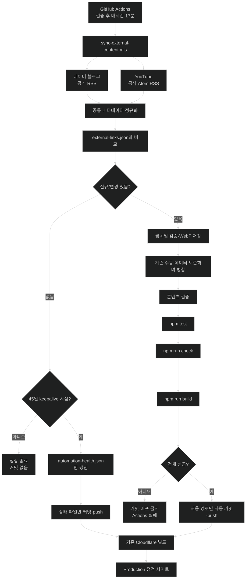
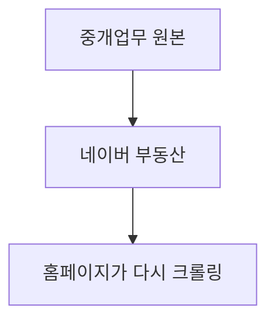
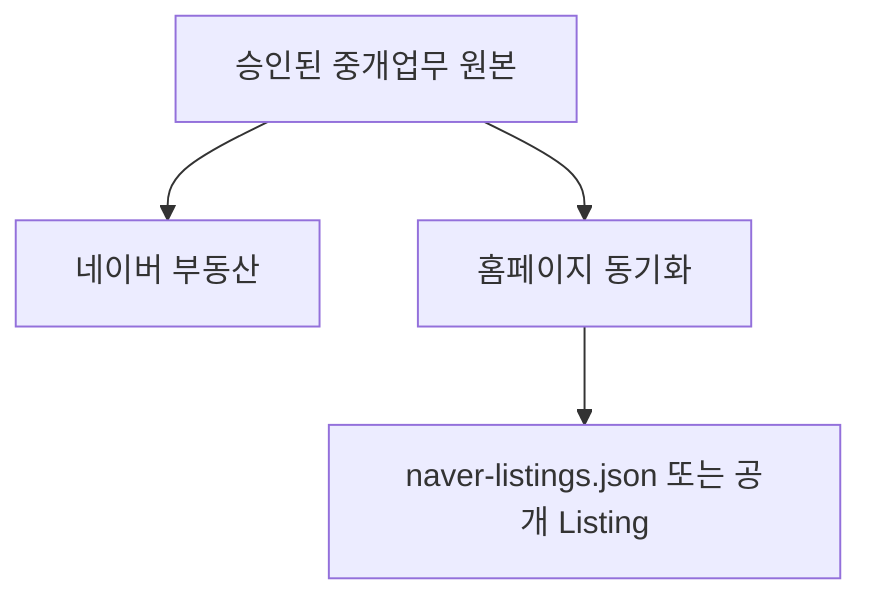

# 리더스시티 행복한부동산 외부 콘텐츠 자동 동기화 개선안

> 문서 목적: 네이버 블로그·YouTube·네이버 공개 매물의 홈페이지 갱신 작업을 자동화하되, 현재 Astro + GitHub + Cloudflare 구조와 공개 콘텐츠 검증 원칙을 유지하는 구현 기준과 Codex 작업 프롬프트를 정의한다.

| 항목 | 내용 |
|---|---|
| 대상 저장소 | `myoungsuk/real-estate-website` |
| 기준 브랜치 | `master` |
| 기준 커밋 | `28f55961a95c1d712cd0772ae94a77a3220e0837` (`origin/master`, 2026-08-26 확인) |
| 기준일 | 2026-08-26 |
| 권장 구현 우선순위 | 1) 네이버 블로그 2) YouTube 3) 네이버 매물 원본 연동 |
| 초기 실행 방식 | 1차 커밋은 `workflow_dispatch`만 제공하고 수동 검증 전에는 예약 실행을 넣지 않음 |
| 검증 후 실행 주기 | 매시간 17분, `cron: "17 * * * *"` |
| 게시 정책 | 공식 블로그·YouTube 신규 항목을 `published`로 자동 추가 |
| 반영 정책 | 검증 성공 시 `master` 직접 push |
| 장기 유지 | 신규 콘텐츠가 없어도 45일마다 `.github/automation-health.json` 갱신 커밋 |
| 기본 배포 방식 | GitHub Actions가 JSON/썸네일 갱신 → 검증 → 커밋/푸시 → 기존 Cloudflare 빌드/배포 |
| 핵심 원칙 | 공개 승인 정보만 저장, 실패 시 배포 금지, 중복/덮어쓰기 방지, 비공식 네이버 부동산 크롤링 금지 |

---

## 1. 핵심 결론

현재 사이트는 외부 콘텐츠 자동화를 위해 새 DB나 별도 서버를 도입할 필요가 없다.

현재 구조를 유지하면서 다음 흐름을 추가하는 것이 가장 적합하다.

1. 1차 도입에서는 `workflow_dispatch`로만 수동 실행한다.
2. 실제 신규 콘텐츠 1건의 수집·검증·커밋·Cloudflare Production 배포까지 확인한다.
3. 검증 완료 후 별도 2차 커밋으로 매시간 17분 예약 실행을 활성화한다.
4. 네이버 RSS에 노출되는 공식 블로그 글과 공식 YouTube 채널의 공개 영상을 조회한다.
5. 기존 `src/data/external-links.json`과 비교하여 신규 항목만 `published`로 병합한다.
6. 필요한 경우 공개용 썸네일을 검증·최적화하여 `public/images/...`에 저장한다.
7. `npm test`, `npm run check`, `npm run build`를 같은 동기화 워크플로 안에서 통과시킨다.
8. 콘텐츠 변경이 있을 때는 허용 경로만 `master`에 커밋·푸시한다.
9. 콘텐츠 변경이 없어도 마지막 keepalive로부터 45일이 지났으면 상태 파일만 커밋한다.
10. 기존 Cloudflare Git 연결이 `master`의 새 커밋을 Production에 배포한다.

네이버 공개 매물은 `src/data/naver-listings.json`이 이미 존재하지만, 네이버 부동산 화면 또는 비공개 내부 API를 크롤링해 자동 갱신하는 방식은 구현하지 않는다.

**네이버 매물 자동 동기화는 중개업무 프로그램·승인 CSV·공식 API 등 운영자가 사용할 권한이 확인된 원본 데이터 경로가 확보된 뒤 별도 단계로 진행한다.**

---

## 2. 2026-08-26 저장소 확인 결과

원격 `master`의 `28f55961a95c1d712cd0772ae94a77a3220e0837` 기준으로 확인된 중요 사항은 다음과 같다.

검토 당시 작업 브랜치는 `admin-storage-test`이며 이 개선안은 Git 미추적 상태였다. 따라서 구현자는 문서의 날짜 표현만 믿지 말고 작업 시작 시 원격 `master` SHA와 실제 코드 차이를 다시 확인한다.

### 2.1 현재 아키텍처

- Astro 정적 사이트 생성
- GitHub 공개 콘텐츠 저장
- Cloudflare Workers Static Assets 배포
- `/api/admin/*` 관리 API와 Cloudflare Access 기반 관리자 기능 존재
- 공개 페이지는 정적 파일 중심
- 관리자 콘텐츠 저장은 GitHub JSON/WebP 파일에 반영
- DB는 현재 사용하지 않음

즉, 자동 동기화도 **GitHub 저장소를 공개 콘텐츠의 단일 기준 저장소로 유지**해야 한다.

### 2.2 현재 외부 콘텐츠 데이터

`src/data/external-links.json`

현재 주요 필드:

```json
{
  "id": "naver-blog-224382351730",
  "type": "blog",
  "status": "published",
  "title": "...",
  "summary": "...",
  "url": "...",
  "publishedAt": "2026-08-18",
  "thumbnail": {
    "src": "/images/blog/224382351730.webp",
    "alt": "..."
  }
}
```

지원 종류:

- `blog`
- `youtube`

지원 상태:

- `draft`
- `published`

기존 ID 규칙을 유지한다.

```text
네이버 블로그: naver-blog-{logNo}
YouTube:       youtube-{videoId를 kebab-case에 맞게 정규화한 값}
```

단, YouTube videoId에는 `_`, 대문자 등이 포함될 수 있으므로 **현재 실제 ID 생성 규칙을 `src/lib`, 테스트, 기존 데이터에서 먼저 확인한 뒤 그대로 재사용**한다. 새로운 ID 규칙을 임의로 도입하지 않는다.

### 2.3 현재 네이버 공개 매물 데이터

`src/data/naver-listings.json`

현재 형태:

```json
{
  "checkedAt": "2026-08-25",
  "items": [
    {
      "id": "2645736151",
      "title": "...",
      "propertyType": "아파트",
      "tradeType": "sale",
      "priceLabel": "2억 6,000",
      "areaLabel": "...",
      "floorLabel": "...",
      "direction": "남향",
      "summary": "...",
      "confirmedAt": "2026-08-25",
      "source": "네이버페이 부동산",
      "url": "https://fin.land.naver.com/articles/2645736151"
    }
  ]
}
```

현재 검증기는 다음을 강제한다.

- 숫자 매물번호
- 중복 ID 금지
- 거래유형 검증
- 확인일 검증
- `source === "네이버페이 부동산"`
- URL이 정확히 `https://fin.land.naver.com/articles/{매물번호}` 형식인지 검증

따라서 매물 자동화는 기존 스키마와 검증을 우회하지 말아야 한다.

### 2.4 현재 CI

`.github/workflows/ci.yml`

현재 CI는:

- PR
- `master` push

에서 실행되며 다음을 수행한다.

```text
npm ci
npm test
npm run build
```

현재 CI의 GitHub 권한은:

```yaml
permissions:
  contents: read
```

따라서 외부 콘텐츠 자동 동기화는 기존 CI를 억지로 변경하지 말고 **별도의 `sync-external-content.yml` 워크플로**로 만드는 것을 권장한다.

### 2.5 기존 자산 가져오기 스크립트

`scripts/import-content-assets.mjs`에 기존 블로그·YouTube 썸네일 다운로드 로직이 존재한다.

현재 코드에서 `sharp`를 import하고 있으나 `package.json`의 직접 dependency/devDependency에는 `sharp`가 명시되어 있지 않다.

이 스크립트를 자동 동기화에 재사용하려면 Codex가 다음을 반드시 확인해야 한다.

1. `npm ci` 후 직접 실행 가능한가
2. transitive dependency에 우연히 의존하고 있지는 않은가
3. 계속 사용할 경우 `sharp`를 직접 의존성으로 명시해야 하는가
4. 기존 일회성 하드코딩 목록과 신규 동기화 책임을 분리할 것인가

**단순히 기존 파일에 신규 URL을 계속 하드코딩하는 방식은 자동화로 보지 않는다.**

---

## 3. 목표와 비목표

### 3.1 목표

#### Phase 1

- 네이버 RSS에 노출되는 공식 블로그의 새 공개 글 자동 감지
- 공식 YouTube 채널의 새 공개 영상 자동 감지
- `external-links.json` 중복 없이 자동 병합
- 공개용 썸네일 자동 준비
- 기존 수동 편집 데이터 보존
- 자동 검증 후 성공한 변경만 커밋
- 공식 외부 콘텐츠는 신규 항목을 `published`로 자동 추가
- 콘텐츠 변경이 없으면 45일 keepalive 시점 전까지 커밋하지 않음
- 45일마다 자동화 상태 파일을 갱신해 예약 워크플로 활동을 유지
- 수동 실행 지원
- 장애 원인을 GitHub Actions 로그에서 확인 가능하게 함

#### Phase 2

- 네이버 매물의 **승인된 원본 데이터 경로**가 확보되면 `naver-listings.json` 자동 스냅샷 갱신
- 신규·변경·종료 매물 차이 감지
- 운영자 승인 정책에 맞는 공개 상태 반영

### 3.2 비목표

다음은 이번 작업에서 하지 않는다.

- 네이버 부동산 HTML 크롤링
- 네이버 부동산의 비공개/내부 API 역공학
- 브라우저 자동화로 로그인 세션을 우회하는 수집
- CAPTCHA 또는 접근 제한 우회
- 블로그 본문 전체 복제
- YouTube 영상 파일 복제
- AI가 자동으로 부동산 사실을 만들어 공개
- DB 추가
- 별도 백엔드 서버 추가
- 기존 Astro 구조 교체
- 기존 관리자 인증 구조 교체

---

## 4. 권장 전체 구조



---

## 5. 실행 주기

예약 활성화 후 권장 실행 주기:

```yaml
on:
  schedule:
    - cron: "17 * * * *"
  workflow_dispatch:
```

### 왜 매시간 17분인가

공식 채널에 새 글이나 영상이 등록된 뒤 대체로 1시간 안에 홈페이지에 반영할 수 있다. 정각은 예약 작업이 몰려 지연될 수 있으므로 17분처럼 정각을 피한다.

매시간 실행에서는 어느 시간대를 기준으로 해도 결과가 같으므로 `timezone`은 생략한다. GitHub Actions가 IANA timezone을 지원한다는 점과 별개로 이 cron에는 시간대가 필요하지 않다.

공개 저장소의 표준 GitHub-hosted runner는 현재 무료이며, 매시간 네이버 RSS와 YouTube Atom RSS를 조회하는 수준은 현재 콘텐츠 발생량에 충분하다. YouTube RSS는 인증 없는 공개 피드이므로 API Key와 API 할당량 관리가 필요 없다. 다만 외부 HTTP 요청에는 timeout과 제한된 재시도를 적용한다.

또한 `workflow_dispatch`를 반드시 넣어 운영자가 즉시 재실행할 수 있게 한다.

GitHub 공식 문서 기준 예약 워크플로는:

- 기본 브랜치 최신 커밋에서 실행
- POSIX cron 사용
- timezone 지정 지원
- 정각 부근에는 지연되거나 드물게 작업이 누락될 수 있음

현재 기본 브랜치는 `master`이지만 워크플로에서 필요 이상으로 브랜치를 하드코딩하지 말고 현재 저장소 기준을 확인한다.

### 예약 활성화 순서

초기 배포와 예약 활성화는 반드시 분리한다.

```text
1차 커밋: workflow_dispatch만 포함
  ↓
공식 YouTube channelId·branch protection/ruleset 확인
  ↓
수동 실행에서 실제 신규 콘텐츠 1건 검증
  ↓
master 자동 커밋과 Cloudflare Production 배포 확인
  ↓
2차 커밋: schedule 추가
```

1차 코드에 비활성 schedule을 주석으로 남기지 않는다. 공식 채널 ID 확인과 수동 검증이 끝나기 전에 schedule부터 넣지 않는다.

---

## 6. 네이버 블로그 자동 동기화 설계

### 6.1 권장 소스

1순위:

```text
https://rss.blog.naver.com/{blogId}.xml
```

현재 공식 블로그 ID:

```text
p5468300
```

네이버 고객센터는 블로그 RSS 서비스를 공식적으로 안내하고 있으며 HTTPS 사용을 권장한다.

RSS 방식의 장점:

- 별도 API Secret 불필요
- 특정 블로그의 새 글을 직접 추적
- 검색 결과 순위나 검색 누락에 덜 의존
- 매시간 수집에도 별도 API Secret이 필요 없음

단, 자동 감지 목표는 **네이버 RSS에 노출되는 공식 블로그 신규 글**로 한정한다. 게시글이 전체 공개여도 `외부 보내기 허용`을 해제하면 RSS 리더기 목록에 노출되지 않는다.

2026-08-26에 공식 RSS를 다시 조회한 결과 `external-links.json`의 최신 항목과 일치했다.

| 공식 RSS `logNo` | 현재 사이트 ID |
|---|---|
| `224382351730` | `naver-blog-224382351730` |
| `224379338084` | `naver-blog-224379338084` |
| `224378379746` | `naver-blog-224378379746` |
| `224376152428` | `naver-blog-224376152428` |

향후 글을 발행할 때 `전체 공개`와 `외부 보내기 허용`을 유지하고, RSS 미노출 글은 `/admin/external-links/`에서 수동 등록한다.

#### RSS가 운영상 사용할 수 없을 때의 대안

네이버 Search API의 블로그 검색을 fallback 후보로 검토할 수 있다.

단, Search API는 본질적으로 **검색 결과 API**이므로 특정 블로그 전체 게시물을 완전한 원본 목록으로 보장하는 저장 API로 간주하면 안 된다.

따라서 Phase 1 기본 구현은 RSS를 우선한다.

### 6.2 수집 필드

RSS에서 최소 다음 값을 얻는다.

- 글 제목
- 원문 URL
- 게시 시각
- `logNo`
- 가능한 경우 대표 이미지 후보

저장 형태:

```json
{
  "id": "naver-blog-{logNo}",
  "type": "blog",
  "status": "published",
  "title": "{공식 글 제목}",
  "summary": "{안전한 기본 요약}",
  "url": "{공식 원문 URL}",
  "publishedAt": "YYYY-MM-DD",
  "thumbnail": {
    "src": "/images/blog/{logNo}.webp",
    "alt": "{제목} 블로그 글 썸네일"
  }
}
```

### 6.3 자동 summary 정책

AI API를 호출해 임의 요약문을 생성하지 않는다.

신규 자동 항목의 기본 summary는 결정론적으로 생성한다.

예:

```text
리더스시티행복한부동산 공식 블로그에서 “{제목}” 관련 내용을 확인해 보세요.
```

운영자가 관리자에서 이미 수정한 summary가 있으면 **향후 동기화가 덮어쓰지 않는다.**

### 6.4 기존 데이터 보존 규칙

기존 ID가 이미 존재하면:

- `summary` 수동 수정값 보존
- `thumbnail` 수동 교체값 보존
- `status` 수동 변경값 보존
- 원문 `title`, `url`, `publishedAt` 갱신 여부는 정책을 명확히 정한 뒤 처리

권장 정책:

```text
신규 ID       → 자동 추가
기존 ID       → 기본적으로 수정하지 않음
명백한 원문 URL 정규화 → 안전한 경우만 갱신
수동 필드     → 절대 자동 덮어쓰기 금지
```

초기 버전은 **append-only에 가깝게 구현**하는 것이 가장 안전하다.

---

## 7. YouTube 자동 동기화 설계

### 7.1 권장 소스

YouTube 공식 Atom RSS 사용.

기본 흐름:

```text
운영자가 승인한 channelId
  ↓
https://www.youtube.com/feeds/videos.xml?channel_id={YOUTUBE_CHANNEL_ID}
  ↓
Atom entry 파싱
  ↓
공식 채널의 최근 업로드 감지
```

공식 피드에서 다음 값을 사용한다.

- `<yt:videoId>`
- `<yt:channelId>`
- `<title>`
- `<link rel="alternate">`의 영상 URL
- `<published>` 게시 시각
- `<updated>` 갱신 시각
- 피드에 포함된 경우 `<media:thumbnail>`의 공식 HTTPS 썸네일 URL

홈페이지 `publishedAt`에는 `<published>`를 사용한다. `<updated>`만 바뀐 같은 `videoId`는 신규 영상으로 추가하지 않으며, 기존 수동 수정값도 덮어쓰지 않는다.

Atom RSS는 최근 항목 감지용이므로 전체 과거 영상 backfill 원본으로 사용하지 않는다. 현재 저장된 40개 항목은 그대로 보존하고, 피드에서 사라진 기존 항목도 자동 삭제하지 않는다.

#### 설정값

필요한 공개 설정값:

```text
YOUTUBE_CHANNEL_ID
```

channelId는 비밀정보가 아니므로 GitHub Actions Secret이 아니라 Repository Variable 또는 코드의 공개 설정값으로 관리한다. 환경변수를 사용하면 `.env.example`에는 `YOUTUBE_CHANNEL_ID=`만 기록할 수 있다. 현재 목적에는 `YOUTUBE_API_KEY`를 만들거나 저장하지 않는다.

### 7.2 채널 고정 검증

채널명을 검색해서 매번 찾는 방식보다 **운영자가 승인한 channelId를 설정으로 고정**하는 것이 안전하다.

공식 채널 페이지와 Atom 피드를 2026-08-26에 교차 확인한 승인 channelId는 `UCuOZDnM5vxOZELDgu-y-hNg`다. 자동화에서는 이 값을 `YOUTUBE_CHANNEL_ID` Repository Variable로 등록하고 요청 URL·채널 링크·각 entry의 `<yt:channelId>`를 다시 검증한다.

각 항목은 다음을 모두 만족해야 한다.

- 요청에 사용한 channelId와 `<yt:channelId>`가 승인된 channelId와 일치
- `<yt:videoId>`가 비어 있지 않고 YouTube videoId 형식에 맞음
- `<link rel="alternate">`가 허용된 YouTube HTTPS 개별 영상 URL(`/watch?v=`, `/shorts/`, `/live/`)임
- `<yt:videoId>`와 영상 URL에서 추출한 원본 videoId가 일치
- alternate URL이 `/shorts/`이면 `youtubeFormat: short`, `/watch` 또는 `/live`이면 `youtubeFormat: video`로 분류
- `<published>`가 유효한 ISO 8601 시각

RSS에는 Data API의 `status.privacyStatus` 필드가 없으므로 공개 상태를 API로 검증했다고 표현하지 않는다. 공식 채널 피드에 반환된 항목만 신규 후보로 취급하고, 누락·삭제·비공개 전환을 이유로 기존 데이터를 자동 삭제하지 않는다.

### 7.3 저장 정책

```json
{
  "id": "youtube-{stable-id}",
  "type": "youtube",
  "youtubeFormat": "video 또는 short",
  "status": "published",
  "title": "{YouTube 공식 제목}",
  "summary": "공식 YouTube 채널에서 “{제목}” 영상 또는 Shorts를 확인해 보세요.",
  "url": "https://www.youtube.com/watch?v={videoId}",
  "publishedAt": "YYYY-MM-DD",
  "thumbnail": {
    "src": "/images/youtube/{videoId}.webp",
    "alt": "{제목} 유튜브 영상 썸네일"
  }
}
```

기존 데이터의 ID 생성 규칙을 먼저 확인하고, 현재 URL/ID 호환성을 깨지 않는다.

현재 40개 YouTube 항목은 운영자 확인에 따라 모두 `youtubeFormat: video`로 명시했고, 원본 `videoId`를 소문자 kebab-case로 정규화한 ID와 일치한다. 신규 항목은 Atom alternate URL을 기준으로 일반 영상과 Shorts를 분류한다. 그러나 `_`, `-`, 대문자 정규화 과정에서 서로 다른 원본 ID가 같은 내부 ID가 될 수 있으므로 다음 충돌 검사를 추가한다.

```text
생성한 내부 ID가 없음
→ 신규 항목 추가

생성한 내부 ID가 이미 있음 + 기존 URL의 원본 videoId도 같음
→ 기존 항목 보존

생성한 내부 ID가 이미 있음 + 기존 URL의 원본 videoId가 다름
→ 충돌 오류로 전체 동기화 중단
```

원본 `videoId`는 새 스키마 필드로 임의 추가하지 않고 공식 영상 URL에서 추출해 비교한다. 신규 항목은 공식 watch URL로 정규화해 저장하되 원래 alternate URL에서 판별한 `youtubeFormat`은 보존한다. `youtubeFormat` 스키마는 핵심 문서·검증기·관리자 편집 화면과 함께 관리한다.

---

## 8. 썸네일 자동화

현재 프로젝트는 외부 썸네일 URL을 화면에서 직접 hotlink하는 것보다 공개용 WebP를 저장하는 방향을 사용하고 있다.

자동 동기화도 이 원칙을 유지한다.

### 8.1 다운로드 검증

다운로드 전/후 최소 검증:

- 허용 호스트 확인
- HTTPS만 허용
- 응답 상태 2xx
- `Content-Type`이 이미지인지 확인
- 최대 바이트 제한
- 이미지 디코딩 가능 여부 확인
- 과도한 해상도 방지
- 출력 파일명에 사용자 정보 금지
- EXIF/GPS가 결과 WebP에 남지 않도록 재인코딩

### 8.2 권장 출력

```text
public/images/blog/{logNo}.webp
public/images/youtube/{videoId}.webp
```

권장 크기:

```text
960 × 540 범위
WebP
```

정확한 품질 값은 기존 디자인과 자산 용량을 확인하여 결정한다.

### 8.3 실패 정책

실패 범위를 구분한다.

- 썸네일 조회·다운로드·디코딩·재인코딩만 실패: Actions summary에 경고를 남기고 `thumbnail: null`로 메타데이터를 추가한다.
- 출처 위조, 허용 호스트 불일치, 공식 채널 불일치, ID 충돌, 데이터 파싱 실패: 전체 동기화를 실패시키고 파일을 반영하지 않는다.
- JSON 검증, 테스트, 빌드 실패: 커밋·push를 금지한다.

현재 `ExternalContentList.astro`, `src/lib/content.ts`, `content-validation.mjs`는 `thumbnail: null`과 fallback 카드를 지원한다. 자동화 테스트에도 이 경로를 고정한다.

---

## 9. 동기화 알고리즘

핵심은 **idempotent**해야 한다는 것이다.

같은 작업을 여러 번 실행해도 결과가 같아야 한다.

의사 코드:

```text
load current external-links.json

fetch blog feed
fetch youtube uploads

normalize source items

for each source item:
    validate source URL/domain/id/date

    if current item with same id exists:
        if source is youtube and URL videoId differs:
            fail with normalized ID collision
        preserve current item
        continue

    create safe default item
    try download/prepare thumbnail when allowed
    if thumbnail-only failure:
        warn and set thumbnail to null
    append item

sort items using existing project ordering policy

validate entire dataset

if generated content == current content:
    if last keepalive < 45 days:
        exit 0 without git commit
    else:
        update only .github/automation-health.json

write files atomically
run project validation/tests/build

if all successful:
    commit
else:
    do not push
```

---

## 10. 원자성 및 장애 처리

예약 동기화에서 가장 위험한 상황은 "절반만 갱신된 데이터"다.

따라서 다음 순서를 지킨다.

```text
외부 조회
  ↓
메모리에서 정규화/병합
  ↓
임시 파일 생성
  ↓
검증
  ↓
최종 파일 교체
  ↓
프로젝트 테스트/빌드
  ↓
Git commit/push
```

다음 상황에서는 기존 공개 데이터가 그대로 유지되어야 한다.

- 네이버 RSS 응답 오류
- YouTube Atom RSS 응답·XML 파싱 오류
- JSON 파싱 오류
- 예상하지 못한 데이터 형식
- 출처·호스트·승인 채널 불일치
- 정규화된 YouTube ID 충돌
- validation 실패
- test 실패
- build 실패

썸네일만 허용 형식이 아니거나 다운로드·디코딩에 실패한 경우에는 전체 동기화를 중단하지 않고 경고 후 `thumbnail: null`로 추가한다. 메타데이터 출처 검증 실패와 썸네일 실패를 같은 오류로 처리하지 않는다.

### 재시도

일시적 HTTP 장애에만 제한적으로 사용한다.

권장:

```text
최대 3회
지수 backoff
HTTP 429/5xx 중심
```

잘못된 데이터나 인증 오류는 반복 재시도하지 말고 즉시 실패시킨다.

---

## 11. GitHub Actions 설계

신규 파일 권장:

```text
.github/workflows/sync-external-content.yml
```

개념 예시:

```yaml
name: Sync external content

on:
  workflow_dispatch:

permissions:
  contents: write

concurrency:
  group: external-content-sync
  cancel-in-progress: false

jobs:
  sync:
    runs-on: ubuntu-latest
    timeout-minutes: 15

    steps:
      - uses: actions/checkout@v4

      - uses: actions/setup-node@v4
        with:
          node-version: 24
          cache: npm

      - run: npm ci

      - name: Sync external content
        env:
          YOUTUBE_CHANNEL_ID: ${{ vars.YOUTUBE_CHANNEL_ID }}
        run: npm run sync:external

      - run: npm test
      - run: npm run check
      - run: npm run build

      - name: Commit changed content
        # 실제 구현에서는 git diff 확인 후 변경이 있을 때만 수행
        run: |
          ...
```

위 예시는 **1차 배포용**이다. 수동 실행과 Production 배포가 확인된 뒤 별도 2차 커밋에서만 다음을 추가한다.

```yaml
on:
  schedule:
    - cron: "17 * * * *"
  workflow_dispatch:
```

### 보안상 중요한 점

기존 `ci.yml`의 `contents: read`는 유지한다.

쓰기 권한은 외부 콘텐츠 동기화 워크플로에만 최소 범위로 준다.

자동 커밋 메시지 예:

```text
chore(content): sync external content
```

가능하면 커밋 본문 또는 Actions summary에 다음을 남긴다.

```text
blog: +N
youtube: +N
assets: +N
```

콘텐츠 커밋은 `git add -A`를 사용하지 않고 다음 경로만 명시적으로 stage한다.

```bash
git add -- src/data/external-links.json public/images/blog/ public/images/youtube/
```

stage 전후에 예상하지 않은 변경 경로가 하나라도 있으면 커밋하지 않고 실패시킨다. GitHub Actions의 새 checkout을 전제로 하더라도 allowlist 검사를 생략하지 않는다.

keepalive 커밋은 다음 파일만 stage한다.

```bash
git add -- .github/automation-health.json
git commit -m "chore(automation): refresh scheduler activity"
```

`GITHUB_TOKEN`으로 push한 커밋은 일반적인 `push` 이벤트 기반 GitHub Actions 워크플로를 다시 실행하지 않는다. 따라서 기존 `ci.yml`이 자동 커밋을 별도로 검증한다고 가정하지 않고, 동기화 워크플로 자체에서 `npm test`, `npm run check`, `npm run build`를 모두 실행한다.

반면 Cloudflare Workers Builds의 Git 연결은 Production 브랜치 push를 빌드·배포 대상으로 처리한다. 첫 수동 실행의 완료 조건에 Cloudflare 새 빌드와 Production 반영 확인을 포함한다.

### 11.1 45일 keepalive

공개 저장소의 예약 워크플로는 저장소 활동이 60일 동안 없으면 자동 비활성화될 수 있다. 이를 예방하기 위해 다음 파일을 둔다.

`.github/automation-health.json`

```json
{
  "lastKeepaliveAt": "2026-08-26"
}
```

동작 규칙:

```text
신규 콘텐츠 있음
→ 콘텐츠 경로만 검증·커밋

신규 콘텐츠 없음 + lastKeepaliveAt으로부터 45일 미만
→ 변경 없이 정상 종료

신규 콘텐츠 없음 + lastKeepaliveAt으로부터 45일 이상
→ automation-health.json 날짜만 갱신·커밋
```

이 파일은 공개 콘텐츠나 화면 동작에 영향을 주지 않는 자동화 상태 기록이다. 약 45일마다 최대 1회 커밋과 Cloudflare 빌드가 추가될 수 있다. 월 1회 Actions 화면에서 예약 실행 상태도 확인한다.

---

## 12. package.json 권장 명령

예:

```json
{
  "scripts": {
    "sync:external": "node scripts/sync-external-content.mjs",
    "sync:external:dry-run": "node scripts/sync-external-content.mjs --dry-run"
  }
}
```

### `--dry-run`은 필수에 가깝게 권장

dry-run에서는:

- 외부 API/RSS 조회
- 신규 항목 비교
- 스키마 검증
- 추가 예정 항목 출력

까지만 수행하고 실제 JSON/이미지/commit은 수정하지 않는다.

운영자가 처음 연결할 때 매우 유용하다.

---

## 13. 권장 파일 구조

```text
scripts/
├─ sync-external-content.mjs
├─ sync/
│  ├─ naver-blog.mjs
│  ├─ youtube.mjs
│  ├─ normalize.mjs
│  ├─ thumbnail.mjs
│  └─ external-content-store.mjs
├─ content-validation.mjs
└─ validate-content.mjs

tests/
├─ external-content-sync.test.mjs
└─ ...

.github/workflows/
├─ ci.yml
└─ sync-external-content.yml
```

단, 현재 프로젝트 규모에서 모듈을 쪼개는 것이 과하면 `sync-external-content.mjs`와 소수 helper 파일만 사용한다.

**구조 자체보다 테스트 가능성과 책임 분리가 목적이다.**

---

## 14. 테스트 요구사항

최소 테스트:

### 블로그

- 새 `logNo` 추가
- 동일 `logNo` 중복 추가 금지
- 잘못된 블로그 ID/호스트 거부
- 비공개/비정상 RSS 항목 처리
- 기존 수동 summary 보존
- 날짜 변환 검증

### YouTube

- 새 videoId 추가
- 동일 videoId 중복 금지
- 승인 channelId가 아닌 데이터 거부
- Atom `<published>` 날짜 변환 검증
- `<yt:videoId>`와 alternate 영상 URL 불일치 거부
- 같은 videoId의 `<updated>` 변경을 신규 항목으로 추가하지 않음
- 필수 Atom 필드 누락·XML 파싱 오류 거부
- 삭제/비공개 영상 때문에 기존 데이터를 무조건 삭제하지 않음
- 기존 수동 summary/status/thumbnail 보존

### 썸네일

- 허용 호스트만 다운로드
- 이미지가 아닌 응답 거부
- 최대 크기 초과 거부
- 파일명 정규화
- 같은 파일 재다운로드 방지

### 전체

- 신규 없음 → JSON diff 없음
- 한 번 실행 후 재실행 → diff 없음
- validation 실패 → 파일 반영 안 함
- 테스트 실패 → push 단계 미진입
- dry-run → 작업트리 변경 없음
- YouTube 내부 ID가 같고 원본 videoId가 다름 → 충돌 오류로 중단
- 썸네일만 실패 → `thumbnail: null` 추가 및 경고
- 공식 YouTube 피드에 없는 항목 또는 승인 채널 불일치 → 추가 금지
- 45일 미만 무변경 → keepalive diff 없음
- 45일 이상 무변경 → 상태 파일만 변경
- 콘텐츠 커밋 stage 경로가 JSON·블로그·YouTube 이미지로 제한됨
- keepalive 커밋 stage 경로가 상태 파일 하나로 제한됨

---

## 15. 네이버 공개 매물 자동화

### 15.1 현재 판단

**불확실한 사실:** 2026-08-26 현재 NAVER Developers의 일반 공개 Search API 문서에서 네이버페이 부동산 중개 매물을 조회하는 공개 API는 확인되지 않았다.

"공개 API가 절대로 존재하지 않는다"라고 단정하지 않는다. 제휴사·중개업무 프로그램·별도 계약 API가 존재할 가능성은 별도로 확인해야 한다.

따라서 현재는 다음을 금지한다.

```text
new.land / fin.land 화면 크롤링
브라우저 세션 자동화
내부 API 호출 패턴 복제
접근 제한 우회
```

### 15.2 권장 데이터 흐름

잘못된 방향:



권장 방향:



### 15.3 Phase 2 시작 조건

다음 중 하나가 확인될 때만 구현한다.

- 사용하는 중개업무 프로그램이 CSV/API/공식 export 제공
- 네이버/제휴사가 허용한 공식 데이터 API 제공
- 운영자가 소유·관리하는 원본 JSON/CSV 존재
- 사용 약관상 자동 연동이 명확히 허용된 데이터 경로 존재

그전에는 설계 문서만 유지한다.

### 15.4 향후 매물 diff 정책

원본 데이터가 확보되면:

```text
신규 ID
→ 신규 공개 후보

기존 ID + 값 변경
→ 가격/확인일 등 허용 필드 갱신 후보

기존에는 있었지만 원본에서 사라짐
→ 즉시 삭제하지 않음
→ ended/확인 필요 정책 적용
```

매물은 법정 표시사항과 정확성이 중요하므로 블로그·YouTube보다 보수적으로 처리한다.

---

## 16. 운영자 알림

초기 버전에서 별도 Slack/메일 시스템을 추가할 필요는 없다.

GitHub Actions의 성공/실패 기록과 Actions summary를 우선 사용한다.

향후 실제 운영에서 실패를 놓치는 문제가 반복될 때:

- GitHub 기본 알림
- 운영 이메일
- 기타 승인 채널

연결을 검토한다.

알림 때문에 새로운 서버나 DB를 먼저 도입하지 않는다.

---

## 17. 보안·개인정보·저작권

자동 수집 코드에서도 현재 공개 경계를 그대로 적용한다.

금지:

- 고객 연락처
- 상담 내용
- 소유자/임대인/임차인
- 공개되지 않은 정확한 호수
- 내부 메모
- API Secret
- GitHub Token
- 원본 사진의 GPS/EXIF

Secret은 GitHub Actions Secrets 또는 현재 승인된 배포 Secret으로 관리한다.

외부 콘텐츠는 원문 전체를 복제하지 않는다.

홈페이지에는:

- 제목
- 짧은 안전한 요약
- 게시일
- 승인된 썸네일
- 원문 링크

만 저장한다.

---

## 18. 성능·운영 trade-off

### 매시간 GitHub Actions

장점:

- 서버 불필요
- 비용 최소
- Git history가 변경 이력
- 장애 범위 작음
- 현재 정적 사이트 구조 유지
- 신규 콘텐츠를 대체로 1시간 안에 반영

단점:

- 실시간 반영 아님
- GitHub Actions 장애나 정각 부하 시 실행이 지연될 수 있음
- 이미지가 계속 쌓이면 저장소 용량 증가
- 공개 저장소가 60일 무활동이면 예약 실행이 비활성화될 수 있음

현재 콘텐츠 규모에서는 인증 없는 RSS를 매시간 확인하는 부담이 작다. 45일 keepalive와 월 1회 상태 확인으로 장기 중단 위험을 관리한다.

### 실시간 webhook/API 방식

현재는 도입하지 않는다.

이유:

- 별도 endpoint
- 인증
- 장애 대응
- 외부 서비스 webhook 지원 여부
- 보안
- 운영 복잡성

이 증가한다.

새 글을 수분 내 반영해야 하는 요구가 생기기 전에는 매시간 batch가 적합하다.

---

## 19. 구현 단계

### Step 0. 사전 확인

Codex가 먼저 확인:

- 최신 default branch
- 최신 commit
- `CODEX.md`
- 핵심 기획/설계/체크리스트
- `external-links.json`
- `naver-listings.json`
- `content-validation.mjs`
- `src/lib` 외부 콘텐츠 처리
- `/blog/`, `/youtube/`
- 관리자 외부 링크 편집 코드
- Worker 허용 파일 목록
- CI
- Cloudflare 배포 방식

### Step 1. dry-run 동기화 구현

먼저 실제 파일을 변경하지 않는:

```text
npm run sync:external:dry-run
```

을 구현한다.

확인 결과:

```text
Blog new: 1
YouTube new: 0
Would add assets: 1
No files changed
```

와 같이 나오게 한다.

### Step 2. 로컬 파일 갱신

dry-run 테스트 후:

```text
npm run sync:external
```

에서 JSON과 썸네일을 안전하게 갱신한다.

아직 GitHub Actions 자동 push는 붙이지 않는다.

### Step 3. 테스트/검증

```bash
npm ci
npm test
npm run check
npm run build
```

통과 확인.

### Step 4. 1차 배포: GitHub Actions 수동 실행

1차 커밋에는 `workflow_dispatch`만 넣고 사람이 실행한다.

실제 신규 콘텐츠 0건/1건 상황, `published` 자동 추가, 제한된 stage 경로, `master` push를 확인한다. 자동 커밋 이후 기존 `ci.yml`은 실행되지 않으므로 동기화 워크플로 자체의 검사 로그와 Cloudflare 새 Production 빌드·운영 반영까지 확인한다.

### Step 5. 2차 배포: schedule 활성화

수동 검증과 Cloudflare 반영이 끝난 뒤 별도 커밋으로 매시간 17분 schedule을 활성화한다.

### Step 6. 45일 keepalive 검증

시간을 주입할 수 있는 테스트로 45일 경계를 검증하고 실제 워크플로에서는 `.github/automation-health.json`만 별도 커밋되는지 확인한다.

### Step 7. 네이버 매물 원본 경로 조사

블로그/YouTube 자동화와 분리해서 진행한다.

---

## 20. 완료 조건

다음을 모두 만족해야 완료다.

- [ ] 현재 스키마와 URL을 깨지 않음
- [ ] 신규 블로그 글을 중복 없이 감지
- [ ] RSS에 없는 블로그 글은 자동 감지 대상이 아니며 수동 등록 절차가 기록됨
- [ ] 신규 YouTube 영상을 중복 없이 감지
- [ ] YouTube 게시 시각은 Atom `<published>`를 사용
- [ ] 승인 채널·Atom 필수 필드·영상 URL·원본 videoId 충돌 검사 통과
- [ ] 수동으로 수정한 기존 콘텐츠를 덮어쓰지 않음
- [ ] `--dry-run`이 작업트리를 변경하지 않음
- [ ] 신규 항목이 없을 때 45일 전에는 commit을 만들지 않음
- [ ] 45일이 지나면 상태 파일만 keepalive commit
- [ ] 실패 시 JSON/이미지를 부분 반영하지 않음
- [ ] 썸네일만 실패하면 경고 후 `thumbnail: null`로 추가
- [ ] 인증정보가 저장소/로그에 노출되지 않고 channelId를 Secret으로 잘못 취급하지 않음
- [ ] 콘텐츠와 keepalive 커밋이 각각 허용 경로만 stage함
- [ ] `npm test` 통과
- [ ] `npm run check` 통과
- [ ] `npm run build` 통과
- [ ] 필요 시 `npx wrangler deploy --dry-run` 결과 확인
- [ ] 1차 커밋은 `workflow_dispatch`만 포함
- [ ] 수동 실행에서 실제 신규 콘텐츠 1건과 Cloudflare Production 반영 확인
- [ ] 2차 별도 커밋으로 `17 * * * *` schedule 활성화
- [ ] `GITHUB_TOKEN` 자동 push가 `ci.yml`을 재실행하지 않는 운영 특성 기록
- [ ] 월 1회 Actions 예약 활성 상태 점검 절차 기록
- [ ] 핵심 설계/기획/체크리스트 문서 동기화
- [ ] 운영 문서에 수동 실행·실패 확인·`YOUTUBE_CHANNEL_ID` 설정 절차 기록
- [ ] 네이버 부동산 비공식 크롤링이 추가되지 않음

---

## 21. Codex 구현 프롬프트

실행용 프롬프트는 중복 수정을 방지하기 위해 별도 문서로 분리했다.

- 1차: `workflow_dispatch` 전용 구현·수동 검증
- 2차: 검증 완료 후 매시간 17분 schedule 활성화
- 3차: 승인된 네이버 매물 원본 경로 확보 후 별도 검토

사용 파일: `docs/외부 콘텐츠 자동 동기화 구현 프롬프트.md`

설계·정책·완료 조건은 현재 개선안을 기준으로 하고, 구현 프롬프트는 설계를 반복하지 않고 이 문서를 참조한다.

---

## 22. 운영자가 준비할 항목

운영자가 확정한 정책과 구현 전에 준비할 값:

```text
[확정]
- 신규 공식 블로그/YouTube 항목: published 자동 추가
- 반영 방식: 검증 성공 시 master 직접 push
- 예약 주기: 수동 검증 후 매시간 17분
- 장기 유지: 45일 automation-health.json keepalive

[구현 전 필수]
- 공식 네이버 블로그 ID: p5468300 재확인
- 공식 YouTube channelId `UCuOZDnM5vxOZELDgu-y-hNg` 재확인
- GitHub Actions Repository Variable: YOUTUBE_CHANNEL_ID 등록(Secret 아님)
- 저장소 Actions의 `GITHUB_TOKEN` workflow write 권한 허용 여부
- GitHub Actions의 master push가 branch protection/ruleset과 충돌하지 않는지 확인

[구현 범위]
- 공식 썸네일 자동 저장 허용
- 썸네일 단독 실패 시 thumbnail: null 허용
```

### 게시 정책 확정 근거

블로그·YouTube는 **운영자가 직접 운영하는 공식 채널의 이미 공개된 글/영상에 대한 링크 메타데이터**이므로 자동 `published`를 허용한다.

단, 외부에서 가져온 사실을 AI가 재작성해서 새 부동산 주장으로 만드는 것은 금지한다.

---

## 23. 직접 push와 PR 방식 비교

### A. 자동으로 master 직접 push

장점:

- 가장 단순
- 바로 Cloudflare 배포
- 사람이 할 일이 거의 없음

단점:

- 잘못된 외부 메타데이터가 검증을 통과하면 곧바로 공개됨

블로그/YouTube 메타데이터만 대상으로 하고 테스트가 충분하면 현실적인 선택이다.

### B. 자동 branch + PR

장점:

- 사람이 최종 diff 확인
- 운영 안전성 높음

단점:

- 신규 콘텐츠가 생길 때마다 승인해야 하므로 "완전 자동화" 효과가 감소

### 확정

```text
블로그/YouTube → 검증 성공 시 master 직접 push
네이버 매물   → 원본 연동 방식 확정 후 별도 위험 평가
```

자동 push를 사용하더라도 GitHub branch protection/ruleset과 충돌하는지 Codex가 현재 저장소 설정을 확인해야 한다.

---

## 24. 향후 개선

실제 운영 후 다음 문제가 발생할 때만 추가 개선한다.

- 1시간 이내 반영도 너무 느림
- 외부 콘텐츠가 하루 수십 건 이상 증가
- Git 저장소 이미지 용량 증가가 부담
- 자동 동기화 실패를 운영자가 자주 놓침
- 여러 운영자가 동시에 콘텐츠 수정
- 매물 원본 API가 확보되어 실시간성이 중요해짐

그때 검토:

- 5분 이상 간격의 더 잦은 GitHub Actions
- R2 등 이미지 저장소
- webhook
- 승인 큐
- 동적 CMS/DB

현재 단계에서는 미리 도입하지 않는다.

---

## 25. 참고한 공식 자료

### GitHub Actions schedule

- https://docs.github.com/ko/actions/reference/workflows-and-actions/events-that-trigger-workflows
- https://docs.github.com/en/actions/reference/workflows-and-actions/workflow-syntax
- https://docs.github.com/en/actions/how-tos/write-workflows/choose-when-workflows-run/trigger-a-workflow
- https://docs.github.com/en/billing/concepts/product-billing/github-actions

### 네이버 블로그 RSS / 블로그 API

- https://help.naver.com/notice/noticeView.help?noticeNo=27243&serviceNo=5593
- https://help.naver.com/service/5593/contents/24722
- https://help.naver.com/service/5593/contents/15408
- https://developers.naver.com/docs/serviceapi/search/blog/blog.md

### YouTube Atom RSS / channelId

- https://developers.google.com/youtube/v3/guides/push_notifications
- https://support.google.com/youtube/answer/3250431

### Cloudflare Workers Builds

- https://developers.cloudflare.com/workers/ci-cd/builds/git-integration/
- https://developers.cloudflare.com/workers/ci-cd/builds/build-branches/

---

## 26. 최종 권장 실행 순서

```text
1. 이 개선안과 별도 구현 프롬프트를 함께 기준 문서로 사용
2. `외부 콘텐츠 자동 동기화 구현 프롬프트.md`의 1차 프롬프트 전달
3. Codex가 현재 코드 전체 영향 범위 확인
4. dry-run부터 구현
5. 테스트
6. `workflow_dispatch`만 포함한 1차 커밋 배포
7. 실제 신규 콘텐츠 1건의 `published` 추가와 제한 경로 `master` 커밋 검증
8. Cloudflare 새 Production 빌드와 운영 URL 반영 확인
9. 2차 프롬프트로 별도 커밋에서 `17 * * * *` schedule 활성화
10. 2~3일 매시간 로그와 변경 0건 종료 확인
11. 45일 keepalive 자동 테스트와 월 1회 Actions 활성 상태 점검
12. 그 후 네이버 매물 원본 데이터 연동 조사
```

핵심은 **블로그·YouTube 자동화와 네이버 매물 자동화를 한 번에 묶지 않는 것**이다.

블로그·YouTube는 공식 공개 채널의 신규 메타데이터 동기화 문제이고, 네이버 매물은 법정 표시·거래 상태·데이터 사용 권한까지 포함된 별도의 문제다.

두 영역을 분리하면 현재 사이트의 단순한 정적 구조를 유지하면서도 운영자의 반복 작업은 크게 줄일 수 있다.
