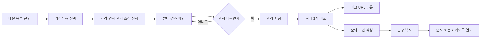
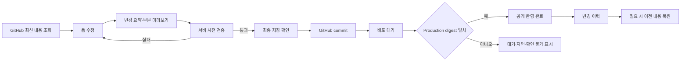
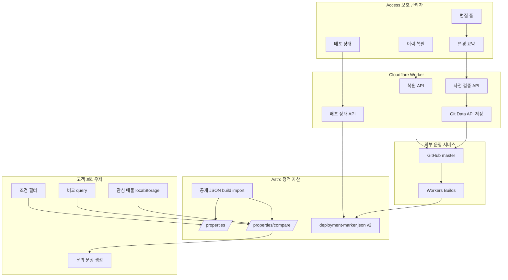

# 리더스시티 행복한부동산 기능·편의 확장 개발 설계서

> 문서 상태: 고객 기능·관리자 사전 검증·marker v2 배포 상태·변경 이력·안전 복원·재확인 큐 기반 로컬 구현 및 자동 검증 완료, 운영 배포 전
> 작성 기준: 2026-08-31 현재 저장소와 Production 운영 구조
> 적용 원칙: 기존 Astro 정적 사이트·GitHub 공개 콘텐츠·Cloudflare Workers Static Assets 구조를 유지한다.
> 진행 관리: `리더스시티 행복한부동산 기능·편의 확장 개발 진행 체크리스트.md`
> 중요: 조건 검색·관심 매물·최대 3개 비교·비저장 문의 문장, 관리자 변경 요약·쓰기 없는 서버 사전 검증, marker v2·resource digest·배포 상태, 변경 이력·2단계 안전 복원 API/UI, 재확인 상태·정책·Bank 갱신·관리자 필터·단건/선택 확인·이력은 로컬 구현과 자동 검증을 마쳤다. Production 반영·승인 콘텐츠 복원 및 재확인 저장 E2E와 통계는 아직 남아 있다.

## 1. 문서 목적

현재 사이트는 공개 매물 탐색, 단지 정보, FAQ, 전화·문자·카카오톡 상담 연결, 관리자 GitHub 저장, 자동 동기화, CI와 Cloudflare 자동 배포까지 운영 가능한 상태다.

다음 확장 단계는 기능 수를 늘리는 데 목적을 두지 않는다. 다음 두 가지 문제를 해결하는 데 집중한다.

1. 고객이 원하는 조건을 빠르게 좁히고 여러 매물을 비교한 뒤 상담으로 자연스럽게 이동할 수 있어야 한다.
2. 운영자가 저장 전에 변경 내용을 확인하고 GitHub 저장과 실제 공개 반영 상태를 구분하며, 문제가 생기면 이전 공개 내용을 안전하게 복원할 수 있어야 한다.

이 문서는 위 목표를 실제 구현 가능한 수준으로 구체화한다.

## 2. 핵심 결정

### 2.1 우선 구현 범위

| 우선순위 | 기능 묶음 | 핵심 효과 | 서버 저장 |
|---|---|---|---|
| 1 | 조건 맞춤 매물 탐색 | 거래·가격·면적·단지 조건을 빠르게 좁힘 | 없음 |
| 1 | 관심 매물·최대 3개 비교 | 여러 매물을 잃지 않고 비교·공유 | 없음 |
| 1 | 상담 조건 도우미 | 선택 매물과 희망 조건을 문자·카카오 상담으로 연결 | 없음 |
| 2 | 관리자 저장 전 검증·변경 요약 | 잘못된 문구와 의도하지 않은 변경 예방 | 기존 GitHub만 사용 |
| 2 | 저장·배포·공개 반영 상태 | GitHub 저장과 실제 공개 반영을 구분 | 기존 GitHub·배포 marker 사용 |
| 2 | 콘텐츠 변경 이력·안전 복원 | 이전 공개 데이터를 새 커밋으로 복구 | 기존 GitHub만 사용 |
| 3 | 매물 재확인 대기열 | 오래된 매물을 자동 삭제하지 않고 운영자에게 알림 | Git 상태 JSON |
| 4 | 개인정보 없는 이용 통계 | 실제 고객 행동을 보고 다음 개선 판단 | Cloudflare 선택 기능 |

### 2.2 이번 설계에서 채택하지 않는 것

- 회원가입과 고객 계정
- 고객별 서버 저장 관심 매물
- 서버 저장형 상담게시판
- 고객 전화번호·문의 내용 저장
- 자체 예약 시스템
- 매물 알림 문자·푸시
- AI가 매물의 적합성이나 계약 판단을 대신하는 챗봇
- 기존 공개 JSON 전체의 D1 이전
- 이미지 전체의 R2 이전
- Cloudflare Preview URL 공개 활성화
- Production 관리자에 Cloudflare 계정 제어 토큰 추가

이 기능들은 개인정보, 스팸 방어, 권한, 보유기간, 비용과 장애 대응 범위를 별도로 승인받은 뒤 검토한다.

### 2.3 비용 원칙

- 1·2·3순위 기능은 현재 GitHub·Cloudflare·정적 자산 구조 안에서 구현한다.
- 고객 편의 상태는 브라우저 `localStorage`, 화면 상태와 공유 조건은 URL query를 사용한다.
- 매물·상담 조건은 서버로 전송하지 않는다.
- Cloudflare D1·R2는 실제 전환 기준이 충족되기 전에는 추가하지 않는다.
- 이용 통계는 Cloudflare Web Analytics를 우선하고, 사용자 식별자가 없는 집계 이벤트가 꼭 필요할 때만 Analytics Engine을 검토한다.

## 3. 현재 구현 기준선

### 3.1 공개 매물 화면

현재 `/properties/`는 다음 기능을 제공한다.

- 거래유형: 전체·매매·전세·월세
- 매물유형
- 단지
- 거래유형별 가격 범위와 면적 범위
- 최근 등록순·가격 낮은순·가격 높은순·면적 작은순·면적 큰순
- 필터 query 반영
- 결과 수 `aria-live`
- 필터 초기화
- 같은 브라우저의 관심 매물 최대 30개와 관심만 보기
- 선택 순서 기준 최대 3개 비교와 공유 URL
- 선택 공개 매물·희망 조건의 서버 비저장 문의 문장
- 결과 0건 상태
- 각 카드의 네이버 개별 매물 이동
- 전화·문자·카카오톡 상담 연결

관련 구현은 다음과 같다.

- `src/pages/properties/index.astro`
- `src/components/NaverListingCard.astro`
- `src/lib/naver-listings.ts`
- `src/lib/naver-listing-sort.mjs`
- `src/components/ContactPanel.astro`
- `src/components/MobileContactBar.astro`

현재 부족한 항목은 다음과 같다.

- 가격·면적 범위 필터
- 모바일 필터 접기·펼치기
- 관심 매물 저장
- 복수 매물 비교
- 선택 조건과 매물 공유
- 선택 매물이 포함된 상담 문장 작성

### 3.2 관리자 화면

현재 관리자는 다음 흐름을 제공한다.

```text
Cloudflare Access 로그인
→ GitHub 최신 JSON 조회
→ 관리자 폼 수정
→ 브라우저 또는 Worker 검증
→ GitHub 단일 commit 생성
→ master ref non-force 갱신
→ Cloudflare Workers Builds 자동 배포
```

현재 다음 기반은 이미 구현되어 있다.

- 허용 관리자 2명과 Email OTP
- Access JWT 재검증
- Origin·CSRF·Content-Type 검증
- 허용 리소스와 금지 필드 검증
- 한 branch-tip snapshot 기준 읽기
- 단일·복수 JSON의 한 tree·한 commit 저장
- SHA와 branch ref 충돌 보호
- WebP 검증·허용 경로 저장
- Production deployment marker
- GitHub CI, Playwright, Lighthouse

현재 부족한 항목은 다음과 같다.

- 저장 완료와 공개 반영 완료의 분리 표시
- 저장 commit과 Production 배포의 직접 연결
- 콘텐츠별 변경 이력
- 이전 콘텐츠를 새 commit으로 복원하는 관리자 기능
- 입력 중 페이지 이탈 경고

### 3.3 절대 유지할 기존 동작

- 승인 콘텐츠가 없으면 가짜 데이터를 만들지 않는다.
- 고객 연락처와 상담 내용을 저장하지 않는다.
- 네이버 공개 화면에 없는 정확한 호수·내부 정보는 저장하지 않는다.
- 부동산뱅크 원본 XLS를 서버로 전송하지 않는다.
- 네이버 ID를 매물 비교·동기화 기준으로 유지한다.
- 부동산뱅크에 없다는 이유만으로 다른 공급처 매물을 자동 삭제하지 않는다.
- `registeredAt`은 등록기간 시작일이며 실제 확인일로 오해하게 표시하지 않는다.
- 관리자 저장은 force push를 사용하지 않는다.
- Preview를 Production 승인 경로로 새로 공개하지 않는다.
- 기존 Production 이외 Cloudflare branch build 비활성 상태를 유지한다.

## 4. 목표와 성공 지표

### 4.1 고객 목표

- 모바일에서 3단계 이내로 거래유형과 핵심 조건을 선택한다.
- 관심 매물을 새로고침 후에도 다시 찾을 수 있다.
- 최대 3개 매물을 한 화면에서 비교한다.
- 선택 상태를 URL로 공유할 수 있다.
- 매물번호와 조건을 다시 입력하지 않고 문의 내용을 준비한다.
- 문의 내용은 서버에 남지 않는다.

### 4.2 운영자 목표

- 저장 전 변경 필드와 변경 전·후를 확인한다.
- 유효성 검사 실패는 GitHub commit 전에 발견한다.
- `GitHub 저장 완료`와 `공개 반영 완료`를 다른 상태로 본다.
- 현재 Production이 어느 commit과 콘텐츠 digest를 제공하는지 확인한다.
- 이전 내용을 force push 없이 새 commit으로 복원한다.
- 오래된 매물을 자동 삭제하지 않고 재확인 목록으로 확인한다.

### 4.3 품질 목표

- 360px에서 가로 넘침이 없다.
- 주요 터치 대상은 44×44px 이상이다.
- 키보드만으로 필터·관심·비교·문의 기능을 사용할 수 있다.
- JavaScript가 실패해도 현재 매물 목록과 네이버 링크는 유지된다.
- 기존 Lighthouse 내부 기준을 떨어뜨리지 않는다.
- 기존 sitemap·canonical·robots·JSON-LD 동작을 변경하지 않는다.
- 관리자 Secret과 내부 오류 원문을 공개 응답에 포함하지 않는다.

## 5. 전체 사용자 흐름

### 5.1 고객 흐름



### 5.2 관리자 흐름



## 6. 전체 아키텍처



### 6.1 런타임 원칙

- 공개 매물 필터·관심·비교·문의는 브라우저에서만 동작한다.
- 공개 매물 데이터는 현재처럼 Astro build 시 JSON을 import한다.
- 고객 기능을 위해 새 공개 API를 만들지 않는다.
- 관리자 검증·이력·복원만 기존 `/api/admin/v1/*`에 추가한다.
- 공개 정적 요청은 계속 ASSETS가 직접 처리한다.
- `/api/admin/*`만 Worker가 먼저 처리하는 현재 라우팅을 유지한다.
- 단, 4순위 custom 집계 event를 별도로 승인해 구현하면 `/api/events`만 예외로 추가한다. 이는 1~3순위 범위와 분리된 아키텍처 변경이다.

## 7. 기능 A — 조건 맞춤 매물 탐색

### 7.1 화면 구성

데스크톱은 현재 필터 패널을 확장한다.

```text
[거래유형] [매물유형] [단지]
[최소 가격] [최대 가격] [최소 면적] [최대 면적]
[최근 등록순 ▼]                    [초기화]

선택 조건: 매매 · 아파트 · 84㎡ 이상 · 5억원 이하
네이버 등록 매물 7건
```

모바일은 접이식 패널을 사용한다.

```text
[조건 3개 · 매물 7건 ▼]

펼침 상태
┌──────────────────────┐
│ 거래유형              │
│ 매물유형              │
│ 단지                  │
│ 가격 범위             │
│ 면적 범위             │
│ 정렬                  │
│ [조건 적용] [초기화]  │
└──────────────────────┘
```

### 7.2 필터 상태

```ts
interface ListingExplorerState {
  trade: "" | "sale" | "jeonse" | "monthly-rent";
  propertyType: string;
  complex: string;
  sort: "latest" | "price" | "price-desc" | "area" | "area-desc";
  minPrice: number | null;
  maxPrice: number | null;
  minArea: number | null;
  maxArea: number | null;
  minDeposit: number | null;
  maxDeposit: number | null;
  minMonthlyRent: number | null;
  maxMonthlyRent: number | null;
}
```

금액 단위는 화면에서 `만원`, 면적은 `㎡`를 사용한다.

### 7.3 거래유형별 가격 처리

현재 `priceLabel`은 고객 표시용 문자열이다. 범위 필터를 추가할 때 거래유형별 숫자 해석 규칙을 순수 함수로 분리한다.

| 거래유형 | 표시 예 | 필터 기준 |
|---|---|---|
| 매매 | `5억 3,000` | 총 매매가 53,000만원 |
| 전세 | `2억 5,000` | 총 보증금 25,000만원 |
| 월세 | `3,000/80` | 보증금 3,000만원과 월세 80만원을 별도 비교 |

원칙:

- 월세 보증금과 월 임대료를 하나의 숫자로 합치지 않는다.
- 파싱할 수 없는 가격은 가격 범위가 없는 상태에서는 표시한다.
- 가격 범위를 선택했는데 파싱할 수 없는 항목은 결과에서 제외한다.
- 파싱 실패는 빌드 검증과 단위 테스트에서 발견하도록 한다.
- 가격 정렬의 기존 동작과 범위 필터가 같은 파서를 사용한다.

### 7.4 URL query 계약

기존 query를 유지하고 다음 항목을 추가한다.

| query | 의미 | 예시 |
|---|---|---|
| `trade` | 거래유형 | `sale` |
| `type` | 매물유형 | `아파트` |
| `complex` | 단지 slug | `leaders-city-5` |
| `sort` | 정렬 | `price-desc` |
| `minPrice` | 매매·전세 최소 금액(만원) | `30000` |
| `maxPrice` | 매매·전세 최대 금액(만원) | `60000` |
| `minArea` | 최소 면적(㎡) | `59` |
| `maxArea` | 최대 면적(㎡) | `85` |
| `minDeposit` | 월세 최소 보증금(만원) | `1000` |
| `maxDeposit` | 월세 최대 보증금(만원) | `5000` |
| `minRent` | 월세 최소 월 임대료(만원) | `40` |
| `maxRent` | 월세 최대 월 임대료(만원) | `100` |

검증 규칙:

- 허용하지 않은 값은 무시한다.
- 음수, `NaN`, 무한대, 지나치게 큰 수는 무시한다.
- 최소값이 최대값보다 크면 두 값을 자동 교환하지 않고 해당 범위를 해제하며 안내한다.
- 월세 query는 `trade=monthly-rent`일 때만 적용한다.
- 매매·전세 가격 query와 월세 가격 query를 동시에 적용하지 않는다.
- 기본 상태는 현재처럼 깨끗한 `/properties/` URL을 유지한다.
- query만 다른 페이지는 canonical을 `/properties/`로 유지한다.

### 7.5 빠른 조건 버튼

실제 매물 분포를 확인한 뒤 운영자가 승인한 범위만 제공한다.

예:

- 매매
- 전세
- 월세
- 59㎡ 이상
- 84㎡ 이상
- 리더스시티4블록
- 리더스시티5블록

가격 구간은 실제 매물 분포가 바뀌기 쉬우므로 코드에 임의의 영구 기준으로 넣지 않는다.

### 7.6 빈 상태

```text
조건에 맞는 공개 매물이 없습니다.

조건을 초기화하거나 찾는 동네·거래유형·예산을
문자 또는 카카오톡으로 알려주세요.

[조건 초기화] [문의 조건 작성]
```

가짜 추천 매물이나 추정 가격을 표시하지 않는다.

## 8. 기능 B — 관심 매물

### 8.1 기본 동작

- 각 네이버 매물 카드에 `관심 매물` 토글 버튼을 추가한다.
- 버튼은 카드의 외부 링크 안에 중첩하지 않는다.
- 저장 성공 여부를 `aria-pressed`와 안내 문구로 전달한다.
- 관심 매물은 같은 브라우저에서 새로고침 후에도 유지한다.
- 로그인과 서버 저장은 사용하지 않는다.
- 최대 30개까지만 저장한다.

### 8.2 저장 스키마

`localStorage` key:

```text
leaderscityhappy:listing-preferences:v1
```

값:

```json
{
  "version": 1,
  "favoriteIds": ["2640120487", "2645400881"],
  "updatedAt": "2026-08-28T06:00:00.000Z"
}
```

저장 원칙:

- 공개 네이버 매물 ID만 저장한다.
- 제목·가격·상담 내용은 저장하지 않는다.
- 현재 데이터에 없는 ID는 화면 진입 시 제거한다.
- 중복 ID는 하나로 정규화한다.
- 30개를 넘기면 새 저장을 막고 안내한다.
- JSON 파싱 실패 시 전체 상태를 초기화하고 사이트 기능은 유지한다.
- `localStorage` 사용이 차단된 브라우저에서는 현재 탭 메모리 상태로만 동작한다.
- `storage` 이벤트로 같은 브라우저의 다른 탭과 상태를 동기화한다.

### 8.3 화면 위치

- 카드 우측 상단: `관심` 버튼
- 필터 아래: `전체`, `관심 매물` 전환
- 모바일 하단 비교 tray: 관심 매물 중 선택된 비교 개수

### 8.4 개인정보 안내

관심 매물 UI 주변에 다음 취지의 안내를 제공한다.

```text
관심 매물은 이 브라우저에만 저장되며 사무소 서버로 전송되지 않습니다.
```

`모두 삭제` 기능을 제공한다.

## 9. 기능 C — 최대 3개 매물 비교

### 9.1 비교 선택

- 관심 매물이 아니어도 비교 선택은 가능하다.
- 비교 선택은 최대 3개다.
- 네 번째 선택 시 기존 항목을 임의로 제거하지 않는다.
- `최대 3개까지 비교할 수 있습니다.`를 표시한다.
- 선택 순서를 비교 열 순서로 유지한다.

### 9.2 비교 URL

권장 경로:

```text
/properties/compare/?ids=2640120487,2645400881
```

규칙:

- ID는 공개 목록에 존재하는 값만 사용한다.
- 중복은 제거한다.
- 최대 3개까지만 허용한다.
- 허용되지 않은 문자는 제거한다.
- 유효한 ID가 0개면 매물 목록으로 이동할 수 있는 빈 상태를 표시한다.
- 비교 URL은 공유 가능하지만 sitemap에는 넣지 않는다.
- 비교 화면은 `noindex,follow`로 제공하고 canonical은 `/properties/`로 둔다.

### 9.3 비교 항목

| 행 | 표시 규칙 |
|---|---|
| 매물명 | 공개 제목 그대로 |
| 매물번호 | 네이버 공개 매물번호 |
| 거래유형 | 매매·전세·월세 |
| 가격 | 원문 `priceLabel` |
| 면적 | 원문 `areaLabel` |
| 층 | 공개된 `floorLabel`만 |
| 방향 | 공개된 값만 |
| 등록 | `등록 YYYY.MM.DD` |
| 매물유형 | 공개 유형 |
| 상세 | 같은 ID의 네이버 개별 매물 링크 |

비교 화면은 `가장 좋은 매물`, `가장 저렴한 매물`, `투자 추천` 같은 판단 문구를 자동 생성하지 않는다.

### 9.4 반응형 비교 UI

- 데스크톱: 왼쪽 항목명 + 최대 3개 열
- 태블릿: 가로 스크롤 허용, 첫 열 sticky
- 모바일: 매물별 세로 카드 전환을 기본으로 하고 `표로 보기`는 보조 기능
- 가로 스크롤 영역은 페이지 전체 overflow를 만들지 않는다.
- 각 비교 항목에 매물 제거 버튼을 제공한다.

## 10. 기능 D — 상담 조건 도우미

### 10.1 목적

고객이 선택한 공개 매물번호와 희망 조건을 다시 입력하지 않고 상담 문장을 준비한다.

AI가 답변을 생성하지 않는다. 고정된 안전한 템플릿에 고객이 선택한 값을 넣는다.

### 10.2 입력 항목

- 거래유형
- 희망 지역 또는 단지
- 예산 범위
- 희망 면적
- 입주 희망 시기
- 선택 매물 최대 3개
- 자유 메모 최대 200자

자유 메모는 서버로 전송하거나 브라우저에 영구 저장하지 않는다.

### 10.3 생성 문장 예시

```text
안녕하세요. 행복한부동산 홈페이지에서 매물을 보고 문의드립니다.

관심 매물
- 네이버 매물번호 2640120487 / 매매 / 5억 3,000
- 네이버 매물번호 2645400881 / 전세 / 2억 5,000

희망 조건
- 지역·단지: 리더스시티5블록
- 예산: 5억원 이하
- 면적: 84㎡ 이상
- 입주 시기: 2026년 10월경

현재 확인 가능한지 상담 부탁드립니다.
```

원칙:

- 정확한 동·호수 같은 비공개 정보를 자동 추가하지 않는다.
- `가능합니다`, `확정`, `보장` 같은 단정 문구를 만들지 않는다.
- 매물의 현재 상태는 상담 시 다시 확인한다는 문장을 포함한다.
- 자유 메모의 HTML은 해석하지 않고 일반 텍스트로만 처리한다.

### 10.4 문자·카카오 연결

모바일 OS별 `sms:` 본문 query 호환성이 다를 수 있으므로 다음 순서를 사용한다.

1. `문의 내용 복사`
2. 복사 성공 안내
3. `문자 앱 열기` 또는 `카카오톡 열기`

클립보드 권한이 거부되면 다음 fallback을 제공한다.

- 읽기 전용 textarea에 전체 문장 표시
- `전체 선택` 안내
- 본문 없이 현재 `sms:` 링크 열기

카카오 채널 URL에는 임의의 본문 전달 query를 추가하지 않는다.

### 10.5 서버 비저장 보장

- form submit을 사용하지 않는다.
- 상담 내용 API를 만들지 않는다.
- analytics event에 예산·지역·메모·매물번호를 넣지 않는다.
- 브라우저 콘솔에 생성 문장을 기록하지 않는다.
- 페이지를 벗어나면 자유 메모를 폐기한다.

## 11. 기능 E — 관리자 저장 전 변경 요약

### 11.1 목표

운영자가 저장 버튼을 누르기 전에 어떤 공개 필드가 어떻게 바뀌는지 확인한다.

### 11.2 공통 저장 단계

```text
편집 중
→ 변경 있음
→ 변경 요약 확인
→ 서버 사전 검증
→ 최종 저장 확인
→ 저장 중
→ GitHub 저장 완료
→ 공개 반영 대기
→ 공개 반영 완료
```

### 11.3 변경 요약 모델

```ts
interface AdminFieldDiff {
  resource: AdminResource;
  path: string;
  label: string;
  kind: "added" | "changed" | "removed" | "reordered";
  before: string | number | boolean | null;
  after: string | number | boolean | null;
}
```

표시 예:

```text
대표 문장
변경 전: 대전 동구 매물, 직접 확인하고 비교해서 안내합니다.
변경 후: 대전 동구 매물, 직접 확인하고 비교해서 안내합니다
```

### 11.4 diff 규칙

- JSON key 순서 차이는 변경으로 보지 않는다.
- 배열의 순서가 공개 순서인 경우 `reordered`로 표시한다.
- 긴 문장은 UI에서 접어 표시하되 전체 내용을 확인할 수 있어야 한다.
- 이미지 data URL 전체를 표시하지 않는다.
- 이미지 변경은 파일명·분류·대체 텍스트·크기만 표시한다.
- 토큰·Access 설정·Secret은 diff 대상이 아니다.
- 변경이 없으면 저장을 막고 `변경된 내용이 없습니다.`를 표시한다.
- 리소스별 공개 라벨 map을 사용하고 내부 경로만 단독 노출하지 않는다.

### 11.5 부분 미리보기

전체 Production 화면과 똑같은 Preview를 Worker에서 새로 렌더링하지 않는다.

대신 리소스별 안전한 부분 미리보기를 제공한다.

- 네이버 매물: 기존 공개 카드 미리보기 유지
- 홈 콘텐츠: 대표 Hero·현장 사진·지역 설명 섹션 미리보기
- 단지: 목록 카드·핵심 사실·출처 블록 미리보기
- 외부 콘텐츠: 카드 제목·요약·썸네일 미리보기
- FAQ: 질문·답변 아코디언 미리보기

정확한 전체 페이지 승인은 계속 로컬 화면과 PR CI를 사용한다.

### 11.6 페이지 이탈 경고

- 최초 조회 데이터와 현재 form 직렬화 결과가 다를 때 dirty 상태로 본다.
- 내부 관리자 링크 클릭 시 인페이지 확인을 우선한다.
- 브라우저 닫기·새로고침은 `beforeunload`를 보조 안전장치로 사용한다.
- 저장 성공 후 dirty 상태를 즉시 해제한다.
- 저장 실패 후에는 입력과 diff를 유지한다.

## 12. 기능 F — 서버 사전 검증

### 12.1 신규 API

```http
POST /api/admin/v1/content/validate
Content-Type: application/json
X-Admin-CSRF: <token>
```

요청:

```json
{
  "changes": [
    {
      "resource": "home-content",
      "sha": "현재 GitHub blob SHA",
      "data": {}
    }
  ]
}
```

성공 응답:

```json
{
  "data": {
    "valid": true,
    "snapshotCommit": "40자리 commit SHA",
    "changedResources": ["home-content"],
    "warnings": []
  }
}
```

실패 응답:

```json
{
  "error": {
    "code": "CONTENT_VALIDATION_FAILED",
    "message": "저장할 공개 내용을 다시 확인해 주세요.",
    "details": [
      {
        "resource": "home-content",
        "path": "broker.headline",
        "message": "승인된 공개 문구 형식을 확인해 주세요."
      }
    ]
  }
}
```

### 12.2 검증 원칙

- 실제 저장 API와 동일한 `worker/admin-resource-validation.mjs`를 사용한다.
- 현재 허용 리소스 전체를 같은 branch-tip snapshot에서 읽는다.
- 복수 후보를 결합한 상태로 교차 검증한다.
- Git blob·tree·commit·ref 쓰기를 호출하지 않는다.
- 성공 응답의 `snapshotCommit`은 실제 저장 직전에 다시 비교한다.
- 검증 이후 branch가 이동하면 저장 단계에서 기존처럼 `409`를 반환한다.
- 검증은 저장 권한이 활성화된 로그인 관리자만 사용할 수 있다.
- POST이므로 Origin·CSRF·JSON media type·본문 크기를 저장 API와 동일하게 검사한다.

## 13. 기능 G — GitHub 저장과 공개 반영 상태

### 13.1 문제 정의

다음 세 상태는 서로 다르다.

1. 관리자 브라우저가 저장 요청을 보냄
2. GitHub commit이 생성됨
3. 해당 콘텐츠가 Cloudflare Production에서 공개됨

UI가 이를 한 문장으로 표시하면 운영자가 공개 반영 여부를 잘못 판단할 수 있다.

### 13.2 상태 모델

```ts
type DeploymentState =
  | "idle"
  | "validating"
  | "saving"
  | "github-saved"
  | "deploying"
  | "published"
  | "superseded"
  | "delayed"
  | "failed"
  | "unknown";
```

| 상태 | 의미 | UI 색상 외 표현 |
|---|---|---|
| `github-saved` | commit 생성 완료 | `GitHub 저장 완료` 아이콘·문구 |
| `deploying` | Production digest 불일치, 대기 제한 안 | 진행 표시와 경과 시간 |
| `published` | 대상 resource digest 일치 | `공개 반영 완료`와 확인 시각 |
| `superseded` | 더 최신 commit이 배포됐지만 저장 resource 내용은 동일 | `최신 배포에 포함됨` |
| `delayed` | 제한 시간 안에 일치하지 않음 | `배포 지연`과 점검 링크 |
| `failed` | 명시적 오류 응답 | 오류 코드와 재시도 안내 |
| `unknown` | marker 또는 네트워크 확인 불가 | `확인 불가`, 저장 실패로 단정하지 않음 |

### 13.3 deployment marker v2

현재 scope hash를 유지하면서 build 출처와 관리자 resource digest를 추가한다.

```json
{
  "schemaVersion": 2,
  "algorithm": "sha256",
  "source": {
    "commit": "40자리 Git commit SHA 또는 null",
    "branch": "master 또는 null",
    "provider": "workers-builds 또는 github-actions 또는 local"
  },
  "resources": {
    "home-content": "SHA-256",
    "office": "SHA-256",
    "listings": "SHA-256",
    "naver-listings": "SHA-256",
    "complexes-overview": "SHA-256",
    "complexes": "SHA-256",
    "external-links": "SHA-256",
    "faq": "SHA-256",
    "reviews": "SHA-256"
  },
  "scopes": {
    "search": "SHA-256",
    "bank": "SHA-256",
    "external": "SHA-256",
    "automation": "SHA-256"
  }
}
```

source 값 우선순위:

```text
WORKERS_CI_COMMIT_SHA / WORKERS_CI_BRANCH
→ GITHUB_SHA / GITHUB_REF_NAME
→ local null
```

Workers Builds가 제공하는 기본 commit SHA와 branch 환경변수를 사용한다. GitHub Actions Production 검사에서는 GitHub 기본 환경변수를 사용한다. 로컬 빌드는 source를 `local`과 `null`로 기록한다.

### 13.4 resource digest

- 대상 JSON을 UTF-8과 LF, `JSON.stringify(data, null, 2) + "\n"` 형식으로 정규화한다.
- Worker 저장 응답은 resource별 SHA-256 digest를 반환한다.
- Production marker도 같은 규칙으로 digest를 계산한다.
- active commit이 저장 commit보다 최신이어도 대상 resource digest가 같으면 `superseded`로 완료 처리할 수 있다.
- digest는 공개 승인 JSON에서 계산하므로 비밀정보가 아니지만 원문을 응답에 복제하지 않는다.

### 13.5 Worker version metadata

`wrangler.jsonc`에 Worker version metadata binding을 추가한다.

```json
{
  "version_metadata": {
    "binding": "CF_VERSION_METADATA"
  }
}
```

관리자 `/system` 응답에는 다음 안전한 값만 추가한다.

```json
{
  "workerVersion": {
    "id": "Cloudflare Worker version ID",
    "createdAt": "ISO timestamp"
  }
}
```

version ID는 로그인한 관리자에게만 제공한다. Cloudflare API token은 추가하지 않는다.

이 상태 판정은 현재처럼 한 Worker version이 Production 트래픽 100%를 처리하는 배포를 기준으로 한다. 향후 gradual deployment나 두 version 트래픽 분할을 사용한다면 version affinity와 정적 자산 version 일치 방식을 별도로 설계하기 전까지 관리자 상태를 `확인 불가`로 표시한다.

### 13.6 상태 API

```http
GET /api/admin/v1/deployment-status?commit=<sha>&resource=<name>&digest=<sha256>
```

응답:

```json
{
  "data": {
    "state": "published",
    "savedCommit": "저장 commit",
    "activeCommit": "marker source commit",
    "resource": "home-content",
    "resourceMatched": true,
    "workerVersionId": "version id",
    "checkedAt": "ISO timestamp"
  }
}
```

구현 원칙:

- API는 같은 Worker의 ASSETS binding에서 `/deployment-marker.json`을 읽는다.
- query의 commit·resource·digest 형식을 엄격히 검증한다.
- marker 응답은 `no-store`로 읽는다.
- GitHub Actions 성공 여부를 추정해 성공으로 표시하지 않는다.
- marker가 일치할 때만 공개 반영 완료로 표시한다.
- 대기 제한은 현재 운영 배포 확인 기준과 같은 최대 10분을 사용한다.
- 10분을 넘으면 자동 재저장하지 않고 `delayed`로 표시한다.
- Cloudflare 대시보드와 GitHub Actions 링크를 보조 링크로 제공한다.

현재 구현은 Cloudflare API 토큰을 추가하지 않고 같은 Worker의 `ASSETS` binding에서 marker v2를 읽는다. 이 브라우저의 마지막 저장 commit·resource digest·서버 저장 시각을 안전하게 기억하며 5초 간격으로 확인하고, 10분 불일치 시 `delayed`, marker v1·잘못된 source·정적 자산 조회 장애 시 GitHub 저장 실패가 아닌 `unknown`으로 표시한다. 명시적 Cloudflare 빌드 실패와 마지막 정상 배포 목록은 Production API 연동 없이 판정할 수 없으므로 후속으로 남긴다.

## 14. 기능 H — 콘텐츠 변경 이력과 안전 복원

### 14.1 이력 조회

```http
GET /api/admin/v1/content-history/home-content?limit=10
```

응답 필드:

- commit SHA
- commit 제목
- 작성 시각
- 작성자 표시 이름
- resource blob SHA
- 현재 branch 포함 여부
- 현재 Production과 같은 resource digest인지 여부

이메일 원문이나 GitHub token을 반환하지 않는다.

### 14.2 복원 방식

Cloudflare 버전 롤백과 GitHub 콘텐츠 복원을 하나의 버튼으로 혼합하지 않는다.

관리자 콘텐츠 복원은 다음 방식으로 수행한다.

1. 과거 commit에서 선택 resource JSON을 읽는다.
2. 현재 branch-tip의 전체 허용 resource snapshot을 읽는다.
3. 과거 JSON을 현재 후보 상태에 결합한다.
4. 현재 검증 규칙으로 전체 교차 검증한다.
5. 현재 resource SHA와 branch ref를 확인한다.
6. force 없이 새 commit을 생성한다.
7. 일반 Workers Builds 배포를 기다린다.
8. resource digest 일치 후 복원 완료로 표시한다.

Git 이력을 과거로 되감거나 기존 commit을 삭제하지 않는다.

### 14.3 복원 API

```http
POST /api/admin/v1/content/restore
Content-Type: application/json
X-Admin-CSRF: <token>
```

요청:

```json
{
  "sourceCommit": "복원할 과거 commit SHA",
  "resources": [
    {
      "resource": "home-content",
      "expectedCurrentSha": "현재 blob SHA"
    }
  ],
  "confirmation": "home-content 이전 내용으로 복원"
}
```

### 14.4 복원 안전장치

- 한 번 클릭으로 실행하지 않는다.
- 첫 클릭에서 변경 전·복원 후 diff를 표시한다.
- 두 번째 확인은 대상 resource 이름을 포함한다.
- `sourceCommit`은 현재 저장소의 허용 history인지 확인한다.
- 과거 JSON도 현재 스키마로 다시 검증한다.
- schema가 달라 자동 복원할 수 없으면 쓰지 않고 수동 검토를 요구한다.
- 현재 SHA가 달라졌으면 `409`로 중단한다.
- 여러 resource 복원은 한 commit으로 원자적으로 수행한다.
- 이미지 파일 삭제는 자동 복원 범위에 포함하지 않는다.
- 복원 commit 제목은 대상과 원본 commit을 명확히 기록한다.

예:

```text
관리자: home-content를 a75e9a9 시점 내용으로 복원
```

## 15. 기능 I — 매물 재확인 대기열

### 15.1 목적

오래된 매물을 자동으로 숨기거나 삭제하지 않고 운영자가 다시 확인해야 할 대상을 분리한다.

### 15.2 중요한 날짜 구분

| 값 | 의미 | 재확인 판단 사용 |
|---|---|---|
| `registeredAt` | 부동산뱅크 등록기간 시작일 | 단독 사용 금지 |
| `checkedAt` | 목록 전체를 수집한 날짜 | 자동 수집 상태 판단 |
| `lastReviewedAt` | 운영자가 실제 재확인한 날짜 | 직접 등록 매물 경고 판단 |
| `lastSeenAt` | 자동 동기화에서 마지막으로 본 날짜 | Bank 매물 경고 판단 |

`registeredAt`을 최근 확인일로 바꿔 표시하지 않는다.

### 15.3 상태 파일

구현 파일:

```text
.github/listing-review-state.json
```

예시:

```json
{
  "schemaVersion": 1,
  "updatedAt": "2026-08-28",
  "items": {
    "2640120487": {
      "source": "bank",
      "lastSeenAt": "2026-08-28",
      "lastReviewedAt": null
    },
    "2645400881": {
      "source": "manual",
      "lastSeenAt": null,
      "lastReviewedAt": "2026-08-20"
    }
  }
}
```

이 파일에는 공개 매물 ID와 날짜·출처 분류만 둔다. 고객·소유자·내부 메모는 금지한다.

### 15.4 경고 기준

경고 일수는 이 문서에서 임의로 확정하지 않는다.

```ts
interface ListingReviewPolicy {
  bankWarningDays: number | null;
  manualWarningDays: number | null;
}
```

- 값이 승인되지 않았으면 경고 기능을 비활성화한다.
- 기준을 넘겨도 자동 삭제·자동 비공개하지 않는다.
- `재확인 필요`는 관리자 화면에만 표시한다.
- 공개 화면에 표시하려면 별도 문구 승인을 받는다.
- 자동 동기화 성공은 Bank 매물의 `lastSeenAt`을 갱신할 수 있다.
- 직접 등록 매물은 운영자가 `현재 공개 상태 확인`을 눌러야 `lastReviewedAt`을 갱신한다.

현재 `.github/listing-review-policy.json`의 두 경고 일수는 승인 전 안전 기본값인 `null`이다. 따라서 관리자 목록에는 출처·확인일과 정렬 기능만 제공하고 `재확인 필요` 경고는 만들지 않는다. Bank 전체 수집이 성공했을 때만 상태 파일을 공개 목록·Bank 기준선과 함께 한 Git 커밋으로 갱신한다.

### 15.5 관리자 화면

대시보드 카드:

```text
재확인 필요 4건
Bank 동기화 미확인 1건 · 직접 등록 재확인 3건
[대기열 보기]
```

목록 필터:

- 전체
- 재확인 필요
- Bank 자동 동기화
- 직접 등록
- 최근 확인

각 항목은 `확인 완료`, `수정`, `등록 종료`로 이동한다.

## 16. 기능 J — 이용 통계

### 16.1 1차: Cloudflare Web Analytics

우선 확인할 항목:

- 페이지뷰
- 유입 경로
- 국가·기기 범주의 집계
- 실제 사용자 LCP·CLS 등 성능

Web Analytics가 이미 Cloudflare에서 활성화되어 있는지 먼저 확인한다. 활성화되어 있지 않으면 개인정보를 수집하지 않는 기본 Web Analytics만 우선 적용한다.

### 16.2 2차: 선택적 집계 이벤트

다음 판단이 필요할 때만 Analytics Engine을 추가한다.

- 필터 사용률
- 관심 매물 버튼 사용률
- 비교 화면 진입률
- 네이버 매물 이동률
- 전화·문자·카카오 CTA 선택 비율

허용 event:

```text
listing_filter_apply
listing_favorite_toggle
listing_compare_open
naver_listing_open
contact_channel_open
```

### 16.3 수집 금지 값

- 고객 입력 메모
- 예산 원문
- 입주 시기 원문
- 전화번호·이메일
- 관심 매물 ID 목록
- 비교한 개별 매물 ID
- 전체 URL query
- IP를 자체 필드로 저장
- 쿠키·지속 사용자 ID
- 브라우저 fingerprint

event에는 다음과 같은 집계값만 허용한다.

```json
{
  "event": "listing_compare_open",
  "page": "properties",
  "count": 3,
  "trade": "sale"
}
```

### 16.4 공개 event API를 추가할 경우

```http
POST /api/events
```

- event 이름 allowlist
- JSON 1KB 이하
- 자유 문자열 금지
- 응답 `204 No Content`
- analytics 실패가 사용자 기능을 막지 않음
- abuse와 과도한 호출 제한
- `wrangler.jsonc`의 `run_worker_first`에 해당 API만 명시
- 개인정보처리방침에 실제 처리 범위 반영

Analytics Engine의 향후 과금 정책이 변경될 수 있으므로 구현 직전에 공식 가격과 무료 한도를 다시 확인한다.

## 17. 고객 측 상태·모듈 설계

### 17.1 신규 순수 모듈 후보

```text
src/lib/naver-listing-filter.mjs
src/lib/listing-preferences.mjs
src/lib/listing-compare.mjs
src/lib/inquiry-message.mjs
```

책임:

| 모듈 | 책임 |
|---|---|
| `naver-listing-filter.mjs` | query 정규화, 가격·면적 파싱, 필터 적용 |
| `listing-preferences.mjs` | 관심 ID 읽기·쓰기·마이그레이션·제한 |
| `listing-compare.mjs` | 비교 ID 검증·중복 제거·최대 3개 제한 |
| `inquiry-message.mjs` | 저장 없는 상담 문장 생성·길이 제한 |

브라우저 DOM 조작과 순수 데이터 로직을 분리해 Node 단위 테스트가 가능해야 한다.

### 17.2 신규 컴포넌트 후보

```text
src/components/ListingFilterPanel.astro
src/components/ListingFavoriteButton.astro
src/components/ListingCompareTray.astro
src/components/ListingCompareTable.astro
src/components/InquiryComposer.astro
```

초기 구현에서 과도한 컴포넌트 분리는 피한다. 두 화면 이상에서 재사용하거나 독립 테스트 가치가 있을 때만 분리한다.

### 17.3 JavaScript 실패 시 동작

- 서버 생성 매물 카드는 그대로 표시된다.
- 네이버 상세 링크는 그대로 동작한다.
- 전화·문자·카카오 링크는 그대로 동작한다.
- 필터와 관심·비교만 사용할 수 없게 된다.
- 핵심 콘텐츠를 `display:none` 기본값으로 숨긴 뒤 JavaScript로 여는 방식을 사용하지 않는다.

## 18. 관리자 API·모듈 변경

### 18.1 API 경로 후보

```text
POST /api/admin/v1/content/validate
GET  /api/admin/v1/deployment-status
GET  /api/admin/v1/content-history/:resource
GET  /api/admin/v1/content-history/:resource/:commit
POST /api/admin/v1/content/restore
```

### 18.2 기존 모듈 영향

| 파일 | 변경 후보 |
|---|---|
| `worker/admin-api.mjs` | 신규 경로 라우팅, 공통 보안 검사 |
| `worker/admin-resource-validation.mjs` | 사전 검증과 복원 후보 검증 재사용 |
| `worker/github-content.mjs` | 이력 조회, 과거 blob 읽기, 복원 commit |
| `src/lib/admin-content-client.ts` | validate·status·history·restore client |
| `src/components/admin/AdminApiStatus.astro` | Worker version·Production commit 표시 |
| `src/components/admin/AdminContentHistory.astro` | 이력 목록·과거/현재 diff·2차 복원 확인 |
| `src/pages/admin/history/index.astro` | 변경 이력과 안전 복원 화면 |
| `src/pages/admin/index.astro` | 배포 상태·재확인 대기열 카드 |
| `scripts/deployment-marker.mjs` | marker v2와 resource digest |
| `scripts/assert-production-build.mjs` | marker v2 Production 검사 |
| `wrangler.jsonc` | version metadata binding |

### 18.3 API 오류 코드

```text
CONTENT_VALIDATION_FAILED
CONTENT_HISTORY_NOT_FOUND
CONTENT_RESTORE_SOURCE_INVALID
CONTENT_RESTORE_SCHEMA_INCOMPATIBLE
CONTENT_SHA_CONFLICT
BRANCH_REF_CONFLICT
DEPLOYMENT_MARKER_UNAVAILABLE
DEPLOYMENT_MARKER_INVALID
DEPLOYMENT_STATUS_UNKNOWN
```

사용자 메시지와 내부 오류를 분리한다.

예:

```json
{
  "error": {
    "code": "DEPLOYMENT_MARKER_UNAVAILABLE",
    "message": "공개 반영 상태를 잠시 확인할 수 없습니다. GitHub 저장 결과는 유지됩니다."
  }
}
```

GitHub token, API 응답 본문, stack trace는 반환하지 않는다.

## 19. 보안·개인정보 설계

### 19.1 공개 기능

- 관심 매물은 브라우저에만 저장한다.
- 비교 URL에는 공개 매물 ID만 넣는다.
- 문의 문장은 서버로 전송하지 않는다.
- 클립보드 실패 내용을 로그에 기록하지 않는다.
- 사용자 자유 메모를 analytics에 넣지 않는다.
- URL query를 구조화 로그에 원문으로 남기지 않는다.

### 19.2 관리자 기능

- 모든 신규 관리자 API는 Access JWT 검증을 통과해야 한다.
- POST는 정확한 HTTPS Origin, CSRF, JSON media type을 요구한다.
- history와 restore resource는 기존 allowlist만 사용한다.
- 과거 commit의 임의 경로를 요청할 수 없게 한다.
- source commit은 40자리 SHA 형식과 저장소 내 존재를 확인한다.
- 복원할 blob 크기와 JSON depth를 제한한다.
- 현재 금지 필드 검사와 전체 교차 검증을 우회하지 않는다.
- restore도 non-force ref CAS를 사용한다.
- Cloudflare API token을 브라우저나 Worker에 새로 추가하지 않는다.
- Worker version ID와 commit 상태는 관리자 API에서만 상세 제공한다.

### 19.3 CSP

- 고객 기능은 inline eval이나 외부 JavaScript SDK를 요구하지 않는다.
- analytics를 추가하면 허용 script·connect origin을 최소 범위로 검토한다.
- CSP 완화를 편의를 위한 기본 해결책으로 사용하지 않는다.

## 20. 접근성·모바일 설계

### 20.1 필터

- 모든 input에 명시적 label을 제공한다.
- 접이식 필터 버튼에 `aria-expanded`와 `aria-controls`를 제공한다.
- 적용 후 결과 수를 `aria-live="polite"`로 알린다.
- 초기화 후 첫 번째 필터 또는 결과 안내에 초점을 적절히 이동한다.

### 20.2 관심·비교

- 관심 버튼은 `aria-pressed`를 사용한다.
- 아이콘만으로 상태를 전달하지 않는다.
- 비교 선택 개수를 텍스트로 제공한다.
- 최대 3개 오류를 색상 외 문구로 알린다.
- 비교 항목 제거 후 다음 논리적 버튼으로 초점을 이동한다.

### 20.3 문의

- 생성 문장은 화면 읽기 프로그램이 읽을 수 있는 영역에 표시한다.
- 복사 성공·실패는 `aria-live`로 알린다.
- textarea는 충분한 글자 크기와 높이를 유지한다.
- 하단 상담 bar와 비교 tray가 서로 겹치지 않게 한다.

### 20.4 검증 폭

```text
360px
390px
430px
768px
1280px
200% 확대
```

실제 Android Chrome과 iPhone Safari에서 문자·클립보드·카카오 전환을 별도로 확인한다.

## 21. SEO·성능·캐시

### 21.1 SEO

- 필터 query는 sitemap에 넣지 않는다.
- 비교 query는 sitemap에 넣지 않는다.
- `/properties/compare/`는 `noindex,follow`와 `/properties/` canonical을 사용한다.
- 관심 매물은 브라우저 상태이므로 검색 로봇 콘텐츠로 만들지 않는다.
- 공개 매물 원문과 네이버 링크 구조는 유지한다.
- 고객 조건을 JSON-LD에 넣지 않는다.

### 21.2 성능

- 별도 프론트엔드 프레임워크를 추가하지 않는다.
- 순수 모듈과 작은 Astro script를 사용한다.
- 비교 페이지에서 전체 매물 JSON을 중복 직렬화하지 않도록 현재 build data를 최소 필드로 전달한다.
- 필터 입력은 즉시 DOM 전체를 반복 갱신하지 않도록 한 번의 apply 함수로 모은다.
- localStorage 접근은 초기화와 사용자 동작 시에만 수행한다.
- analytics는 `sendBeacon` 또는 non-blocking 방식으로 처리한다.
- 고객 기능 추가 후 기존 Lighthouse 기준을 그대로 적용한다.

### 21.3 캐시

- 공개 HTML·JS·CSS는 기존 정적 자산 정책을 따른다.
- `deployment-marker.json`은 계속 `no-store`다.
- 관리자 status·history 응답은 `Cache-Control: no-store`다.
- 관심·문의 상태는 서버 캐시에 존재하지 않는다.

## 22. 오류·경계 상황

| 상황 | 처리 |
|---|---|
| localStorage 차단 | 현재 탭 메모리로 동작, 안내 |
| 저장 JSON 손상 | 관심 상태 초기화, 공개 목록 유지 |
| 저장된 매물 ID가 종료됨 | 자동 제거하고 개수 갱신 |
| 비교 URL ID 일부 오류 | 유효 ID만 표시하고 안내 |
| 비교 URL ID 모두 오류 | 빈 상태와 목록 링크 |
| 가격 파싱 실패 | 범위 필터 사용 시 제외, 단위 테스트 실패 후보 기록 |
| 클립보드 거부 | textarea 전체 선택 fallback |
| 관리자 사전 검증 실패 | 입력 유지, 필드 오류 표시 |
| GitHub 409 | 최신 내용 다시 읽기 전 저장 금지 |
| GitHub 저장 성공·marker 불일치 | `배포 중` 또는 `지연`, 재저장 금지 |
| marker 형식 오류 | `확인 불가`, 저장 실패로 단정 금지 |
| 과거 JSON이 현재 schema와 불일치 | 자동 복원 중단 |
| analytics 장애 | 사용자 기능 정상 유지 |

## 23. 테스트 전략

### 23.1 단위 테스트

#### 조건 탐색

- 억·만원 가격 파싱
- 매매·전세 가격 비교
- 월세 보증금·월 임대료 분리
- 면적 파싱
- query 허용값·숫자 범위 검증
- 최소·최대 역전 처리
- 필터와 정렬 동률 순서

#### 관심·비교

- localStorage v1 읽기·쓰기
- 손상 JSON 복구
- 중복 ID 제거
- 종료된 ID 정리
- 30개 제한
- 비교 3개 제한
- URL ID 정규화와 순서 보존

#### 문의

- 선택 매물 0·1·3개 문장
- 자유 메모 200자 제한
- HTML을 일반 텍스트로 처리
- 단정·보장 문구가 템플릿에 없음
- 서버 전송 함수가 없음

#### 관리자

- key 순서만 다른 JSON은 diff 0건
- 배열 순서 변경 감지
- 이미지 data URL 비노출
- validate가 Git 쓰기를 호출하지 않음
- marker v2 source와 resource digest
- GitHub Actions와 Workers Builds 환경변수 우선순위
- 저장 응답 digest와 build marker digest 일치
- history resource allowlist
- 과거 schema 불일치 복원 차단
- 복원 SHA 충돌 시 Git 쓰기 0회
- 복수 resource 복원 한 commit

### 23.2 Playwright E2E

- 모바일 필터 펼침·닫힘
- 가격·면적 조건과 URL 반영
- 초기화 후 clean URL
- 관심 저장 후 새로고침 유지
- 다른 탭 `storage` event 반영
- 네 번째 비교 선택 차단
- 비교 URL 새 탭 재현
- 360px 비교 화면 가로 overflow 없음
- 문의 문장 생성·복사 fallback
- 기존 전화·문자·카카오 href 유지
- JavaScript 오류 0건

관리자 mock E2E:

- 변경 없음 저장 차단
- diff 확인 전 저장 차단
- validate 실패 시 입력 유지
- 저장 성공 후 `github-saved`
- marker 불일치 시 `deploying`
- resource digest 일치 시 `published`
- 더 최신 commit·같은 digest면 `superseded`
- 10분 초과 시 `delayed`
- 복원 1차·2차 확인

### 23.3 Production 확인

```text
1. 승인된 테스트 콘텐츠로 관리자 저장
2. GitHub commit SHA 확인
3. CI 결과 확인
4. Cloudflare version 생성 확인
5. deployment-marker v2 commit·resource digest 확인
6. 관리자 `공개 반영 완료` 확인
7. 실제 공개 화면 확인
8. 이전 콘텐츠 복원
9. 복원 commit·CI·Cloudflare·공개 화면 확인
```

### 23.4 회귀 검사

```bash
npm test
npm run check
npm run build
npm run assert:production-build
npm run test:e2e
npm run audit:lighthouse
npx wrangler deploy --dry-run
```

실행하지 않은 실제 기기 검사를 통과로 표시하지 않는다.

## 24. 예상 변경 파일

### 24.1 1단계 — 고객 탐색·관심·비교·문의

```text
src/pages/properties/index.astro
src/pages/properties/compare/index.astro            신규
src/components/NaverListingCard.astro
src/components/ListingFilterPanel.astro             신규 후보
src/components/ListingCompareTray.astro             신규
src/components/ListingCompareTable.astro            신규
src/components/InquiryComposer.astro                신규
src/lib/naver-listings.ts
src/lib/naver-listing-sort.mjs
src/lib/naver-listing-filter.mjs                    신규
src/lib/listing-preferences.mjs                     신규
src/lib/listing-compare.mjs                         신규
src/lib/inquiry-message.mjs                         신규
src/styles/global.css
tests/listing-experience.test.mjs                   신규
e2e/public-site.spec.mjs
```

### 24.2 2단계 — 관리자 검증·배포 상태·복원

```text
src/lib/admin-content-client.ts
src/lib/admin-resource-digest.mjs                   신규
src/components/admin/AdminApiStatus.astro
src/components/admin/AdminChangeSummary.astro       신규 후보
src/components/admin/AdminDeploymentStatus.astro   신규
src/pages/admin/deployment/index.astro              신규
src/pages/admin/index.astro
src/pages/admin/content/index.astro
src/pages/admin/listings/editor.astro
src/pages/admin/complexes/index.astro
src/pages/admin/external-links/index.astro
worker/admin-api.mjs
worker/admin-resource-validation.mjs
worker/github-content.mjs
scripts/deployment-marker.mjs
scripts/assert-production-build.mjs
wrangler.jsonc
tests/admin-api.test.mjs
tests/admin-pages.test.mjs
tests/github-content.test.mjs
tests/workflow-hardening.test.mjs
.github/workflows/ci.yml
.github/workflows/notify-indexnow.yml
.github/workflows/sync-bank-listings.yml
.github/workflows/sync-external-content.yml
```

### 24.3 3단계 — 재확인 대기열

```text
.github/listing-review-state.json                  신규
scripts/sync-bank-listings.mjs
scripts/sync/bank-listings.mjs
src/pages/admin/index.astro
src/pages/admin/listings/index.astro
src/pages/admin/listings/editor.astro
worker/admin-resource-validation.mjs
.github/workflows/sync-bank-listings.yml
tests/bank-listing-sync.test.mjs
tests/admin-pages.test.mjs
```

### 24.4 4단계 — 선택적 통계

```text
src/layouts/BaseLayout.astro                       필요 시 Web Analytics
worker/index.mjs                                   custom event 사용 시
worker/public-analytics.mjs                        신규 후보
wrangler.jsonc                                    Analytics Engine 사용 시
src/lib/public-analytics.mjs                       신규 후보
tests/public-analytics.test.mjs                    신규 후보
```

## 25. 구현 순서

### Step 0. 운영 기준 확인

- [x] 관심 매물 최대 30개 승인
- [x] 비교 최대 3개 승인
- [x] 매매·전세·월세 가격 필터 표시 단위 확인
- [x] 매물 재확인 경고 일수 결정 또는 비활성 유지 — 현재 `null` 비활성
- [ ] Web Analytics 현재 활성 여부 확인
- [ ] custom event 필요 여부 결정

### Step 1. 공통 순수 로직

- [x] 거래유형별 가격 파서 분리
- [x] query 정규화
- [x] 관심 매물 저장 모듈
- [x] 비교 ID 모듈
- [x] 문의 문장 모듈
- [x] 단위 테스트

완료 기준:

- DOM 없이 Node 테스트 가능
- 기존 정렬 결과 회귀 없음
- 월세 보증금·월 임대료 혼합 없음

### Step 2. 필터·관심 UI

- [x] 가격·면적 범위 필터
- [x] 모바일 접이식 패널
- [x] 관심 버튼과 관심만 보기
- [x] query 반영
- [x] 0건 CTA

완료 기준:

- 360px overflow 없음
- 새로고침 후 관심 상태 유지
- JavaScript 실패 시 공개 카드·외부 링크 유지

### Step 3. 비교·문의

- [x] 비교 tray
- [x] 비교 페이지
- [x] 공유 URL
- [x] 문의 조건 도우미
- [x] 복사 fallback

완료 기준:

- 최대 3개 제한
- 공유 URL 재현
- 상담 내용 서버 전송 0건
- Android·iPhone 앱 연결 실기기 확인

### Step 4. 관리자 공통 diff·사전 검증

- [x] 공통 diff 모듈
- [x] 리소스 라벨 map
- [x] 변경 요약 UI
- [x] dirty·이탈 경고
- [x] validate API
- [x] 기존 편집 화면 순차 적용

완료 기준:

- 검증 요청에서 Git 쓰기 0회
- 실패 후 입력 유지
- 변경 없음 저장 차단

### Step 5. marker v2·배포 상태

> 위험 변경: `deployment-marker.json`, CI, 예약 동기화 workflow, `wrangler.jsonc`가 함께 바뀐다. 부분 배포하지 않는다.

- [x] marker v2 구현
- [x] resource digest 구현
- [x] Workers Builds·GitHub Actions source 환경 처리
- [x] version metadata binding
- [x] status API와 UI
- [x] 모든 workflow marker 검사 v1·v2 호환 갱신

완료 기준:

- 기존 4개 scope hash 의미 유지
- Production source commit 확인
- 저장 digest와 공개 digest 일치
- status 확인 불가를 저장 실패로 표시하지 않음

### Step 6. history·복원

- [x] resource별 현재 branch commit history와 10개 cursor pagination
- [x] 과거 blob 읽기와 현재 schema 재검증
- [x] 안전한 공개 필드 복원 diff
- [x] 정확한 resource 문구 2단계 확인
- [x] 최신 blob SHA·ref CAS·`force: false` 새 commit 복원
- [x] 복원 결과 resource digest를 배포 상태 추적에 연결
- [ ] 승인 콘텐츠를 사용한 Production 저장→과거 복원→공개 digest 일치 E2E

완료 기준:

- force push 0회
- 과거 schema 불일치 fail closed
- 복원 전후 전체 snapshot 검증
- 실제 승인 콘텐츠 저장·복원 E2E 통과

### Step 7. 재확인 대기열

- [x] 승인된 경고 기준만 반영 — 현재 미승인 `null`
- [x] state·policy JSON과 검증
- [x] Bank sync `lastSeenAt`
- [x] 직접 등록 단건 `lastReviewedAt`·변경 미리보기·Git 이력 복원
- [x] 관리자 대기열의 출처·확인일·오래된 순·유형 필터와 미설정 상태
- [x] 체크한 직접 등록 ID만 선택 일괄 확인하고 한 커밋으로 저장

완료 기준:

- 자동 삭제 0건
- Bank 외 공급처 보존
- `registeredAt` 의미 변경 없음

### Step 8. 통계

- [ ] Web Analytics 현재 설정 확인
- [ ] 필요한 경우 기본 RUM 적용
- [ ] custom event 필요성 재평가
- [ ] 사용 시 allowlist·1KB 제한·무식별 집계 구현
- [ ] 개인정보처리방침 동기화

완료 기준:

- 자유 입력·매물 ID 저장 0건
- analytics 실패 시 사용자 기능 영향 0건
- 비용 한도 확인

## 26. 단계별 배포 전략

### 26.1 1단계 고객 기능

- 공개 JSON schema를 바꾸지 않고 배포한다.
- 새 기능이 실패해도 기존 목록과 네이버 링크가 유지되는지 먼저 확인한다.
- 관심·비교 기능은 feature flag 없이 배포할 수 있지만, compare CTA는 관련 E2E가 통과한 뒤 노출한다.

### 26.2 관리자 기능

- validate API부터 배포한다.
- UI는 API capability가 있을 때만 기능을 노출한다.
- marker v2는 producer·consumer·테스트·workflow를 한 commit에서 변경한다.
- marker v2 배포 직후 실제 Production marker 형식을 확인한다.
- history는 읽기 기능을 먼저 배포하고 restore는 별도 승인 후 활성화한다.

### 26.3 롤백

- UI 오류: 해당 commit을 `git revert`하고 자동 배포한다.
- 관리자 API 오류: 쓰기 capability를 비활성화하고 읽기 상태를 유지한다.
- marker v2 오류: 직전 정상 Cloudflare version으로 트래픽을 복구한 뒤 Git revert한다.
- restore 오류: 추가 restore를 중단하고 현재 branch·Production digest를 먼저 대조한다.
- 고객 브라우저 저장 schema 오류: v1 key를 안전하게 무시하고 초기화한다.

## 27. 완료 정의

### 27.1 고객 기능 완료

- [x] 거래유형별 가격·면적 필터가 정확함
- [ ] 모바일 접이식 필터의 자동 클릭 검증 완료, 실제 터치 확인 대기
- [x] URL 공유로 같은 조건 재현
- [x] 관심 매물이 같은 브라우저에서 유지
- [x] 종료된 관심 ID 자동 정리
- [x] 최대 3개 비교
- [x] 비교 화면 모바일 가독성 확보
- [x] 문의 문장에 공개 정보만 포함
- [x] 상담 내용 서버 요청 0건
- [ ] 실제 Android·iPhone 문자·카카오 연결 확인

### 27.2 관리자 기능 완료

- [x] 현재 구현된 모든 저장 화면에 변경 요약
- [x] 사전 검증과 실제 저장이 같은 검증 모듈 사용
- [ ] GitHub commit SHA 표시
- [ ] Production resource digest 일치 표시
- [ ] 저장 완료와 공개 완료 분리
- [ ] 배포 지연과 확인 불가 분리
- [ ] history가 허용 resource만 조회
- [ ] 복원은 새 commit으로 수행
- [ ] SHA 충돌과 schema 불일치 시 쓰기 없음
- [ ] 복원 후 CI·Cloudflare·공개 화면 확인

### 27.3 품질 완료

- [x] `npm test` 171개 통과
- [x] `npm run check` 오류·경고 0
- [x] 기본 build 통과
- [x] Production build assertion 통과
- [x] Playwright 7개 통과
- [ ] Lighthouse 재확인 필요 — SEO는 100, 매물·단지 LCP는 통과했으나 홈 LCP 2.610초가 내부 2.5초 기준을 0.110초 초과
- [x] Wrangler dry-run 통과
- [ ] 360·390·430·768·1280px 확인
- [ ] 200% 확대 확인
- [ ] Android Chrome·iPhone Safari 확인
- [ ] 공개 canonical·sitemap·robots 회귀 없음
- [ ] 관리자 Secret 응답·로그 노출 0건

## 28. 위험과 대응

| 위험 | 영향 | 대응 |
|---|---|---|
| 월세 가격을 한 숫자로 잘못 비교 | 잘못된 필터 결과 | 보증금·월세 별도 파서와 테스트 |
| localStorage 손상 | 관심 상태 오류 | schemaVersion·try/catch·안전 초기화 |
| 비교 URL 남용 | 긴 URL·오류 상태 | 공개 ID 최대 3개, 길이 제한 |
| 문의 문장 서버 유출 | 개인정보 문제 | API 없음, analytics 금지 |
| full preview처럼 오해 | 공개 결과 오판 | 부분 미리보기임을 명시 |
| GitHub 저장과 공개 상태 혼동 | 운영 실수 | digest 기반 상태 분리 |
| 자동화 commit이 관리자 commit을 추월 | commit 단순 비교 실패 | resource digest로 포함 여부 판정 |
| marker v2 부분 적용 | Actions·Production 실패 | producer·consumer·workflow 동시 변경 |
| 과거 콘텐츠 schema 불일치 | 잘못된 복원 | 현재 schema 재검증 후 fail closed |
| 재확인 기준을 등록일로 오해 | 잘못된 경고 | `registeredAt`과 review 날짜 분리 |
| analytics 비용·정책 변경 | 예상 비용 증가 | 구현 직전 공식 한도 재확인, 선택 기능 |

## 29. 동적 저장소 전환 기준

다음 중 하나가 반복적으로 발생하기 전에는 D1 전환을 권장하지 않는다.

- 고객 계정과 기기 간 관심 매물 동기화가 실제로 필요함
- 개인정보 정책을 갖춘 서버 저장 상담이 승인됨
- 고객별 매물 알림이 승인됨
- 하루 수십 회 이상 콘텐츠 저장
- 관리자 3명 이상이 동시에 수정
- 2개월 연속 월 2회 이상 SHA 충돌
- Public GitHub에 둘 수 없는 비공개 초안 필요
- GitHub API 장애가 운영을 반복적으로 방해
- 관계형 조회·검색이 정적 JSON 범위를 명확히 넘어섬

전환 시 별도 ADR에 다음을 포함한다.

- D1 schema와 index
- 공개·비공개 데이터 분리
- 암호화·권한
- 보유·삭제 기간
- 백업·복구
- Git JSON에서 D1로의 migration
- D1 장애 시 read-only fallback
- 비용 상한

## 30. 구현 시 문서 동기화

이 문서는 구현 제안이므로 현재 핵심 문서의 완료 상태를 바꾸지 않는다.

실제 구현 시 같은 작업에서 다음 문서를 갱신한다.

```text
CODEX.md
README.md
docs/01_천동_리더스시티_행복한부동산_서비스기획서.md
docs/02_천동_리더스시티_행복한부동산_시스템설계서.md
docs/03_천동_리더스시티_행복한부동산_개발진행체크리스트.md
docs/리더스시티 행복한부동산 관리자시스템 설계서.md
docs/리더스시티 행복한부동산 관리자시스템 개발 진행 체크리스트.md
docs/operations/CONTENT_GUIDE.md
docs/operations/CLOUDFLARE_DEPLOY.md
```

analytics를 구현하면 `privacy.astro`와 개인정보 관련 문서도 실제 처리 범위에 맞춰 갱신한다.

## 31. 운영자 결정이 필요한 항목

구현 전 반드시 필요한 결정:

1. 관심 매물 최대 30개가 적절한지
2. 비교 최대 3개가 적절한지
3. 가격 빠른 버튼을 제공할지
4. 매물 재확인 경고 일수
5. 직접 등록 매물의 `확인 완료` 책임자
6. Web Analytics 현재 설정 유지 여부
7. custom CTA 집계가 실제로 필요한지

운영자 결정 전에도 구현 가능한 항목:

- 가격·면적 parser와 query 검증
- 관심 매물 browser storage
- 비교 URL과 비교 화면
- 저장 없는 문의 문장
- 관리자 diff
- validate API
- marker v2 설계·테스트
- 읽기 전용 history

## 32. 공식 참고 자료

- Cloudflare Workers Builds 기본 환경변수: https://developers.cloudflare.com/workers/ci-cd/builds/configuration/
- Cloudflare Worker version metadata binding: https://developers.cloudflare.com/workers/runtime-apis/bindings/version-metadata/
- Cloudflare Workers versions and deployments: https://developers.cloudflare.com/workers/versions-and-deployments/
- Cloudflare Workers rollback: https://developers.cloudflare.com/workers/versions-and-deployments/rollbacks/
- Cloudflare Web Analytics: https://developers.cloudflare.com/web-analytics/about/
- Cloudflare Workers Analytics Engine pricing: https://developers.cloudflare.com/analytics/analytics-engine/pricing/
- Cloudflare D1 pricing: https://developers.cloudflare.com/d1/platform/pricing/

## 33. 최종 권장 실행 순서

```text
1. 가격·면적 파서와 query 검증
2. 모바일 필터·관심 매물
3. 최대 3개 비교·공유 URL
4. 서버에 저장하지 않는 문의 조건 도우미
5. 관리자 변경 요약·사전 검증
6. deployment marker v2·공개 반영 상태
7. 읽기 전용 history
8. 승인 후 안전 복원
9. 재확인 대기열 적용, 경고 일수는 승인 전 `null` 유지
10. 실제 이용 데이터가 필요할 때만 analytics 확장
```

첫 개발 묶음은 1~4다. 공개 JSON schema와 관리자 API를 바꾸지 않으면서 고객 체감 효과를 먼저 확인할 수 있다.

두 번째 개발 묶음은 5~8이다. 전역 배포 marker와 관리자 API를 건드리므로 별도 위험 변경으로 다루고, unified diff 검토와 Production E2E를 필수로 한다.

세 번째 개발 묶음은 9~10이다. 운영 기준과 실제 사용 데이터가 준비된 뒤 진행한다.
