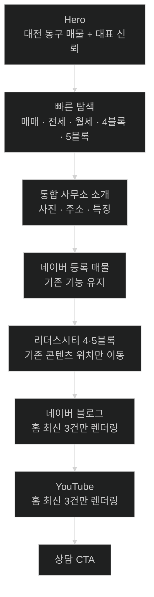

# 리더스시티 행복한부동산 메인페이지 선택 개선안

> 이 문서는 메인페이지 전체 개편안이 아니다.  
> 2026-08-26 사용자가 선택한 **7개 개선 항목만** 구현하기 위한 범위 제한 문서다.  
> Codex는 아래 범위를 넘어선 리팩터링·콘텐츠 변경·기능 추가를 임의로 섞지 않는다.

| 항목 | 내용 |
|---|---|
| 대상 사이트 | https://leaderscityhappy.com/ |
| 저장소 | `myoungsuk/real-estate-website` |
| 기준 브랜치 | 작업 시작 시 실제 default branch 재확인. 2026-08-26 확인 시 `master` |
| 주 대상 파일 | `src/pages/index.astro`, `src/data/home-content.json`, `src/layouts/BaseLayout.astro`, `src/styles/global.css` |
| 보조 확인 파일 | `src/components/ExternalContentList.astro`, `src/lib/content.ts`, `src/lib/naver-listings.ts`, `src/lib/complexes.ts`, `src/pages/properties/index.astro` |
| 구현 원칙 | 현재 Astro SSG + JSON 구조 유지, 작은 변경, 기존 URL·데이터·관리자 기능 보존 |

---

# 1. 이번 작업 범위

이번 작업에서는 아래 **7개 항목만** 구현한다.

1. 첫 화면 Hero 문구 개선
2. Hero에 `매물 보기` CTA 추가
3. 홈 블로그·YouTube 불필요 전체 DOM 렌더링 개선
4. Hero 아래 빠른 탐색 버튼 추가
5. 리더스시티 4·5블록 정보 섹션을 위로 이동
6. 사무소 관련 중복 섹션 2개를 1개로 통합
7. SNS·카카오톡 공유용 OG 이미지 개선

---

# 2. 이번 작업에서 하지 않을 것

다음은 이전 검토에서 제안되었지만 **사용자가 이번 작업 대상으로 선택하지 않았다.**

Codex는 임의로 구현하지 않는다.

- 메인 매물 섹션 자체를 Hero 바로 아래로 이동
- 홈 매물 카드의 페이지네이션·정렬 기능 제거
- 홈 매물을 최근 6건만 실제 렌더링하도록 변경
- `허위매물 0건`, `중개사고 0건` 등의 현재 운영지표 교체
- 블로그와 YouTube를 하나의 통합 섹션으로 재설계
- FAQ를 메인페이지에 신규 추가
- 전체 헤더·푸터 디자인 개편
- 전체 컬러 시스템 교체
- 프레임워크 교체
- DB 또는 신규 서버 도입
- 관리자 기능 변경
- 네이버 매물 데이터 스키마 변경
- SEO 전면 개편
- 관련 없는 공통 컴포넌트 대규모 리팩터링

필요한 CSS 조정은 허용하지만 선택된 7개 항목을 구현하기 위한 최소 범위로 제한한다.

---

# 3. 현재 메인페이지 구조

현재 `src/pages/index.astro`의 흐름은 대략 다음과 같다.

```text
Hero: 대표 공인중개사 소개
↓
리더스시티 단지 사진
↓
사무소/지역 전문 소개
↓
네이버 등록 매물
↓
네이버 블로그
↓
YouTube
↓
리더스시티 4·5블록 정보
↓
상담
```

이번 개선 후 권장 구조는 다음과 같다.

```text
Hero
↓
빠른 탐색
↓
통합된 사무소·지역 전문 소개
↓
네이버 등록 매물
↓
리더스시티 4·5블록 정보
↓
네이버 블로그
↓
YouTube
↓
상담
```

중요:

- **매물 섹션은 이번 작업에서 Hero 바로 아래로 올리지 않는다.**
- 대신 사무소 관련 2개 섹션을 1개로 줄여 전체 길이를 압축한다.
- 리더스시티 정보는 블로그·YouTube보다 위로 이동한다.
- 블로그와 YouTube는 별도 섹션을 유지한다.

---

# 4. 개선 1: 첫 화면 Hero 문구

## 4.1 현재 문제

현재 Hero의 핵심 문구는 신뢰 메시지는 좋지만 첫 방문자가 즉시 알아야 하는 다음 정보가 H1에서 바로 드러나지 않는다.

- 어느 지역을 다루는지
- 무엇을 안내하는지
- 이 사이트가 어떤 부동산인지

현재 문구의 장점인 신뢰 메시지는 버리지 않고 보조 문장으로 살린다.

## 4.2 권장 문구

`src/data/home-content.json`의 현재 스키마를 유지한다.

새로운 필드를 추가하지 않는 방향을 우선한다.

### `broker.headline`

```text
대전 동구 매물, 직접 확인하고 비교해서 안내합니다.
```

### `broker.lead`

```text
리더스시티 4·5블록을 가까이에서 확인하는 백진옥 공인중개사가 대전 동구의 매매·전세·월세를 조건별로 차분하게 안내합니다. 한 번의 계약보다 오래 믿고 연락할 수 있는 파트너가 되겠습니다.
```

### `broker.eyebrow`

현재 값이 디자인상 자연스럽다면 유지한다.

임의로 과장형 문구를 추가하지 않는다.

## 4.3 구현 원칙

- 하드코딩보다 기존 `home-content.json` 데이터 구조를 사용한다.
- 관리자에서 해당 필드를 편집하는 기존 기능이 있으면 호환성을 깨지 않는다.
- `H1`은 페이지당 현재처럼 하나를 유지한다.
- "최저가", "급매", "1등", "무조건", "최고" 등 검증하기 어려운 표현은 추가하지 않는다.

---

# 5. 개선 2: Hero에 매물 보기 CTA 추가

## 5.1 현재 상태

현재 Hero에는 다음 CTA가 있다.

```text
전화 상담
문자로 문의하기
```

처음 방문한 사람 중에는 상담 전에 매물을 먼저 확인하려는 사용자가 많으므로 매물 탐색 진입점을 추가한다.

## 5.2 요구사항

Hero에 다음 링크를 추가한다.

```text
현재 매물 보기
→ /properties/
```

가능하면 현재 `naverListings.length`를 재사용하여 다음처럼 실제 건수를 표시한다.

```text
현재 매물 {N}건 보기
```

단, UI가 지나치게 복잡해지거나 Hero가 모바일에서 3줄 이상 버튼으로 깨지면 단순한:

```text
현재 매물 보기
```

를 사용해도 된다.

## 5.3 CTA 우선순위

권장:

```text
[현재 매물 보기]  [전화 상담]
[문자로 문의하기]
```

또는 현재 디자인 시스템에 가장 자연스러운 3-button 구성.

중요:

- `tel:` 링크 유지
- `sms:` 링크 유지
- 기존 전화번호 데이터 사용
- 전화번호 하드코딩 금지
- 모바일 360px에서 가로 넘침 금지
- 주요 터치 영역 44×44px 이상 유지

---

# 6. 개선 3: 홈 블로그·YouTube DOM 렌더링 최적화

## 6.1 현재 문제

현재 홈은 대략 다음 방식이다.

```astro
<ExternalContentList items={publishedBlogContents} pageSize={9} />
<ExternalContentList items={publishedYoutubeContents} pageSize={6} />
```

그런데 `ExternalContentList.astro`는 전달받은 `items` 전체를 HTML 카드로 렌더링하고 JavaScript에서 페이지 바깥 항목을 `hidden` 처리한다.

따라서 화면에는 일부 카드만 보여도 홈 HTML/DOM에는 전체 블로그·YouTube 항목이 포함될 수 있다.

홈페이지는 외부 콘텐츠 아카이브 페이지가 아니므로 전체 데이터를 렌더링할 필요가 없다.

## 6.2 이번 작업의 최소 변경 방식

`ExternalContentList.astro` 전체 동작을 대규모로 바꾸지 않는다.

홈에서 전달하는 배열 자체를 제한하는 방향을 우선한다.

예:

```ts
const homeBlogContents = publishedBlogContents.slice(0, 3);
const homeYoutubeContents = publishedYoutubeContents.slice(0, 3);
```

그리고:

```astro
<ExternalContentList
  items={homeBlogContents}
  emptyLabel="공개할 블로그 글을 준비하고 있습니다."
  pageSize={3}
/>

<ExternalContentList
  items={homeYoutubeContents}
  emptyLabel="공개할 유튜브 영상을 준비하고 있습니다."
  pageSize={3}
/>
```

## 6.3 중요 범위 제한

이번 작업은:

- 블로그 섹션 삭제 아님
- YouTube 섹션 삭제 아님
- 두 섹션 통합 아님
- 콘텐츠 전체 페이지 `/blog/`, `/youtube/` 변경 아님
- 데이터 삭제 아님

홈에서만 최신 일부 항목을 전달하여 실제 DOM 생성량을 줄이는 작업이다.

`publishedBlogContents`, `publishedYoutubeContents`가 이미 최신순으로 정렬되는지 `src/lib/content.ts`를 먼저 확인한다.

정렬이 보장되지 않으면 홈에서 임의 정렬 로직을 중복 작성하지 말고 기존 공통 로직을 우선 사용한다.

---

# 7. 개선 4: 빠른 탐색 버튼

## 7.1 목적

Hero에서 바로 아래 단계로 이동할 수 있게 한다.

복잡한 검색 UI가 아니라 **짧은 바로가기 그룹**을 만든다.

## 7.2 구성

권장 구성:

```text
찾는 조건으로 바로 보기

[매매] [전세] [월세]

[리더스시티 4블록] [리더스시티 5블록]
```

## 7.3 거래유형 링크

현재 `/properties/` 페이지는 URL query의 `trade` 값을 읽는다.

따라서 다음 링크를 사용한다.

```text
매매
/properties/?trade=sale

전세
/properties/?trade=jeonse

월세
/properties/?trade=monthly-rent
```

새 JavaScript 필터 로직을 메인에 중복 구현하지 않는다.

## 7.4 단지 링크

현재 실제 단지 slug를 코드에서 확인한 뒤 기존 상세 URL을 재사용한다.

예상 구조:

```text
/complexes/leaders-city-4/
/complexes/leaders-city-5/
```

slug를 문자열 여러 군데 중복 하드코딩하는 것보다 기존 `publishedComplexes` 데이터를 활용할 수 있으면 그 방식을 우선한다.

단, 작은 MVP에 불필요한 추상화 계층을 새로 만들지는 않는다.

## 7.5 디자인

- Hero와 다음 섹션 사이에서 자연스럽게 연결
- 과도한 카드형 UI 금지
- 모바일에서 2열 또는 자연스러운 wrap
- 터치 영역 44px 이상
- 키보드 focus 유지
- 현재 차분한 화이트/아이보리/딥네이비/로즈 계열 디자인 유지

---

# 8. 개선 5: 리더스시티 4·5블록 정보 위치 이동

## 8.1 현재 문제

현재 리더스시티 정보는:

```text
매물
↓
블로그
↓
YouTube
↓
리더스시티
```

순서다.

사이트 브랜드와 실제 사무소 위치를 고려하면 지역 전문성을 보여주는 핵심 정보가 외부 콘텐츠보다 뒤에 있다.

## 8.2 변경 후

다음 순서로 이동한다.

```text
네이버 등록 매물
↓
리더스시티 4·5블록 정보
↓
네이버 블로그
↓
YouTube
```

## 8.3 범위

리더스시티 섹션의:

- 현재 데이터
- 카드 내용
- 비교표
- 출처
- 상세 URL

은 이번 작업에서 임의 변경하지 않는다.

핵심은 **섹션 위치 이동**이다.

레이아웃이 부자연스러운 경우 필요한 최소 CSS만 조정한다.

---

# 9. 개선 6: 사무소 관련 2개 섹션 통합

## 9.1 현재 상태

Hero 다음에 사무소/지역 전문 관련 섹션이 연속해서 두 개 있다.

현재 개념:

### 섹션 A

```text
리더스시티 단지 사진
+
리더스시티에서 시작해 대전 동구 전체를 봅니다
```

### 섹션 B

```text
주소
+
대전 동구 지역 전문
+
리더스시티 행복한부동산
+
사무소 소개
+
확인 매물 보기
+
상담 특징 배지
```

내용이 일부 중복되므로 하나의 강한 섹션으로 통합한다.

## 9.2 통합 섹션 권장 구조

```text
[리더스시티 또는 사무소 관련 승인 사진]

대전 동구 지역 전문

리더스시티에서 시작해
대전 동구 전체를 봅니다

리더스시티 4·5블록을 가까이에서 확인하고,
천동·신흥동을 비롯한 대전 동구의
주거 조건과 매물을 함께 비교해 안내합니다.

[사무소 주소]

• 대전 동구 전역 상담
• 매매·전세·월세
• 대표가 직접 상담
• 단지 내 상가 입점

[사무소 자세히 보기]
[오시는 길]
```

## 9.3 데이터 사용

가능한 한 기존 데이터를 그대로 재사용한다.

- `homeContent.office.image`
- `homeContent.office.title`
- `homeContent.office.description`
- `homeContent.office.badges`
- `office.address`
- `office.introduction`
- `/office/`
- `/location/`

새로운 중복 JSON 필드를 추가하지 않는다.

## 9.4 기존 CTA 정리

현재 섹션에 있는 `리더스시티 단지정보 보기` 링크는 이후 리더스시티 전용 섹션이 따로 있으므로 중복된다면 제거 또는 위치 조정 가능하다.

단, 사용자가 선택하지 않은 매물 섹션 재설계로 확대하지 않는다.

---

# 10. 개선 7: SNS·카카오톡 공유 이미지

## 10.1 현재 문제

현재 `BaseLayout.astro`의 Open Graph 공유 이미지는 브랜드 로고 PNG를 사용한다.

```text
/images/brand/leaders-city-happy-logo.png
```

현재 페이지는 `summary_large_image` 형태로 공유되므로 전용 가로형 OG 이미지를 사용하는 편이 적합하다.

## 10.2 신규 이미지

권장:

```text
public/images/brand/og-home.png
```

크기:

```text
1200 × 630
```

## 10.3 디자인 내용

과장된 광고 배너처럼 만들지 않는다.

권장 구성:

```text
[리더스시티 승인 전경 이미지]

리더스시티 행복한부동산
대전 동구 매매 · 전세 · 월세

백진옥 공인중개사
```

가능하면 현재 브랜드 로고를 함께 사용한다.

## 10.4 이미지 원칙

- 저장소에 이미 공개 승인된 사진만 사용
- 새 외부 사진 다운로드 금지
- 미승인 대표 사진 사용 금지
- 고객/차량번호/개인정보가 보이는 이미지 금지
- 1200×630 실제 raster 이미지 PNG/JPG/WebP 중 소셜 플랫폼 호환성이 좋은 형식 우선
- OG 이미지를 만들기 위해 런타임 의존성을 추가하지 않는다
- 필요하면 개발 시점 로컬 도구로 한 번 생성하고 최종 정적 이미지만 저장한다

## 10.5 BaseLayout 변경

권장 방식:

`BaseLayout.astro`가 선택적으로 OG 이미지를 받을 수 있도록 최소 확장한다.

예:

```ts
interface Props {
  title: string;
  description: string;
  structuredData?: Record<string, unknown> | Record<string, unknown>[];
  shareImage?: string;
  shareImageAlt?: string;
}
```

메인페이지:

```astro
<BaseLayout
  {title}
  {description}
  {structuredData}
  shareImage="/images/brand/og-home.png"
  shareImageAlt="리더스시티 행복한부동산 대전 동구 매매·전세·월세 안내"
/>
```

다른 페이지는 현재 default 이미지를 그대로 사용할 수 있게 한다.

또는 전체 사이트 공통 공유 이미지로 사용하는 것이 더 자연스럽다고 코드 구조상 판단되면 그 이유를 완료 보고에 적고 최소 변경으로 적용한다.

## 10.6 메타데이터

실제 이미지 크기에 맞게 다음도 정정한다.

```html
<meta property="og:image:width" content="1200" />
<meta property="og:image:height" content="630" />
```

`twitter:image`, `og:image`, `og:image:alt`도 동일 자산과 의미로 맞춘다.

---

# 11. 최종 권장 메인 흐름



---

# 12. 접근성·반응형 체크

선택된 변경을 하면서 다음은 반드시 보존한다.

- 360px 가로 넘침 없음
- 주요 터치 영역 44×44px 이상
- 버튼/링크 키보드 focus 표시
- 기존 skip link 유지
- 의미 있는 이미지 alt
- Hero `h1` 하나 유지
- 섹션 heading 단계가 깨지지 않음
- 빠른 탐색이 키보드만으로 사용 가능
- OG 이미지가 실제 페이지 본문에 불필요하게 표시되지 않음
- 모바일 하단 전화·문자 CTA와 신규 빠른 탐색 UI가 겹치지 않음

---

# 13. 성능 체크

이번 작업에서 특히 확인할 것:

## 변경 전

홈에서 `ExternalContentList`에 블로그/YouTube 전체 배열 전달.

## 변경 후

홈에서는 최신 3건씩만 전달.

검증 항목:

- 생성 HTML 크기 감소 여부
- 블로그 전체 페이지 정상
- YouTube 전체 페이지 정상
- 홈의 pagination 불필요 생성 여부
- JavaScript 오류 없음
- `npm run build` 정상

Lighthouse 점수를 억지로 특정 수치에 맞추기 위해 범위를 확대하지 않는다.

---

# 14. 예상 변경 파일

Codex가 실제 코드를 확인하여 최종 결정한다.

우선 예상:

```text
src/pages/index.astro
src/data/home-content.json
src/layouts/BaseLayout.astro
src/styles/global.css
public/images/brand/og-home.png
tests/...
docs/...
```

필요할 수 있는 파일:

```text
src/components/ExternalContentList.astro
src/lib/content.ts
```

단, 홈에서 배열을 slice하는 것만으로 해결된다면 공통 컴포넌트는 수정하지 않는다.

---

# 15. 테스트 요구사항

기존 테스트를 유지하고 필요한 최소 테스트를 추가한다.

최소 확인:

- Hero H1 새 문구 표시
- `/properties/` 매물 보기 링크 존재
- `trade=sale`, `trade=jeonse`, `trade=monthly-rent` 빠른 링크 존재
- 리더스시티 4블록/5블록 링크 존재
- 사무소 중복 섹션이 하나로 통합됨
- 블로그 홈 렌더링 항목 수 최대 3
- YouTube 홈 렌더링 항목 수 최대 3
- `/blog/` 전체 페이지 데이터 감소 없음
- `/youtube/` 전체 페이지 데이터 감소 없음
- 리더스시티 섹션이 홈에서 블로그·YouTube보다 앞에 존재
- OG image URL이 `/images/brand/og-home.png`
- OG width/height가 실제 이미지와 일치
- 기존 매물 페이지 기능 정상
- 기존 전화/SMS/카카오톡 링크 정상

---

# 16. 검증 명령

가능한 범위에서 실제 실행:

```bash
npm ci
npm test
npm run check
npm run build
npx wrangler deploy --dry-run
```

실행하지 않은 검사를 통과했다고 보고하지 않는다.

브라우저 확인 가능 시:

```text
/
360px
390px
768px
desktop

/properties/
/complexes/
/blog/
/youtube/
```

를 확인한다.

---

# 17. Codex에 그대로 전달할 프롬프트

```text
리더스시티 행복한부동산 홈페이지의 메인페이지를 개선해줘.

저장소:
https://github.com/myoungsuk/real-estate-website

중요:
이번 작업은 전체 메인페이지 리뉴얼이 아니다.
사용자가 선택한 아래 7개 항목만 구현해라.

1. 첫 화면 Hero 문구 개선
2. Hero에 매물 보기 CTA 추가
3. 홈 블로그·YouTube 불필요 전체 DOM 렌더링 개선
4. Hero 아래 빠른 탐색 버튼 추가
5. 리더스시티 4·5블록 정보 섹션을 블로그/YouTube보다 위로 이동
6. Hero 아래에 연속된 사무소 관련 2개 섹션을 1개로 통합
7. SNS·카카오톡 공유용 OG 이미지 개선

절대 범위를 넓히지 마라.

이번 작업에서 하지 말 것:
- 매물 섹션 자체를 Hero 바로 아래로 옮기기
- 홈 매물 페이지네이션/정렬 제거
- 홈 매물을 6건만 실제 렌더링하도록 변경
- 허위매물 0건/중개사고 0건 운영지표 변경
- 블로그와 YouTube 섹션 통합
- FAQ 신규 추가
- 전체 헤더/푸터 개편
- 전체 디자인 시스템 교체
- 네이버 매물 데이터 스키마 변경
- 관리자 기능 변경
- 관련 없는 리팩터링
- 프레임워크/DB/서버 추가

작업 시작 전 반드시:
1. 현재 default branch와 최신 commit 확인
2. CODEX.md 확인
3. 서비스 기획서/시스템 설계서/개발 체크리스트 확인
4. src/pages/index.astro 확인
5. src/data/home-content.json 확인
6. src/layouts/BaseLayout.astro 확인
7. src/styles/global.css 확인
8. src/components/ExternalContentList.astro 확인
9. src/lib/content.ts 확인
10. src/lib/naver-listings.ts 확인
11. src/pages/properties/index.astro의 query 처리 확인
12. src/lib/complexes.ts와 실제 리더스시티 slug 확인
13. 관련 tests 확인

실제 코드가 이 프롬프트의 가정보다 최신이면 실제 코드와 CODEX.md를 우선해라.
다만 사용자가 정한 이번 작업 범위는 유지한다.

────────────────────────
A. Hero 문구
────────────────────────

현재 home-content.json 스키마를 유지하는 방향을 우선해라.

권장:

broker.headline:
"대전 동구 매물, 직접 확인하고 비교해서 안내합니다."

broker.lead:
"리더스시티 4·5블록을 가까이에서 확인하는 백진옥 공인중개사가 대전 동구의 매매·전세·월세를 조건별로 차분하게 안내합니다. 한 번의 계약보다 오래 믿고 연락할 수 있는 파트너가 되겠습니다."

새 field를 추가할 필요가 없다면 추가하지 마라.
기존 관리자 편집 호환성을 깨지 마라.

────────────────────────
B. Hero 매물 CTA
────────────────────────

Hero에 /properties/ 링크를 추가해라.

가능하면 현재 naverListings.length를 사용해:

"현재 매물 N건 보기"

형태로 표시한다.

UI가 복잡해지면:

"현재 매물 보기"

도 허용한다.

기존 전화 상담, 문자 문의 기능은 유지한다.
전화번호 하드코딩 금지.

────────────────────────
C. 외부 콘텐츠 DOM 최적화
────────────────────────

현재 홈이 publishedBlogContents 전체와 publishedYoutubeContents 전체를 ExternalContentList에 전달하고,
ExternalContentList가 전체 items를 HTML로 렌더링한 뒤 hidden 처리하는 구조인지 확인해라.

맞다면 공통 컴포넌트를 대규모 수정하지 말고 홈에서 실제 전달 배열을 제한하는 최소 변경을 우선해라.

예:

const homeBlogContents = publishedBlogContents.slice(0, 3);
const homeYoutubeContents = publishedYoutubeContents.slice(0, 3);

홈에서는 각각 최신 3건만 실제 렌더링한다.

중요:
- /blog/ 전체 목록에는 영향 없음
- /youtube/ 전체 목록에는 영향 없음
- 데이터 삭제 금지
- 블로그/YouTube 섹션 통합 금지
- 기존 전체 보기 버튼 유지
- published*Contents의 정렬 보장 여부를 먼저 확인

────────────────────────
D. 빠른 탐색
────────────────────────

Hero 바로 아래에 작고 명확한 바로가기 영역을 추가해라.

구성:

매매
→ /properties/?trade=sale

전세
→ /properties/?trade=jeonse

월세
→ /properties/?trade=monthly-rent

리더스시티 4블록
→ 실제 기존 상세 URL

리더스시티 5블록
→ 실제 기존 상세 URL

properties 페이지가 현재 query를 지원하는지 먼저 확인하고 기존 로직을 재사용해라.

단지 URL도 실제 slug를 확인해라.
불필요한 새 JavaScript 필터를 만들지 마라.

모바일 360px에서 자연스럽게 wrap되고 각 터치 영역은 44px 이상이어야 한다.

────────────────────────
E. 리더스시티 섹션 위치
────────────────────────

현재 리더스시티 4·5블록 정보가 블로그/YouTube 뒤에 있다면 위치만 이동해라.

변경 후:

네이버 등록 매물
→ 리더스시티 4·5블록
→ 네이버 블로그
→ YouTube
→ 상담

리더스시티 데이터, 비교표, 출처, 상세 URL은 이번 작업에서 임의로 수정하지 마라.

────────────────────────
F. 사무소 관련 섹션 통합
────────────────────────

Hero 아래의:

1) area-photo-feature 계열 섹션
2) office-specialist 계열 섹션

이 실제로 별도 중복 섹션인지 확인해라.

맞다면 하나의 통합 섹션으로 만들어라.

가능한 한 다음 기존 데이터를 재사용해라.

homeContent.office.image
homeContent.office.title
homeContent.office.description
homeContent.office.badges
office.address
office.introduction
/office/
/location/

새로운 중복 JSON 데이터는 만들지 마라.

통합 결과에는:
- 승인된 사진
- 지역 전문 제목/설명
- 주소
- 기존 상담 특징 badges
- 사무소 자세히 보기
- 오시는 길

정도가 자연스럽게 보이면 된다.

리더스시티 단지정보 CTA가 별도 리더스시티 섹션과 중복되면 제거 또는 위치 조정 가능하다.

────────────────────────
G. OG 공유 이미지
────────────────────────

현재 BaseLayout이 로고 이미지를 og:image/twitter:image로 사용하는지 확인해라.

메인페이지 공유용 전용 이미지를 만든다.

권장 경로:
public/images/brand/og-home.png

권장 크기:
1200x630

이미지는 저장소에 이미 공개 승인된:
- 리더스시티 이미지
- 브랜드 로고

만 사용한다.

외부에서 새 이미지를 가져오지 마라.
미승인 이미지 사용 금지.

문구 예:
"리더스시티 행복한부동산"
"대전 동구 매매 · 전세 · 월세"
"백진옥 공인중개사"

광고 배너처럼 과장하지 말고 현재 브랜드 디자인과 맞춰라.

필요하면 BaseLayout에 optional shareImage/shareImageAlt prop을 최소 추가하여
메인에서만 og-home.png를 쓰게 해라.

기존 페이지의 default OG 동작은 깨지지 않게 한다.

실제 이미지 크기에 맞게:
og:image:width
og:image:height
og:image:alt
twitter:image
도 맞춰라.

OG 정적 이미지를 만들기 위해 런타임 dependency를 새로 추가하지 마라.
개발 시점 로컬 도구로 한 번 생성한 뒤 정적 결과물만 저장하는 방식은 허용한다.

────────────────────────
권장 최종 메인 순서
────────────────────────

Hero
→ 빠른 탐색
→ 통합 사무소·지역 전문 소개
→ 네이버 등록 매물
→ 리더스시티 4·5블록 정보
→ 네이버 블로그
→ YouTube
→ 상담

중요:
매물 섹션을 Hero 바로 아래로 올리는 것은 이번 범위가 아니다.

────────────────────────
접근성/반응형
────────────────────────

반드시 유지:
- 360px 가로 넘침 없음
- 44x44px 이상 터치 영역
- 키보드 focus
- h1 하나
- skip link
- 이미지 alt
- 모바일 하단 CTA와 겹치지 않음
- 기존 네이버 매물/전화/SMS/카카오톡 기능 정상

────────────────────────
테스트
────────────────────────

필요한 최소 테스트를 추가해라.

확인:
- Hero 새 H1
- /properties/ CTA
- 매매/전세/월세 query 링크
- 4블록/5블록 링크
- 사무소 중복 섹션 통합
- 홈 블로그 최대 3건 실제 렌더링
- 홈 YouTube 최대 3건 실제 렌더링
- /blog/ 전체 데이터 유지
- /youtube/ 전체 데이터 유지
- 리더스시티가 블로그/YouTube보다 앞
- OG image 정상
- OG 이미지 실제 크기와 metadata 일치
- 기존 매물 기능 정상

────────────────────────
검증
────────────────────────

가능한 범위에서 실제 실행:

npm ci
npm test
npm run check
npm run build
npx wrangler deploy --dry-run

실행하지 못한 검사는 통과했다고 보고하지 마라.

문서 변경이 필요한 경우 CODEX.md의 문서 동기화 규칙을 따른다.
단순 레이아웃 변경 때문에 관련 없는 문서를 대량 수정하지 마라.

완료 보고:
1. 작업 전 확인 구조
2. 변경 파일
3. 7개 선택 항목별 구현 결과
4. 기존 기능 영향
5. 성능 개선 내용
6. 모바일/접근성 확인
7. OG 이미지 처리
8. 테스트/빌드 실제 결과
9. Cloudflare/SEO 영향
10. 미실행 검사
11. 이번 범위에서 의도적으로 하지 않은 항목

작업을 완료한 뒤에도 사용자가 선택하지 않은 개선을 덧붙여 구현하지 마라.
```

---

# 18. 완료 기준

- [ ] 선택한 7개 개선만 반영
- [ ] Hero 문구가 대전 동구·매물 안내 목적을 즉시 전달
- [ ] Hero에서 `/properties/`로 바로 이동 가능
- [ ] 매매·전세·월세 바로가기 정상
- [ ] 리더스시티 4·5블록 바로가기 정상
- [ ] 기존 사무소 관련 2개 섹션이 하나로 정리됨
- [ ] 기존 네이버 매물 섹션 기능은 유지
- [ ] 리더스시티 정보가 블로그·YouTube보다 앞에 표시
- [ ] 홈 블로그 실제 렌더링 최대 3건
- [ ] 홈 YouTube 실제 렌더링 최대 3건
- [ ] `/blog/`, `/youtube/` 전체 목록은 그대로 유지
- [ ] 1200×630 OG 공유 이미지 적용
- [ ] 기존 전화·문자·카카오톡 링크 유지
- [ ] 360px 모바일에서 가로 넘침 없음
- [ ] 테스트·check·build 결과 확인
- [ ] 선택하지 않은 개선은 구현하지 않음

---

# 19. 구현 우선순위

Codex가 한 번에 작업하더라도 내부적으로 다음 순서가 안전하다.

```text
1. 현재 코드/문서 확인
2. Hero 문구 + 매물 CTA
3. 빠른 탐색
4. 사무소 2개 섹션 통합
5. 리더스시티 섹션 위치 이동
6. 블로그/YouTube 홈 데이터 slice
7. OG 이미지 및 metadata
8. CSS 반응형 정리
9. 테스트
10. build / wrangler dry-run
```

범위 밖 개선이 보이더라도 이번 작업에서는 수정하지 말고 완료 보고의 "추가 발견 사항" 정도로만 기록한다.
