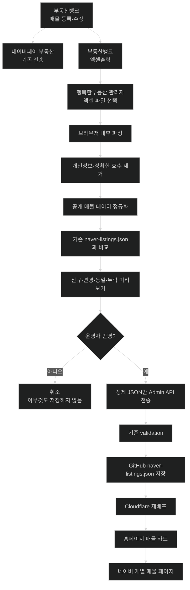

# 부동산뱅크 엑셀 매물 동기화 개선안

> 목적: 부동산뱅크 중개회원 관리자에서 `엑셀출력`한 매물 파일을 리더스시티 행복한부동산 관리자 페이지에서 선택하면, **원본 파일을 서버에 저장하지 않고 브라우저에서 개인정보를 제거한 뒤 공개 가능한 네이버 매물 데이터만 미리보기·검증·반영**할 수 있도록 한다.
>
> 이 문서는 2026-08-26 실제 부동산뱅크 엑셀 출력 파일 `전체 _2026-08-26.xls`과 현재 `myoungsuk/real-estate-website` 저장소 구조를 기준으로 작성했다.

| 항목 | 내용 |
|---|---|
| 대상 사이트 | `https://leaderscityhappy.com/` |
| 저장소 | `myoungsuk/real-estate-website` |
| 기준 브랜치 | 작업 시작 시 actual default branch 재확인. 2026-08-26 확인 시 `master` |
| 입력 파일 | 부동산뱅크 중개회원 관리자 `매물관리 → 엑셀출력` 파일 |
| 출력 데이터 | `src/data/naver-listings.json` |
| 사용자 화면 | 기존처럼 매물 카드 클릭 시 해당 네이버페이 부동산 개별 매물로 이동 |
| 기본 정책 | 원본 엑셀은 브라우저 밖으로 보내지 않음, 공개 허용 필드만 변환, 미리보기 후 저장 |
| 1차 범위 | 매매·전세 중심. 월세는 실제 부동산뱅크 월세 샘플 확보 후 매핑 확정 |
| 사진 | 1차 제외. 엑셀에는 사진 개수만 있고 이미지 URL/파일은 없음 |

---

# 1. 핵심 결론

현재 부동산뱅크는 실제 운영 매물의 앞단 시스템이고, 부동산뱅크에서 등록한 매물이 네이버페이 부동산으로 전송된다.

따라서 네이버 화면을 역으로 크롤링하지 않고 다음 운영 흐름으로 바꾸는 것이 가장 안전하고 현실적이다.



사용자 입장에서는 현재와 동일하다.

```text
홈페이지 매물 카드 클릭
        ↓
https://fin.land.naver.com/articles/{네이버매물번호}
        ↓
네이버페이 부동산 개별 매물
```

바뀌는 것은 **관리자의 데이터 입력 과정**뿐이다.

---

# 2. 실제 부동산뱅크 파일 확인 결과

2026-08-26 제공된 실제 파일을 확인한 결과:

- 파일명: `전체 _2026-08-26.xls`
- 크기: 약 85KB
- 매물 행: **42건**
- 컬럼: **25개**
- 42건 모두 `부동산뱅크 매물번호`와 `네이버 매물번호`가 함께 존재
- 거래 유형 샘플: `매매`, `전세`
- 매물 종류 샘플: `아파트`, `아파트분양권`, `단독/다가구`
- 진행 상태 샘플: `서비스중`, `서비스중 (전자홍보확인서)`

## 2.1 파일 형식

확장자는 `.xls`지만 전통적인 Excel OLE 바이너리 파일이 아니다.

실제 내용은 다음과 같은 **EUC-KR HTML table 형식**이다.

```html
<meta
  http-equiv="Content-Type"
  content="application/vnd.ms-excel; charset=euc-kr">

<html>
  ...
  <table>
    ...
  </table>
</html>
```

따라서 1차 구현은 무거운 Excel 라이브러리를 추가하기보다 브라우저에서 다음 방식으로 처리하는 것을 우선 검토한다.

```text
File
 ↓
ArrayBuffer
 ↓
TextDecoder("euc-kr")
 ↓
DOMParser("text/html")
 ↓
table / tr / td의 textContent만 추출
```

중요:

- 원본 HTML을 `innerHTML`로 화면에 삽입하지 않는다.
- DOMParser로 파싱하더라도 데이터는 `textContent`만 읽는다.
- 현재 부동산뱅크 HTML-table `.xls` 형식만 허용한다.
- 향후 부동산뱅크가 실제 바이너리 XLS/XLSX로 변경하면 추측해서 파싱하지 말고 `지원하지 않는 파일 형식`으로 실패시킨다.

---

# 3. 개인정보 위험 분석

이 기능에서 가장 중요한 부분이다.

실제 엑셀에는 공개 매물에 필요한 필드와 함께 **홈페이지나 GitHub에 들어가면 안 되는 개인정보·내부정보가 섞여 있다.**

실제 42건 샘플 기준:

- `소유자명`: 42건 존재
- `소유자 핸드폰번호`: 일부 행 존재
- `매도자명`: 일부 행 존재
- `매도자 핸드폰번호`: 일부 행 존재
- `매물설명`: 대부분의 행에 정확한 `○○호` 형태가 포함
- `상세설명`: 일부 행에 전화번호 또는 정확한 호수와 같은 공개 제외 정보가 섞임
- `메모`: 이번 샘플은 비어 있지만 필드 자체가 내부 메모 성격이므로 항상 금지

따라서 **원본 엑셀 전체를 Worker, GitHub, Cloudflare, 로그에 업로드하는 구현은 금지한다.**

---

# 4. 개인정보 처리 원칙

## 4.1 원본 파일

원본 `.xls`:

- 브라우저의 `File` 객체로만 읽는다.
- 서버에 업로드하지 않는다.
- `FormData`로 Worker에 전송하지 않는다.
- GitHub에 저장하지 않는다.
- LocalStorage / IndexedDB에 저장하지 않는다.
- 분석 로그에 원본 행 전체를 출력하지 않는다.
- 브라우저 새로고침 시 자연스럽게 사라지게 한다.

## 4.2 즉시 폐기할 컬럼

다음 컬럼은 파싱 과정에서 공개 모델로 복사하지 않는다.

```text
번호
소유자명
소유자 핸드폰번호
매도자명
매도자 핸드폰번호
메모
상세설명
사진 개수
```

`사진 개수`는 개인정보는 아니지만 현재 `naver-listings.json`에 쓸 필요가 없으며 실제 사진 URL도 제공하지 않으므로 1차에서는 폐기한다.

`상세설명`은 공개 문구가 포함될 수도 있지만 실제 샘플에 전화번호·정확한 호수 등이 섞여 있으므로 **1차에서는 통째로 사용하지 않는다.**

## 4.3 부분적으로만 사용할 컬럼

`매물설명`은 `507동 2405호`처럼 동·호 정보가 같이 들어 있다.

따라서 원문을 저장하지 않는다.

아파트/분양권의 경우:

```text
507동 2405호
```

에서 공개 title 생성에 필요한:

```text
507동
```

까지만 추출하고:

```text
2405호
```

는 즉시 버린다.

추출 결과에 `호`가 남아 있으면 변환 실패로 처리한다.

---

# 5. 현재 사이트 구조와의 연결

현재 `src/lib/naver-listings.ts`의 공개 타입은 다음 개념이다.

```ts
interface NaverListing {
  id: string;
  title: string;
  propertyType: string;
  tradeType: "sale" | "jeonse" | "monthly-rent";
  priceLabel: string;
  areaLabel: string | null;
  floorLabel: string | null;
  direction: string | null;
  summary: string;
  confirmedAt: string;
  source: "네이버페이 부동산";
  url: string;
}
```

`src/data/naver-listings.json`:

```json
{
  "checkedAt": "YYYY-MM-DD",
  "items": []
}
```

현재 구조를 유지한다.

새로운 `BankListing` 공개 스키마를 만들어 사이트 전체를 갈아엎지 않는다.

부동산뱅크 데이터는 **입력 포맷**일 뿐이고, 최종 공개 데이터는 기존 `NaverListing`을 계속 사용한다.

---

# 6. 중요한 개인정보 차이: 정확한 층수

이 항목은 반드시 주의한다.

실제 부동산뱅크 엑셀은:

```text
24 / 29
20 / 29
8 / 29
```

처럼 **정확한 해당층**을 제공한다.

그러나 현재 사이트의 같은 네이버 매물은 경우에 따라:

```text
고/29층
중/29층
```

처럼 네이버 공개 광고 수준에 맞춘 층수를 사용하고 있다.

따라서 엑셀의 `해당층/총층`을 그대로 홈페이지에 덮어쓰면 현재보다 더 구체적인 비공개 정보를 공개할 가능성이 있다.

## 6.1 정책

### 기존 매물

같은 네이버 매물번호가 `naver-listings.json`에 이미 존재하면:

- 기존 `floorLabel`을 **그대로 보존**
- 엑셀의 정확한 해당층으로 덮어쓰지 않음

### 신규 매물

신규 네이버 매물번호는 안전한 공개 층수 정보가 없으므로 1차에서는:

```json
"floorLabel": null
```

을 기본으로 한다.

운영자가 네이버 공개 화면에서 확인한 `저/중/고` 등의 공개용 층수 정보를 별도 입력하는 기능을 이번 작업에 추가할지는 **현재 관리자 UX와 범위를 확인 후 최소 구현**으로 판단한다.

중요:

- 정확한 층을 `저/중/고`로 임의 계산하지 않는다.
- "24층이면 고층" 같은 규칙을 코드로 추정하지 않는다.
- 네이버 공개 방식과 다른 정보를 만들어내지 않는다.

---

# 7. 실제 25개 컬럼 매핑표

| 부동산뱅크 컬럼 | 처리 | 공개 데이터 | 규칙 |
|---|---|---|---|
| `번호` | 폐기 | - | 화면 순번일 뿐 식별자로 사용하지 않음 |
| `매물번호 (네이버번호)` | 사용 | `id`, `url` | 부동산뱅크 번호와 네이버 번호를 분리. 네이버 번호만 공개 저장 |
| `거래` | 사용 | `tradeType` | `매매→sale`, `전세→jeonse`; 월세는 샘플 확보 전 보류 |
| `매물종류` | 사용 | `propertyType` | 공백 정규화 후 사용 |
| `소재지` | 검증용 | 기본 미저장 | 현재 공개 스키마에 필드 없음. 서비스 범위 정책을 임의 추가하지 않음 |
| `매물명` | 사용 | `title` 일부 | 단지명. 기존 표기 정규화 규칙 재사용 |
| `매물설명` | 부분 사용 | `title` 일부 | `○○동`만 추출. `○○호` 폐기 |
| `면적(㎡)` | 사용 | `areaLabel` | 공급/전용 면적 파싱 |
| `해당층/총층` | 공개 저장 금지 원칙 | 기존 `floorLabel` 보존 | 신규는 기본 `null` |
| `방향` | 사용 | `direction` | 빈 값은 `null` |
| `방수` | 1차 미사용 | - | 현재 스키마 없음 |
| `욕실수` | 1차 미사용 | - | 현재 스키마 없음 |
| `월관리비` | 1차 미사용 | - | 현재 스키마 없음 |
| `매물가(만원)` | 사용 | `priceLabel` | 거래 유형별 가격 표기. 월세는 샘플 전 보류 |
| `입주가능일` | 1차 미사용 | - | 현재 스키마 없음 |
| `특징` | 사용 후보 | `summary` | 금지 패턴 검사 후 사용 |
| `상세설명` | 폐기 | - | 전화번호·호수 등 혼재 가능 |
| `등록기간` | 사용 | `confirmedAt` 후보 | 시작일 파싱. 의미를 기존 confirmedAt 정책과 대조 |
| `소유자명` | 즉시 폐기 | - | 공개 금지 개인정보 |
| `소유자 핸드폰번호` | 즉시 폐기 | - | 공개 금지 개인정보 |
| `매도자명` | 즉시 폐기 | - | 공개 금지 개인정보 |
| `매도자 핸드폰번호` | 즉시 폐기 | - | 공개 금지 개인정보 |
| `진행상황 (확인방식)` | 검증용 | 기본 미저장 | `서비스중` 여부 확인 |
| `메모` | 즉시 폐기 | - | 내부 메모 |
| `사진 개수` | 1차 미사용 | - | 이미지 자체가 없음 |

---

# 8. 네이버 매물번호 파싱

실제 샘플 형식:

```text
143367919  (  2645754923  )
```

의미:

```text
143367919   = 부동산뱅크 매물번호
2645754923  = 네이버 매물번호
```

파서는 공백 차이를 허용하되 숫자 2개를 명확히 분리해야 한다.

개념 regex:

```regex
^\s*(\d+)\s*\(\s*(\d+)\s*\)\s*$
```

파싱 결과:

```ts
{
  bankListingId: "143367919",
  naverListingId: "2645754923"
}
```

`bankListingId`는 diff 진단을 위해 브라우저 메모리에서 사용할 수 있으나 현재 공개 JSON에는 저장하지 않는다.

네이버 URL:

```ts
const url = `https://fin.land.naver.com/articles/${naverListingId}`;
```

따라서 엑셀로 가져온 매물도 **현재처럼 카드 클릭 시 네이버 개별 매물 페이지로 이동한다.**

네이버 번호가 없거나 형식이 잘못되면 해당 행은 자동 공개하지 않는다.

---

# 9. title 생성 규칙

## 9.1 아파트 / 아파트분양권

예:

```text
매물명: 리더스시티5BL
매물설명: 507동 2405호
```

공개 결과:

```text
리더스시티 5블록 507동
```

다른 예:

```text
대전르에브스위첸1단지 + 103동 1406호
→ 대전르에브스위첸1단지 103동
```

## 9.2 단지명 정규화

현재 사이트에서 이미 사용하는 표기와 최대한 일치시킨다.

예:

```text
리더스시티4BL → 리더스시티 4블록
리더스시티5BL → 리더스시티 5블록
```

이 규칙은 하드코딩이 필요한 소수의 명확한 현재 표기에만 적용한다.

일반적인 단지명을 임의로 재작성하지 않는다.

## 9.3 단독/다가구

실제 샘플에는 `매물명=단독`, `매물설명=4-6 1층` 형태가 존재한다.

아파트의 `○○동` 추출 규칙을 단독/다가구에 억지로 적용하지 않는다.

기존 `naver-listings.json`에서 같은 네이버 ID가 있으면 기존 title을 우선 보존한다.

신규 단독/다가구의 안전한 title 생성 규칙이 현재 데이터만으로 확정되지 않으면:

```text
자동 반영 보류
→ 미리보기에서 '제목 확인 필요'
```

로 표시한다.

---

# 10. 거래 유형

현재 실제 샘플:

```text
매매
전세
```

매핑:

```ts
const tradeMap = {
  "매매": "sale",
  "전세": "jeonse",
};
```

## 월세

**불확실한 사실:** 이번 42건 샘플에는 월세 행이 없어서 `매물가(만원)`이 월세일 때 어떤 형식으로 출력되는지 확인되지 않았다.

따라서:

- `월세`가 나타나면 값을 추측하지 않는다.
- `보증금/월세` 구조를 임의로 가정하지 않는다.
- 1차 구현에서 `지원되지 않은 거래 유형: 월세 샘플 필요`로 미리보기 오류 처리할 수 있다.
- 실제 월세 엑셀 한 건을 확보한 뒤 매핑 테스트를 추가하고 지원한다.

기존 사이트가 `monthly-rent` 타입을 지원한다는 이유만으로 부동산뱅크 입력 형식을 추정하지 않는다.

---

# 11. 가격 변환

부동산뱅크 샘플의 `매물가(만원)`:

```text
39000
52000
45780
27000
```

매매 예:

```text
39000만원 → 3억 9,000
52000만원 → 5억 2,000
45780만원 → 4억 5,780
```

전세도 샘플 형식이 동일한 경우 같은 포맷터를 사용할 수 있다.

가격 숫자가:

- 빈 값
- 음수
- 0
- 숫자 이외
- 비정상적으로 큰 값

이면 자동 반영하지 않는다.

기존 프로젝트에 가격 포맷 함수가 있다면 중복 구현하지 말고 재사용 가능성을 먼저 확인한다.

---

# 12. 면적 변환

실제 형식 예:

```text
81.32B/59.64
100.07A/74.96
111.51C/84.87
154.24B-2/118.83
330/125.45
```

구조:

```text
공급면적/전용면적
```

현재 사이트의 표시 형태와 호환되도록 정규화한다.

예:

```text
81.32B/59.64
→ 81.32B㎡ · 전용 59.64B㎡
```

또는 현재 사이트의 기존 public 형식이 소수점을 줄이는 정책이라면 그 정책을 먼저 확인한다.

중요:

- 타입 suffix `A`, `B`, `C`, `B-2`를 전용면적 표기에 전파할지 여부는 현재 데이터 규칙을 분석해 일관되게 처리한다.
- 파싱 실패 시 원문을 그대로 공개하지 말고 `areaLabel: null` 또는 오류 처리한다.
- 공개 화면과 정렬 함수가 정상 동작하는지 테스트한다.

---

# 13. summary 생성

1차에서는 `특징` 컬럼만 사용한다.

예:

```text
27년 1월 입주 가능 시스템에어컨외 옵션설치
```

→

```json
"summary": "27년 1월 입주 가능 시스템에어컨외 옵션설치"
```

## 13.1 금지 패턴 검사

`특징`에도 향후 민감정보가 들어갈 가능성을 고려하여 다음을 검사한다.

- 휴대전화 번호 패턴
- 일반 전화번호 패턴
- `○○호`
- 주민등록번호 유사 패턴
- 이메일
- 소유자/임대인/임차인 표현과 결합된 개인정보
- 프로젝트 `bannedKeys` 정책과 동일 취지의 금지 정보

금지 패턴이 발견되면 자동 삭제로 조용히 숨기기보다:

```text
요약 문구 확인 필요
```

로 해당 행을 미리보기 오류/경고 처리한다.

`상세설명`에서 summary를 자동 생성하지 않는다.

---

# 14. confirmedAt / checkedAt

## 14.1 `confirmedAt`

실제 `등록기간`:

```text
26.08.24 ~26.09.23
```

의 시작일이 현재 저장된 네이버 매물의 `confirmedAt`과 대응하는 사례가 확인된다.

따라서 시작일을:

```text
2026-08-24
```

로 파싱하는 방안을 우선 사용한다.

단, 작업 전 현재 `confirmedAt`의 운영 의미를 CODEX.md/문서/기존 데이터에서 재확인한다.

## 14.2 `checkedAt`

`naver-listings.json` 최상위 `checkedAt`은 **이번 엑셀 스냅샷을 운영자가 확인·반영한 날짜**로 사용한다.

안전한 방식:

1. 파일명에서 `YYYY-MM-DD`가 존재하면 후보로 표시
2. 관리자 화면에 `파일 기준일`을 보여줌
3. 운영자가 반영 전에 확인
4. 이름에 날짜가 없거나 이상하면 오늘 날짜를 몰래 넣지 말고 확인을 요구

파일명은 사용자가 바꿀 수 있으므로 절대적인 신뢰 근거로 취급하지 않는다.

---

# 15. 진행 상태 처리

실제 샘플:

```text
서비스중
서비스중  (전자홍보확인서)
```

1차 허용:

```text
trim/공백 정규화 후 "서비스중"으로 시작하는 행
```

그 외:

```text
거래완료
종료
중지
전송대기
검증중
```

등 새로운 상태가 나오면 임의 공개하지 않고 `지원 상태 확인 필요`로 표시한다.

---

# 16. 신규·변경·동일·누락 diff 정책

기준 키:

```text
네이버 매물번호
```

## 신규

```text
Excel에는 있음
현재 naver-listings.json에는 없음
```

→ 신규 후보.

단 모든 안전 검증 통과 필요.

## 변경

같은 네이버 매물번호지만 공개 필드가 다름.

예:

```text
홈페이지: 5억 3,000
Excel:    5억 2,000
```

→ 변경 후보.

## 동일

공개 비교 대상 필드가 동일.

→ 아무 작업 없음.

## 누락

```text
현재 홈페이지에는 있음
Excel에는 없음
```

→ **자동 삭제 금지**

이유:

- 운영자가 부동산뱅크에서 검색/필터를 건 뒤 엑셀을 받았을 가능성
- 일부 페이지/일부 상태만 출력했을 가능성
- 부동산뱅크 출력 장애 가능성
- 네이버 광고 상태와 부동산뱅크 목록의 타이밍 차이 가능성

UI:

```text
사이트에만 존재 1건
⚠ 이번 파일에서 확인되지 않았습니다.
자동으로 삭제하지 않습니다.
```

향후 `전체 목록 출력임을 확실히 검증할 수 있는 방법`이 생긴 뒤 종료 동기화를 별도 설계한다.

---

# 17. 기존 데이터 보존 정책

엑셀을 `naver-listings.json` 전체 교체 소스로 사용하지 않는다.

기존 매물이 존재할 때는 필드별 정책을 둔다.

| 필드 | 기존 ID | 신규 ID |
|---|---|---|
| `id` | 네이버 번호 유지 | 네이버 번호 |
| `url` | ID 기반 재생성 가능 | ID 기반 생성 |
| `title` | 안전한 경우 diff 표시 후 갱신 | 안전 파싱 성공 시 생성 |
| `propertyType` | diff 표시 후 갱신 | 생성 |
| `tradeType` | diff 표시 후 갱신 | 생성 |
| `priceLabel` | diff 표시 후 갱신 | 생성 |
| `areaLabel` | diff 표시 후 갱신 | 생성 |
| `floorLabel` | **기존 값 보존** | `null` 기본 |
| `direction` | diff 표시 후 갱신 | 생성 또는 `null` |
| `summary` | `특징` 기반 diff 표시 | 안전 검사 통과 시 생성 |
| `confirmedAt` | 등록기간 시작일 기반 | 생성 |
| `source` | 그대로 유지 | `네이버페이 부동산` |
| `checkedAt` | 파일 반영 기준일 | 동일 |

모든 변경은 저장 전에 미리보기에서 보여준다.

---

# 18. 관리자 UI 설계

현재:

```text
/admin/listings/
    현재 사이트에 반영된 네이버 매물 확인

/admin/listings/editor/
    네이버에서 매물을 관리하라는 안내
```

현재 실제 운영은 부동산뱅크가 원본이므로 `/admin/listings/editor/`를 **부동산뱅크 엑셀 가져오기 화면**으로 개편하는 것이 자연스럽다.

## 18.1 상단

```text
네이버 매물 데이터 가져오기

부동산뱅크 매물관리에서
[엑셀출력]한 파일을 선택해 주세요.

원본 파일은 서버에 업로드하지 않으며,
브라우저에서 개인정보를 제외한 공개 데이터만 저장합니다.
```

버튼:

```text
[부동산뱅크 열기 ↗]
[엑셀 파일 선택]
```

부동산뱅크 관리자 URL을 저장소에 새 비밀값처럼 하드코딩할 필요가 있는지 먼저 검토한다.

## 18.2 파일 선택

```text
┌───────────────────────────────┐
│ 부동산뱅크 엑셀 파일          │
│ 전체 _2026-08-26.xls          │
│                               │
│ 42건 / 25개 컬럼 확인         │
└───────────────────────────────┘

[파일 분석]
```

드래그앤드롭을 추가하더라도 `<input type=file>`을 기본으로 유지한다.

## 18.3 분석 결과

```text
분석 결과

전체             42건
신규              2건
변경              3건
동일             37건
확인 필요          0건
사이트에만 존재    1건
```

그리고:

```text
보안 처리
✓ 소유자 정보 저장 안 함
✓ 매도자 정보 저장 안 함
✓ 전화번호 저장 안 함
✓ 정확한 호수 저장 안 함
✓ 내부 메모 저장 안 함
✓ 원본 파일 서버 전송 안 함
```

## 18.4 변경 미리보기

신규:

```text
[신규]
리더스시티 5블록 507동
아파트 · 매매
3억 9,000
81.32B㎡ · 전용 59.64B㎡
남서향
네이버 매물번호 2645402920

네이버 상세 링크 생성 완료
```

변경:

```text
[가격 변경]
리더스시티 5블록 501동

현재    5억 3,000
변경    5억 2,000
```

정확한 층 정보는 미리보기에도 불필요하게 표시하지 않는다.

## 18.5 저장

```text
[취소] [변경사항 반영]
```

저장 전에:

- 신규 수
- 변경 수
- 오류 수
- 누락 수

를 다시 보여준다.

오류가 있으면 전체 저장을 막을지, 안전한 행만 저장할지는 현재 운영성 판단이 필요하다.

### 권장 1차

**오류가 한 건이라도 있으면 저장 전체 차단**

이유:

- 초기 운영에서 silent partial import보다 안전
- 사용자가 파일/매핑 문제를 즉시 인식 가능
- 42건 규모에서는 수정 후 다시 출력/업로드가 부담이 크지 않음

---

# 19. 관리자 저장 API 재사용

현재 Worker에는 이미 다음 패턴이 있다.

```text
GET /api/admin/v1/content/{resource}
PUT /api/admin/v1/content/{resource}
```

그리고:

- Cloudflare Access 인증
- Email OTP/JWT 검증
- CSRF
- SHA conflict
- content validation
- GitHub 저장

흐름이 구현되어 있다.

새로운 엑셀 업로드 API를 만들지 않고 **정제된 JSON만 기존 content API로 저장**하는 방향을 우선한다.

## 19.1 필요한 확장

현재 `worker/admin-resource-validation.mjs`의 `ADMIN_RESOURCE_PATHS`에 `naver-listings`가 없다.

추가 후보:

```js
"naver-listings": "src/data/naver-listings.json"
```

그리고:

```js
case "naver-listings":
  return validateNaverListings(data);
```

기존 `scripts/content-validation.mjs`의 `validateNaverListings()`를 재사용한다.

## 19.2 보안상 중요한 점

Worker는 **원본 엑셀을 받을 필요가 없다.**

Worker가 받는 것은 다음 구조뿐이다.

```json
{
  "data": {
    "checkedAt": "2026-08-26",
    "items": [
      {
        "id": "2645402920",
        "title": "리더스시티 5블록 507동",
        "...": "..."
      }
    ]
  },
  "sha": "..."
}
```

즉 공개 가능한 JSON만 서버 경계를 넘어간다.

---

# 20. 파서/정규화 코드 구조

과도한 추상화를 만들 필요는 없지만 테스트 가능한 순수 함수 분리는 필요하다.

권장 예:

```text
src/lib/admin/
└─ bank-listing-import.ts
```

또는 현재 관리자 JS 구조에 더 자연스러운 위치.

개념 함수:

```ts
decodeBankExcel(bytes)
parseBankTable(html)
parseBankListingNumber(value)
normalizeBankRow(row)
sanitizePublicTitle(row)
sanitizeSummary(value)
formatBankPrice(value, tradeType)
formatBankArea(value)
buildNaverListing(normalizedRow, existingListing)
diffNaverListings(current, imported)
```

중요:

- DOM 접근과 데이터 변환을 분리
- 개인정보 필드를 반환 타입에 포함하지 않기
- 로그에서 raw row 출력하지 않기
- 실제 저장 데이터와 preview data를 구분

---

# 21. 원본 파일 형식 검증

단순히 `.xls` 확장자만 확인하지 않는다.

최소:

1. 크기 제한
2. 인코딩/HTML 구조 확인
3. `<table>` 존재 확인
4. 헤더 25개 중 필수 헤더 확인
5. 예상하지 못한 형식이면 fail closed

권장 최대 크기:

```text
5MB
```

현재 샘플이 약 85KB이므로 충분한 여유다.

필수 컬럼 최소 세트:

```text
매물번호 (네이버번호)
거래
매물종류
매물명
매물설명
면적(㎡)
방향
매물가(만원)
특징
등록기간
진행상황 (확인방식)
```

개인정보 컬럼이 없다고 실패시킬 필요는 없지만, 존재하더라도 절대로 결과 객체에 복사하지 않는다.

---

# 22. HTML/XSS 안전

입력 파일은 외부 시스템이 생성한 HTML이다.

금지:

```js
preview.innerHTML = sourceHtml;
```

허용:

```text
DOMParser로 별도 Document 파싱
→ td.textContent 추출
→ 문자열 정규화
→ UI 출력 시 framework의 기본 escaping 사용
```

외부 HTML:

- script 실행 금지
- img fetch 금지
- style 적용 금지
- iframe 삽입 금지
- 링크 자동 활성화 금지

원본 HTML 문서를 페이지 DOM에 붙이지 않는다.

---

# 23. 공개 금지 문자열 방어

최종 `NaverListing`을 만들고 저장하기 전에 **2중 검증**한다.

## 1차: importer

title/summary 등의 문자열에:

```text
정확한 호수 패턴
전화번호
이메일
주민번호 유사 패턴
```

검사.

## 2차: 공통 content validation

`validateNaverListings()`와 필요한 개인정보 문자열 검사를 통과시킨다.

현재 `findBannedKeys()`가 key 이름 중심이라면 문자열 안의 개인정보까지 잡는 별도 검사가 필요한지 검토한다.

테스트를 통과시키기 위해 기존 validation을 약화하지 않는다.

---

# 24. 사진 정책

이번 엑셀에는 `사진 개수`만 있고 이미지 URL이나 파일 자체는 없다.

따라서 1차에서는:

- 네이버 사진 크롤링 금지
- 부동산뱅크 My홈페이지 사진 크롤링 금지
- 내부 API 역공학 금지
- 사진 자동 다운로드 금지

현재 `NaverListingCard`의 사진 없는 카드 구조를 유지한다.

향후 부동산뱅크가 공식 사진 export/API를 제공할 때 별도 검토한다.

---

# 25. 관리자 운영 절차

운영자는 앞으로:

```text
1. 부동산뱅크에서 매물 등록·수정
2. 네이버 전송은 기존 부동산뱅크 기능 사용
3. 부동산뱅크 매물관리 → 전체 목록
4. 엑셀출력
5. leaderscityhappy.com/admin/listings/editor/
6. 파일 선택
7. 신규/변경 미리보기
8. 이상 없으면 반영
9. GitHub/Cloudflare 배포 확인
```

으로 운영한다.

홈페이지에서 매물을 다시 한 건씩 입력하지 않는다.

---

# 26. 실패 처리

## 파일 오류

```text
지원하지 않는 부동산뱅크 파일입니다.
매물관리 → 엑셀출력에서 받은 전체 목록 파일인지 확인해 주세요.
```

## 컬럼 변경

```text
부동산뱅크 엑셀 형식이 변경되었습니다.
자동 반영하지 않았습니다.
```

## 네이버 번호 없음

```text
네이버 매물번호가 없어 공개 링크를 만들 수 없습니다.
```

## 개인정보 잔존

```text
공개 금지 정보가 감지되어 해당 파일을 반영하지 않았습니다.
```

구체적인 개인정보 값을 오류 메시지에 다시 표시하지 않는다.

## GitHub 충돌

기존 SHA conflict 흐름을 재사용:

```text
다른 변경이 먼저 저장되었습니다.
최신 내용을 다시 불러온 뒤 파일을 다시 분석해 주세요.
```

---

# 27. 월세 처리

1차 구현에서 가장 중요한 미확정 사항이다.

**불확실한 사실:** 이번 실제 파일에는 월세가 없어 부동산뱅크의 월세 가격 컬럼 표현을 검증하지 못했다.

따라서 Codex는 다음을 하면 안 된다.

```text
"아마 5000/70일 것이다"
"매물가 하나를 보증금으로 쓰고 다른 컬럼을 월세로 쓰자"
```

1차 동작:

```text
월세 행 발견
→ 지원 보류
→ "월세 엑셀 샘플이 필요합니다."
→ 저장 차단
```

향후 월세 매물을 한 건 부동산뱅크에 등록하고 엑셀출력한 샘플을 확보한 뒤 확장한다.

---

# 28. 서비스 범위 처리

실제 엑셀 샘플에는 대전 동구 외 매물도 포함되어 있다.

또 현재 `naver-listings.json`에도 일부 동구 외 공개 매물이 존재한다.

따라서 importer 단계에서:

```text
소재지가 동구가 아니면 무조건 삭제
```

같은 새로운 정책을 임의로 도입하지 않는다.

서비스 범위와 네이버 공개 매물 범위가 다르다면 이는 별도 콘텐츠/사업 정책 문제다.

이번 작업은 **현재 naver-listings 동작을 자동화하는 것**이므로 범위 정책을 바꾸지 않는다.

---

# 29. 테스트 계획

## 파일 파싱

- 실제 형식과 같은 EUC-KR HTML `.xls` 파싱
- 42건 테이블 파싱
- 필수 컬럼 누락 거부
- 잘못된 HTML 거부
- 실제 바이너리 XLS를 잘못 처리하지 않음
- XLSX ZIP 형식 거부 또는 별도 명확한 오류
- 5MB 초과 거부

## 네이버 번호

- `143367919 (2645754923)` 정상 파싱
- 공백 변형 정상 파싱
- 네이버 번호 없음 거부
- 숫자 아닌 값 거부
- 중복 네이버 번호 거부
- URL 정확히 생성

## 개인정보

- 소유자명 결과 객체에 없음
- 소유자 전화번호 결과 객체에 없음
- 매도자명/전화번호 결과 객체에 없음
- 메모 결과 객체에 없음
- 상세설명 결과 객체에 없음
- `507동 2405호` → title에 `507동`만 존재
- 결과 JSON 전체 문자열에 `2405호` 없음
- 전화번호가 `특징`에 들어가면 저장 차단

## 층 정보

- 기존 ID는 기존 `floorLabel` 보존
- Excel의 `24/29`가 기존 `고/29층`을 덮어쓰지 않음
- 신규 ID는 정확한 해당층을 자동 공개하지 않음
- 임의 저/중/고 계산 금지

## 거래

- 매매 → `sale`
- 전세 → `jeonse`
- 월세 샘플 없을 때 저장 차단

## 가격

- 39000 → `3억 9,000`
- 52000 → `5억 2,000`
- 45780 → `4억 5,780`
- 0/음수/문자열 오류 처리

## 면적

- `81.32B/59.64`
- `154.24B-2/118.83`
- `330/125.45`
- 비정상 문자열 오류/nullable 정책 검증

## diff

- 신규 ID 탐지
- 가격 변경 탐지
- summary 변경 탐지
- 동일 항목 무변경
- Excel에 없는 기존 항목 자동 삭제하지 않음
- 순서만 바뀐 경우 불필요한 대규모 diff 방지

## 관리자 API

- `naver-listings` GET
- `naver-listings` PUT
- validation 실패 422
- SHA 충돌 409
- Access 미인증 거부
- CSRF 실패 거부
- raw XLS 업로드 endpoint가 생기지 않았는지 확인

---

# 30. 완료 조건

- [ ] 부동산뱅크 HTML-table `.xls` 파일을 브라우저에서 읽을 수 있음
- [ ] 원본 파일은 서버에 전송되지 않음
- [ ] 25개 컬럼 중 공개 허용 필드만 사용
- [ ] 소유자/매도자 개인정보가 결과 객체에 존재하지 않음
- [ ] 정확한 호수가 결과 JSON에 존재하지 않음
- [ ] 기존 공개용 `floorLabel`을 정확한 엑셀 층수로 덮어쓰지 않음
- [ ] 신규/변경/동일/누락을 관리자에게 보여줌
- [ ] 누락 매물을 자동 삭제하지 않음
- [ ] 네이버 매물번호로 개별 `fin.land.naver.com/articles/{id}` 링크 생성
- [ ] 카드 클릭 동작은 현재와 동일
- [ ] 월세를 추정 구현하지 않음
- [ ] 사진 크롤링을 추가하지 않음
- [ ] `naver-listings.json` 기존 스키마 유지
- [ ] 기존 Admin Access/CSRF/SHA 저장 흐름 재사용
- [ ] 기존 content validation 약화 없음
- [ ] `npm test` 통과
- [ ] `npm run check` 통과
- [ ] `npm run build` 통과
- [ ] `npx wrangler deploy --dry-run` 결과 확인
- [ ] 관련 설계/운영 문서 동기화
- [ ] 실제 브라우저에서 업로드 → 미리보기 → 저장 흐름 검수

---

# 31. 예상 변경 파일

실제 최신 코드 확인 후 Codex가 최소 범위로 확정한다.

예상:

```text
src/pages/admin/listings/editor.astro
src/pages/admin/listings/index.astro
src/lib/admin/... 또는 적절한 importer 모듈
src/styles/admin.css 또는 현재 관리자 스타일 파일
worker/admin-resource-validation.mjs
scripts/content-validation.mjs
tests/...
docs/operations/...
docs/02_천동_리더스시티_행복한부동산_시스템설계서.md
docs/03_천동_리더스시티_행복한부동산_개발진행체크리스트.md
docs/리더스시티 행복한부동산 관리자시스템 설계서.md
docs/리더스시티 행복한부동산 관리자시스템 개발 진행 체크리스트.md
```

가능하면 변경하지 않을 파일:

```text
src/data/naver-listings.json
```

구현 커밋에서 샘플 실제 개인정보가 들어 있는 Excel로 production JSON을 재생성하지 않는다.

테스트 fixture는 **완전히 가상화된 데이터**로 만든다.

실제 제공받은 엑셀 파일을 repository의 fixture로 커밋하지 않는다.

---

# 32. Codex에 그대로 전달할 구현 프롬프트

```text
리더스시티 행복한부동산 관리자에
"부동산뱅크 엑셀 → 네이버 공개 매물 데이터 동기화" 기능을 구현해줘.

저장소:
https://github.com/myoungsuk/real-estate-website

중요:
이번 기능의 목적은 부동산뱅크 중개회원 관리자에서 엑셀출력한 매물 파일을
관리자 브라우저에서 분석하고,
개인정보/비공개 정보를 제거한 공개 데이터만
기존 src/data/naver-listings.json에 반영하는 것이다.

네이버 부동산이나 부동산뱅크를 크롤링하는 기능은 구현하지 마라.
원본 XLS 파일을 Worker/GitHub/Cloudflare로 업로드하지 마라.

━━━━━━━━━━━━━━━━━━━━
0. 작업 전 확인
━━━━━━━━━━━━━━━━━━━━

먼저 반드시 현재 실제 코드를 확인해라.

1. default branch와 최신 commit
2. CODEX.md
3. 서비스 기획서
4. 시스템 설계서
5. 개발 진행 체크리스트
6. 관리자시스템 설계서/체크리스트
7. docs/operations/*
8. package.json
9. src/data/naver-listings.json
10. src/lib/naver-listings.ts
11. src/pages/admin/listings/index.astro
12. src/pages/admin/listings/editor.astro
13. src/pages/properties/index.astro
14. NaverListingCard/NaverListingPager 관련 코드
15. scripts/content-validation.mjs의 validateNaverListings
16. worker/admin-api.mjs
17. worker/admin-resource-validation.mjs
18. worker/github-content.mjs
19. worker/admin-security.mjs
20. 관련 tests/

현재 실제 코드가 이 프롬프트와 다르면 실제 코드와 CODEX.md를 우선하되,
개인정보 보호와 이번 기능 범위는 반드시 지켜라.

━━━━━━━━━━━━━━━━━━━━
1. 실제 부동산뱅크 파일 형식
━━━━━━━━━━━━━━━━━━━━

2026-08-26 실제 부동산뱅크 "엑셀출력" 파일을 확인했다.

파일 확장자는 .xls지만 실제로는:
- EUC-KR HTML
- <table> 기반
- 42행
- 25개 컬럼

형식이다.

25개 컬럼:

번호
매물번호 (네이버번호)
거래
매물종류
소재지
매물명
매물설명
면적(㎡)
해당층/총층
방향
방수
욕실수
월관리비
매물가(만원)
입주가능일
특징
상세설명
등록기간
소유자명
소유자 핸드폰번호
매도자명
매도자 핸드폰번호
진행상황 (확인방식)
메모
사진 개수

무거운 Excel dependency를 먼저 추가하지 말고
현재 형식을 browser-native API로 안전하게 읽을 수 있는지 우선 구현해라.

권장:
File.arrayBuffer()
→ TextDecoder("euc-kr")
→ DOMParser("text/html")
→ table의 textContent 추출

중요:
원본 HTML을 innerHTML로 현재 페이지에 삽입하지 마라.
source의 script/style/img/link를 실행하거나 로드하지 마라.
오직 파싱된 별도 Document에서 textContent만 추출해라.

파일 확장자만 신뢰하지 말고 실제 HTML-table 형식과 필수 컬럼을 검증해라.
예상하지 못한 실제 binary XLS/XLSX는 추측해서 처리하지 말고 명확히 실패시켜라.

원본 파일 최대 크기는 적절히 제한해라. 5MB 정도를 우선 검토해라.

━━━━━━━━━━━━━━━━━━━━
2. 개인정보 절대 원칙
━━━━━━━━━━━━━━━━━━━━

실제 엑셀에는 다음 개인정보/내부정보가 있다.

소유자명
소유자 핸드폰번호
매도자명
매도자 핸드폰번호
정확한 호수
메모

또 상세설명에는 전화번호나 호수 등 비공개 정보가 섞일 수 있다.

절대:
- XLS 원본을 API로 전송하지 마라.
- XLS 원본을 GitHub에 저장하지 마라.
- XLS 원본을 LocalStorage/IndexedDB에 저장하지 마라.
- raw row 전체를 console/log에 출력하지 마라.
- 테스트 fixture에 실제 제공 파일이나 실제 개인정보를 복사하지 마라.

다음 컬럼은 공개 모델에 복사하지 마라:

번호
소유자명
소유자 핸드폰번호
매도자명
매도자 핸드폰번호
메모
상세설명
사진 개수

상세설명은 1차에서 통째로 사용하지 마라.

매물설명은 "507동 2405호" 같은 형식이다.
아파트/분양권 title 생성 시 "507동"만 사용하고 "2405호"는 즉시 버려라.

최종 결과 JSON 전체에 정확한 호수나 전화번호가 남지 않는 테스트를 추가해라.

━━━━━━━━━━━━━━━━━━━━
3. 현재 NaverListing 스키마 유지
━━━━━━━━━━━━━━━━━━━━

새 DB나 새 공개 listing system을 만들지 마라.

현재:

src/data/naver-listings.json

구조와:

src/lib/naver-listings.ts

NaverListing 타입을 유지한다.

현재 필드:

id
title
propertyType
tradeType
priceLabel
areaLabel
floorLabel
direction
summary
confirmedAt
source
url

최상위:

checkedAt
items

을 유지한다.

━━━━━━━━━━━━━━━━━━━━
4. 네이버 링크
━━━━━━━━━━━━━━━━━━━━

실제 "매물번호 (네이버번호)" 값은 예를 들어:

143367919  (  2645754923  )

이다.

첫 번호:
부동산뱅크 매물번호

괄호 안:
네이버 매물번호

공백 차이는 허용하되 두 숫자를 엄격하게 파싱해라.

네이버 매물번호가 2645754923이면:

id:
2645754923

url:
https://fin.land.naver.com/articles/2645754923

를 생성한다.

따라서 홈페이지 카드 클릭은 현재와 동일하게
해당 네이버페이 부동산 개별 매물 페이지로 이동해야 한다.

네이버 매물번호가 없거나 잘못된 행은 자동 공개하지 마라.

━━━━━━━━━━━━━━━━━━━━
5. 거래 유형
━━━━━━━━━━━━━━━━━━━━

실제 샘플에서 확인한 거래는:

매매
전세

이다.

매핑:

매매 → sale
전세 → jeonse

중요:
현재 샘플에는 월세가 없다.

월세 가격이 부동산뱅크 엑셀에서 어떤 형식으로 출력되는지 검증되지 않았으므로
monthly-rent를 추측 구현하지 마라.

월세 행을 만나면:
"월세 엑셀 샘플 확인 필요"
오류로 표시하고 저장을 막아라.

향후 실제 월세 엑셀 한 건이 확보되면 별도 확장 가능하게 현재 코드를 깔끔하게 작성하되,
미사용 adapter/추상화는 만들지 마라.

━━━━━━━━━━━━━━━━━━━━
6. title
━━━━━━━━━━━━━━━━━━━━

아파트 예:

매물명:
리더스시티5BL

매물설명:
507동 2405호

공개 title:
리더스시티 5블록 507동

정규화 후보:
리더스시티4BL → 리더스시티 4블록
리더스시티5BL → 리더스시티 5블록

다른 일반 단지명은 임의로 재작성하지 마라.

매물설명에서 정확한 호수는 결과 객체에 보존하지 마라.

단독/다가구는 샘플 형식이 아파트와 다르다.
기존 같은 네이버 ID가 있으면 기존 title 보존을 우선하고,
신규 단독/다가구 title을 안전하게 만들 수 없는 경우 미리보기에서 확인 필요로 처리해라.

━━━━━━━━━━━━━━━━━━━━
7. 정확한 층수 매우 중요
━━━━━━━━━━━━━━━━━━━━

부동산뱅크 Excel은 "24 / 29"처럼 정확한 층을 갖고 있다.

하지만 현재 사이트의 같은 매물은
"고/29층", "중/29층" 등 네이버 공개용 층 표시를 사용하는 사례가 있다.

따라서:
기존 ID의 floorLabel은 현재 사이트 값을 반드시 보존해라.
엑셀의 정확한 층으로 덮어쓰지 마라.

신규 ID는 공개 가능한 층 수준을 확정할 수 없으면:
floorLabel: null
로 둬라.

24층이면 고층 같은 계산을 임의로 하지 마라.
네이버 공개 정보를 추정해서 만들지 마라.

이 privacy regression을 막는 테스트를 반드시 추가해라.

━━━━━━━━━━━━━━━━━━━━
8. 가격
━━━━━━━━━━━━━━━━━━━━

실제 매물가(만원) 예:

39000 → 3억 9,000
52000 → 5억 2,000
45780 → 4억 5,780
27000 → 2억 7,000

기존 공통 포맷 함수가 있으면 재사용을 우선 검토해라.

0, 음수, NaN, 비정상 값은 거부해라.

월세 가격은 샘플 확보 전 추측하지 마라.

━━━━━━━━━━━━━━━━━━━━
9. 면적
━━━━━━━━━━━━━━━━━━━━

실제 형식 예:

81.32B/59.64
100.07A/74.96
154.24B-2/118.83
330/125.45

공급/전용으로 파싱해 현재 areaLabel 형식과 호환시켜라.

기존 naver-listings.json의 표시 규칙을 먼저 분석해라.
suffix A/B/C/B-2를 어떻게 표시하는지도 기존 정책과 일관되게 처리해라.

파싱 실패 시 원문 전체를 그대로 공개하지 마라.

━━━━━━━━━━━━━━━━━━━━
10. summary
━━━━━━━━━━━━━━━━━━━━

1차 summary는 "특징" 컬럼만 사용해라.

"상세설명"은 사용하지 마라.

특징에서도:
- 전화번호
- 정확한 호수
- 이메일
- 기타 공개 금지 패턴

이 발견되면 해당 행을 오류/확인 필요로 처리해라.

민감 문자열을 오류 메시지에 그대로 다시 출력하지 마라.

━━━━━━━━━━━━━━━━━━━━
11. 날짜
━━━━━━━━━━━━━━━━━━━━

등록기간 예:

26.08.24 ~26.09.23

시작일을 기존 confirmedAt의 의미와 대조해
2026-08-24 형태로 매핑하는 방향을 우선 검토해라.

checkedAt은 파일 스냅샷 확인 날짜다.

파일명 "전체 _2026-08-26.xls"에서 날짜를 읽을 수 있지만
파일명은 사용자가 변경할 수 있으므로 절대값으로 무조건 신뢰하지 마라.

관리자 미리보기에서 파일 기준일을 보여주고 확인 가능한 UX를 만들어라.

━━━━━━━━━━━━━━━━━━━━
12. 진행상태
━━━━━━━━━━━━━━━━━━━━

샘플:

서비스중
서비스중 (전자홍보확인서)

은 허용 후보.

새로운 상태:
종료
거래완료
검증중
전송대기
등이 나타나면 임의로 공개하지 말고 확인 필요로 처리해라.

━━━━━━━━━━━━━━━━━━━━
13. diff 정책
━━━━━━━━━━━━━━━━━━━━

네이버 매물번호를 key로 사용해:

신규
변경
동일
사이트에만 존재

를 구분해라.

신규:
Excel에 있고 현재 JSON에 없음

변경:
같은 ID의 공개 필드가 다름

동일:
공개 필드 동일

사이트에만 존재:
현재 JSON에 있으나 Excel에 없음

중요:
사이트에만 존재하는 매물을 자동 삭제하지 마라.

운영자가 필터된 Excel을 출력했을 수도 있으므로
1차에서는 "이번 파일에서 확인되지 않음" 경고만 보여주고 현재 데이터를 보존해라.

━━━━━━━━━━━━━━━━━━━━
14. 기존 필드 보존
━━━━━━━━━━━━━━━━━━━━

기존 같은 ID가 있을 때:

floorLabel:
반드시 기존 값 보존

나머지:
title
propertyType
tradeType
priceLabel
areaLabel
direction
summary
confirmedAt

은 안전한 변환 후 diff를 보여주고 운영자 반영 대상으로 한다.

source:
네이버페이 부동산 유지

url:
네이버 ID 기반으로 검증/생성 가능

신규 floorLabel:
null 기본

━━━━━━━━━━━━━━━━━━━━
15. 관리자 UI
━━━━━━━━━━━━━━━━━━━━

현재 /admin/listings/editor/가
"네이버에서 매물을 관리합니다" 안내 화면이라면
실제 운영 원본이 부동산뱅크라는 점에 맞춰:

"부동산뱅크 엑셀 가져오기"

화면으로 개편해라.

권장 UX:

1.
부동산뱅크 매물관리에서 엑셀출력한 파일을 선택

2.
파일 분석

3.
분석 요약:

전체 N건
신규 N건
변경 N건
동일 N건
확인 필요 N건
사이트에만 존재 N건

4.
보안 안내:

소유자 정보 저장 안 함
매도자 정보 저장 안 함
전화번호 저장 안 함
정확한 호수 저장 안 함
내부 메모 저장 안 함
원본 파일 서버 전송 안 함

5.
신규/변경사항 미리보기

6.
취소 / 변경사항 반영

초기 버전에서는 오류가 하나라도 있으면 전체 저장을 차단하는 fail-closed 방식을 우선해라.

정확한 층수나 개인정보는 미리보기에도 불필요하게 노출하지 마라.

━━━━━━━━━━━━━━━━━━━━
16. Admin API
━━━━━━━━━━━━━━━━━━━━

새 raw XLS upload endpoint를 만들지 마라.

기존:

GET /api/admin/v1/content/{resource}
PUT /api/admin/v1/content/{resource}

를 재사용하는 방향으로 구현해라.

worker/admin-resource-validation.mjs에 필요하다면:

"naver-listings": "src/data/naver-listings.json"

을 추가하고:

validateNaverListings()

를 연결해라.

기존:
Cloudflare Access
CSRF
SHA conflict
GitHub write
validation

을 모두 그대로 거쳐야 한다.

Worker에는 정제 완료된 공개 JSON만 전송한다.

━━━━━━━━━━━━━━━━━━━━
17. 원본 파일 보안
━━━━━━━━━━━━━━━━━━━━

금지:

XLS 원본 API upload
GitHub commit
public/ 저장
로그 출력
LocalStorage 저장
IndexedDB 저장
테스트 fixture에 실제 파일 복사

테스트 fixture는 가상의 이름/번호/전화번호를 사용하고
실제 사용자 제공 Excel 개인정보를 절대 repository에 넣지 마라.

━━━━━━━━━━━━━━━━━━━━
18. 사진
━━━━━━━━━━━━━━━━━━━━

이번 Excel에는 사진 개수만 있고 실제 사진/URL이 없다.

사진 자동화는 이번 범위에서 제외한다.

네이버/부동산뱅크/My홈페이지 이미지 크롤링 금지.
내부 API 역공학 금지.

━━━━━━━━━━━━━━━━━━━━
19. 서비스 지역
━━━━━━━━━━━━━━━━━━━━

실제 Excel과 현재 naver-listings에는 동구 외 매물이 일부 존재한다.

이번 importer에서 새롭게:
"동구가 아니면 버림"
같은 정책을 추가하지 마라.

이번 작업은 현재 naver-listings 운영을 자동화하는 것이며
영업범위/공개범위 정책 변경 작업이 아니다.

━━━━━━━━━━━━━━━━━━━━
20. 테스트
━━━━━━━━━━━━━━━━━━━━

최소 다음을 실제 테스트해라.

파일:
- EUC-KR HTML .xls
- 필수 헤더
- 잘못된 파일 거부
- 크기 제한

매물번호:
- 부동산뱅크 ID / 네이버 ID 분리
- 네이버 URL 생성
- 중복 ID 거부

개인정보:
- owner/seller 관련 필드 결과에 없음
- phone 결과에 없음
- memo 없음
- 상세설명 없음
- "507동 2405호"에서 "507동"만 공개
- 최종 JSON에 "2405호" 없음
- summary 안 전화번호 감지

층:
- 기존 "고/29층"이 Excel "24/29"로 덮어써지지 않음
- 신규 정확한 층 자동 공개 안 함

거래:
- 매매
- 전세
- 월세 샘플 없을 때 오류

가격:
- 39000
- 52000
- 45780

면적:
- 81.32B/59.64
- 154.24B-2/118.83
- 330/125.45

diff:
- 신규
- 변경
- 동일
- 누락 자동 삭제 안 함

API:
- naver-listings GET/PUT
- 422 validation
- 409 SHA conflict
- 인증/CSRF
- raw XLS endpoint 없음

공개:
- 저장 후 기존 /properties/ 정상
- 홈 NaverListingPager 정상
- 카드 클릭 → 정확한 네이버 ID의 fin.land.naver.com 상세 URL

━━━━━━━━━━━━━━━━━━━━
21. 문서
━━━━━━━━━━━━━━━━━━━━

CODEX.md의 문서 동기화 규칙에 따라
실제 공개/관리자 운영 방식이 바뀌는 문서를 함께 갱신해라.

특히 기존 문서가:
"매물은 네이버에서 직접 등록·수정"
이라고 되어 있다면 실제 운영 흐름:

"부동산뱅크에서 등록·수정
→ 네이버 전송
→ 부동산뱅크 Excel을 관리자에서 공개 데이터로 동기화"

와 맞게 수정해라.

단:
원본 Excel을 저장한다고 잘못 문서화하지 마라.
원본은 브라우저 내부에서만 처리한다.

━━━━━━━━━━━━━━━━━━━━
22. 검증 명령
━━━━━━━━━━━━━━━━━━━━

실제 실행 가능한 범위에서:

npm ci
npm test
npm run check
npm run build
npx wrangler deploy --dry-run

실행하지 않은 검사는 통과했다고 보고하지 마라.

가능하면 브라우저에서:
- admin/listings
- admin/listings/editor
- properties
- 홈 매물 카드
를 모바일/데스크톱으로 확인해라.

━━━━━━━━━━━━━━━━━━━━
23. 완료 보고
━━━━━━━━━━━━━━━━━━━━

1. 작업 전 현재 구조
2. 실제 구현 파일
3. XLS 파싱 방식
4. 개인정보 제거 방식
5. 25개 컬럼 매핑
6. 정확한 층/호수 보호 방식
7. 신규/변경/동일/누락 정책
8. Admin API 변경
9. 사용자 운영 절차
10. 네이버 상세 링크 유지 확인
11. 월세가 아직 제외된 이유
12. 사진 자동화 제외
13. 테스트 실제 결과
14. build/wrangler 결과
15. 보안·개인정보 영향
16. 문서 업데이트
17. 미실행 검사
18. 남은 운영자 확인사항

관련 없는 리팩터링이나 새 서버/DB 도입은 하지 마라.
```

---

# 33. Codex 작업 후 수동 검수 시나리오

## 시나리오 A: 동일 파일 재업로드

1. 같은 Excel 업로드
2. 분석
3. 두 번째 실행 시 변경 0건
4. 불필요한 Git commit 발생하지 않는지 확인

## 시나리오 B: 가격 변경

1. 테스트 fixture에서 가격 39000 → 40000
2. 미리보기:
   - 현재 3억 9,000
   - 변경 4억
3. 승인 후 정확히 한 필드 변경되는지 확인

## 시나리오 C: 신규 매물

1. 신규 Naver ID 추가
2. title에서 호수 제거
3. floorLabel null
4. Naver URL 생성
5. `/properties/` 카드 클릭 확인

## 시나리오 D: 누락

1. 현재 사이트 매물 하나를 Excel fixture에서 제거
2. 삭제되지 않는지 확인
3. `사이트에만 존재` 경고 확인

## 시나리오 E: 개인정보

가상 fixture:

```text
매물설명: 507동 2405호
소유자명: 테스트소유자
소유자 핸드폰번호: 010-0000-0000
특징: 전망 좋은 집
```

최종 JSON:

```text
507동 존재 → 가능
2405호 → 없어야 함
테스트소유자 → 없어야 함
010-0000-0000 → 없어야 함
```

## 시나리오 F: summary에 전화번호

```text
특징:
전망 좋음 문의 010-0000-0000
```

→ 저장 차단.

---

# 34. 향후 확장

## Phase 1

현재 문서 범위:

```text
Excel 수동 다운로드
→ 관리자 업로드
→ 자동 정제/diff
→ 운영자 승인
→ 홈페이지 반영
```

## Phase 2

부동산뱅크가 향후 공식 API/Feed를 제공한다면:

```text
부동산뱅크 API
→ 같은 normalize/sanitize/diff
→ 같은 validation
→ 같은 저장
```

으로 확장한다.

즉 잘 설계하면 바뀌는 것은 **입력 어댑터**뿐이다.

다만 API가 존재하지 않는 현재 단계에서 빈 `BankApiClient` 등 미사용 구조를 미리 만들지 않는다.

## Phase 3

전체 목록임을 공식적으로 식별할 수 있고 종료 상태가 안정적으로 제공될 때:

```text
서비스 종료
→ 자동 숨김/종료 처리
```

를 별도 ADR로 검토한다.

---

# 35. 최종 운영 모습

이 기능이 완성되면 매물 운영은 다음처럼 단순해진다.

```text
어머님

부동산뱅크에서
매물 등록·가격 변경·종료 관리
          │
          ├──── 네이버 전송
          │
          └──── 엑셀출력
                    │
                    ▼
행복한부동산 관리자
엑셀 파일 선택
          │
          ▼
자동으로
개인정보 제거
네이버번호 추출
가격/면적/방향 정리
신규/변경 비교
          │
          ▼
[변경사항 반영]
          │
          ▼
홈페이지
          │
          ▼
매물 카드 클릭
          │
          ▼
네이버 개별 매물
```

목표는 **부동산뱅크에는 한 번만 입력하고, 홈페이지에는 다시 손으로 입력하지 않는 것**이다.

완전자동 API 연동이 없어도 이 구조만으로 현재 반복 작업의 대부분을 제거할 수 있다.
