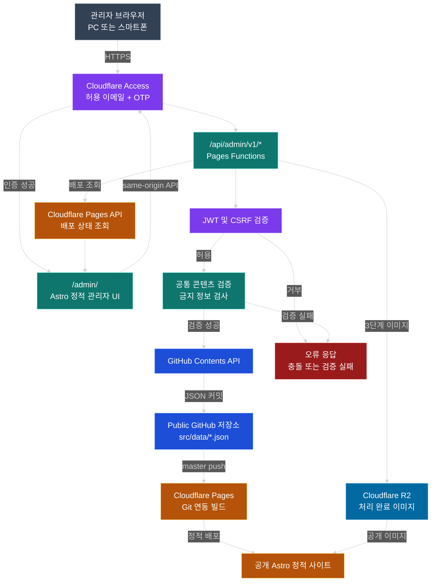
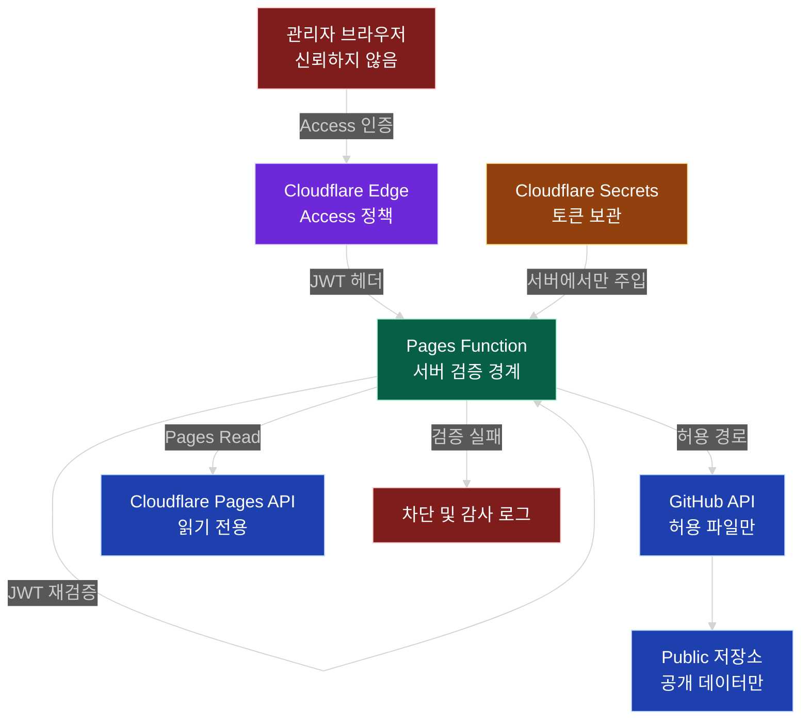
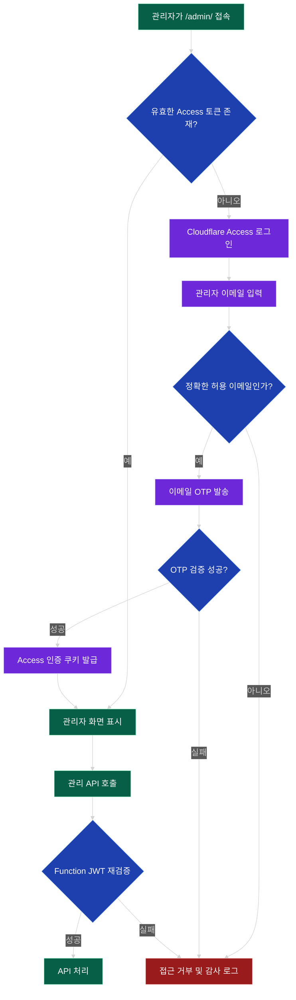
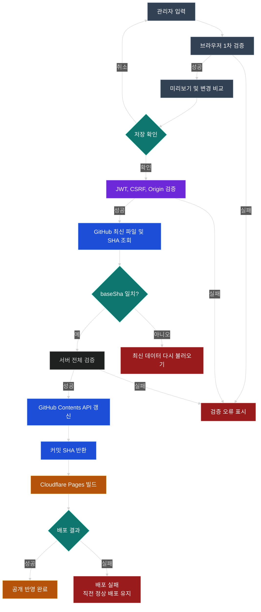
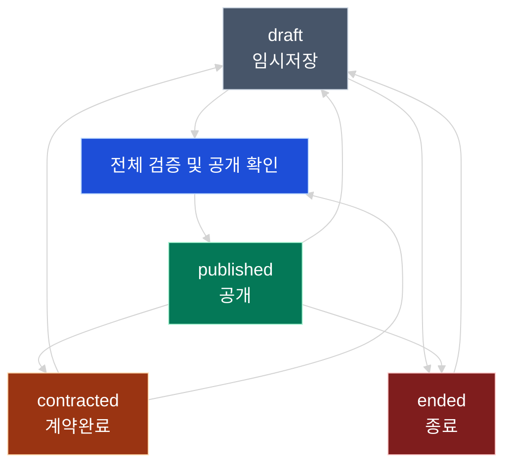
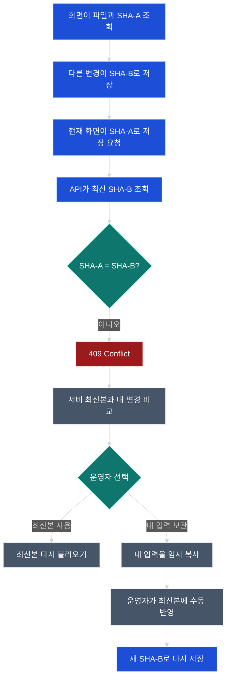
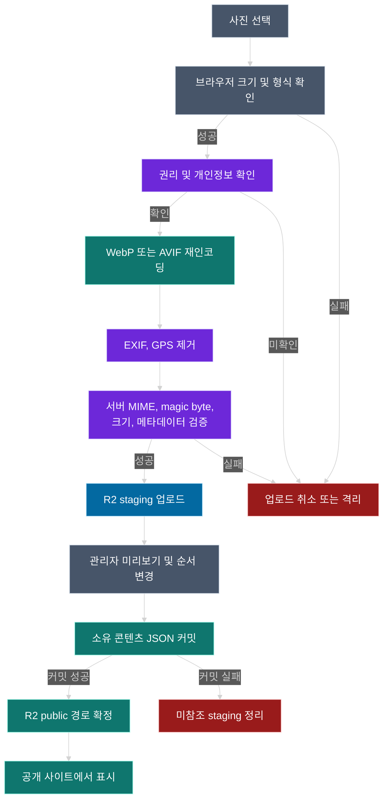

# 리더스시티 행복한부동산 관리자시스템 설계서

> **2026-08-25 네이버 매물 운영 범위 변경**
> 이 결정은 아래 문서의 자체 매물 CRUD 설계보다 우선한다. 매물 등록·수정·종료는 네이버 부동산에서 처리하며 `/admin/listings/`는 사이트에 반영된 네이버 공개 매물 50건의 검색·유형 필터와 개별 매물 링크를 제공한다. `/admin/listings/editor/`는 입력 폼 대신 `office.naverListingsUrl`의 네이버 관리 화면으로 연결한다. `src/data/listings.json` 쓰기와 매물 사진 업로드 UI는 현행 관리자 운영 범위에서 제외하고, 네이버 공개 스냅샷 동기화는 검수 후 빌드 데이터에 반영한다.
>
> 공개 화면은 네이버 카드의 가짜 썸네일 영역을 제거하고 홈 6건 단위 페이징, 전체 목록의 랭킹순·가격순·최신순·면적순 정렬을 제공한다. 블로그와 유튜브는 `/blog/`, `/youtube/`로 분리한다. `/faq/`의 상담 작성 화면은 서버나 DB에 저장하지 않고 이용자의 문자 앱으로만 전달하며, 실제 저장형 상담게시판은 DB·스팸 방어·개인정보 보유/삭제 정책 승인 후 별도 설계한다.

**파일명:** `04_리더스시티_행복한부동산_관리자시스템_설계서.md`

| 항목 | 내용 |
|---|---|
| 문서 ID | HRE-ADMIN-001 |
| 버전 | v1.2 |
| 작성일 | 2026-08-25 |
| 문서 상태 | 콘텐츠 편집 UI·GitHub Contents 저장 API·WebP 업로드 구현 반영 |
| 대상 서비스 | 리더스시티행복한공인중개사사무소 홈페이지 |
| 운영 도메인 | `https://leaderscityhappy.com` |
| 저장소 | `myoungsuk/real-estate-website` |
| 기준 브랜치 | `master` |
| 기본 기술 | Astro 7, TypeScript, Cloudflare Workers Static Assets + 동일 Worker 관리 API |
| 데이터 원칙 | 공개 승인 콘텐츠만 GitHub Public 저장소에 저장 |
| 최종 권장안 | Cloudflare Access + 동일 Worker 관리 API + GitHub Contents API + Workers 자동 배포 |
| 초기 DB | 도입하지 않음 |
| 이미지 초기안 | 비용 0원을 위해 브라우저 WebP 변환 후 GitHub 공개 경로 저장, 규모 증가 시 R2 전환 |
| 구현 여부 | 매물·홈·블로그·유튜브·지역 설명 편집 UI와 허용 JSON·WebP 저장 코드 완료, Production Secret 연결 대기 |

> **2026-08-25 확정 결정**
> 공개 정적 자산과 `/api/admin/*` 관리 API는 Cloudflare Worker 하나로 배포한다. 인증은 Cloudflare Access, 서로 다른 허용 이메일 2개와 Email OTP를 사용한다. 아래의 Pages Functions, Pages Deployment API 및 `functions/` 경로 설명은 이전 대안의 상세안이며 구현 기준으로 사용하지 않는다. 동일 Worker 구현의 기준은 `docs/adr/ADR-004-workers-static-assets-admin-api.md`와 `wrangler.jsonc`이다.

> **2026-08-25 구현 갱신**
> 기준 사이트에서 빠졌던 대표 소개→실제 사무소 사진→매물→블로그→유튜브→리더스시티 설명 흐름을 공개 홈에 반영했다. `/admin/listings/editor/`, `/admin/content/`, `/admin/external-links/`, `/admin/complexes/`에 필드형 편집 화면을 추가했다. 관리 API는 저장소 한 개와 허용 JSON·`public/images/content/` WebP 경로만 수정하며, Access JWT 외에도 동일 Origin, JSON Content-Type, 2시간 HMAC CSRF 토큰, 콘텐츠 스키마와 최신 GitHub SHA를 검증한다. 실제 쓰기는 Production Secret이 모두 준비된 경우에만 활성화한다.

---

## 판정 표기

본 문서에서는 사실과 설계 판단을 다음과 같이 구분한다.

- **[실제 확인된 내용]** GitHub 저장소의 실제 파일, 사용자 최신 지시 또는 공식 문서에서 직접 확인한 내용
- **[설계상 권장 사항]** 본 시스템의 규모, 운영 방식, 보안 및 복구성을 고려해 채택을 권장하는 설계
- **[불확실한 사실]** 공식 자료 간 설명 차이, 환경별 동작 차이 등으로 구현 전에 시험이 필요한 내용
- **[추가 확인 필요]** Cloudflare 대시보드, 운영 도메인, 운영자 승인 등 현재 환경에서 확인하지 못한 내용

---

# 1. 문서 개요

## 1.1 목적

이 문서는 현재 Astro 정적 홈페이지에 다음 기능을 추가하기 위한 구현 기준을 정의한다.

1. 기술을 모르는 운영자도 사용할 수 있는 관리자 전용 화면
2. 자체 회원가입이나 자체 비밀번호 DB 없이 Cloudflare Access로 보호되는 로그인
3. 관리자 화면에서 수정한 공개 콘텐츠를 GitHub의 `src/data/*.json`에 안전하게 반영
4. GitHub 커밋 이후 Cloudflare Pages 자동 빌드 및 배포 상태 확인
5. 공개 저장 금지 정보와 개인정보가 Public 저장소에 들어가지 않도록 다중 검증
6. 모바일과 PC에서 모두 사용할 수 있는 관리 UX
7. 장애 발생 시 GitHub 커밋과 Cloudflare 배포 이력으로 복구할 수 있는 운영 구조

## 1.2 핵심 결론

**[설계상 권장 사항]**

초기 관리자 시스템은 다음 구조를 채택한다.

- 공개 홈페이지는 현재와 같이 Astro 정적 사이트로 유지한다.
- `/admin/`에는 정적 관리자 UI를 배치한다.
- `/api/admin/`에는 Workers Static Assets와 같은 Worker의 관리 API를 배치한다.
- `/admin`, `/admin/*`, `/api/admin`, `/api/admin/*`를 하나의 Cloudflare Access 애플리케이션으로 보호한다.
- 허용된 관리자 이메일 2개와 이메일 OTP를 조합한다.
- Pages Function에서도 Access JWT를 다시 검증한다.
- GitHub 토큰은 브라우저에 전달하지 않고 Cloudflare Secret으로만 보관한다.
- GitHub Contents API로 허용된 JSON 파일만 수정한다.
- 저장 시 최신 GitHub 파일 SHA를 비교해 충돌을 차단한다.
- 초기에는 D1을 도입하지 않는다.
- 사진 관리 기능이 시작되는 3단계부터 R2를 사용한다.
- Public 저장소에 들어가는 `draft`는 비공개 데이터가 아니라 단지 홈페이지 미노출 상태임을 관리자 화면에 명확히 표시한다.

## 1.3 선행 조건

**[추가 확인 필요]**

배포 제품은 Cloudflare Workers Static Assets로 확정하였다. `wrangler.jsonc`에 Worker 진입점과 `ASSETS` 바인딩을 추가하고 `/api/admin` 경로만 `run_worker_first`로 처리한다. 실제 Cloudflare 리소스명, Git 연결과 도메인은 배포 전 대시보드에서 확인한다.

## 1.4 기술 근거 공식 문서

본 설계의 Cloudflare 및 GitHub 관련 기술 근거는 다음 공식 문서를 기준으로 한다.

### Cloudflare 공식 문서

- [Cloudflare Access 이메일 OTP](https://developers.cloudflare.com/cloudflare-one/integrations/identity-providers/one-time-pin/)
- [Cloudflare Access 정책 예시와 OTP 주의사항](https://developers.cloudflare.com/cloudflare-one/access-controls/policies/common-policies/)
- [Access 애플리케이션 경로](https://developers.cloudflare.com/cloudflare-one/access-controls/policies/app-paths/)
- [Access JWT 검증](https://developers.cloudflare.com/cloudflare-one/access-controls/applications/http-apps/authorization-cookie/validating-json/)
- [Access 인증 쿠키](https://developers.cloudflare.com/cloudflare-one/access-controls/applications/http-apps/authorization-cookie/)
- [Cloudflare Pages Functions](https://developers.cloudflare.com/pages/functions/)
- [Pages Functions 바인딩](https://developers.cloudflare.com/pages/functions/bindings/)
- [Pages Git 연동](https://developers.cloudflare.com/pages/configuration/git-integration/)
- [Pages 제한](https://developers.cloudflare.com/pages/platform/limits/)
- [Pages Functions 비용](https://developers.cloudflare.com/pages/functions/pricing/)
- [Pages 배포 목록 API](https://developers.cloudflare.com/api/resources/pages/subresources/projects/subresources/deployments/methods/list/)
- [Pages 롤백](https://developers.cloudflare.com/pages/configuration/rollbacks/)
- [R2 비용](https://developers.cloudflare.com/r2/pricing/)
- [Cloudflare Images 비용](https://developers.cloudflare.com/images/pricing/)
- [Images 바인딩](https://developers.cloudflare.com/images/optimization/binding/)
- [Images 메타데이터 처리](https://developers.cloudflare.com/images/optimization/features/)
- [D1 비용](https://developers.cloudflare.com/d1/platform/pricing/)
- [Workers Rate Limiting 바인딩](https://developers.cloudflare.com/workers/runtime-apis/bindings/rate-limit/)

### GitHub 공식 문서

- [GitHub Contents API](https://docs.github.com/en/rest/repos/contents)
- [Fine-grained personal access token 관리](https://docs.github.com/en/authentication/keeping-your-account-and-data-secure/managing-your-personal-access-tokens)
- [GitHub REST API 사용 모범 사례](https://docs.github.com/en/rest/using-the-rest-api/best-practices-for-using-the-rest-api)
- [GitHub REST API Rate Limit](https://docs.github.com/en/rest/using-the-rest-api/rate-limits-for-the-rest-api)
- [GitHub Actions 비용과 사용량](https://docs.github.com/en/actions/concepts/billing-and-usage)

---

# 2. 현재 시스템 분석

## 2.1 저장소 및 실행 구조

| 분석 항목 | 실제 상태 | 근거 | 관리자 시스템 영향 |
|---|---|---|---|
| 저장소 공개 범위 | Public 저장소 | GitHub 저장소 메타데이터 | 초안도 외부에서 열람 가능하므로 개인정보나 내부 메모 저장 금지 |
| 기본 브랜치 | `master` | GitHub 저장소 메타데이터 | 관리 API의 쓰기 브랜치를 서버 설정으로 고정 |
| 프레임워크 | Astro `7.2.4` | [`package.json`](https://github.com/myoungsuk/real-estate-website/blob/master/package.json) | 기존 프레임워크 유지 |
| 언어 | TypeScript `6.0.3` | `package.json` | 관리자 UI 및 API 타입을 TypeScript로 통일 |
| 출력 모드 | `output: "static"` | [`astro.config.mjs`](https://github.com/myoungsuk/real-estate-website/blob/master/astro.config.mjs) | 공개 페이지는 정적 생성 유지 |
| 빌드 명령 | `npm run build` | `package.json` | 관리자 저장 후 동일 빌드 파이프라인 사용 |
| 빌드 출력 | `dist` | Astro 기본 및 Wrangler 설정 | Pages 출력 디렉터리와 일치 여부 확인 |
| 콘텐츠 저장 | `src/data/*.json` | 저장소 실제 구조 | 초기 관리 API의 단일 원본 |
| 현재 DB | 없음 | 저장소 및 CODEX | 초기에도 D1 미도입 |
| 현재 서버 API | 동일 Worker의 `/api/admin/v1/*` 구현 | `worker/` | GitHub 콘텐츠 저장, 이미지 업로드, 링크 미리보기 제공 |
| 현재 관리자 화면 | `/admin/` 및 콘텐츠별 편집 화면 구현 | `src/pages/admin/` | 매물·홈 콘텐츠·블로그/유튜브·단지 정보 관리 |
| 현재 로그인 | Cloudflare Access JWT 검증 구현 | `worker/admin-security.mjs` | 운영 도메인의 Access 애플리케이션·허용 이메일 설정 필요 |
| CI | `npm ci`, `npm test`, `npm run build` | [`.github/workflows/ci.yml`](https://github.com/myoungsuk/real-estate-website/blob/master/.github/workflows/ci.yml) | 관리자 변경 후 기존 CI를 유지하고 관리자 테스트 추가 |
| 보안 헤더 | CSP, nosniff, frame deny 등 존재 | [`public/_headers`](https://github.com/myoungsuk/real-estate-website/blob/master/public/_headers) | 관리자 경로별 `no-store`, `noindex` 및 더 엄격한 CSP 추가 필요 |

**[실제 확인된 내용]**

현재 `package.json`은 `astro 7.2.4`, `typescript 6.0.3`, `wrangler 4.125.0`을 사용하며, 빌드는 정적 검사와 콘텐츠 검증 후 Astro 빌드를 수행한다.

## 2.2 현재 배포 관련 코드

현재 `wrangler.jsonc`에는 다음이 정의되어 있다.

- 리소스 이름: `leaders-city-happy-realty`
- 정적 자산 디렉터리: `./dist`
- 404 처리: `404-page`
- Worker 스크립트 진입점 없음

이는 저장소만 놓고 보면 Cloudflare Workers Static Assets 배포 형식이다.

또한 `astro.config.mjs`의 기본 사이트 주소는 다음과 같다.

- `https://leaders-city-happy-realty.workers.dev`

실제 도메인을 사용하려면 Production 환경에서 `PUBLIC_SITE_URL`을 설정해야 한다.

**[추가 확인 필요]**

사용자 제공 정보에 따르면 실제 운영은 다음과 같다.

- Cloudflare Pages 프로젝트: `real-estate-website`
- GitHub 연동 자동 배포
- Production 브랜치: `master`
- 운영 도메인: `leaderscityhappy.com`

그러나 현재 검토 환경에서는 Cloudflare 대시보드에 접근하지 않았고, 운영 도메인의 HTTP 응답도 가져오지 못했다. 이는 사이트가 실제로 중단되었다는 의미가 아니라 현재 검토 환경에서 응답을 검증하지 못했다는 뜻이다.

## 2.3 현재 콘텐츠 구조

### 사무소 정보

`src/data/office.json`에는 다음 필드가 존재한다.

- `legalName`
- `brandName`
- `serviceArea`
- `representative`
- `mobile`
- `address`
- `registrationNumber`
- `businessNumber`
- `email`
- `hours`
- `parking`
- `introduction`
- `publicClaims`
- `naverPlaceUrl`
- `naverBlogUrl`
- `youtubeUrl`
- `kakaoUrl`

법적 상호, 브랜드명, 전문 지역, 대표자, 전화번호, 공개 이메일, 주소, 중개사무소 등록번호, 사업자등록번호, 영업시간, 주차, 소개 문안, 카카오톡과 운영자 확인 기준 공개 현황이 등록되어 있다. 공개 이메일은 `packjinok123@gmail.com`이며, 운영 현황은 `허위매물 0건`, `중개사고 0건`이다.

### 매물

`src/data/listings.json`은 현재 빈 배열이다.

공개 사이트에는 이 자체 등록 매물과 별도로 `src/data/naver-listings.json`의 네이버 공개 매물 스냅샷 50건이 표시된다. 이 파일은 네이버에 공개된 동 번호·광고 층수·가격·면적과 개별 상세 URL만 저장하며, 현재 관리자 편집·쓰기 허용 범위에는 포함하지 않는다.

현재 `Listing` 타입에는 다음 상태와 거래유형이 정의되어 있다.

- 상태: `draft`, `published`, `contracted`, `ended`
- 거래유형: `sale`, `jeonse`, `monthly-rent`
- 지역: `district`, `neighborhoodSlug`, `neighborhoodName`, 선택 `complexName`

`published` 매물만 공개 목록과 정적 상세 페이지에 포함되고, 최근 확인일의 내림차순으로 정렬된다.

### 단지

`src/data/complexes.json`에는 리더스시티 4블록과 5블록이 각각 한 건씩 공개 상태로 존재한다. 각 항목은 운영자 제공 현장 사진, 기본 사실 배열, 생활 특징 배열, 복수 HTTPS 출처와 확인일을 가진다. 배열과 관리 화면은 대전 동구의 다른 동네·단지를 추가할 수 있어야 하며 두 항목을 고정 허용값으로 사용하지 않는다.

### 외부 콘텐츠

`src/data/external-links.json`에는 다음 공개 콘텐츠가 있다.

- 2024~2026년 네이버 블로그 공개 게시글 128건
- 공식 유튜브 개별 영상 40건

현재 구조는 `id`, `type`, `status`, `title`, `summary`, `url`, `publishedAt`, `thumbnail`이다. `published`만 공개하며 썸네일은 자체 `/images/` 경로와 대체 텍스트를 사용한다.

관리자 화면은 공통 저장 리소스를 유지하되 네이버 블로그와 유튜브를 독립된 카테고리로 표시한다. 카테고리별 전체 건수, 제목·URL 검색, 새 항목 등록, 수정 목록을 제공한다.

### FAQ와 후기

- `src/data/faq.json`: 빈 배열
- `src/data/reviews.json`: 빈 배열

## 2.4 현재 검증 구조

현재 `scripts/content-validation.mjs`는 다음 검증을 수행한다.

- 매물 ID와 slug의 kebab-case
- 매물 상태, 거래유형, 단지 ID 허용 목록
- 매매, 전세, 월세 가격 조합
- 공개 매물의 제목, 요약, 출처, 확인일, 면적, 특징 배열
- 중복 ID와 slug
- 외부 링크의 HTTPS
- 필수 사무소 정보
- 두 개의 단지 항목
- 금지 필드의 재귀 검색

현재 금지 필드는 다음과 같다.

- `exactUnit`
- `unitNumber`
- `owner`
- `landlord`
- `tenant`
- `clientPhone`
- `internalMemo`
- `privateNote`

이 검증은 관리자 API에서도 동일하게 수행되어야 하며, 기존 빌드 검증과 서로 다른 규칙을 따르게 해서는 안 된다.

## 2.5 현재 공개 화면과 SEO

**[실제 확인된 내용]**

저장소 코드를 기준으로 다음이 확인된다.

- 매물 목록은 `published`만 표시한다.
- 매물 상세 정적 URL도 `published`만 생성한다.
- `draft`, `contracted`, `ended`는 상세 정적 페이지가 생성되지 않는다.
- 목록에는 거래유형과 동구 내 지역 필터가 있다.
- 공개 매물이 없으면 가짜 매물 대신 준비 중 상태를 표시한다.
- `BaseLayout`은 canonical, Open Graph, robots, JSON-LD를 처리한다.
- `PUBLIC_ALLOW_INDEXING` 값에 따라 `index,follow` 또는 `noindex,nofollow`를 설정한다.
- 건너뛰기 링크와 모바일 상담 바가 존재한다.

## 2.6 현재 구조의 관리자 기능 관련 한계

1. JSON을 직접 수정해야 한다.
2. 모바일에서 GitHub JSON을 편집하기 어렵다.
3. 필드 단위 도움말과 실시간 검증이 없다.
4. 저장과 공개 배포의 차이를 운영자가 확인하기 어렵다.
5. GitHub SHA 충돌 처리 UI가 없다.
6. 공개 저장 금지 정보가 입력 단계에서는 차단되지 않는다.
7. 이미지 최적화, EXIF 제거, 순서 관리가 없다.
8. Cloudflare 배포 상태를 홈페이지에서 확인할 수 없다.
9. 법적 상호와 등록번호 변경에 별도 보호 절차가 없다.
10. 현재 `draft`가 Public 저장소에 노출된다는 사실이 비기술 운영자에게 충분히 드러나지 않는다.

---

# 3. 기존 설계와 실제 배포 구조의 차이

## 3.1 차이 분석

| 항목 | 기존 문서 및 코드 | 사용자 최신 제공 정보 | 판단 |
|---|---|---|---|
| 배포 제품 | Cloudflare Workers Static Assets | Cloudflare Pages | **추가 확인 필요** |
| Cloudflare 리소스명 | `leaders-city-happy-realty` | `real-estate-website` | **추가 확인 필요** |
| 기본 공개 URL | `leaders-city-happy-realty.workers.dev` | `leaderscityhappy.com` | Production 환경변수 및 도메인 연결 확인 필요 |
| 서버 기능 | 없음 | 관리자용 Pages Functions 추가 예정 | 신규 설계 대상 |
| GitHub 자동 배포 | 저장소 CI에는 배포 단계 없음 | Cloudflare Git 연동으로 자동 배포 | 대시보드 연결 상태 확인 필요 |
| 관리자 인증 | 초기 제외 | Cloudflare Access 도입 | 승인된 확장 |
| DB | 초기 제외 | D1 초기 미도입 | 기존 원칙 유지 |
| 이미지 저장 | 승인된 정적 파일만 `public/` | 관리자 업로드 필요 | R2 신규 검토 |
| 홈페이지 공통 문구 | 페이지에 일부 하드코딩 | 관리자 관리 대상 | 데이터 분리 필요 |
| 정책 문서 | Astro 페이지에 정적 작성 | 관리자 관리 대상 | 구조화 콘텐츠 파일 필요 |

## 3.2 배포 구조 확인 게이트

**[설계상 권장 사항]**

관리자 개발을 시작하기 전에 아래 확인을 `Gate-DEPLOY-01`로 수행한다.

1. Cloudflare 대시보드의 Workers & Pages에서 `real-estate-website`를 연다.
2. 리소스 종류가 Pages인지 Workers인지 확인한다.
3. GitHub 저장소 연결이 `myoungsuk/real-estate-website`인지 확인한다.
4. Production 브랜치가 `master`인지 확인한다.
5. 빌드 명령이 `npm run build`인지 확인한다.
6. 출력 디렉터리가 `dist`인지 확인한다.
7. Production 도메인이 `leaderscityhappy.com`인지 확인한다.
8. Preview 환경이 어떤 도메인으로 생성되는지 확인한다.
9. 실제 Production 환경의 `PUBLIC_SITE_URL`과 `PUBLIC_ALLOW_INDEXING`을 확인한다.
10. 현재 배포 설정과 `wrangler.jsonc`의 차이를 ADR에 기록한다.

### Pages가 맞는 경우

- 본 문서의 Pages Functions 구조를 그대로 적용한다.
- `wrangler.jsonc`를 Pages 프로젝트의 설정 원본으로 사용할지, 대시보드 설정을 원본으로 사용할지 하나로 통일한다.
- Pages Functions가 인식하는 `functions/` 루트 구조를 사용한다.

### Workers Static Assets인 경우

다음 둘 중 하나를 운영자 승인 후 선택한다.

1. **권장:** 기존 정적 홈페이지를 Cloudflare Pages 프로젝트로 이전하고 사용자 제공 기준과 일치시킨다.
2. **대안:** Workers Static Assets를 유지하고 Worker 라우터에 `/api/admin/*`를 구현한다.

본 프로젝트의 최신 요구사항이 Pages 유지이므로 1안을 우선한다. 전환 시 도메인, SEO, 배포 이력, 롤백 경로를 ADR로 기록하고 실제 도메인 전환 전 Preview에서 검증한다.

---

# 4. 관리자 시스템 목표

## 4.1 기능 목표

1. 관리자 1명이 PC와 스마트폰에서 콘텐츠를 관리할 수 있어야 한다.
2. JSON 구조를 몰라도 필드 기반 폼으로 등록할 수 있어야 한다.
3. 거래유형에 따라 필요한 가격 입력란만 보여야 한다.
4. 저장 전에 필수값, 공개 금지 정보, 가격 조합을 확인해야 한다.
5. 저장 전에 공개 화면 형태를 미리 볼 수 있어야 한다.
6. 변경 전후 차이를 확인할 수 있어야 한다.
7. 저장 후 GitHub 커밋과 배포 상태를 확인할 수 있어야 한다.
8. GitHub 충돌이 발생하면 기존 변경을 덮어쓰지 않아야 한다.
9. 매물은 삭제보다 종료 또는 보관을 우선해야 한다.
10. 법적 상호와 중개사무소 등록번호 변경은 강한 확인 절차를 거쳐야 한다.

## 4.2 보안 목표

1. 자체 비밀번호 저장소를 만들지 않는다.
2. 관리자 화면과 관리 API를 모두 Cloudflare Access로 보호한다.
3. Access UI 보호만 믿지 않고 API에서 JWT를 다시 검증한다.
4. GitHub 토큰과 Cloudflare API 토큰을 브라우저에 전달하지 않는다.
5. Public 저장소에 개인정보, 비밀, 내부 업무 정보가 들어가지 않게 한다.
6. CSRF, XSS, SSRF, 경로 조작, 대량 요청을 차단한다.
7. 관리 API가 클라이언트가 지정한 임의의 저장소 경로나 브랜치를 수정하지 못하게 한다.
8. 관리자 작업을 GitHub 커밋과 Cloudflare 로그로 추적할 수 있어야 한다.

## 4.3 운영 목표

**[설계상 권장 사항]**

- 월 고정 운영비 목표: 0원
- 데이터 복구 지점: 모든 정상 관리자 저장 커밋
- 권장 복구 목표 시간: 장애 확인 후 30분 이내
- 저장 성공의 의미: GitHub 커밋 완료
- 공개 완료의 의미: 해당 커밋 SHA와 연결된 Production 배포 성공
- Preview 환경의 GitHub 쓰기: 기본 비활성화
- 관리자 화면의 캐시: 사용하지 않음
- 시스템 설정 수정: 관리자 화면에서 금지

---

# 5. 범위와 제외 범위

## 5.1 범위

### 1단계 범위

- Cloudflare Access
- 관리자 공통 레이아웃
- 대시보드 기본 통계
- 매물 목록, 등록, 수정, 복제
- 상태 변경
- 공개 전 미리보기
- 서버 측 콘텐츠 검증
- GitHub JSON 커밋
- GitHub SHA 충돌 처리
- 저장 후 배포 시작 안내

### 2단계 범위

- 사무소 정보
- 외부 콘텐츠
- 단지 정보
- FAQ
- 후기
- 홈페이지 공통 문구
- SEO 문구
- 개인정보처리방침 및 이용 안내

### 3단계 범위

- 사진 등록, 삭제, 순서 변경
- R2 저장
- 이미지 최적화
- EXIF 및 GPS 제거
- 대표 이미지
- 배포 상태 상세 표시
- 변경 전후 비교
- GitHub 이력을 이용한 복구 기능

### 4단계 범위

- 실제 운영 문제를 근거로 D1 전환 여부 검토
- D1 도입 시 별도 ADR, 마이그레이션, 롤백 설계

## 5.2 제외 범위

다음 기능은 본 관리자 시스템 범위에 포함하지 않는다.

- 자체 회원가입
- 자체 아이디 및 비밀번호
- 고객 로그인
- 고객 상담 폼
- 고객 연락처 저장
- CRM
- 계약 관리
- 임대인 및 임차인 관리
- 계약서 업로드
- 신분증 업로드
- 네이버부동산 자동 등록
- 외부 부동산 플랫폼 크롤링
- 실시간 매물 API
- 결제
- 관리자 다중 권한
- 임의 HTML 편집기
- 서버에서 임의 URL의 전체 콘텐츠 복제
- 관리자 화면에서 Cloudflare 또는 GitHub 시스템 설정 변경
- 관리자 화면에서 검색 색인 허용 여부 변경
- 관리자 화면에서 토큰 발급 또는 교체
- 관리자 화면에서 보안 헤더 수정

---

# 6. 사용자와 권한

## 6.1 사용자 정의

| 사용자 | 인원 | 인증 | 역할 |
|---|---:|---|---|
| 콘텐츠 관리자 | 1명 | Cloudflare Access 이메일 OTP | 공개 콘텐츠 등록, 수정, 상태 변경 |
| 사이트 유지보수 개발자 | 필요 시 | GitHub 및 Cloudflare 계정 | 코드, 스키마, 배포, 보안 설정 |
| Cloudflare 계정 관리자 | 1명 이상 | Cloudflare 계정 보안 | Access, Pages, 도메인, Secrets 관리 |
| GitHub 토큰 발급자 | 저장소 소유자 | GitHub 계정 | Fine-grained token 발급 및 회수 |
| 일반 방문자 | 불특정 | 없음 | 공개된 정적 콘텐츠 열람 |

## 6.2 권한 매트릭스

| 기능 | 콘텐츠 관리자 | 개발자 | Cloudflare 관리자 | 일반 방문자 |
|---|---:|---:|---:|---:|
| 관리자 로그인 | 허용 | 필요 시 허용 | 필요 시 허용 | 차단 |
| 매물 편집 | 허용 | 필요 시 | 불필요 | 차단 |
| 법적 정보 변경 | 강한 확인 후 허용 | 필요 시 | 불필요 | 차단 |
| GitHub 토큰 열람 | 차단 | 차단 | Secret 값 재열람 불가 | 차단 |
| Cloudflare Secret 등록 | 차단 | 권한에 따라 | 허용 | 차단 |
| 도메인 및 DNS 수정 | 차단 | 권한에 따라 | 허용 | 차단 |
| 보안 헤더 수정 | 차단 | 코드 변경으로만 | 차단 | 차단 |
| 검색 색인 정책 변경 | 차단 | 배포 설정으로만 | 환경변수로만 | 차단 |
| 공개 홈페이지 열람 | 허용 | 허용 | 허용 | 허용 |

## 6.3 중요 정보 변경 권한

다음 필드는 일반 콘텐츠보다 강하게 보호한다.

- 법적 상호
- 대표자
- 주소
- 중개사무소 등록번호
- 사업자등록번호가 향후 공개 승인된 경우 해당 번호
- 대표 전화번호
- 문자 수신 번호

**[설계상 권장 사항]**

중요 정보 저장 시 다음 절차를 모두 적용한다.

1. 최근 15분 이내 발급된 Access JWT인지 확인
2. 변경 전후 값을 별도 화면으로 표시
3. `중요 정보 변경` 문구를 직접 입력
4. 등록번호 변경 시 변경 후 등록번호 마지막 4자리 재입력
5. 다시 저장 확인
6. 별도 커밋 메시지 접두사 사용
7. 동일 요청에서 다른 일반 콘텐츠를 함께 수정하지 않음

---

# 7. 권장 아키텍처

## 7.1 구성 요소

| 구성 요소 | 기술 | 책임 |
|---|---|---|
| 공개 홈페이지 | Astro 7 SSG | 승인된 공개 콘텐츠 정적 제공 |
| 관리자 UI | Astro 정적 페이지 + TypeScript | 폼, 검증, 미리보기, 배포 상태 표시 |
| 관리자 인증 | Cloudflare Zero Trust Access | 허용 이메일과 OTP 인증 |
| 관리 API | Cloudflare Pages Functions | JWT, CSRF, 검증, GitHub API 중계 |
| 콘텐츠 저장소 | GitHub Public 저장소 | 승인된 JSON과 코드 이력 |
| 콘텐츠 변경 API | GitHub Contents API | JSON 파일 조회 및 커밋 |
| 자동 배포 | Cloudflare Pages Git Integration | `master` 커밋 감지, 빌드, 배포 |
| 배포 상태 조회 | Cloudflare Pages API | 최근 Production 배포와 커밋 상태 조회 |
| 이미지 저장 | Cloudflare R2 | 처리 완료된 공개 이미지 저장 |
| 이미지 처리 | 3단계에서 결정 | 클라이언트 안전 변환 또는 별도 Images 처리 Worker |
| 감사 이력 | GitHub 커밋 + Cloudflare 로그 | 변경자, 시간, 파일, 결과 추적 |
| DB | 없음 | 초기 범위에서 사용하지 않음 |

Cloudflare Pages는 Git 저장소의 브랜치 변경을 감지해 자동으로 빌드 및 배포할 수 있으며, Pages Functions 요청은 Workers Free 한도에 포함된다. 정적 자산 요청은 Pages Functions를 호출하지 않는 한 무료이며 무제한이다.

## 7.2 신뢰 경계

1. 일반 브라우저와 Cloudflare Access 경계
2. Access를 통과한 관리자 브라우저와 Pages Function 경계
3. Pages Function과 GitHub API 경계
4. Pages Function과 Cloudflare Pages API 경계
5. Pages Function과 R2 경계
6. Public GitHub 저장소와 절대 저장하면 안 되는 내부 정보 경계

## 7.3 아키텍처 불변 규칙

- 클라이언트는 GitHub 저장소명, 브랜치, 수정 파일 경로를 지정할 수 없다.
- 관리 API가 수정할 수 있는 파일은 서버의 고정 허용 목록에만 존재한다.
- 모든 쓰기는 Production에서만 허용한다.
- Preview 환경의 관리 API는 기본적으로 읽기 전용이다.
- 모든 JSON 쓰기는 최신 SHA와 함께 수행한다.
- GitHub API 변경 요청을 병렬 실행하지 않는다.
- 저장 전 전체 파일을 서버에서 다시 검증한다.
- 클라이언트 검증 성공은 저장 허용 근거가 아니다.
- 공개 금지 필드는 상태와 관계없이 금지한다.
- `draft`도 Public 저장소에서 누구나 볼 수 있다.
- 관리 화면은 공개 내비게이션, sitemap, `llms.txt`에 노출하지 않는다.
- 비밀값에 `PUBLIC_` 접두사를 사용하지 않는다.

---

# 8. 대안 비교

## 8.1 비교표

| 기준 | GitHub 기반 | D1 기반 | 외부 CMS | IP 제한 단독 |
|---|---|---|---|---|
| 초기 비용 | 매우 낮음 | 낮음 | 제품에 따라 다름 | 낮음 |
| 기존 구조 변경 | 작음 | 큼 | 중간 이상 | 작음 |
| Astro SSG 호환성 | 매우 높음 | 별도 동기화 필요 | CMS 연동 필요 | 인증만 해결 |
| 변경 이력 | Git 커밋으로 명확 | 별도 감사 테이블 필요 | 제품 기능 의존 | 없음 |
| 롤백 | Git revert와 Pages 롤백 | DB 백업 및 마이그레이션 필요 | 제품 기능 의존 | 없음 |
| 동시 편집 | SHA 충돌 처리 필요 | 트랜잭션 가능 | 제품에 따라 우수 | 해결하지 못함 |
| 비공개 초안 | 불가, Public 저장소에서 보임 | 가능 | 가능 | 저장 구조와 무관 |
| 운영 복잡성 | 낮음 | 중간 이상 | 외부 제품 의존 | 인증 취약 |
| 토큰 위험 | GitHub 토큰 관리 필요 | DB 및 API 보안 필요 | CMS 자격 증명 필요 | IP 우회 및 변동 문제 |
| 모바일 UX | 별도 관리자 UI로 해결 | 별도 관리자 UI 필요 | 기본 제공 가능 | 해결하지 못함 |
| 공급자 종속 | GitHub와 Cloudflare | Cloudflare 데이터 계층 추가 | CMS 종속 증가 | 낮음 |
| 본 프로젝트 적합성 | 높음 | 현재는 과함 | 현재는 과함 | 채택 금지 |
| 최종 판단 | **채택** | 조건부 미래 검토 | 보류 | 단독 사용 금지 |

## 8.2 GitHub 기반

### 장점

- 현재 JSON이 그대로 단일 원본 역할을 한다.
- 별도 데이터베이스 운영이 없다.
- 코드와 콘텐츠 변경 이력이 같은 저장소에 남는다.
- 잘못된 변경은 Git revert로 복구할 수 있다.
- Astro 정적 빌드와 직접 연결된다.
- 관리자 1명 규모에서 동시 편집 빈도가 낮다.
- 공개 데이터만 저장한다는 기존 운영 원칙을 유지한다.

### 단점

- `draft`도 Public 저장소에서 볼 수 있다.
- 매 저장마다 사이트 빌드가 발생할 수 있다.
- JSON 파일 전체를 갱신해야 한다.
- 동시에 저장하면 SHA 충돌이 발생한다.
- 이미지 바이너리를 GitHub에 계속 넣으면 저장소가 비대해진다.
- GitHub 토큰 만료와 회전이 필요하다.

## 8.3 D1 기반

### 장점

- 비공개 초안 저장 가능
- 레코드 단위 변경
- 트랜잭션 및 질의
- 다수 운영자와 동시 수정에 적합
- 상세 감사 로그 구축 가능

### 단점

- 현재 정적 JSON 구조와 이중 원본 문제가 발생한다.
- 빌드 시 D1 데이터를 가져오는 경로 또는 공개 API가 필요하다.
- 백업, 스키마 마이그레이션, 장애 복구 설계가 추가된다.
- 공개 데이터와 비공개 데이터의 권한 분리가 필요하다.
- 현재 운영 규모에서는 과도한 복잡성이 될 수 있다.

Cloudflare D1 Free는 일일 500만 행 읽기, 일일 10만 행 쓰기, 계정 전체 5GB 저장 공간을 포함하지만, 비용이 0원이라는 사실만으로 초기 도입 필요성이 생기는 것은 아니다.

## 8.4 외부 CMS

### 장점

- 관리자 UX를 빠르게 확보할 수 있다.
- 이미지와 초안 워크플로가 기본 제공될 수 있다.
- 다수 편집자 지원이 쉬울 수 있다.

### 단점

- 추가 계정과 권한 체계가 생긴다.
- 무료 정책과 API 한도가 바뀔 수 있다.
- 기존 JSON 스키마와 동기화 계층이 필요하다.
- 콘텐츠 및 이미지의 외부 공급자 종속이 커진다.
- 운영자가 장애 시 직접 복구하기 어려울 수 있다.

## 8.5 IP 제한

IP 제한만으로는 다음 문제를 해결하지 못한다.

- 이동통신망의 IP가 자주 바뀜
- 가정 및 사무실 공인 IP 변경
- 모바일 통신사의 공유 IP
- VPN 및 프록시
- 허용 IP 내부 단말 탈취
- 사용자의 신원을 확인하지 못함

따라서 IP 제한 단독 인증은 채택하지 않는다.

**[설계상 권장 사항]**

운영자가 고정 IP를 실제로 보유하고 있고 모바일 사용을 방해하지 않는 경우에만 다음처럼 보조 조건으로 사용할 수 있다.

- Include: 정확한 관리자 이메일
- Require: One-time PIN
- Require: 허용 IP 또는 지정 장치 조건

Cloudflare 공식 Rate Limiting 문서도 모바일 네트워크와 프라이버시 프록시에서 많은 사용자가 같은 IP를 공유할 수 있으므로 IP 키 사용을 권장하지 않는다.

---

# 9. 최종 선택 근거

## 9.1 선택

**최종 선택: 동일 Worker 기반 GitHub 관리자 시스템**

- 인증: Cloudflare Access
- 관리자 UI: Astro 정적 페이지
- 관리 API: Workers Static Assets와 같은 Worker script
- 콘텐츠 저장: GitHub `src/data/*.json`
- 변경 반영: GitHub Contents API
- 배포: Cloudflare Workers Builds 또는 승인된 Wrangler 자동 배포
- 이미지: 관리자 이미지 기능을 시작할 때 R2
- DB: 초기 미도입

## 9.2 선택 이유

1. 현재 사이트와 가장 작은 차이로 구현할 수 있다.
2. 기존 콘텐츠 검증과 정적 빌드를 그대로 활용할 수 있다.
3. 관리자 1명 규모에서 DB의 동시성 이점이 크지 않다.
4. GitHub 커밋이 감사 로그와 복구 지점 역할을 한다.
5. 잘못된 데이터는 배포 전 기존 빌드 검증으로 다시 차단할 수 있다.
6. 실패한 배포가 마지막 정상 배포를 자동으로 대체하지 않도록 Pages 이력을 활용할 수 있다.
7. 새로운 비공개 데이터 저장소가 생기지 않아 개인정보 관리 범위가 확대되지 않는다.
8. 운영비를 무료 한도 안에 유지할 가능성이 가장 높다.

## 9.3 채택 조건

다음 조건이 유지되는 동안 GitHub 기반을 사용한다.

- 관리자 1명 또는 극소수
- 공개 승인 콘텐츠만 저장
- 하루 저장 횟수가 많지 않음
- 저장 후 수십 초에서 수분의 빌드 지연을 허용
- 레코드 수가 JSON 운영에 무리가 없는 범위
- 비공개 초안이나 고객 상담 데이터가 필요하지 않음

---

# 10. 전체 구성도

## 10.1 전체 아키텍처



## 10.2 신뢰 경계



---

# 11. 로그인 및 권한 흐름

## 11.1 Access 애플리케이션

**[설계상 권장 사항]**

하나의 Self-hosted Access 애플리케이션 `leaderscityhappy-admin`에 다음 경로를 모두 등록한다.

- `leaderscityhappy.com/admin`
- `leaderscityhappy.com/admin/*`
- `leaderscityhappy.com/api/admin`
- `leaderscityhappy.com/api/admin/*`

하나의 애플리케이션으로 구성하면 관리자 UI와 API가 같은 Access 애플리케이션 토큰과 Audience를 사용하므로 XHR 요청 중 별도 로그인 화면이 나타나는 문제를 줄일 수 있다.

**[추가 확인 필요]**

Cloudflare 대시보드에서 한 애플리케이션에 위 네 경로를 모두 등록할 수 있는지 실제 계정 UI로 확인한다. 불가능한 경우 UI와 API를 두 애플리케이션으로 나누되, API Function은 API용 Audience만 허용해야 한다.

Cloudflare Access에서는 더 구체적인 경로 정책이 상위 경로의 정책을 자동으로 상속하지 않을 수 있으므로, 다른 Access 애플리케이션 또는 더 구체적인 경로가 관리 API 정책을 우회하지 않는지 확인해야 한다.

## 11.2 Access 정책

| 항목 | 설정 |
|---|---|
| 정책 이름 | `Allow two admins with email OTP` |
| Action | Allow |
| Include | 정확한 관리자 이메일 2개 |
| Require | Login method: One-time PIN |
| Exclude | 없음 또는 명시적 차단 이메일 |
| Session duration | 권장 4시간 |
| Instant authentication | OTP만 사용할 경우 활성화 검토 |
| Optional Require | 승인된 고정 IP, 운영자 선택 |
| Bypass | 사용하지 않음 |

Cloudflare OTP 코드는 허용된 이메일에 전송되며 발급 후 10분 동안 유효하다. OTP 로그인 방식을 특정 이메일 또는 도메인 제한 없이 허용하면 이메일을 가진 누구나 접근할 수 있으므로 정확한 이메일 목록과 반드시 결합해야 한다.

## 11.3 로그인 흐름



## 11.4 Pages Function의 JWT 재검증

Cloudflare Access를 통과한 요청에는 `Cf-Access-Jwt-Assertion` 헤더가 포함된다. Cloudflare 공식 문서는 쿠키가 항상 전달된다고 보장할 수 없으므로 Function에서는 `CF_Authorization` 쿠키가 아니라 이 헤더를 검증할 것을 권장한다.

Function은 다음을 모두 검증한다.

1. `Cf-Access-Jwt-Assertion` 헤더 존재
2. JWT 형식
3. 서명 알고리즘 허용 목록
4. Cloudflare Access 공개키로 서명 검증
5. `iss`가 설정된 Team Domain과 일치
6. `aud`가 관리자 Access 애플리케이션 Audience와 일치
7. `exp`, `nbf`, `iat`
8. 관리자 이메일 claim이 허용 이메일과 정확히 일치
9. 필요한 경우 최근 인증 시간
10. 알 수 없는 `kid`일 때 JWKS를 한 번 갱신한 뒤 재검증
11. 검증 실패 시 `401` 또는 `403`
12. 검증 라이브러리가 단순 decode만 수행하지 않는지 확인

Cloudflare Access 서명키는 회전되므로 키를 코드에 고정하지 않고 Team Domain의 인증서 엔드포인트에서 가져와 캐시해야 한다.

## 11.5 CSRF 방어

Access 인증 쿠키가 있더라도 상태 변경 요청에는 별도 CSRF 방어를 적용한다.

### 서버 규칙

- `GET`은 상태를 변경하지 않는다.
- 쓰기 메서드는 `POST`, `PUT`, `PATCH`, `DELETE` 중 허용된 메서드만 사용한다.
- `Origin`이 정확히 `https://leaderscityhappy.com`인지 확인한다.
- `Origin`이 없는 경우에만 `Referer`를 보조 확인한다.
- `Origin: null`은 거부한다.
- JSON 요청은 `application/json`만 허용한다.
- 이미지 요청만 `multipart/form-data`를 허용한다.
- CORS 허용 헤더를 설정하지 않는다.
- `Access-Control-Allow-Origin: *`를 사용하지 않는다.
- `X-Admin-CSRF` 헤더를 요구한다.
- CSRF 토큰은 Access JWT의 `sub`, Audience, 만료시간, 서버 nonce를 HMAC으로 서명한다.
- CSRF 토큰 유효기간은 권장 30분이다.
- 토큰은 브라우저 메모리 또는 `sessionStorage`에 저장한다.
- `localStorage`에는 저장하지 않는다.

### 쿠키

- Access 쿠키는 HttpOnly를 유지한다.
- SameSite는 우선 `Lax`를 사용한다.
- `Strict` 사용 시 Access 인증 리디렉션 루프가 없는지 실제 시험 후 선택한다.
- 애플리케이션 자체 세션 쿠키는 만들지 않는 것을 기본으로 한다.
- 자체 쿠키가 불가피하면 `__Host-` 접두사, Secure, HttpOnly, SameSite=Strict, Path=/, Domain 미지정을 적용한다.

## 11.6 관리 API 우회 방지

다음 조건 중 하나라도 맞으면 요청을 처리하지 않는다.

- Access 헤더 없음
- JWT 서명 불일치
- Audience 불일치
- 허용 이메일 불일치
- 만료된 JWT
- CSRF 불일치
- Origin 불일치
- 금지 HTTP 메서드
- 잘못된 Content-Type
- 과도한 요청 크기
- 허용되지 않은 리소스 경로
- Preview 환경에서 쓰기 요청
- 필수 Secret 누락

---

# 12. 콘텐츠 저장 및 배포 흐름

## 12.1 저장 처리 순서

1. 관리자 화면이 API에서 현재 JSON 데이터와 파일 SHA를 조회한다.
2. 운영자가 내용을 수정한다.
3. 브라우저에서 1차 입력 검증을 수행한다.
4. 저장 전에 공개 미리보기와 변경 전후 비교를 표시한다.
5. 운영자가 저장 또는 공개를 확인한다.
6. API가 Access JWT, 이메일, CSRF, Origin을 검증한다.
7. API가 요청 크기와 Content-Type을 검증한다.
8. API가 GitHub에서 해당 파일의 최신 SHA와 내용을 다시 조회한다.
9. 화면이 보유한 `baseSha`와 최신 SHA를 비교한다.
10. SHA가 다르면 저장하지 않고 `409 Conflict`를 반환한다.
11. 서버가 수정 결과를 전체 JSON 파일 기준으로 재구성한다.
12. 서버가 기존 콘텐츠 검증과 관리자 전용 검증을 모두 실행한다.
13. 금지 필드 및 개인정보 패턴을 검사한다.
14. JSON을 안정적인 포맷으로 직렬화한다.
15. GitHub Contents API에 최신 SHA와 함께 파일 갱신 요청을 보낸다.
16. GitHub 커밋 SHA를 응답으로 받는다.
17. 관리자 화면은 `저장 완료, 배포 진행 중`을 표시한다.
18. Cloudflare Pages Git Integration이 `master` 변경을 감지한다.
19. Pages가 `npm run build`를 수행한다.
20. 관리자 API가 Pages Deployment API에서 해당 커밋의 상태를 조회한다.
21. 성공하면 `공개 반영 완료`로 표시한다.
22. 실패하면 마지막 정상 배포는 유지하고 `배포 실패`를 표시한다.

GitHub Contents API는 파일 갱신 시 기존 파일의 blob SHA를 요구하며, 생성, 수정, 삭제 요청을 병렬로 실행하면 충돌할 수 있으므로 직렬 실행해야 한다.

## 12.2 저장 및 배포 흐름도



## 12.3 저장 상태 표시

| 상태 | 운영자 표시 | 의미 |
|---|---|---|
| 편집 중 | `저장되지 않은 변경이 있습니다` | 브라우저에만 존재 |
| 검증 중 | `입력 내용을 확인하고 있습니다` | 클라이언트 검증 |
| 저장 중 | `GitHub에 안전하게 저장 중입니다` | API 처리 중 |
| 커밋 완료 | `저장 완료, 배포를 시작했습니다` | GitHub 커밋 성공 |
| 배포 대기 | `배포 대기 중` | Pages가 아직 빌드 시작 전 |
| 빌드 중 | `홈페이지를 새로 만들고 있습니다` | Pages build 실행 중 |
| 배포 중 | `새 버전을 배포하고 있습니다` | build 성공 후 배포 중 |
| 성공 | `홈페이지 반영 완료` | Production 배포 성공 |
| 실패 | `저장은 됐지만 홈페이지 배포에 실패했습니다` | GitHub 커밋은 존재하나 배포 실패 |
| 상태 확인 불가 | `배포 상태를 확인할 수 없습니다` | Cloudflare API 토큰 또는 API 장애 |
| 충돌 | `다른 변경이 먼저 저장되었습니다` | base SHA 불일치 |

## 12.4 초안과 공개의 의미

관리자 UI에는 다음 경고를 고정 표시한다.

> `임시저장`은 홈페이지에 표시하지 않는 상태입니다. 그러나 이 프로젝트의 저장소는 Public이므로 임시저장 내용도 GitHub에서는 누구나 볼 수 있습니다. 고객 개인정보, 정확한 동·호수, 내부 메모, 미공개 계약 정보는 임시저장에도 입력하면 안 됩니다.

---

# 13. 메뉴 구조

```text
관리자
├─ 대시보드
├─ 매물 관리
│  ├─ 전체 매물
│  ├─ 신규 등록
│  ├─ 공개 매물
│  ├─ 임시저장
│  ├─ 계약완료
│  └─ 종료 매물
├─ 사무소 정보
├─ 단지 정보
│  ├─ 전체 단지 목록
│  └─ 동구 내 동네·단지 추가 및 수정
├─ 외부 콘텐츠
│  ├─ 네이버 블로그
│  └─ 유튜브
├─ FAQ
├─ 후기
├─ 홈페이지 공통 콘텐츠
│  ├─ 홈 문구
│  ├─ 상담 문구
│  ├─ SEO
│  ├─ 푸터
│  ├─ 개인정보처리방침
│  └─ 이용 안내
├─ 이미지 관리                     3단계
├─ 배포 및 변경 이력
└─ 시스템 정보                     읽기 전용
```

## 13.1 시스템 정보 메뉴

다음 값은 보여줄 수 있지만 수정할 수 없다.

- 운영 도메인
- GitHub 저장소
- Production 브랜치
- Cloudflare Pages 프로젝트명
- 최근 배포 커밋
- 관리자 API 쓰기 활성 여부
- R2 연결 여부
- 현재 스키마 버전
- 검색 색인 상태
- GitHub 토큰 만료 예정일에 대한 운영자 등록 메모

다음 값은 화면에 원문으로 표시하지 않는다.

- GitHub 토큰
- Cloudflare API 토큰
- CSRF Secret
- Access JWT
- 인증 쿠키
- R2 자격 증명
- 기타 Secret 값

---

# 14. 화면별 상세 명세

| 화면명 | 목적 | 입력 항목 | 필수 여부 | 검증 규칙 | 저장 위치 | 공개 영향 | 오류 처리 |
|---|---|---|---|---|---|---|---|
| Access 로그인 | 관리자 인증 | 이메일, OTP | 모두 필수 | Access 정책의 정확한 이메일, OTP 유효성 | Cloudflare Access | 없음 | Access 자체 오류 화면, 비허용 이메일은 접근 차단 |
| 대시보드 | 전체 상태 확인 | 없음 | 해당 없음 | API 응답 스키마 | 저장하지 않음 | 없음 | 데이터별 오류를 분리 표시하고 전체 화면을 막지 않음 |
| 매물 목록 | 검색, 필터, 상태 확인 | 검색어, 거래유형, 동구 내 지역, 상태 | 선택 | 등록된 지역과 허용된 필터값만 | URL query 또는 브라우저 상태 | 없음 | 조회 실패 시 재시도, 기존 화면 유지 |
| 매물 신규 등록 | 새 매물 작성 | Listing 전체 필드 | 상태별 상이 | 가격 조합, ID, slug, 금지 정보, 출처, 확인일 | `src/data/listings.json` | `published` 저장 후 배포 시 공개 | 필드별 오류, 서버 오류, 충돌 표시 |
| 매물 수정 | 기존 매물 변경 | Listing 전체 필드 | 상태별 상이 | 최신 SHA, slug 정책, 상태 전이 | `src/data/listings.json` | 공개 상태면 다음 배포에 반영 | `409` 시 덮어쓰기 금지, 최신본과 비교 |
| 매물 복제 | 기존 조건을 새 매물의 시작값으로 사용 | 새 ID, 새 slug, 상태 | ID, slug 필수 | 사진 참조 복제 정책, publishedAt 초기화 | `src/data/listings.json` | 기본값은 draft로 저장 | 중복 ID 및 slug 거부 |
| 매물 미리보기 | 저장 전 공개 화면 검토 | 현재 입력값 | 해당 없음 | 서버 또는 클라이언트 동일 표시 규칙 | 저장하지 않음 | 없음 | 오류 필드는 미리보기에서 경고 표시 |
| 변경 비교 | 저장 전 이전값과 새값 확인 | 없음 | 해당 없음 | 의미 기반 JSON 비교 | 저장하지 않음 | 없음 | 비교 생성 실패 시 저장 버튼 비활성화 |
| 사무소 정보 | 사무소와 상담 정보 관리 | 법적 정보, 전문 지역, 소개, 공개 운영 현황, 채널, 사진 | 중요 필드 필수 | 중요 정보 강한 확인, 전화·이메일·URL 검증 | `src/data/office.json` | 다수 공개 페이지와 구조화 데이터 영향 | 중요 변경 별도 오류 및 재인증 요구 |
| 외부 콘텐츠 | 분리된 블로그·유튜브 카테고리와 링크 관리 | 유형, 제목, 설명, URL, 게시일, 공개, 썸네일 | URL, 제목, 유형 필수 | HTTPS, 허용 도메인, SSRF 방어, 카테고리별 건수·검색, 최신순·블로그 9개·유튜브 6개 단위 페이징 | `src/data/external-links.json` | 콘텐츠 페이지 및 홈 영향 | URL 미리보기 실패와 저장 실패 분리 |
| 단지 정보 | 대전 동구 주요 단지 관리 | 동네, 단지명, 소개, 분야별 정보, 출처, 확인일, 사진 | 공개 정보별 출처 및 확인일 필수 | slug·지역 검증, 사실 항목별 출처 | `src/data/complexes.json` | 단지 목록·상세 페이지 영향 | 출처 누락 시 공개 차단 |
| FAQ | FAQ 관리 | 질문, 답변, 카테고리, 공개, 순서 | 질문과 답변 필수 | 길이, 중복 질문 경고, HTML 금지 | `src/data/faq.json` | FAQ 페이지 영향 | 비공개 보관 기본 |
| 후기 | 승인된 후기 관리 | 표시 이름, 내용, 확인일, 출처, 공개, 개인정보 검수 | 공개 시 모두 필수 | 전화, 실명, 계약정보 패턴 및 검수 확인 | `src/data/reviews.json` | 후기 페이지 영향 | 개인정보 의심 시 공개 차단 |
| 홈페이지 공통 콘텐츠 | 홈, 상담, SEO, 푸터 문구 관리 | 구조화된 문구 및 이미지 | 항목별 상이 | 길이, 금지 HTML, 필수 SEO | 신규 `src/data/site-content.json` | 홈, 메타, 푸터 영향 | 개별 섹션 단위 오류 |
| 정책 문서 | 개인정보처리방침 및 이용 안내 | 제목, 시행일, 구조화 본문 | 필수 | raw HTML 금지, 빈 섹션 금지 | 신규 `src/data/policies.json` | 정책 페이지 영향 | 기존 정책 백업과 비교 제공 |
| 이미지 관리 | 사진 등록, 순서, 대표 사진 | 이미지, 대체 텍스트, 권리 및 개인정보 확인 | 공개 이미지 필수 | 크기, MIME, 픽셀, EXIF, 권리 확인 | R2 및 소유 콘텐츠 JSON | 연결 페이지 영향 | 업로드와 JSON 저장을 분리해 보상 처리 |
| 배포 및 이력 | 커밋 및 배포 상태 확인 | 조회 필터 | 선택 | GitHub 및 Pages 응답 검증 | 저장하지 않음 | 없음 | 한쪽 API 장애 시 다른 이력은 표시 |
| 복구 | 이전 정상 콘텐츠 복원 | 복구 커밋 선택, 확인 문구 | 필수 | 대상 커밋, 현재 SHA, 강한 확인 | 해당 JSON 파일 | 다음 배포 후 이전 내용 복원 | 현재 변경과 충돌 시 중단 |
| 시스템 정보 | 설정 확인 | 없음 | 해당 없음 | 서버 제공 허용 필드만 | 저장하지 않음 | 없음 | Secret은 절대 반환하지 않음 |

---

# 15. 입력 필드 명세

## 15.1 매물 필드

| 필드 | 관리자 표시명 | 입력 방식 | 필수 조건 | 검증 및 저장 규칙 |
|---|---|---|---|---|
| `id` | 매물 ID | 자동 생성, 필요 시 생성 전 수정 | 항상 | 영문 소문자, 숫자, 하이픈. 생성 후 변경 금지 |
| `slug` | 공개 주소 | 제목과 조건으로 자동 제안 | 항상 | kebab-case, 전체 중복 금지. 한 번 공개한 뒤 변경 금지 권장 |
| `title` | 매물 제목 | 한 줄 텍스트 | 공개 시 필수 | 1~80자, 고객 정보와 정확한 동·호수 금지 |
| `status` | 상태 | 라디오 또는 선택 | 항상 | `draft`, `published`, `contracted`, `ended`만 |
| `propertyType` | 매물 종류 | 읽기 전용 `아파트` | 항상 | 초기에는 `apartment` 고정 |
| `tradeType` | 거래 유형 | 매매, 전세, 월세 | 항상 | 허용된 3개 값만 |
| `district` | 서비스 지역 | 대전 동구 | 항상 | 현재 `대전 동구`만 허용 |
| `neighborhoodSlug` | 동네 식별자 | 영문 kebab-case 입력 | 항상 | 중복·형식 검증 |
| `neighborhoodName` | 동네 이름 | 예: 천동, 용운동 | 항상 | 빈 문자열 금지 |
| `complexName` | 단지명 | 직접 입력 또는 없음 | 선택 | 문자열 또는 `null`, 특정 두 단지에 고정하지 않음 |
| `salePriceKrw` | 매매가 | 억, 만원 분리 입력 | 매매만 필수 | 양의 안전 정수, 다른 가격 필드는 `null` |
| `depositKrw` | 보증금 | 억, 만원 분리 입력 | 전세와 월세 | 양의 안전 정수 |
| `monthlyRentKrw` | 월 임대료 | 만원 단위 입력 | 월세만 필수 | 양의 안전 정수 |
| `exclusiveAreaM2` | 전용면적 | 소수 입력 | 공개 시 필수 | 0 초과, 권장 소수 둘째 자리까지 |
| `floorLabel` | 층 정보 | 짧은 텍스트 | 선택 | 최대 20자, 정확한 동·호수 입력 금지 |
| `direction` | 방향 | 선택 또는 짧은 텍스트 | 선택 | 최대 20자, 확인되지 않은 값은 공개 금지 |
| `moveIn` | 입주 가능 시기 | 짧은 텍스트 | 선택 | 최대 60자, 개인 사정 및 상담 내용 금지 |
| `summary` | 매물 설명 | 여러 줄 텍스트 | 공개 시 필수 | 권장 20~500자, raw HTML 금지 |
| `features` | 특징 | 태그 목록 | 선택 | 최대 12개, 각 1~40자, 중복 제거 |
| `source` | 정보 출처 | 텍스트 또는 승인 목록 | 공개 시 필수 | 최대 200자, 내부 고객정보를 출처로 쓰지 않음 |
| `confirmedAt` | 최근 확인일 | 날짜 | 공개 시 필수 | 미래 날짜 금지, 운영자 최신성 정책 적용 |
| `publishedAt` | 최초 공개일 | 서버 자동 | 최초 공개 시 | 최초 `published` 전환 시 서버가 생성, 이후 보존 |
| `coverImageId` | 대표 사진 | 이미지 선택 | 사진 기능 사용 시 권장 | `images` 안의 ID만 허용 |
| `images` | 사진 목록 | 업로드 및 순서 변경 | 정책에 따라 | 처리 완료 이미지 참조만 저장 |
| `updatedAt` | 최근 수정 시각 | 서버 자동 | 항상 | UTC ISO 8601, 화면은 한국 시간 표시 |

## 15.2 가격 입력 UX

### 매매

- `억` 입력
- `만원` 입력
- 실시간 표시: `N억 N만원`
- 저장값: `salePriceKrw`
- `depositKrw`, `monthlyRentKrw`: 반드시 `null`

### 전세

- `억` 입력
- `만원` 입력
- 실시간 표시
- 저장값: `depositKrw`
- `salePriceKrw`, `monthlyRentKrw`: 반드시 `null`

### 월세

- 보증금 `억`, `만원`
- 월 임대료 `만원`
- 실시간 표시: `보증금 N / 월 N`
- 저장값: `depositKrw`, `monthlyRentKrw`
- `salePriceKrw`: 반드시 `null`

### 원 단위 변환

- 억 입력값 × `100,000,000`
- 만원 입력값 × `10,000`
- 부동소수점 금액 계산 금지
- 최종 값은 `Number.isSafeInteger`를 만족해야 함
- 음수, 0, 지수 표기, 쉼표 혼입, 공백만 있는 값 거부
- 거래유형을 바꾸면 기존의 호환되지 않는 가격값을 자동으로 저장하지 않음
- 거래유형 변경 시 기존 가격값 삭제 확인창 표시

## 15.3 매물 상태 전이

| 현재 상태 | 허용 상태 | 확인 절차 | 공개 결과 |
|---|---|---|---|
| `draft` | `published` | 공개 전 검증과 공개 확인 | 배포 후 목록 및 상세 공개 |
| `draft` | `ended` | 일반 확인 | 공개되지 않음 |
| `published` | `draft` | 비공개 확인 | 배포 후 목록 및 상세 제거 |
| `published` | `contracted` | 계약완료 확인 | 현재 코드 기준 상세 URL 제거 |
| `published` | `ended` | 종료 확인 | 현재 코드 기준 상세 URL 제거 |
| `contracted` | `draft` | 재등록 사유 확인 | 아직 공개되지 않음 |
| `contracted` | `published` | 전체 공개 검증 재실행 | 배포 후 재공개 |
| `ended` | `draft` | 복원 확인 | 아직 공개되지 않음 |
| `ended` | `published` | 직접 전환 금지 권장 | 먼저 draft로 복원 후 검토 |

**[추가 확인 필요]**

현재 공개 코드는 `published`만 정적 상세 URL을 생성하므로 `contracted` 또는 `ended`로 변경하면 기존 URL은 다음 배포 후 404가 된다. 거래완료 안내 페이지를 유지할지 운영자가 결정해야 한다.

## 15.4 사무소 정보 필드

| 필드 | 표시명 | 필수 | 중요 변경 | 검증 |
|---|---|---:|---:|---|
| `legalName` | 법적 상호 | 예 | 예 | 1~100자, 강한 확인 |
| `brandName` | 홈페이지 브랜드명 | 예 | 아니오 | 1~60자 |
| `serviceArea` | 전문 지역 | 예 | 예 | 현재 `대전광역시 동구` |
| `representative` | 대표자 | 예 | 예 | 1~40자, 강한 확인 |
| `mobile` | 대표 전화번호 | 예 | 예 | 국내 전화 형식, 강한 확인 |
| `sms` | 문자 수신 번호 | 예 | 예 | `sms:` 링크 생성 가능 형식 |
| `address` | 주소 | 예 | 예 | 1~200자, 강한 확인 |
| `registrationNumber` | 중개사무소 등록번호 | 예 | 예 | 형식과 마지막 4자리 재입력 |
| `businessNumber` | 사업자등록번호 | 예 | 예 | `000-00-00000` 형식 |
| `email` | 공개 이메일 | 예 | 아니오 | 이메일 형식 |
| `introduction` | 대표 및 사무소 소개 | 예 | 아니오 | 문단 배열, raw HTML 금지 |
| `publicClaims` | 공개 운영 현황 | 예 | 예 | 운영 기준과 표시 문구·값 필수, 변경 이력 기록 |
| `hours` | 영업시간 | 예 | 아니오 | 구조화된 요일과 시간 |
| `closedDays` | 휴무일 | 선택 | 아니오 | 최대 200자 |
| `parking` | 주차 안내 | 선택 | 아니오 | 최대 500자 |
| `directions` | 찾아오는 방법 | 선택 | 아니오 | 최대 1,000자 |
| `naverPlaceUrl` | 네이버지도 | 선택 | 아니오 | HTTPS, 허용 도메인 |
| `naverBlogUrl` | 네이버 블로그 | 선택 | 아니오 | HTTPS, 허용 도메인 |
| `youtubeUrl` | 유튜브 | 선택 | 아니오 | HTTPS, 허용 도메인 |
| `kakaoUrl` | 카카오톡 | 선택 | 아니오 | 승인 도메인만 |
| `otherChannels` | 기타 상담 채널 | 선택 | 아니오 | 유형별 허용 URL |
| `logo` | 로고 | 선택 | 아니오 | 승인 및 권리 확인 이미지 |
| `representativePhoto` | 대표 사진 | 선택 | 아니오 | 본인 공개 동의 |
| `officePhotos` | 사무실 사진 | 선택 | 아니오 | 개인정보와 출입정보 검수 |

## 15.5 외부 콘텐츠 필드

| 필드 | 필수 | 검증 |
|---|---:|---|
| `id` | 예 | kebab-case 또는 UUID, 변경 금지 |
| `type` | 예 | `blog`, `youtube`만 초기 허용 |
| `title` | 예 | 1~100자 |
| `summary` | 예 | 1~300자, 원문 전체 복제 금지 |
| `url` | 예 | HTTPS, 허용 도메인, 사용자 정보와 비표준 포트 금지 |
| `publishedAt` | 선택 | 미래 날짜 경고 |
| `thumbnail` | 선택 | 승인된 이미지 또는 안전한 URL |
| `isPublished` | 예 | boolean |
| `displayOrder` | 예 | 0 이상의 정수, 저장 시 재정렬 |
| `updatedAt` | 예 | 서버 자동 |

### 허용 도메인 초기안

- 네이버 블로그: `blog.naver.com`, `m.blog.naver.com`
- 유튜브: `www.youtube.com`, `youtube.com`, `m.youtube.com`, `youtu.be`
- 네이버지도: `map.naver.com`
- 카카오톡: 운영자가 승인한 정확한 도메인만 추가

단축 URL은 최종 도메인이 허용 목록에 있는지 서버에서 제한적으로 확인한다. 리디렉션은 최대 1회, 동일 허용 목록 안에서만 허용한다.

## 15.6 단지 정보 필드

| 필드 | 필수 | 규칙 |
|---|---:|---|
| `slug` | 예 | 고유한 영문 kebab-case, 특정 두 값에 고정하지 않음 |
| `areaSlug` | 예 | 동구 내 지역 식별자, 영문 kebab-case |
| `areaName` | 예 | 공개할 동네 이름 |
| `eyebrow` | 예 | 카드 상단 표시 문구 |
| `mark` | 예 | 카드 표시용 짧은 문자 또는 숫자 |
| `name` | 예 | 공개 단지명 |
| `status` | 예 | `preparing`, `published` |
| `summary` | 공개 시 | 사실과 의견을 구분 |
| `image` | 공개 시 | 자체 저장 사진 경로와 대체 텍스트 |
| `facts` | 공개 시 | `label`, `value` 기본 사실 배열 |
| `highlights` | 공개 시 | `title`, `description` 생활 특징 배열 |
| `sources` | 공개 시 | `label`, HTTPS `url` 복수 출처 배열 |
| `confirmedAt` | 공개 시 | 출처 확인일 |
| `environment` | 선택 | 항목별 설명, 출처, 확인일 |
| `source` | 공개 시 | 공식 또는 승인된 출처 |
| `confirmedAt` | 공개 시 | 미래 날짜 금지 |
| `representativeImage` | 선택 | 권리 확인 |
| `images` | 선택 | 권리, 개인정보, EXIF 검수 |
| `updatedAt` | 예 | 서버 자동 |

숫자가 포함된 단지 정보는 해당 주장 단위로 출처와 확인일을 필수화한다. 출처가 없는 단지 수치, 세대수, 주차대수, 학군 거리, 도보 시간, 관리비 등은 공개 상태로 저장할 수 없다.

## 15.7 FAQ 필드

| 필드 | 필수 | 규칙 |
|---|---:|---|
| `id` | 예 | 고유 ID |
| `question` | 예 | 1~150자 |
| `answer` | 예 | 1~2,000자, raw HTML 금지 |
| `category` | 예 | 허용 카테고리 또는 관리 목록 |
| `isPublished` | 예 | boolean |
| `displayOrder` | 예 | 0 이상의 정수 |
| `archivedAt` | 선택 | 보관 시 서버 자동 |
| `updatedAt` | 예 | 서버 자동 |

FAQ의 기본 삭제 동작은 `비공개 보관`이다. 한 번도 공개하지 않은 항목만 강한 확인 후 현재 JSON에서 제거할 수 있다. GitHub 이력에는 이전 버전이 남으므로 UI에서 `완전 삭제`라는 표현을 사용하지 않는다.

## 15.8 후기 필드

| 필드 | 필수 | 규칙 |
|---|---:|---|
| `id` | 예 | 고유 ID |
| `displayName` | 공개 시 | 실명 대신 동의받은 표시명 또는 마스킹 이름 |
| `content` | 공개 시 | 1~1,000자, 전화, 계약, 주소, 호수 금지 |
| `confirmedAt` | 공개 시 | 작성일 또는 확인일 |
| `source` | 공개 시 | 승인된 출처 |
| `isPublished` | 예 | boolean |
| `privacyReviewed` | 공개 시 | 반드시 `true` |
| `privacyReviewedAt` | 공개 시 | 서버 자동 또는 확인자 입력 |
| `archivedAt` | 선택 | 비공개 보관 |
| `updatedAt` | 예 | 서버 자동 |

후기 공개 시 다음 확인란을 모두 체크해야 한다.

- 실제 후기임을 확인함
- 공개 동의를 확인함
- 고객 전화번호가 없음
- 정확한 동·호수가 없음
- 계약금, 계좌번호, 계약서 내용이 없음
- 고객 실명이 불필요하게 노출되지 않음
- 가족, 차량번호, 우편물 등 식별정보가 없음

## 15.9 홈페이지 공통 콘텐츠

신규 `src/data/site-content.json`에 다음을 구조화한다.

| 구역 | 필드 |
|---|---|
| 홈 | 메인 제목, 소개 문구, 신뢰 문구, 대표 이미지 |
| 상담 | 상담 안내, 전화 버튼 문구, 문자 버튼 문구 |
| 매물 | 목록 설명, 빈 상태 문구 |
| 단지 | 대전 동구 주요 단지 진입 및 빈 상태 문구 |
| SEO | 기본 제목, 기본 설명, SNS 공유 이미지 |
| 푸터 | 상호 표시, 등록번호 표시, 상담 안내 |
| 공통 | 준비 중 문구, 오류 안내 문구 |

SEO 입력은 다음을 적용한다.

- SEO 제목: 최대 70자, 권장 30~60자
- SEO 설명: 최대 180자, 권장 70~160자
- 같은 제목을 여러 페이지에 반복 사용하면 경고
- 확인되지 않은 호재, 1위, 최고, 독점 등의 과장 표현 경고
- 검색 색인 허용 여부는 관리자 입력 필드로 제공하지 않음

## 15.10 정책 콘텐츠

신규 `src/data/policies.json`은 raw HTML 문자열 대신 다음 블록을 사용한다.

- 제목
- 시행일
- 섹션 제목
- 문단
- 목록
- 연락 안내
- 이전 버전 메모

스크립트, iframe, 임의 스타일, HTML 태그는 입력받지 않는다.

---

# 16. 데이터 스키마

## 16.1 파일별 원본

| 파일 | 현재 형식 | 관리자 도입 후 형식 | 비고 |
|---|---|---|---|
| `src/data/listings.json` | 배열 | 배열 유지, 필드 확장 | 광범위한 마이그레이션 방지 |
| `src/data/naver-listings.json` | 확인일과 외부 매물 배열 | 수동 확인 스냅샷 유지 | 관리자 API 쓰기 제외, 네이버 매물번호·URL 일치 검증 |
| `src/data/office.json` | 객체 | 객체 유지, 필드 확장 | 중요 필드 보호 |
| `src/data/complexes.json` | 초기 배열 2건 | 배열 유지, 동구 내 동네·단지 확장 | slug·지역·출처 검증, 단지 수 고정 금지 |
| `src/data/external-links.json` | 배열 | ID, 공개, 순서 추가 | 원문 복제 금지 |
| `src/data/faq.json` | 빈 배열 | FAQ 배열 | 비공개 보관 지원 |
| `src/data/reviews.json` | 빈 배열 | 후기 배열 | 개인정보 검수 필수 |
| `src/data/site-content.json` | 없음 | 신규 객체 | 공통 문구 및 SEO |
| `src/data/policies.json` | 없음 | 신규 객체 | 정책 페이지 |
| `public/images/` | 승인 파일 | 기존 파일 유지 | 신규 관리자 업로드는 R2 권장 |

## 16.2 공통 데이터 규칙

- ID는 생성 이후 변경하지 않는다.
- 공개 URL에 사용한 slug는 장기 자산으로 취급한다.
- 날짜만 필요한 값은 `YYYY-MM-DD`를 사용한다.
- 시각이 필요한 값은 UTC ISO 8601을 사용한다.
- 화면에서는 Asia/Seoul 시간으로 변환한다.
- 금액은 원 단위 정수다.
- 면적은 ㎡ 숫자다.
- 빈 문자열과 `null`을 구분한다.
- 미확정 값은 `null`로 저장한다.
- 배열 순서가 화면 순서에 영향을 주면 명시적 `displayOrder`를 둔다.
- 서버가 JSON을 2칸 들여쓰기와 마지막 줄바꿈으로 직렬화한다.
- 객체 키 정렬은 기존 파일 diff를 불필요하게 크게 만들지 않는 방식으로 고정한다.
- 관리자 이메일을 JSON에 저장하지 않는다.
- 감사 대상 사용자는 GitHub 커밋과 Cloudflare Access 로그에서 추적한다.

## 16.3 이미지 참조 타입

사진은 소유 콘텐츠 안에 `MediaRef` 형태로 포함한다.

| 필드 | 설명 |
|---|---|
| `id` | 이미지 고유 ID |
| `storage` | `github` 또는 `r2` |
| `objectKey` | R2 객체 키, GitHub 경로인 경우 미사용 |
| `path` | 기존 GitHub 이미지 경로 |
| `url` | 공개 URL |
| `thumbnailUrl` | 썸네일 URL |
| `format` | `webp`, `avif` 등 |
| `width` | 픽셀 너비 |
| `height` | 픽셀 높이 |
| `bytes` | 파일 크기 |
| `sha256` | 내용 해시 |
| `alt` | 대체 텍스트 |
| `rightsApprovedAt` | 공개 권리 확인일 |
| `privacyCheckedAt` | 개인정보 검수일 |
| `createdAt` | 생성 시각 |

중앙 `media.json`을 초기에 만들지 않고 소유 콘텐츠에 참조를 포함하는 이유는 한 번의 관리자 저장이 하나의 JSON 파일만 수정하도록 유지하기 위해서다.

## 16.4 상태 모델



## 16.5 스키마 변경과 마이그레이션

스키마 변경 시 다음을 함께 반영한다.

1. TypeScript 타입
2. 공통 서버 검증
3. 빌드 전 콘텐츠 검증
4. 관리자 폼
5. 공개 렌더링
6. 기존 JSON 변환 스크립트
7. 단위 테스트
8. 운영 문서
9. 롤백 방법
10. 이전 공개 URL 영향

기존 JSON에 신규 선택 필드를 추가할 때는 이전 데이터에 기본값을 강제로 대량 기록하지 않고 렌더러에서 안전한 기본값을 지원한다. 필수 필드가 새로 생기는 경우에만 명시적 마이그레이션을 수행한다.

---

# 17. API 명세

## 17.1 기본 경로

- 기본 경로: `/api/admin/v1`
- 응답 형식: JSON
- 인증: Cloudflare Access JWT + 정확한 이메일 + CSRF
- CORS: 허용하지 않음
- 캐시: `Cache-Control: no-store`
- 쓰기 가능 환경: Production만
- 타임존: 서버 저장은 UTC
- 요청 식별자: `X-Request-Id`

## 17.2 공통 성공 응답

| 필드 | 설명 |
|---|---|
| `ok` | `true` |
| `data` | 응답 데이터 |
| `revision.fileSha` | 최신 GitHub 파일 SHA |
| `revision.commitSha` | 쓰기 완료 커밋 SHA |
| `deployment.state` | `not-started`, `queued`, `building`, `success`, `failure`, `unknown` |
| `requestId` | 요청 추적 ID |

## 17.3 공통 오류 응답

| 필드 | 설명 |
|---|---|
| `ok` | `false` |
| `error.code` | 안정적인 오류 코드 |
| `error.message` | 운영자가 이해할 수 있는 한글 메시지 |
| `error.fields` | 필드별 오류 |
| `error.retryable` | 재시도 가능 여부 |
| `error.latestSha` | 충돌 발생 시 최신 SHA |
| `requestId` | 로그와 대조할 요청 ID |

## 17.4 공통 및 매물 API

| 메서드 | 경로 | 인증 | 요청값 | 서버 검증 | 응답 | GitHub 변경 파일 | 발생하는 커밋 | 실패 처리 |
|---|---|---|---|---|---|---|---|---|
| GET | `/api/admin/v1/session` | Access JWT | 없음 | JWT, Audience, 이메일 | 관리자 표시명, CSRF 토큰, 쓰기 가능 여부 | 없음 | 없음 | 401, 403 |
| GET | `/api/admin/v1/dashboard` | Access JWT | 없음 | JWT | 매물 통계, 최근 변경, 배포 요약 | 없음 | 없음 | 일부 API 실패 시 부분 응답 |
| GET | `/api/admin/v1/history` | Access JWT | resource, cursor | 허용 리소스만 | 관리자 커밋 이력 | 없음 | 없음 | GitHub 장애 시 502 |
| GET | `/api/admin/v1/deployments` | Access JWT | commitSha 선택 | Pages 프로젝트 고정 | 배포 상태와 최근 성공 | 없음 | 없음 | 토큰 미설정 시 unknown |
| GET | `/api/admin/v1/system` | Access JWT | 없음 | 반환 필드 허용 목록 | 읽기 전용 설정 | 없음 | 없음 | Secret 반환 금지 |
| GET | `/api/admin/v1/listings` | Access JWT | 검색 및 필터 | 필터 허용 목록 | 전체 매물과 fileSha | 없음 | 없음 | 502 또는 재시도 |
| GET | `/api/admin/v1/listings/:id` | Access JWT | ID | ID 형식 및 존재 | 매물과 fileSha | 없음 | 없음 | 404 |
| POST | `/api/admin/v1/listings` | Access JWT + CSRF | 매물, baseSha | 전체 Listing, 중복, 금지 정보 | 생성 매물, commitSha | `src/data/listings.json` | `admin(listing): create <id>` | 409, 422, 502 |
| PUT | `/api/admin/v1/listings/:id` | Access JWT + CSRF | 매물, baseSha | ID 불변, slug, 상태, 전체 배열 | 수정 매물, commitSha | `src/data/listings.json` | `admin(listing): update <id>` | 409 시 덮어쓰기 금지 |
| POST | `/api/admin/v1/listings/:id/clone` | Access JWT + CSRF | 새 ID, 새 slug, baseSha | 새 ID와 slug, draft 강제 | 복제 매물, commitSha | `src/data/listings.json` | `admin(listing): clone <source> to <new>` | 중복 시 422 |
| PATCH | `/api/admin/v1/listings/:id/status` | Access JWT + CSRF | status, baseSha | 상태 전이, 공개 필수값 | 변경 상태, commitSha | `src/data/listings.json` | `admin(listing): set <id> <status>` | 잘못된 전이 422 |
| POST | `/api/admin/v1/listings/preview` | Access JWT + CSRF | 저장 전 매물 | 공개 수준 전체 검증 | 정규화된 미리보기 데이터 | 없음 | 없음 | 검증 오류 422 |

## 17.5 콘텐츠 API

| 메서드 | 경로 | 인증 | 요청값 | 서버 검증 | 응답 | GitHub 변경 파일 | 발생하는 커밋 | 실패 처리 |
|---|---|---|---|---|---|---|---|---|
| GET | `/api/admin/v1/office` | Access JWT | 없음 | JWT | 사무소 정보와 SHA | 없음 | 없음 | 502 |
| PUT | `/api/admin/v1/office` | Access JWT + CSRF | office, baseSha, criticalConfirmation | 필수값, URL, 중요 변경 확인 | office, commitSha | `src/data/office.json` | 일반: `admin(office): update public office information`<br>중요: `admin(office-critical): update verified office fields` | 최근 인증 아니면 403 |
| GET | `/api/admin/v1/external-links` | Access JWT | 없음 | JWT | 링크 목록과 SHA | 없음 | 없음 | 502 |
| PUT | `/api/admin/v1/external-links` | Access JWT + CSRF | 전체 정렬 목록, baseSha | HTTPS, 허용 도메인, 중복 | 목록, commitSha | `src/data/external-links.json` | `admin(content): update external links` | URL 오류 422 |
| POST | `/api/admin/v1/external-links/preview` | Access JWT + CSRF | URL | 허용 도메인, SSRF, 크기, 시간 | 안전한 제목, 설명, 썸네일 후보 | 없음 | 없음 | 미리보기 실패는 저장과 분리 |
| GET | `/api/admin/v1/complexes/:slug` | Access JWT | slug | 등록된 kebab-case slug | 단지와 SHA | 없음 | 없음 | 404 |
| PUT | `/api/admin/v1/complexes/:slug` | Access JWT + CSRF | complex, baseSha | slug·지역, 출처, 확인일 | 단지, commitSha | `src/data/complexes.json` | `admin(complex): update <slug>` | 출처 누락 422 |
| GET | `/api/admin/v1/faq` | Access JWT | 없음 | JWT | FAQ와 SHA | 없음 | 없음 | 502 |
| PUT | `/api/admin/v1/faq` | Access JWT + CSRF | 전체 FAQ, baseSha | 질문, 답변, 순서, 금지 HTML | FAQ, commitSha | `src/data/faq.json` | `admin(content): update faq` | 409, 422 |
| GET | `/api/admin/v1/reviews` | Access JWT | 없음 | JWT | 후기와 SHA | 없음 | 없음 | 502 |
| PUT | `/api/admin/v1/reviews` | Access JWT + CSRF | 전체 후기, baseSha | 개인정보, 공개 동의, 출처 | 후기, commitSha | `src/data/reviews.json` | `admin(content): update reviews` | 개인정보 의심 시 422 |
| GET | `/api/admin/v1/site-content` | Access JWT | 없음 | JWT | 공통 콘텐츠와 SHA | 없음 | 없음 | 502 |
| PUT | `/api/admin/v1/site-content` | Access JWT + CSRF | content, baseSha | 길이, 금지 HTML, SEO | 공통 콘텐츠, commitSha | `src/data/site-content.json` | `admin(content): update site content` | 409, 422 |
| GET | `/api/admin/v1/policies` | Access JWT | 없음 | JWT | 정책과 SHA | 없음 | 없음 | 502 |
| PUT | `/api/admin/v1/policies` | Access JWT + CSRF | policies, baseSha | 시행일, 블록, HTML 금지 | 정책, commitSha | `src/data/policies.json` | `admin(policy): update public policies` | 확인창 후 처리 |

## 17.6 이미지 API

| 메서드 | 경로 | 인증 | 요청값 | 서버 검증 | 응답 | GitHub 변경 파일 | 발생하는 커밋 | 실패 처리 |
|---|---|---|---|---|---|---|---|---|
| POST | `/api/admin/v1/media/stage` | Access JWT + CSRF | multipart 이미지, 소유 리소스 | 크기, MIME, magic byte, 픽셀, 메타데이터 | 임시 MediaRef | 없음 | 없음 | 413, 415, 422 |
| DELETE | `/api/admin/v1/media/stage/:id` | Access JWT + CSRF | 임시 ID | 소유 세션, 키 허용 목록 | 삭제 결과 | 없음 | 없음 | 이미 없으면 멱등 성공 |
| POST | `/api/admin/v1/media/cleanup` | Access JWT + CSRF | 없음 또는 대상 목록 | 참조되지 않은 staging만 | 정리 결과 | 없음 | 없음 | 실패 객체를 목록으로 반환 |
| DELETE | `/api/admin/v1/media/:id` | Access JWT + CSRF | 소유 리소스와 baseSha | 참조 제거가 먼저인지 확인 | 삭제 예약 | 소유 콘텐츠 JSON | `admin(media): remove <id> from <resource>` | GitHub 커밋 실패 시 R2 삭제 금지 |

## 17.7 HTTP 상태 코드

| 상태 | 의미 |
|---:|---|
| 200 | 조회 또는 수정 성공 |
| 201 | 신규 생성 성공 |
| 204 | 삭제 또는 정리 성공, 본문 없음 |
| 400 | 잘못된 요청 형식 |
| 401 | Access JWT 없음 또는 만료 |
| 403 | 이메일, Audience, CSRF, Origin 또는 권한 불일치 |
| 404 | 리소스 없음 |
| 405 | 허용되지 않은 HTTP 메서드 |
| 409 | GitHub SHA 충돌 |
| 413 | 요청 또는 이미지가 너무 큼 |
| 415 | 지원하지 않는 Content-Type 또는 이미지 형식 |
| 422 | 필드 및 콘텐츠 검증 실패 |
| 429 | Rate Limit |
| 500 | 내부 오류 |
| 502 | GitHub 또는 Cloudflare 외부 API 오류 |
| 503 | 일시적 서비스 불가 |

---

# 18. GitHub API 연동 방식

## 18.1 토큰

- Fine-grained personal access token 사용
- Resource owner: `myoungsuk`
- Repository access: `real-estate-website` 한 개
- Repository permissions: `Contents: Read and write`
- `Workflows: Write` 권한 부여 금지
- Actions, Administration, Secrets, Deployments 쓰기 권한 부여 금지
- 권장 만료기간: 90일
- Cloudflare Secret 이름: `GITHUB_CONTENTS_TOKEN`
- 브라우저 반환 금지
- 로그 출력 금지

GitHub는 가능한 경우 classic PAT보다 fine-grained PAT를 권장하며, 특정 소유자, 특정 저장소, 특정 권한으로 제한할 수 있다. 토큰은 비밀번호와 같은 민감정보로 취급해야 한다.

## 18.2 서버 고정 설정

다음 값은 클라이언트 요청으로 받지 않는다.

| 변수 | 값 |
|---|---|
| `GITHUB_OWNER` | `myoungsuk` |
| `GITHUB_REPO` | `real-estate-website` |
| `GITHUB_BRANCH` | `master` |
| `GITHUB_ALLOWED_PATHS` | 서버 코드에 고정된 허용 목록 |
| `ADMIN_WRITE_ENABLED` | Production에서만 `true` |

## 18.3 허용 파일 목록

- `src/data/listings.json`
- `src/data/office.json`
- `src/data/complexes.json`
- `src/data/external-links.json`
- `src/data/faq.json`
- `src/data/reviews.json`

`src/data/naver-listings.json`은 공개 화면 빌드 검증 대상이지만 현재 관리자 쓰기 허용 목록에서는 제외한다. 갱신 시 네이버에 공개된 동 번호와 광고 층수만 반영하고 정확한 호수나 고객·소유자 정보는 추가하지 않는다.
- `src/data/site-content.json`
- `src/data/policies.json`

다음 경로는 API에서 어떠한 경우에도 수정하지 못한다.

- `.github/`
- `public/_headers`
- `astro.config.mjs`
- `wrangler.jsonc`
- `package.json`
- `src/pages/robots.txt.ts`
- `.env*`
- `CODEX.md`
- 배포 및 보안 설정 파일
- 허용 목록에 없는 모든 경로

## 18.4 읽기

1. Contents API로 고정 파일 조회
2. 응답 SHA 저장
3. Base64 디코딩
4. UTF-8 확인
5. JSON parse
6. 스키마 검증
7. 관리자 화면에는 콘텐츠와 SHA만 반환
8. GitHub 응답의 불필요한 URL 및 토큰 관련 헤더는 반환하지 않음

읽기 요청에는 가능하면 ETag 및 조건부 요청을 사용해 불필요한 API 호출을 줄인다. GitHub는 폴링이 필요할 때 조건부 요청과 필요한 데이터만 조회할 것을 권장한다.

## 18.5 쓰기

1. 클라이언트의 `baseSha` 수신
2. GitHub에서 최신 파일과 SHA 재조회
3. 최신 SHA와 `baseSha` 비교
4. 서버가 변경 적용
5. 전체 파일 검증
6. 안정적인 JSON 직렬화
7. Base64 인코딩
8. 최신 SHA를 포함해 Contents API PUT
9. 커밋 SHA 확인
10. 관리자 화면에 커밋 SHA 반환

## 18.6 충돌 처리



UI는 `무시하고 덮어쓰기` 버튼을 기본 제공하지 않는다.

## 18.7 직렬 처리

GitHub 공식 문서는 Contents API의 생성, 갱신, 삭제를 병렬로 실행하면 충돌할 수 있으므로 직렬 처리할 것을 요구한다. GitHub REST 모범 사례도 변경 요청의 직렬 실행과 대량 쓰기 사이의 간격을 권장한다.

초기 구현에서는 다음으로 충분하다.

- 한 API 요청 안에서 GitHub 쓰기는 한 번만 수행
- 한 관리자 화면에서 저장 중 버튼 비활성화
- SHA 비교를 최종 동시성 제어로 사용
- 이중 클릭 방지
- 네트워크 재시도 전 저장 결과 재조회

**[설계상 권장 사항]**

월 2회 이상 충돌이 2개월 연속 발생하면 Durable Object 기반 전역 쓰기 조정 또는 D1 전환을 검토한다. 초기에는 추가 상태 서비스를 도입하지 않는다.

## 18.8 Rate Limit과 재시도

GitHub PAT 인증 요청은 일반적으로 시간당 5,000회의 기본 REST API 한도를 공유한다. 본 시스템 규모에서는 충분하지만, 무한 폴링과 즉시 반복 재시도는 금지한다.

재시도 규칙:

- 네트워크 오류: 지수 백오프
- `Retry-After`: 해당 시간 이후 재시도
- `X-RateLimit-Remaining: 0`: reset 시각까지 재시도 금지
- `409`: 자동 재시도 금지
- `422`: 자동 재시도 금지
- `5xx`: 최대 2회 재시도
- 쓰기 재시도 전 최신 SHA와 커밋 결과 재확인

## 18.9 커밋 메시지

커밋 메시지에는 다음만 포함한다.

- 작업 종류
- 콘텐츠 종류
- 콘텐츠 ID 또는 slug
- 상태 변경값

포함하지 않는 정보:

- 관리자 이메일
- IP 주소
- 고객 이름
- 전화번호
- 매물 가격
- 정확한 주소
- 상담 내용
- 토큰
- 요청 본문

---

# 19. 이미지 저장 및 처리 방식

## 19.1 GitHub 이미지와 R2 비교

| 기준 | GitHub `public/` | Cloudflare R2 |
|---|---|---|
| 초기 설정 | 가장 단순 | 버킷, 바인딩, 도메인 설정 필요 |
| Git 이력 | 이미지 변경 이력 포함 | 객체 이력은 별도 정책 필요 |
| 삭제 | 과거 커밋에 계속 남음 | 객체 실제 삭제 가능 |
| 저장소 크기 | 계속 증가 | 코드 저장소와 분리 |
| 빌드 영향 | 이미지 수가 증가하면 빌드와 업로드 증가 | JSON만 커밋하므로 영향 작음 |
| Public 저장소 위험 | 원본 또는 잘못된 이미지가 Git 이력에 남을 수 있음 | 비공개 버킷에 처리 결과만 저장 가능 |
| 배포 없이 이미지 교체 | 불가 | 객체 업로드는 가능하지만 JSON 참조 배포는 필요 |
| 권리 철회 대응 | Git 이력 제거가 어려움 | 객체 삭제가 쉬움 |
| 무료 범위 | GitHub 정책 의존 | 월 10GB, Class A 100만, Class B 1,000만 무료 |
| 최종 권장 | 기존 승인 이미지 유지 | 신규 관리자 업로드에 사용 |

## 19.2 최종 권장안

**[설계상 권장 사항]**

- 1단계와 2단계에서는 사진 업로드 기능을 구현하지 않는다.
- 기존에 공개 승인되어 `public/`에 있는 이미지는 그대로 유지한다.
- 3단계에서 관리자 이미지 기능을 시작할 때부터 신규 이미지는 R2에 저장한다.
- 원본 이미지는 GitHub에 커밋하지 않는다.
- 원본 이미지는 R2에도 영구 저장하지 않는다.
- 처리 및 검수가 끝난 WebP 또는 AVIF 파생본만 R2에 저장한다.
- Public 이미지 전용 Custom Domain을 사용한다.
- `r2.dev` 개발 URL은 운영 공개 주소로 사용하지 않는다.

R2 Standard 무료 범위는 월 10GB 저장, Class A 100만 건, Class B 1,000만 건이며 인터넷 egress는 무료다. 소규모 부동산 홈페이지의 최적화 이미지 규모에서는 무료 범위 안에 머물 가능성이 높다.

## 19.3 권장 버킷 구조

```text
leaderscityhappy-media
├─ staging/
│  └─ <upload-session>/<random-id>.webp
└─ public/
   ├─ listings/<listing-id>/<random-id>-full.webp
   ├─ listings/<listing-id>/<random-id>-thumb.webp
   ├─ office/<random-id>-full.webp
   ├─ complexes/<complex-id>/<random-id>-full.webp
   └─ site/<random-id>-social.webp
```

파일명에는 다음을 포함하지 않는다.

- 동
- 호수
- 고객 이름
- 소유자 이름
- 전화번호
- 계약 번호
- 내부 매물 번호
- 원본 촬영 파일명

## 19.4 업로드 제한

| 항목 | 제한 |
|---|---|
| 브라우저 선택 파일 | 최대 10MiB |
| Images 바인딩 기술 한도 | 입력 최대 20MB |
| 초기 허용 형식 | JPEG, PNG, WebP |
| HEIC 및 HEIF | 실제 모바일 시험 후 조건부 허용 |
| SVG | 업로드 금지 |
| 애니메이션 GIF | 업로드 금지 |
| 최대 픽셀 | 권장 40메가픽셀 이하 |
| 파일 수 | 매물당 운영자 결정, 초기 권장 20장 이하 |
| 대표 이미지 | 목록 안에서 정확히 1장 |
| 대체 텍스트 | 공개 이미지마다 필수 |
| 원본 보관 | 금지 |
| 메타데이터 | 모두 제거 |

## 19.5 처리 산출물

### 권장 기본 산출물

- 상세 이미지
  - 최대 긴 변 1,920px
  - WebP
  - 품질 권장 80~84
- 썸네일
  - 최대 긴 변 640px
  - WebP
  - 품질 권장 75~80
- SNS 공유 이미지
  - 승인된 비율과 크기
  - 별도 크롭 확인
- AVIF
  - Images 서버 변환 경로가 확정된 경우 선택 생성
  - 무조건 중복 생성하지 않고 실제 성능 이점 확인 후 적용

## 19.6 EXIF 및 GPS 제거

Cloudflare Images는 WebP나 PNG 출력의 메타데이터를 제거하며, JPEG 출력 시 `metadata=none`으로 보이지 않는 EXIF를 제거할 수 있다. `metadata=keep`은 GPS 위치까지 보존할 수 있으므로 사용 금지다.

처리 절차:

1. 원본 파일을 브라우저에서 선택
2. 브라우저에서 화면 미리보기
3. 업로드 전에 얼굴, 차량번호, 우편물, 가족사진 등 검수 확인
4. 서버 또는 안전한 클라이언트 처리로 이미지 재인코딩
5. EXIF, XMP, GPS 관련 메타데이터 제거
6. 처리 결과의 MIME와 magic byte 재검증
7. 크기와 해시 계산
8. 처리 결과만 R2에 저장
9. 원본 스트림 폐기
10. JSON에는 처리 결과의 참조만 저장

## 19.7 이미지 처리 구현 선택

### 선택 A: 별도 Cloudflare Images 처리 Worker

장점:

- 서버에서 원본 바이트를 직접 검증하고 변환
- WebP와 AVIF 생성
- 크기 조절과 메타데이터 제거를 서버에서 강제
- 브라우저 구현 차이에 덜 의존

단점:

- 별도 Worker와 Access 또는 내부 인증 설계 필요
- Images 바인딩 사용 비용과 구독 상태 확인 필요
- Pages Functions만으로 끝나지 않음

Cloudflare Images Free는 외부 저장소 이미지에 대해 월 5,000개의 고유 변환을 무료로 제공한다. 그러나 Cloudflare의 사용자 업로드 변환 튜토리얼은 Images API를 Worker에 바인딩하려면 Images Paid 구독을 준비사항으로 명시하고 있다.

**[불확실한 사실]**

Images Free 변환 제공 범위와 raw-byte Images 바인딩의 실제 계정 구독 요구사항은 공식 문서 표현에 차이가 있다. 3단계 시작 전에 실제 Cloudflare 계정에서 바인딩 생성 가능 여부와 결제 화면을 확인해야 한다.

### 선택 B: 브라우저 안전 변환 + Pages Function 검증 + R2

장점:

- 원본 이미지가 사용자 단말 밖으로 나가지 않음
- Images Paid 의존 없이 구현 가능
- R2 무료 범위를 직접 활용
- 별도 Worker가 없음

단점:

- 브라우저별 지원 차이
- 악의적 요청을 신뢰하지 않도록 서버의 컨테이너 구조 검증 필요
- AVIF 생성 지원이 기기마다 다를 수 있음
- 서버에서 전체 이미지 디코딩을 하지 않으면 픽셀 폭탄 검증이 제한적

### 최종 선택 원칙

1. Images 바인딩을 무료 또는 승인된 비용으로 사용할 수 있으면 선택 A를 권장한다.
2. 비용 0원이 절대 조건이면 선택 B로 WebP만 먼저 지원한다.
3. 선택 B에서도 서버는 WebP 컨테이너의 EXIF 및 XMP chunk 존재 여부를 검사하고 해당 chunk가 있으면 거부한다.
4. AVIF는 서버 측 변환 경로가 확보된 이후 추가한다.
5. 어느 경로든 원본 영구 저장은 금지한다.

## 19.8 이미지 흐름



## 19.9 GitHub 이미지 방식을 임시로 선택한 경우 R2 전환 기준

다음 중 하나라도 충족하면 R2 전환을 진행한다.

- 최적화 이미지가 300개를 초과
- 이미지 총량이 500MB를 초과
- 월 이미지 변경 커밋이 20회를 초과
- 이미지 때문에 빌드가 3분 이상 길어짐
- 권리 철회나 개인정보 삭제 요청이 발생
- 월 2회 이상 이미지 충돌 발생
- 저장소 clone 또는 CI 시간이 운영에 불편할 정도로 증가
- 원본이 Git 이력에 남을 위험이 확인됨

---

# 20. 검증 규칙

## 20.1 검증 계층

| 계층 | 목적 | 신뢰 수준 |
|---|---|---|
| 브라우저 UI | 빠른 피드백, 사용성 | 보안 근거로 사용하지 않음 |
| 관리자 API | 저장 차단 | 주 검증 계층 |
| 공통 검증 모듈 | UI, API, 빌드 규칙 통일 | 단일 규칙 원본 |
| 빌드 전 검증 | 잘못된 커밋의 배포 차단 | 최종 배포 게이트 |
| 공개 렌더링 | 안전한 escaping | 방어 심층화 |

## 20.2 공통 검증 모듈

현재 `scripts/content-validation.mjs`의 규칙을 약화하지 않고 공통 모듈로 분리한다.

권장 구조:

```text
src/domain/
├─ content-types.ts
├─ content-validation.ts
├─ content-normalization.ts
├─ content-diff.ts
└─ forbidden-content.ts
```

Node 빌드 검증과 Pages Functions가 동일한 규칙을 가져갈 수 있도록 빌드 환경 호환성을 확인한다. Node 전용 API와 Workers 전용 API를 공통 검증 모듈에 넣지 않는다.

## 20.3 공개 저장 금지 필드

현재 금지 필드에 다음 후보를 추가한다.

- `exactBuilding`
- `dong`
- `ho`
- `ownerName`
- `landlordName`
- `tenantName`
- `customerName`
- `customerPhone`
- `consultation`
- `consultationNote`
- `contract`
- `contractFile`
- `identityDocument`
- `internalNote`
- `secret`
- `token`
- `apiKey`
- `certificate`
- `privateData`

금지 필드 검사는 객체 전체를 재귀적으로 탐색한다.

## 20.4 공개 저장 금지 내용

필드 이름이 안전하더라도 값에 다음 내용이 포함되면 차단하거나 추가 검수를 요구한다.

- 국내 전화번호 패턴
- 이메일 주소
- 주민등록번호 패턴
- 계좌번호로 의심되는 긴 숫자열
- 정확한 동 및 호수 패턴
- 고객 실명과 계약 당사자 표현
- 계약금, 잔금, 계좌 이체 정보
- 신분증 및 계약서 파일 참조
- API 키와 토큰 형식
- GPS 좌표
- 비밀키 헤더와 인증서 블록

자동 패턴 검사는 모든 개인정보를 완벽하게 찾아낼 수 없다. 따라서 공개 전 운영자의 개인정보 검수 확인을 별도로 요구한다.

## 20.5 문자열 검증

- 제어 문자 제거 또는 거부
- NULL 문자 거부
- raw HTML 입력 금지
- 스크립트 태그 거부
- 이벤트 속성 형태 거부
- 텍스트는 렌더링 시 HTML escape
- Markdown을 허용하는 경우 raw HTML 확장 비활성화
- URL은 텍스트에서 자동 링크로 만들지 않음
- 링크는 별도 URL 필드로 입력
- 과도한 반복 문자와 비정상 길이 제한
- 줄바꿈 개수 제한

## 20.6 URL 검증

1. URL API로 parse
2. `https:`만 허용
3. username 및 password 포함 URL 금지
4. IP 주소 호스트 금지
5. localhost 금지
6. 사설 IP 및 link-local 주소 금지
7. 비표준 포트 금지
8. 허용 도메인과 정확히 일치하는지 확인
9. 유니코드 도메인을 ASCII로 정규화해 비교
10. 리디렉션 최대 1회
11. 리디렉션 대상도 허용 도메인 재검증
12. URL 미리보기 요청 제한 시간 3초 권장
13. 응답 최대 256KiB까지만 읽음
14. HTML, 이미지 이외 Content-Type 거부
15. 임의 iframe 삽입 금지

## 20.7 요청 제한

| 요청 | 제한 |
|---|---:|
| 일반 JSON | 256KiB |
| 정책 콘텐츠 JSON | 512KiB |
| 이미지 multipart | 10MiB |
| URL 미리보기 응답 | 256KiB |
| 제목 | 최대 100자, 항목별 별도 제한 |
| 일반 요약 | 최대 500자 |
| 장문 소개 | 최대 2,000자 |
| FAQ 답변 | 최대 2,000자 |
| 정책 전체 | 운영상 필요한 범위, 파일 상한 설정 |
| 특징 배열 | 최대 12개 |
| 사진 | 콘텐츠별 운영자 결정 |

## 20.8 공개 전 추가 게이트

`published` 전환 시 다음을 검사한다.

- 필수 표시 정보
- 거래유형과 가격 조합
- 출처
- 최근 확인일
- 공개 금지 정보
- slug
- 사진 정책
- 법적 표시 항목
- 과장 표현
- 개인정보 검수
- 이미지 대체 텍스트
- URL 허용 목록
- 단지 수치 출처
- 후기 공개 동의

---

# 21. 오류 및 예외 처리

## 21.1 오류 코드

| 오류 코드 | 상황 | 운영자 메시지 | 재시도 |
|---|---|---|---|
| `AUTH_REQUIRED` | 인증 없음 | 다시 로그인해 주세요 | 로그인 후 |
| `AUTH_EXPIRED` | JWT 만료 | 로그인 시간이 만료되었습니다 | 로그인 후 |
| `AUTH_EMAIL_DENIED` | 이메일 불일치 | 이 계정은 관리자 권한이 없습니다 | 불가 |
| `AUTH_AUDIENCE_INVALID` | 잘못된 Access 앱 | 관리자 인증 설정을 확인해 주세요 | 개발자 확인 |
| `CSRF_INVALID` | CSRF 실패 | 보안을 위해 요청을 중단했습니다. 화면을 새로고침해 주세요 | 새로고침 후 |
| `ORIGIN_DENIED` | Origin 불일치 | 허용되지 않은 경로에서 요청되었습니다 | 불가 |
| `METHOD_NOT_ALLOWED` | 금지 메서드 | 지원하지 않는 요청입니다 | 불가 |
| `CONTENT_TYPE_INVALID` | 잘못된 Content-Type | 요청 형식이 올바르지 않습니다 | 수정 후 |
| `PAYLOAD_TOO_LARGE` | 크기 초과 | 입력 또는 파일이 너무 큽니다 | 크기 축소 후 |
| `VALIDATION_FAILED` | 필드 검증 실패 | 표시된 항목을 확인해 주세요 | 수정 후 |
| `FORBIDDEN_CONTENT` | 개인정보 또는 금지정보 | 공개 저장이 금지된 정보가 포함되어 있습니다 | 제거 후 |
| `GITHUB_CONFLICT` | SHA 충돌 | 다른 변경이 먼저 저장되었습니다 | 최신본 확인 후 |
| `GITHUB_RATE_LIMIT` | GitHub 제한 | 잠시 후 다시 시도해 주세요 | 지정 시간 후 |
| `GITHUB_UNAVAILABLE` | GitHub API 장애 | GitHub 저장 서비스에 연결할 수 없습니다 | 가능 |
| `DEPLOYMENT_FAILED` | Pages 배포 실패 | 저장은 되었지만 홈페이지 배포에 실패했습니다 | 수정 또는 롤백 |
| `DEPLOYMENT_UNKNOWN` | 상태 조회 실패 | 배포 상태를 확인할 수 없습니다 | 가능 |
| `IMAGE_INVALID` | 이미지 검증 실패 | 지원하지 않거나 안전하지 않은 이미지입니다 | 다른 파일 |
| `IMAGE_METADATA_FOUND` | EXIF 또는 GPS 발견 | 위치 정보가 포함된 사진은 저장할 수 없습니다 | 재처리 후 |
| `RATE_LIMITED` | 관리자 API 제한 | 요청이 너무 빠릅니다. 잠시 후 다시 시도해 주세요 | 제한 해제 후 |
| `WRITE_DISABLED` | Preview 쓰기 | 이 환경에서는 저장할 수 없습니다 | Production 사용 |
| `INTERNAL_ERROR` | 예상치 못한 오류 | 요청을 완료하지 못했습니다. 요청 번호를 확인해 주세요 | 1회 재시도 |

## 21.2 네트워크 오류

- 입력값은 즉시 지우지 않는다.
- 브라우저 메모리에 편집 내용을 유지한다.
- 재시도 버튼을 제공한다.
- 저장 응답을 받지 못한 경우 자동으로 동일 쓰기를 반복하지 않는다.
- 먼저 최신 데이터와 커밋 이력을 조회해 실제 저장 여부를 확인한다.
- 중복 생성 방지를 위해 신규 매물 ID의 존재 여부를 확인한다.
- 화면 이탈 전에 로컬 복사 기능을 제공할 수 있다.
- 민감정보 저장 위험 때문에 브라우저 영구 자동저장은 사용하지 않는다.

## 21.3 페이지 이탈

- 입력값이 초기값과 다르면 `beforeunload` 경고
- 관리자 내부 메뉴 이동 시 자체 확인 모달
- 저장 완료 후 dirty 상태 해제
- 배포 진행 중이어도 편집 내용이 저장되었으면 이탈 가능
- 배포 진행 중 상태는 대시보드에서 다시 확인 가능

## 21.4 중복 저장

- 저장 시작 즉시 버튼 비활성화
- 버튼에 진행 상태 표시
- 첫 요청 완료 전 같은 리소스의 두 번째 요청 금지
- 네트워크 타임아웃 후 자동 재전송 금지
- 신규 생성은 고유 ID 중복 검증
- PUT 기반 수정은 같은 내용 재요청 시 의미적으로 멱등 처리

## 21.5 외부 API 장애

### GitHub 장애

- JSON 저장 실패
- 공개 배포 시작 안 됨
- 운영자 입력 보존
- 상태 페이지와 GitHub 링크 제공

### Cloudflare Pages API 장애

- GitHub 저장은 정상 가능
- 배포 상태만 `확인 불가`
- 실제 배포 성공으로 추정하지 않음
- Cloudflare 대시보드 확인 링크 제공

### Pages 빌드 실패

- GitHub 커밋은 남음
- 마지막 정상 Production 배포 유지
- 실패 로그 확인
- 수정 커밋 또는 Git revert
- 필요 시 이전 정상 배포로 즉시 롤백

---

# 22. 보안 위협 모델과 대응

## 22.1 보호 대상

- GitHub 쓰기 권한
- 공개 콘텐츠 무결성
- 법적 사무소 정보
- 관리자 이메일
- Cloudflare Access 세션
- GitHub 커밋 이력
- R2 이미지
- 운영 도메인
- 검색 노출 정책
- Public 저장소에 들어가면 안 되는 정보

## 22.2 위협 및 대응

| 위협 | 공격 시나리오 | 대응 |
|---|---|---|
| Access 미적용 API | UI만 보호하고 API URL 직접 호출 | `/api/admin/*`도 Access 적용, Function JWT 재검증 |
| 허용 이메일 정책 오류 | OTP를 모든 이메일에 허용 | 정확한 이메일 Include + OTP Require |
| JWT 위조 | 헤더에 임의 JWT 삽입 | 서명, issuer, audience, exp 검증 |
| 쿠키 탈취 | XSS로 세션 접근 | HttpOnly Access 쿠키, CSP, raw HTML 금지 |
| CSRF | 인증된 브라우저에서 외부 사이트가 저장 요청 | SameSite, Origin, CSRF 토큰, JSON Content-Type |
| XSS | 제목 또는 설명에 스크립트 삽입 | 구조화 텍스트, HTML escape, CSP |
| SSRF | URL 미리보기로 내부 주소 요청 | HTTPS 허용 도메인, IP 및 localhost 차단, 제한된 리디렉션 |
| GitHub 경로 조작 | 클라이언트가 `.github/workflows` 수정 | 서버 고정 경로 허용 목록 |
| 토큰 유출 | 브라우저 번들 또는 로그에 토큰 포함 | Cloudflare Secret, 응답 및 로그 제외 |
| 과도한 토큰 권한 | 토큰 탈취 시 전체 계정 영향 | 저장소 1개, Contents Write만 |
| 동시 수정 유실 | 오래된 화면이 최신 변경 덮어씀 | base SHA 비교, 409, 수동 병합 |
| 공개 초안 개인정보 | draft에 고객 정보 저장 | UI 경고, 서버 검증, Public 저장소 교육 |
| 이미지 위치정보 | EXIF GPS 노출 | 원본 미보관, 재인코딩, 메타데이터 검사 |
| 이미지 권리 침해 | 동의 없는 사진 공개 | 권리 확인 필수, 감사일 저장 |
| 로그 개인정보 | 요청 본문과 JWT를 로그에 기록 | 구조화 메타 로그만, body 및 token 금지 |
| 대량 요청 | API 비용 및 GitHub 제한 소모 | Access, 사용자 키 Rate Limit, 요청 크기 제한 |
| Preview 쓰기 | Preview에서 Production JSON 변경 | Preview Secret 미등록, `ADMIN_WRITE_ENABLED=false` |
| 배포 실패 | 잘못된 커밋이 Production을 망침 | 빌드 검증, Pages 롤백, Git revert |
| 공급망 공격 | 의존성 변경으로 토큰 탈취 | lockfile, 최소 의존성, Dependabot 검토, CI |
| 관리자 이메일 탈취 | 이메일 계정 공격자가 OTP 수신 | 이메일 계정 MFA 권장, 중요 변경 최근 인증 |
| IP 우회 | 허용 IP만 신뢰 | IP는 단독 인증으로 사용하지 않음 |
| 관리자 링크 은닉 의존 | URL을 숨기면 안전하다고 판단 | 링크 비노출은 편의일 뿐 Access가 실질 보안 |

## 22.3 Rate Limit

**[설계상 권장 사항]**

| 요청 종류 | 관리자 1명 기준 제한 |
|---|---:|
| 조회 API | 분당 120회 |
| 일반 쓰기 | 분당 20회 |
| 중요 정보 쓰기 | 분당 5회 |
| 이미지 업로드 | 분당 5회 |
| URL 미리보기 | 분당 10회 |
| 복구 요청 | 분당 2회 |

Rate Limiting 키는 IP가 아니라 Access 사용자 ID 또는 이메일의 서버 해시와 API 분류를 조합한다.

Cloudflare Rate Limiting 바인딩은 10초 또는 60초 기간을 지원한다. 이는 정확한 회계나 권한 제어가 아니라 남용 방어로만 사용한다.

**[추가 확인 필요]**

Pages Functions에서 현재 계정 및 프로젝트 설정으로 Rate Limiting 바인딩을 사용할 수 있는지 확인한다. 지원되지 않으면 Cloudflare WAF Rate Limiting 규칙 또는 Function 내부의 보조 제한을 사용한다.

## 22.4 보안 헤더

### `/admin/*`

- `Cache-Control: no-store`
- `X-Robots-Tag: noindex, nofollow, noarchive`
- `X-Content-Type-Options: nosniff`
- `Referrer-Policy: no-referrer`
- `X-Frame-Options: DENY`
- `Content-Security-Policy`
  - `default-src 'self'`
  - `script-src 'self'`
  - `style-src 'self'`
  - `connect-src 'self'`
  - `img-src 'self' data: <승인된 R2 이미지 도메인>`
  - `frame-src 'none'`
  - `frame-ancestors 'none'`
  - `object-src 'none'`
  - `base-uri 'none'`
  - `form-action 'self'`

### `/api/admin/*`

- `Cache-Control: no-store`
- `X-Content-Type-Options: nosniff`
- `X-Robots-Tag: noindex, nofollow`
- JSON 응답의 정확한 Content-Type
- 오류에도 내부 stack trace 미노출

현재 공개 사이트 CSP에는 inline script와 inline style 허용이 포함되어 있으므로, 관리자 경로의 CSP를 별도로 강화하되 공개 사이트 기능을 깨뜨리지 않도록 경로별 헤더 또는 Function 미들웨어로 적용한다.

## 22.5 감사 로그

### GitHub 커밋

기록:

- 리소스 종류
- 작업 종류
- 리소스 ID
- 커밋 SHA
- 커밋 시각
- 변경 diff

기록하지 않음:

- 관리자 이메일
- IP
- JWT
- CSRF 토큰
- 요청 본문 전체
- 민감한 값

### Function 구조화 로그

권장 필드:

- `requestId`
- `actorHash`
- `action`
- `resourceType`
- `resourceId`
- `result`
- `httpStatus`
- `commitSha`
- `durationMs`
- `errorCode`

로그에 콘텐츠 본문과 Secret을 포함하지 않는다.

---

# 23. 배포, 미리보기 및 롤백

## 23.1 배포 상태 조회

Cloudflare Pages API의 배포 목록 엔드포인트를 사용한다.

- 메서드: `GET`
- 경로: `/accounts/{account_id}/pages/projects/{project_name}/deployments`
- 권한: `Pages Read`
- 환경 필터: `production`
- 연관 기준: GitHub commit hash

Cloudflare Pages 배포 목록 API는 `Pages Read` 또는 `Pages Write` 권한을 허용하므로 본 시스템은 읽기 전용 `Pages Read`만 사용한다.

### Cloudflare 서버 변수

| 변수 | 분류 |
|---|---|
| `CF_ACCOUNT_ID` | 일반 서버 환경변수 |
| `CF_PAGES_PROJECT` | 일반 서버 환경변수 |
| `CF_PAGES_READ_TOKEN` | Secret |
| `CF_ACCESS_TEAM_DOMAIN` | 서버 환경변수 |
| `CF_ACCESS_AUD` | 서버 환경변수 |
| `ADMIN_ALLOWED_EMAILS` | 쉼표로 구분한 허용 이메일 2개, Secret |

## 23.2 배포 상태 상관관계

1. GitHub 저장 성공 응답에서 commit SHA 확보
2. 대시보드에 commit SHA 표시
3. Pages API를 5초 간격으로 조회
4. 서버는 결과를 5초 정도 캐시
5. 해당 commit SHA의 Production deployment를 찾음
6. build stage와 deployment stage 표시
7. 최대 5분 후에도 찾지 못하면 `상태 확인 필요`
8. 브라우저가 닫혀도 대시보드에서 다시 조회 가능

GitHub API를 이용한 빈번한 상태 폴링은 하지 않는다. 배포 상태는 Cloudflare Pages API를 사용한다.

## 23.3 공개 전 미리보기

### 1차 미리보기

- 커밋하지 않음
- 관리자 화면 안에서 현재 입력값을 공개 컴포넌트 형태로 렌더링
- 실제 공개 렌더링과 같은 표시 유틸리티 사용
- 가격, 면적, 상태, 이미지, 출처, 확인일 표시
- SEO title과 description 미리보기
- 모바일 폭 미리보기 제공

### 2차 Preview 배포

필요한 경우에만 별도 브랜치 및 Pull Request Preview를 사용한다.

- 코드 및 대규모 디자인 변경 검증용
- 일반 콘텐츠 저장마다 Preview 브랜치를 만들지 않음
- Preview 관리자 API 쓰기 비활성화
- Preview URL도 Access로 보호
- Preview의 검색 색인 금지

Cloudflare Pages Git Integration은 브랜치 커밋과 Pull Request에 Preview 배포를 생성할 수 있다.

## 23.4 배포 실패

배포 실패 시 UI는 다음을 구분해 표시한다.

- GitHub 저장: 성공
- Production 배포: 실패
- 현재 방문자에게 보이는 버전: 마지막 정상 배포
- 실패 커밋: `<commit-sha>`
- 조치:
  1. 빌드 로그 확인
  2. 검증 오류 수정 후 재커밋
  3. 긴급 시 Git revert
  4. 현재 배포가 손상된 경우 Pages 롤백

## 23.5 롤백 절차

### 긴급 트래픽 롤백

1. Cloudflare Pages 프로젝트의 Deployments 이동
2. 마지막 정상 Production 배포 선택
3. Rollback 실행
4. 공개 사이트 주요 경로 점검

Cloudflare Pages는 성공적으로 빌드된 Production 배포를 롤백 대상으로 사용할 수 있으며 Preview 배포는 롤백 대상이 아니다.

### 소스 원본 복구

Cloudflare 롤백만 하면 GitHub `master`에는 실패한 내용이 그대로 남아 있으므로 반드시 소스도 복구한다.

1. 실패한 관리자 커밋 확인
2. 이전 정상 JSON 내용 확인
3. Git revert 또는 관리자 복구 기능 실행
4. 새 복구 커밋 생성
5. 정상 빌드 확인
6. Production과 `master`가 다시 일치하는지 확인

## 23.6 복구 기능

3단계에서 다음 기능을 제공한다.

- 허용된 JSON 파일의 관리자 커밋 이력
- 커밋별 필드 차이
- 이전 버전 미리보기
- 현재 버전과 비교
- `이 버전의 내용을 새 커밋으로 복원`
- 최신 SHA 충돌 확인
- 강한 확인 문구
- 복구 후 배포 상태 표시

Git 히스토리를 강제로 되감거나 force push하지 않고, 이전 내용을 새 커밋으로 복원한다.

---

# 24. 모바일 및 접근성 기준

## 24.1 반응형 기준

- 최소 지원 폭: 360px
- 모바일 우선
- 360px, 390px, 430px, 768px, 1024px, 1280px 확인
- 가로 스크롤 금지
- 넓은 표는 모바일에서 카드 목록으로 변환
- 사이드 메뉴는 모바일에서 drawer
- 주요 저장 버튼은 모바일 하단에 고정 가능
- safe-area 고려
- 가상 키보드가 저장 버튼과 오류 메시지를 가리지 않게 함

## 24.2 터치와 입력

- 모든 주요 터치 영역 최소 44×44px
- 가격 입력에 `inputmode="numeric"`
- 면적 입력에 적절한 숫자 키패드
- 날짜 입력은 기기 기본 날짜 선택과 수동 입력 모두 고려
- 드래그 순서 변경만 제공하지 않고 위, 아래 버튼도 제공
- 이미지 대표 선택은 큰 라디오 형태
- 저장 중 중복 터치 차단

## 24.3 한글 중심 용어

| 기술 용어 | 관리자 표시 |
|---|---|
| draft | 임시저장 |
| published | 공개 |
| contracted | 계약완료 |
| ended | 종료 |
| commit | 저장 기록 |
| deploy | 홈페이지 반영 |
| conflict | 다른 변경과 충돌 |
| rollback | 이전 정상 버전으로 복구 |
| SHA | 화면에 필요 시 `저장 버전 번호`로 설명 |
| validation | 입력 내용 확인 |

## 24.4 접근성

- 모든 입력에 명시적 `<label>`
- 필수 항목은 텍스트와 `aria-required`로 표시
- 오류는 색상뿐 아니라 아이콘과 문장으로 표시
- 첫 오류 필드로 포커스 이동
- 오류 요약 영역 제공
- `aria-live`로 저장 및 배포 상태 전달
- 키보드만으로 모든 기능 사용 가능
- 포커스 표시 제거 금지
- 모달 열림 시 포커스 가두기
- 모달 닫힘 시 원래 버튼으로 포커스 복원
- 대체 텍스트 입력 필수
- 이미지 순서를 화면 읽기 프로그램에 전달
- 버튼 이름에 상태와 대상 포함
- 자동 재생과 과도한 애니메이션 금지
- `prefers-reduced-motion` 준수
- 최소 본문 16px
- 충분한 명도 대비
- 상태 배지는 텍스트를 함께 표시

## 24.5 편집 UX

- 자동 저장보다 명시적인 저장 버튼 우선
- 저장 전 상태와 공개 영향을 요약
- `임시저장`과 `공개하고 저장`을 시각적으로 명확히 구분
- 공개 버튼은 기본 저장 버튼과 떨어뜨려 배치
- `공개하고 저장` 시 확인창
- 종료나 비공개 전환 시 공개 URL 변화 설명
- 중요 정보 저장 시 추가 확인
- 네트워크 실패 시 입력 보존
- 저장 성공과 배포 성공을 별도 표시
- 배포 중 화면을 닫아도 저장은 유지됨을 안내

---

# 25. 테스트 계획

## 25.1 단위 테스트

### 콘텐츠 검증

- 정상 매매, 전세, 월세
- 거래유형별 잘못된 가격 조합
- 0원, 음수, 안전 정수 초과
- 중복 ID 및 slug
- 잘못된 상태
- 잘못된 단지
- 공개 필수값 누락
- 미래 확인일
- 출처 누락
- 금지 필드 재귀 탐색
- 전화번호 및 정확한 동·호수 패턴
- HTML 및 스크립트
- 허용 URL과 금지 URL
- 단지 정보의 출처 및 확인일
- 후기 개인정보 검수
- 이미지 참조 무결성

### 변환 및 표시

- 억 및 만원 입력을 원 단위로 변환
- 원 단위를 한글 가격으로 표시
- ㎡를 평으로 표시
- 날짜와 한국 시간 표시
- JSON 안정적 직렬화
- 변경 전후 diff
- 상태 전이

## 25.2 API 테스트

- JWT 없음
- 잘못된 JWT
- 잘못된 서명
- 잘못된 Audience
- 만료 JWT
- 허용되지 않은 이메일
- CSRF 없음 및 불일치
- 잘못된 Origin
- Referer 보조 처리
- 금지 메서드
- 잘못된 Content-Type
- 요청 크기 초과
- Rate Limit
- Preview 쓰기 차단
- GitHub 401, 403, 404, 409, 422, 429, 500
- Cloudflare API 401, 403, 429, 500
- Secret 누락 시 fail closed
- 경로 조작
- 저장소명 및 브랜치 조작
- `.github/workflows` 수정 시도

## 25.3 GitHub 통합 테스트

- 현재 파일과 SHA 조회
- 최신 SHA로 정상 저장
- 오래된 SHA로 409
- 커밋 메시지 검증
- 허용 파일 외 수정 차단
- JSON 마지막 줄바꿈
- 기존 데이터 보존
- 한 번의 요청에서 한 번의 Contents write
- 저장 중 중복 요청
- Rate Limit 헤더 처리
- `Retry-After` 처리

## 25.4 배포 테스트

- draft 저장 후 build 성공
- published 저장 후 공개 URL 생성
- published에서 draft 전환 후 URL 제거
- 배포 상태와 commit SHA 연결
- build 실패 상태 표시
- Pages API 토큰이 없을 때 `상태 확인 불가`
- 마지막 정상 Production 시각 표시
- 롤백
- Git revert 후 재배포
- robots, sitemap, canonical 회귀 테스트
- `/admin/`이 sitemap에 없는지 확인
- `/admin/`과 `/api/admin/`의 `no-store`, `noindex`

## 25.5 보안 테스트

- Access 없이 `/admin/` 접근
- Access 없이 `/api/admin/v1/dashboard` 접근
- 허용되지 않은 이메일 OTP 접근
- URL만 알고 API 직접 호출
- 외부 사이트에서 CSRF 요청
- XSS payload
- SSRF payload
- `localhost`, `127.0.0.1`, 사설 IP URL
- URL 사용자 정보 삽입
- 과도한 JSON nesting
- 다중 중복 키 JSON
- 토큰 및 인증서 패턴 입력
- 로그에서 JWT, 토큰, 요청 본문이 보이지 않는지 확인
- Preview 환경의 Secret 미설정 확인

## 25.6 이미지 테스트

- 정상 JPEG, PNG, WebP
- 파일 확장자와 magic byte 불일치
- SVG
- 애니메이션 파일
- 10MiB 초과
- 지나치게 큰 픽셀
- EXIF GPS 포함 사진
- 이미지 안의 개인정보 수동 검수
- R2 업로드 실패
- GitHub 커밋 실패 후 orphan 정리
- 대표 이미지 삭제
- 사용 중 이미지 삭제
- 순서 변경
- 동일 파일 중복 업로드
- 모바일 HEIC 조건부 시험

## 25.7 UI 및 접근성 테스트

- Chrome, Edge, Safari, Firefox
- Android Chrome 실제 기기
- iPhone Safari 실제 기기
- 360px, 390px, 430px
- 키보드 전용
- 화면 읽기 프로그램 기본 점검
- 오류 포커스 이동
- 모달 포커스
- 저장 중 중복 클릭
- 페이지 이탈 경고
- 느린 모바일 네트워크
- 오프라인 전환
- 배포 중 화면 재접속

## 25.8 기존 기본 명령

기본 검증은 기존 프로젝트 기준을 유지한다.

```bash
npm ci
npm test
npm run check
npm run build
npx wrangler deploy --dry-run
```

**[추가 확인 필요]**

실제 배포가 Cloudflare Pages라면 `wrangler deploy --dry-run`이 현재 배포 방식과 일치하지 않을 수 있다. Gate-DEPLOY-01에서 Pages 기준의 로컬 Functions 실행 및 배포 검증 명령을 확정해 CODEX와 운영 문서를 갱신해야 한다.

---

# 26. Cloudflare 대시보드 설정 절차

## 26.1 실제 배포 리소스 확인

- [ ] Workers & Pages에서 `real-estate-website` 검색
- [ ] 리소스 종류가 Pages인지 확인
- [ ] GitHub 저장소 연결 확인
- [ ] Production 브랜치 `master` 확인
- [ ] 빌드 명령 `npm run build` 확인
- [ ] 출력 디렉터리 `dist` 확인
- [ ] 운영 도메인 `leaderscityhappy.com` 확인
- [ ] Preview 배포 도메인 확인
- [ ] 최근 정상 배포 SHA 확인
- [ ] `wrangler.jsonc`와 실제 설정 차이 기록

## 26.2 Zero Trust 조직

1. Cloudflare Dashboard에서 Zero Trust로 이동한다.
2. Team name과 Team domain을 확인한다.
3. 현재 플랜과 사용 가능한 Seat 수를 확인한다.
4. 관리자 1명 외 불필요한 사용자 Seat가 없는지 확인한다.
5. 관리 담당자의 Cloudflare 계정 자체에 MFA를 활성화한다.

Cloudflare Zero Trust는 Free와 Paid 플랜을 모두 제공하며 실제 기능과 Seat는 계정 플랜에서 확인해야 한다.

## 26.3 이메일 OTP 추가

1. Zero Trust에서 Identity providers로 이동한다.
2. One-time PIN을 추가한다.
3. OTP를 불필요한 다른 애플리케이션에 전역 허용하지 않는다.
4. 관리자 이메일이 OTP 메일을 정상 수신하는지 확인한다.
5. 스팸 필터에서 Cloudflare 발신 메일이 차단되지 않는지 확인한다.

## 26.4 Access 애플리케이션 생성

1. Access Applications에서 Self-hosted application 생성
2. 이름: `leaderscityhappy-admin`
3. 도메인 및 경로 등록
   - `/admin`
   - `/admin/*`
   - `/api/admin`
   - `/api/admin/*`
4. Session duration 권장 4시간
5. Allow 정책 추가
6. Include: 정확한 관리자 이메일
7. Require: One-time PIN
8. Bypass 정책 없음
9. Access Audience 값 기록
10. 로그인 및 로그아웃 시험

Access 애플리케이션은 기본적으로 Allow 정책과 일치하지 않는 사용자를 거부한다.

## 26.5 Production 환경변수

| 변수 | 값 또는 용도 | Secret |
|---|---|---:|
| `PUBLIC_SITE_URL` | `https://leaderscityhappy.com` | 아니오 |
| `PUBLIC_ALLOW_INDEXING` | `true` | 아니오 |
| `ADMIN_WRITE_ENABLED` | `true` | 아니오 |
| `GITHUB_OWNER` | `myoungsuk` | 아니오 |
| `GITHUB_REPO` | `real-estate-website` | 아니오 |
| `GITHUB_BRANCH` | `master` | 아니오 |
| `GITHUB_CONTENTS_TOKEN` | Fine-grained PAT | 예 |
| `CF_ACCESS_TEAM_DOMAIN` | Access Team Domain | 아니오 |
| `CF_ACCESS_AUD` | 관리자 앱 Audience | 서버 전용 |
| `ADMIN_ALLOWED_EMAILS` | 쉼표로 구분한 관리자 이메일 2개 | 예 |
| `ADMIN_CSRF_SECRET` | 충분히 긴 난수 | 예 |
| `CF_ACCOUNT_ID` | Cloudflare Account ID | 서버 전용 |
| `CF_PAGES_PROJECT` | 실제 Pages 프로젝트명 | 서버 전용 |
| `CF_PAGES_READ_TOKEN` | Pages Read API token | 예 |
| `R2_PUBLIC_BASE_URL` | 이미지 공개 도메인 | 아니오 |
| `IMAGE_UPLOAD_ENABLED` | 3단계 전 `false` | 아니오 |

## 26.6 Preview 환경변수

| 변수 | Preview 값 |
|---|---|
| `PUBLIC_ALLOW_INDEXING` | `false` |
| `ADMIN_WRITE_ENABLED` | `false` |
| `GITHUB_CONTENTS_TOKEN` | 등록하지 않음 권장 |
| `CF_PAGES_READ_TOKEN` | 필요 시 읽기 전용 별도 토큰 |
| `IMAGE_UPLOAD_ENABLED` | `false` |
| `ADMIN_ALLOWED_EMAILS` | 서로 다른 테스트 관리자 2개만 |
| Production R2 binding | 연결하지 않음 또는 별도 Preview 버킷 |

## 26.7 Pages Read 토큰

1. Cloudflare API Tokens에서 Custom Token 생성
2. 권한: Account, Cloudflare Pages, Read
3. 리소스: 해당 Cloudflare Account만
4. Global API Key 사용 금지
5. Production Secret으로 등록
6. 관리자 API에서 배포 조회만 수행
7. Pages Write 권한 부여 금지

## 26.8 R2 설정

3단계에서 수행한다.

1. Standard storage class 버킷 생성
2. 이름 예: `leaderscityhappy-media`
3. Production Pages Function에 R2 binding
4. Preview에는 별도 버킷 또는 미연결
5. 공개용 Custom Domain 설정
6. staging prefix lifecycle 또는 관리 정리 절차 설정
7. CORS는 브라우저 직접 업로드를 하지 않으므로 기본 비허용
8. Pages Function만 R2에 쓰기
9. 공개 객체의 Cache-Control 설정
10. `public/_headers` 또는 응답 CSP에 이미지 도메인 추가

Pages Functions는 R2, D1, KV 등의 일부 Cloudflare 바인딩을 지원하며 Production과 Preview 환경을 분리해 설정할 수 있다.

## 26.9 배포 후 Access 시험

- [ ] 비로그인 `/admin/` 차단
- [ ] 비로그인 `/api/admin/v1/dashboard` 차단
- [ ] 허용 이메일 OTP 성공
- [ ] 비허용 이메일 실패
- [ ] 세션 만료 후 재인증
- [ ] API JWT 재검증 성공
- [ ] Preview 쓰기 차단
- [ ] 모바일 OTP 로그인
- [ ] 중요 정보 변경 최근 인증 확인

---

# 27. GitHub 토큰 발급, 권한 및 등록 절차

## 27.1 발급

1. GitHub 저장소 소유자 계정으로 로그인한다.
2. Settings로 이동한다.
3. Developer settings를 연다.
4. Personal access tokens에서 Fine-grained tokens를 선택한다.
5. Generate new token을 선택한다.
6. 이름 예: `leaderscityhappy-admin-content`
7. 설명에 용도와 Cloudflare Pages Function 전용임을 기록한다.
8. 만료기간은 권장 90일로 설정한다.
9. Resource owner는 `myoungsuk`을 선택한다.
10. Repository access는 Only select repositories를 선택한다.
11. `real-estate-website` 한 개만 선택한다.
12. Repository permissions에서 `Contents: Read and write`만 추가한다.
13. Metadata의 기본 읽기 권한 외 불필요한 권한을 추가하지 않는다.
14. Generate token을 실행한다.
15. 화면에 한 번 표시되는 토큰을 안전한 경로로 Cloudflare Secret에 입력한다.
16. 개인 메모, 메신저, 저장소, 문서에 원문을 남기지 않는다.

## 27.2 부여 금지 권한

- Actions Write
- Administration
- Codespaces
- Deployments Write
- Environments
- Issues
- Pull requests Write
- Secrets
- Webhooks
- Workflows Write

Contents API로 `.github/workflows`를 수정하려면 추가 Workflow 권한이 필요하므로, 해당 권한을 주지 않는 것이 경로 허용 목록 외의 두 번째 방어선이 된다.

## 27.3 Cloudflare 등록

1. Cloudflare Pages 프로젝트 설정으로 이동
2. Production 환경의 Variables and Secrets 이동
3. `GITHUB_CONTENTS_TOKEN` 추가
4. Secret으로 설정
5. Preview에는 등록하지 않음
6. 새 배포 실행
7. API가 Secret 누락 시 fail closed하는지 확인
8. 토큰 값이 빌드 로그에 나오지 않는지 확인
9. 브라우저 Network 응답과 JavaScript bundle에 토큰이 없는지 확인

## 27.4 토큰 작동 시험

실제 운영 파일을 바로 수정하지 않는다.

권장 시험 순서:

1. 별도 테스트 저장소 또는 승인된 테스트 브랜치 준비
2. 읽기 API 확인
3. 허용된 테스트 JSON 한 파일 갱신
4. SHA 충돌 시험
5. 허용되지 않은 경로 차단 시험
6. Production 토큰 전환
7. 운영 파일의 읽기 시험
8. 운영자 승인된 draft 콘텐츠로 첫 저장 시험
9. 커밋과 Pages 배포 확인

## 27.5 토큰 회전

- 만료 30일 전 알림
- 만료 7일 전 재알림
- 새 Fine-grained token 발급
- Cloudflare Secret 교체
- 재배포
- 읽기 및 쓰기 시험
- 기존 토큰 즉시 폐기
- 운영 문서에 교체 일자와 다음 예정일 기록
- 토큰 원문은 기록하지 않음

## 27.6 유출 사고

1. GitHub에서 토큰 즉시 revoke
2. Cloudflare Secret 제거
3. 관리자 API 쓰기 비활성화
4. 유출 기간의 GitHub 커밋 조사
5. 허용 파일 외 변경 조사
6. 의심 커밋 revert
7. 새로운 토큰 발급
8. 관련 Cloudflare Secret 회전
9. Access 세션 revoke
10. 원인 및 재발 방지 기록

---

# 28. 예상 비용과 무료 한도

## 28.1 비용 표

| 항목 | 공식 무료 또는 포함 범위 | 본 시스템 예상 | 월 예상 비용 |
|---|---|---|---:|
| Cloudflare Access | Free 플랜 존재, Seat 수는 계정 확인 | 관리자 1명 | 0원 예상 |
| Cloudflare Pages 정적 자산 | 정적 요청 무료 및 무제한 | 공개 홈페이지 | 0원 |
| Pages Functions | Workers Free 한도와 공유, 일 100,000 요청 | 관리자 1명 | 0원 예상 |
| Pages 빌드 | Free 월 500회, 동시 1회, 최대 20분 | 저빈도 콘텐츠 저장 | 0원 예상 |
| GitHub Public 저장소 | Public Actions 표준 runner 무료 | CI와 콘텐츠 이력 | 0원 |
| GitHub REST API | 인증 요청 기본 5,000회/시간 | 저빈도 | 0원 |
| R2 Standard | 10GB-month, Class A 100만, Class B 1,000만, egress 무료 | 최적화 이미지 | 0원 예상 |
| Cloudflare Images | Free 월 5,000 unique transformations | 3단계 옵션 | 0원 또는 추가 확인 |
| D1 | 일 500만 read, 10만 write, 5GB | 초기 미사용 | 0원 |
| 운영 도메인 | 기존 계약 | 현재 운영 도메인 | 기존 도메인 비용 |
| 외부 CMS | 미사용 | 없음 | 0원 |

Cloudflare Pages Free는 월 500회 빌드, 동시 빌드 1회, 빌드 최대 20분을 제공한다. Pages 사이트는 Free에서 최대 20,000개 파일을 포함할 수 있고 단일 정적 자산은 최대 25MiB다.

GitHub Actions는 Public 저장소의 표준 GitHub-hosted runner 사용이 무료다.

## 28.2 예상 사용량

관리자 1명을 기준으로 다음 사용량을 예상한다.

- 대시보드 조회: 하루 수십 회 이하
- 콘텐츠 저장: 하루 0~수회
- Pages Functions: 일 1,000회 미만 예상
- GitHub API: 일 수백 회 미만
- Pages 빌드: 월 수십 회
- 이미지 저장: 초기 수 GB 미만
- 이미지 읽기: 소규모 지역 홈페이지 트래픽

이는 설계 추정이며 실제 트래픽은 Cloudflare Dashboard에서 확인한다.

## 28.3 비용 증가 위험

- 저장 버튼을 누를 때마다 Production 빌드 발생
- 이미지 URL 변환 조합이 지나치게 많음
- R2 이미지 요청이 대규모로 증가
- 불필요한 관리자 API 폴링
- Preview 브랜치 자동 빌드 남발
- Images Paid 구독
- Workers Paid 전환
- D1 또는 추가 저장 제품 사용
- 로그 보존을 위한 유료 서비스 도입

## 28.4 비용 방어

- 배포 상태 조회 최소 5초 간격
- 관리자 화면을 닫으면 폴링 중지
- 이미지 크기 프리셋 고정
- 자유로운 이미지 변환 파라미터 금지
- Preview 자동 배포 브랜치 제한
- Production 저장 전 확인창
- 한 번의 저장으로 관련 변경 묶기
- 월 빌드 횟수 대시보드 표시
- 유료 제품 활성화 전 운영자 확인
- Cloudflare Billing에서 실제 구독 상태 확인

---

# 29. 단계별 개발 계획

## 29.0 선행 단계: 배포 구조 일치

### 수정할 파일

- `CODEX.md`
- `README.md`
- `docs/operations/CLOUDFLARE_DEPLOY.md`
- `wrangler.jsonc`
- 필요 시 `astro.config.mjs`

### 새로 만들 파일

- `docs/adr/ADR-004-cloudflare-pages-admin-foundation.md`

### Cloudflare 설정

- 실제 Pages 또는 Workers 리소스 확인
- Production 프로젝트, 브랜치, 빌드, 출력 확인
- 도메인 확인

### GitHub 설정

- 현재 `master` 보호 정책 확인
- Cloudflare GitHub App 연결 확인

### 테스트 항목

- 현재 Production 배포 SHA
- 로컬 빌드
- Preview 배포
- canonical, sitemap, robots
- 404

### 보안 점검

- Secret 유출 없음
- Preview 색인 금지
- 도메인 전환 시 임시 노출 없음

### 롤백 방법

- 저장소 설정 revert
- 기존 Cloudflare 프로젝트와 도메인 연결 복원

### 완료 기준

- 저장소 문서, `wrangler.jsonc`, Cloudflare 대시보드의 배포 제품과 프로젝트명이 서로 일치
- Pages Functions를 실제로 배치할 수 있는 구조가 확인됨

---

## 29.1 1단계

### 범위

- Cloudflare Access
- 관리자 기본 레이아웃
- 매물 등록 및 수정
- 상태 변경
- 서버 측 검증
- GitHub JSON 커밋
- 자동 배포 확인

### 수정할 파일

- `astro.config.mjs`
- `public/_headers`
- `src/pages/robots.txt.ts`
- `src/lib/listings.ts`
- `scripts/content-validation.mjs`
- `scripts/validate-content.mjs`
- `tests/content-validation.test.mjs`
- `.github/workflows/ci.yml`
- `CODEX.md`
- `README.md`

### 새로 만들 파일

```text
src/layouts/AdminLayout.astro
src/pages/admin/index.astro
src/pages/admin/listings/index.astro
src/pages/admin/listings/new.astro
src/pages/admin/listings/edit.astro
src/components/admin/AdminHeader.astro
src/components/admin/AdminNavigation.astro
src/components/admin/ListingForm.astro
src/components/admin/SaveStatus.astro
src/components/admin/DeploymentBadge.astro
src/domain/content-types.ts
src/domain/content-validation.ts
src/domain/content-normalization.ts
src/domain/forbidden-content.ts
src/domain/listing-state.ts
functions/api/admin/_middleware.ts
functions/api/admin/v1/session.ts
functions/api/admin/v1/dashboard.ts
functions/api/admin/v1/listings/index.ts
functions/api/admin/v1/listings/[id].ts
functions/api/admin/v1/listings/preview.ts
functions/api/admin/v1/deployments.ts
functions/_shared/access-jwt.ts
functions/_shared/csrf.ts
functions/_shared/github-client.ts
functions/_shared/http.ts
functions/_shared/rate-limit.ts
tests/admin/
docs/operations/ADMIN_LOGIN.md
docs/operations/ADMIN_LISTINGS.md
docs/operations/ADMIN_ROLLBACK.md
```

### Cloudflare 설정

- Access OTP
- 정확한 이메일 정책
- `/admin` 및 `/api/admin` 경로 보호
- Production Secrets
- Preview 쓰기 비활성화
- Pages Read 토큰
- 관리자 경로 no-store

### GitHub 설정

- Fine-grained PAT
- Contents Read and write
- 저장소 1개
- 권장 토큰 만료 90일
- CI에서 관리자 테스트 실행

### 테스트 항목

- Access 로그인
- API 직접 호출 차단
- JWT, CSRF, Origin
- Listing 모든 가격 조합
- 상태 전이
- 금지 필드
- SHA 충돌
- GitHub 커밋
- Pages 자동 배포
- 공개 매물 생성
- draft 미노출
- 모바일 입력

### 보안 점검

- 번들에 토큰 없음
- 로그에 JWT 없음
- Public 저장소 draft 경고
- `.github` 경로 수정 차단
- Preview 쓰기 차단
- CSP
- noindex
- Rate Limit

### 롤백 방법

- 신규 `/admin` 페이지와 `functions/` 제거
- Access 애플리케이션 비활성화
- 관리자 도입 전 커밋으로 revert
- 기존 정적 사이트 배포 복원

### 완료 기준

- 허용 이메일 관리자만 로그인 가능
- `/api/admin/*` URL 직접 호출 차단
- 매물 CRUD 중 삭제 제외 기능 정상
- 잘못된 데이터가 GitHub에 커밋되지 않음
- 충돌 시 기존 변경을 덮어쓰지 않음
- 저장 커밋과 Pages 배포 상태 확인
- 기존 공개 사이트 회귀 테스트 통과

---

## 29.2 2단계

### 범위

- 사무소 정보
- 네이버 블로그
- 유튜브
- FAQ
- 단지 정보
- 후기
- 홈페이지 공통 문구
- 정책 콘텐츠

### 수정할 파일

- `src/data/office.json`
- `src/data/complexes.json`
- `src/data/external-links.json`
- `src/data/faq.json`
- `src/data/reviews.json`
- 관련 공개 Astro 페이지
- `BaseLayout.astro`
- 콘텐츠 검증
- 테스트
- 운영 문서

### 새로 만들 파일

```text
src/data/site-content.json
src/data/policies.json
src/pages/admin/office.astro
src/pages/admin/external-links.astro
src/pages/admin/complexes.astro
src/pages/admin/faq.astro
src/pages/admin/reviews.astro
src/pages/admin/site-content.astro
src/pages/admin/policies.astro
src/components/admin/OfficeForm.astro
src/components/admin/ExternalLinkEditor.astro
src/components/admin/ComplexEditor.astro
src/components/admin/FaqEditor.astro
src/components/admin/ReviewEditor.astro
src/components/admin/StructuredTextEditor.astro
functions/api/admin/v1/office.ts
functions/api/admin/v1/external-links.ts
functions/api/admin/v1/external-links/preview.ts
functions/api/admin/v1/complexes/[slug].ts
functions/api/admin/v1/faq.ts
functions/api/admin/v1/reviews.ts
functions/api/admin/v1/site-content.ts
functions/api/admin/v1/policies.ts
docs/operations/ADMIN_CONTENT_POLICY.md
```

### Cloudflare 설정

- 기존 Access 및 Secret 유지
- URL 미리보기 요청 제한
- 관리자 CSP에서 외부 iframe 금지
- 필요 시 Rate Limit 분류 추가

### GitHub 설정

- 기존 Contents 토큰 유지
- 허용 파일 목록에 신규 JSON 추가
- 토큰 권한 확대 없음

### 테스트 항목

- 중요 사무소 정보 강한 확인
- 외부 URL 허용 목록
- SSRF
- 단지 출처와 확인일
- 후기 개인정보
- FAQ 보관
- SEO 길이
- 정책 렌더링
- 공개 페이지 데이터 일치
- sitemap과 canonical

### 보안 점검

- raw HTML 금지
- 관리자 이메일 커밋 미노출
- 고객 전화번호 차단
- 법적 정보 변경 감사
- URL redirect 제한
- 공개 금지 데이터 패턴

### 롤백 방법

- 신규 JSON과 렌더링을 이전 하드코딩 값으로 revert
- 사무소, 단지, 외부 링크 파일 이전 커밋 복원
- 정책 페이지 이전 정적 버전 복원

### 완료 기준

- 모든 대상 콘텐츠를 관리자 폼으로 관리
- 중요 정보는 별도 확인 없이 저장 불가
- 출처 없는 단지 정보 공개 불가
- 후기 개인정보 검수 없이 공개 불가
- 기존 공개 사이트의 모바일, SEO, 접근성 유지

---

## 29.3 3단계

### 범위

- 사진 업로드
- 이미지 최적화
- R2
- 배포 상태 상세
- 변경 전후 비교
- 복구 기능

### 수정할 파일

- `wrangler.jsonc` 또는 Pages 프로젝트 설정
- `public/_headers`
- 콘텐츠 타입
- 공개 이미지 컴포넌트
- 관리자 각 편집 화면
- CSP
- 테스트
- 운영 문서

### 새로 만들 파일

```text
src/components/admin/MediaUploader.astro
src/components/admin/MediaGalleryEditor.astro
src/components/admin/ContentDiff.astro
src/pages/admin/history.astro
src/pages/admin/deployments.astro
functions/api/admin/v1/media/stage.ts
functions/api/admin/v1/media/[id].ts
functions/api/admin/v1/media/cleanup.ts
functions/api/admin/v1/history.ts
functions/_shared/r2-client.ts
functions/_shared/image-validation.ts
functions/_shared/cloudflare-pages-client.ts
docs/adr/ADR-005-admin-image-pipeline.md
docs/operations/ADMIN_MEDIA.md
docs/operations/ADMIN_DEPLOYMENT_RECOVERY.md
```

### Cloudflare 설정

- R2 Standard 버킷
- Production R2 binding
- Custom Domain
- Preview 버킷 분리
- 이미지 처리 방식 결정
- Images 유료 여부 확인
- Pages Read 토큰
- 이미지 도메인 CSP
- staging 정리 정책

### GitHub 설정

- 이미지 바이너리 커밋 없음
- JSON 참조만 커밋
- 토큰 권한 확대 없음

### 테스트 항목

- 이미지 크기와 형식
- EXIF 및 GPS
- WebP 출력
- AVIF 조건부 출력
- 대표 이미지
- 순서 변경
- R2 장애
- orphan 정리
- 배포 상태 correlation
- 변경 diff
- 이전 버전 복구
- Pages 롤백

### 보안 점검

- 원본 미보관
- SVG 금지
- filename 개인정보 금지
- R2 쓰기 브라우저 직접 금지
- Custom Domain 캐시
- 이미지 URL 조작
- 사용 중 이미지 삭제
- 권리 확인

### 롤백 방법

- 이미지 업로드 기능 비활성화
- 기존 GitHub 이미지 fallback
- R2 binding 제거 전 참조 확인
- 이전 JSON 복원
- Pages 이전 배포 롤백

### 완료 기준

- 원본 이미지가 Public 저장소와 R2에 남지 않음
- 처리 결과만 공개
- EXIF와 GPS 검증
- 배포 성공과 실패를 관리자 화면에서 구분
- 이전 JSON 버전을 안전하게 새 커밋으로 복원 가능

---

## 29.4 4단계

### 검토 조건

다음 문제가 반복될 때만 D1 전환 ADR을 작성한다.

- 월 2회 이상 SHA 충돌이 2개월 연속 발생
- 운영자가 3명 이상으로 증가
- Public 저장소에 둘 수 없는 비공개 초안이 업무상 필요
- 하루 수십 회 이상의 콘텐츠 저장
- Pages 월 500회 빌드 한도에 근접
- JSON 파일 크기와 로딩이 운영에 불편
- 즉시 공개 또는 예약 공개가 필수
- 관리자 감사 이력과 승인 단계가 복잡해짐
- GitHub API 장애가 업무를 반복적으로 방해
- 여러 콘텐츠 파일의 원자적 저장이 필수

### 수정할 파일

이 단계에서 별도 ADR로 결정한다. 현재 문서에서 D1 테이블과 API를 미리 확정하지 않는다.

### 새로 만들 파일

- D1 전환 ADR
- 데이터 마이그레이션 계획
- 백업 및 복구 계획
- 공개 및 비공개 데이터 분리 설계
- 롤백 계획

### Cloudflare 설정

- D1 데이터베이스
- Production 및 Preview binding 분리
- 백업, 마이그레이션, 지표

### GitHub 설정

- JSON을 계속 공개 원본으로 둘지, D1 export snapshot으로 바꿀지 결정
- URL 및 slug 보존
- 기존 이력 보존

### 테스트 항목

- 데이터 마이그레이션
- 레코드 수 일치
- URL 일치
- 공개 데이터와 비공개 데이터 분리
- 롤백
- 성능
- 트랜잭션
- 백업 복구

### 보안 점검

- 비공개 데이터 권한
- 개인정보 최소 수집
- 암호화
- 보유 및 파기
- 감사 로그
- 관리자 권한
- API 접근 통제

### 롤백 방법

- D1 전환 전 GitHub JSON 스냅샷 유지
- 읽기 전용 전환 기간
- 구버전 정적 배포 복구
- 데이터 이중 쓰기는 제한된 전환 기간에만 사용

### 완료 기준

- GitHub 방식의 반복 문제를 객관적 지표로 확인
- 운영자 승인
- ADR 승인
- 전체 마이그레이션 및 롤백 시험 완료

---

# 30. 완료 조건

## 30.1 기능

- [ ] 관리자 1명이 PC와 모바일에서 로그인할 수 있음
- [ ] 매물을 등록, 수정, 복제할 수 있음
- [ ] 매물 상태를 변경할 수 있음
- [ ] 거래유형에 따라 가격 입력이 정확히 전환됨
- [ ] 원 단위 정수로 저장됨
- [ ] 한글 가격이 동시에 표시됨
- [ ] 공개 전 미리보기가 가능함
- [ ] 변경 전후 비교가 가능함
- [ ] 사무소, 단지, 외부 콘텐츠, FAQ, 후기, 공통 문구를 관리할 수 있음
- [ ] 저장과 배포 완료를 구분해 표시함
- [ ] 마지막 정상 배포를 표시함
- [ ] 배포 실패를 확인할 수 있음

## 30.2 보안

- [ ] `/admin`과 `/admin/*`가 Access로 보호됨
- [ ] `/api/admin`과 `/api/admin/*`가 동일하게 보호됨
- [ ] API가 Access JWT를 다시 검증함
- [ ] 정확한 관리자 이메일만 허용됨
- [ ] CSRF, Origin, Content-Type 검증이 있음
- [ ] GitHub 토큰이 브라우저에 노출되지 않음
- [ ] GitHub 토큰이 저장소 한 개와 Contents Write로 제한됨
- [ ] 관리자 API가 허용 파일 외 경로를 수정할 수 없음
- [ ] Preview 쓰기가 비활성화됨
- [ ] 공개 금지 필드와 개인정보 패턴이 서버에서 차단됨
- [ ] 로그에 JWT, 토큰, 콘텐츠 본문이 없음
- [ ] Rate Limit이 적용됨

## 30.3 데이터 무결성

- [ ] 최신 SHA 비교가 있음
- [ ] 충돌 시 409를 반환함
- [ ] 강제 덮어쓰기 기본 기능이 없음
- [ ] 빌드 검증과 API 검증이 동일한 규칙을 사용함
- [ ] 기존 `content-validation.mjs`의 검증이 약화되지 않음
- [ ] `published`만 공개됨
- [ ] ID와 slug 중복이 차단됨
- [ ] 단지 정보의 출처와 확인일이 필수임
- [ ] 후기 개인정보 검수가 필수임
- [ ] draft가 Public이라는 경고가 표시됨

## 30.4 배포와 복구

- [ ] GitHub 커밋 후 Pages 자동 배포가 시작됨
- [ ] commit SHA와 배포 상태가 연결됨
- [ ] 실패한 배포가 성공으로 표시되지 않음
- [ ] 마지막 정상 배포로 Pages 롤백이 가능함
- [ ] Git revert 또는 콘텐츠 복구 기능으로 소스도 복원 가능함
- [ ] 404, robots, sitemap, canonical 회귀 검증 완료
- [ ] `/admin/`이 sitemap과 `llms.txt`에 없음

## 30.5 UX와 접근성

- [ ] 360px부터 가로 넘침 없음
- [ ] 주요 터치 영역 44×44px 이상
- [ ] 키보드만으로 사용 가능
- [ ] 포커스 표시 유지
- [ ] 색상만으로 상태를 구분하지 않음
- [ ] 입력 중 이탈 경고
- [ ] 저장 중 중복 클릭 차단
- [ ] 네트워크 오류 후 입력 보존
- [ ] Android Chrome 실제 기기 확인
- [ ] iPhone Safari 실제 기기 확인

## 30.6 운영

- [ ] 관리자 사용 설명서가 있음
- [ ] 토큰 회전 절차가 있음
- [ ] 배포 실패 대응 문서가 있음
- [ ] 복구 절차가 있음
- [ ] 이미지 권리 및 개인정보 점검 절차가 있음
- [ ] 운영자가 첫 콘텐츠 저장과 복구를 직접 수행함
- [ ] 실행하지 않은 검사를 통과로 기록하지 않음

---

# 31. 운영자가 최종 결정해야 할 항목

## 31.1 배포 및 인프라

- 실제 Cloudflare 리소스가 Pages인지 Workers Static Assets인지
- 실제 Pages 프로젝트명이 `real-estate-website`가 맞는지
- `leaders-city-happy-realty` Workers 리소스를 계속 사용할지
- Production 브랜치가 `master`가 맞는지
- Preview 배포를 어떤 브랜치에 허용할지
- Preview 관리자 UI를 Access로 보호할 방법
- apex 도메인과 `www` 중 canonical 도메인
- 관리자 API Production 쓰기 활성 시점

## 31.2 인증

- 허용할 관리자 이메일 정확한 주소
- Access 세션 시간을 4시간으로 할지
- 고정 IP를 추가 Require 조건으로 사용할지
- 중요 정보 변경 시 최근 인증 기준을 15분으로 할지
- 관리자 이메일 계정에 MFA가 설정되어 있는지
- 비상시 추가 관리자 이메일을 둘지

## 31.3 GitHub

- Fine-grained PAT 발급자
- 토큰 만료기간
- 토큰 교체 담당자
- 만료 알림 방식
- 커밋 author 및 committer 표시 방식
- `master` 직접 커밋 방식 승인
- 향후 branch와 Pull Request 방식 전환 기준

## 31.4 매물 운영 정책

- 매물 최근 확인 유효기간
- 유효기간 초과 시 경고만 할지 공개를 차단할지
- 계약완료 매물 URL을 유지할지
- 종료 매물 URL을 유지할지
- 사진이 없는 매물을 공개할지
- 한 매물의 최대 사진 수
- slug 변경 금지 정책
- 재공개 절차
- 실제 삭제가 필요한 예외 조건
- 매물 ID 생성 규칙

## 31.5 콘텐츠 정책

- 사무소 브랜드명 최종 승인
- 대표 소개 승인 문안
- 영업시간
- 휴무일
- 주차 안내
- 찾아오는 방법
- 공개 이메일 `packjinok123@gmail.com`
- 카카오톡 URL
- 기타 상담 채널
- FAQ 초기 내용
- 실제 후기 및 공개 동의
- 초기 등록 단지와 앞으로 추가할 동구 주요 단지의 공식 정보 출처
- 홈페이지 공통 문구
- 개인정보처리방침
- 이용 안내
- SEO 기본 제목과 설명

## 31.6 이미지

- 신규 관리자 이미지를 처음부터 R2에 저장할지
- R2 공개 Custom Domain
- Cloudflare Images Paid 사용을 허용할지
- 비용 0원 조건에서 WebP만 먼저 지원할지
- AVIF 추가 시점
- HEIC 업로드 지원 여부
- 대표 사진과 로고 공개 동의
- 사무실 및 단지 사진 저작권
- 이미지 보관 및 삭제 기간
- 워터마크 사용 여부
- 이미지 권리 확인 책임자

## 31.7 운영 및 장애

- 배포 실패 알림을 받을 채널
- 토큰 만료 알림을 받을 채널
- 롤백 권한을 가진 사람
- 월별 콘텐츠 및 이미지 점검일
- 관리자 사용 교육 방식
- GitHub 장애 시 임시 운영 절차
- D1 검토를 시작할 정량 기준 승인

## 31.8 개발 시작 전에 운영자에게 받아야 할 정보

- [ ] Cloudflare Pages 프로젝트 화면 캡처 또는 프로젝트 설정 정보
- [ ] 실제 리소스 종류가 Pages인지 확인한 결과
- [ ] Cloudflare Account ID
- [ ] Pages 프로젝트의 정확한 이름
- [ ] Production 브랜치
- [ ] 빌드 명령과 출력 디렉터리
- [ ] Production 및 Preview 도메인
- [ ] Access Team Domain
- [ ] 관리자 Access 애플리케이션 Audience
- [ ] 관리자 허용 이메일 2개
- [ ] Access 세션 시간 결정
- [ ] 보조 IP 제한 사용 여부
- [ ] GitHub Fine-grained token 발급 담당자
- [ ] GitHub 토큰 만료기간
- [ ] 토큰 교체 담당자와 알림 방식
- [ ] 매물 최근 확인 유효기간
- [ ] 계약완료 및 종료 매물 URL 정책
- [ ] 매물 사진 없는 공개 허용 여부
- [ ] 매물당 최대 사진 수
- [ ] 사무소 브랜드명 최종 승인
- [ ] 대표 소개 승인 문안
- [ ] 영업시간과 휴무일
- [ ] 주차 안내
- [ ] 찾아오는 방법
- [ ] 문자 수신 번호
- [x] 공개 이메일 `packjinok123@gmail.com`
- [ ] 카카오톡 또는 기타 상담 채널
- [ ] 초기 등록 단지와 추가할 동구 주요 단지 정보의 공식 출처
- [ ] 단지 정보 확인 기준일
- [ ] 초기 FAQ
- [ ] 실제 후기와 공개 동의 근거
- [ ] 개인정보처리방침 최종 문안
- [ ] 이용 안내 최종 문안
- [ ] SEO 기본 제목과 설명
- [ ] 로고와 대표 사진의 공개 권한
- [ ] 사무실 및 단지 사진의 공개 권한
- [ ] R2 사용 승인
- [ ] R2 이미지 공개 도메인
- [ ] Cloudflare Images Paid 허용 여부
- [ ] WebP만 우선 적용할지 여부
- [ ] HEIC 지원 필요 여부
- [ ] 이미지 워터마크 사용 여부
- [ ] 배포 실패 알림 채널
- [ ] 긴급 롤백 담당자
- [ ] 실제 Android Chrome 시험 기기
- [ ] 실제 iPhone Safari 시험 기기
- [ ] 관리자 첫 저장 및 복구 교육 일정
